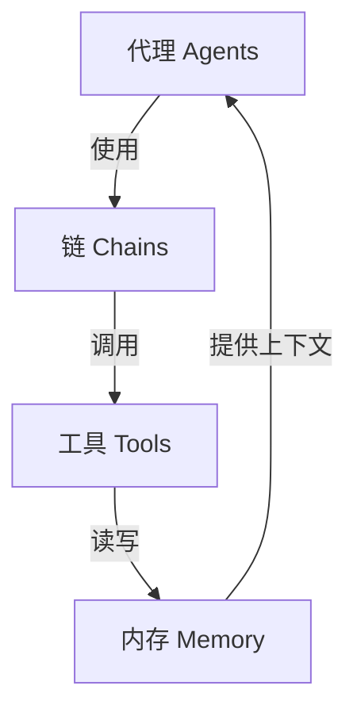
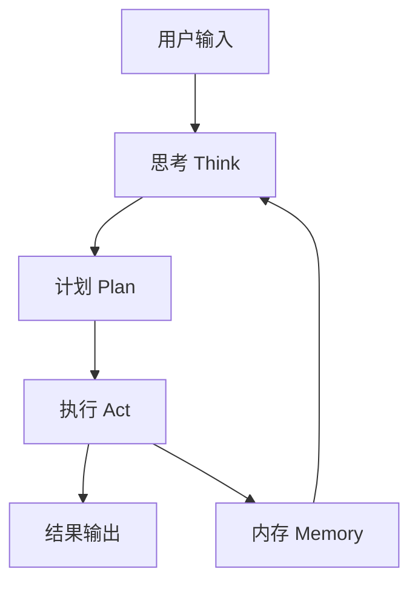

# 【LangChain编程：从入门到实践】社区和资源

## 1. 背景介绍

### 1.1 问题的由来

在当今数字时代，数据的爆炸式增长带来了巨大的机遇和挑战。作为开发人员和研究人员,我们面临着如何高效地处理和利用这些海量数据的问题。传统的编程方式已经难以满足现代应用的需求,因此我们需要一种新的编程范式来应对这一挑战。

LangChain正是在这种背景下应运而生的。它是一个用于构建应用程序的框架和库,旨在简化与大型语言模型(LLM)的交互。LangChain的核心理念是将LLM视为一种新型计算内核,并提供了一系列工具和组件,使开发人员能够轻松地将LLM集成到他们的应用程序中。

### 1.2 研究现状

尽管LangChain项目相对较新,但它已经在开源社区中引起了广泛关注。越来越多的开发人员和研究人员开始探索LangChain的潜力,并将其应用于各种领域,如自然语言处理、知识管理、智能助手等。

目前,LangChain已经拥有了一个活跃的社区,包括贡献者、用户和爱好者。这个社区不断壮大,为LangChain的发展提供了动力和支持。

### 1.3 研究意义

LangChain的出现为我们提供了一种全新的编程方式,它不仅能够简化与LLM的交互,还能够帮助我们更好地利用这些强大的语言模型。通过LangChain,我们可以构建更智能、更人性化的应用程序,从而提高生产力和效率。

此外,LangChain还为开发人员和研究人员提供了一个实验和探索的平台。我们可以在这个平台上尝试新的想法和方法,推动LLM技术的发展和应用。

### 1.4 本文结构

本文将全面介绍LangChain编程,从入门到实践。我们将首先探讨LangChain的核心概念和原理,然后深入研究其算法和数学模型。接下来,我们将通过实际案例和代码示例,展示如何使用LangChain构建应用程序。最后,我们将分享一些实用的工具和资源,以及对LangChain未来发展的展望。

## 2. 核心概念与联系

LangChain的核心概念包括代理(Agents)、链(Chains)、工具(Tools)和内存(Memory)。这些概念相互关联,共同构成了LangChain的编程范式。



### 2.1 代理(Agents)

代理是LangChain中的核心组件,它充当了人工智能系统的大脑。代理负责接收用户的输入,分析任务,制定计划,并调用适当的链和工具来完成任务。

代理可以是基于规则的,也可以是基于LLM的。基于规则的代理遵循预定义的逻辑和策略,而基于LLM的代理则利用语言模型的能力进行推理和决策。

### 2.2 链(Chains)

链是一系列预定义的步骤,用于完成特定的任务。链可以包含多个工具,并按照特定的顺序调用这些工具。链还可以嵌套其他链,从而构建更复杂的流程。

LangChain提供了许多预构建的链,如问答链、任务链、分析链等。开发人员也可以根据需求定制自己的链。

### 2.3 工具(Tools)

工具是LangChain中的基本构建块,它们封装了各种功能,如Web搜索、数据库查询、文件操作等。代理可以调用这些工具来执行特定的操作,从而完成更复杂的任务。

LangChain提供了许多预构建的工具,如Wikipedia查询工具、Python REPL工具、文件操作工具等。开发人员也可以创建自定义工具,以满足特定的需求。

### 2.4 内存(Memory)

内存是LangChain中的一个重要概念,它用于存储和管理上下文信息。在执行任务时,代理可以读取和写入内存,以保持对话的连贯性和一致性。

LangChain支持多种内存类型,如向量存储、Redis、SQLite等。开发人员可以根据需求选择合适的内存类型。

## 3. 核心算法原理 & 具体操作步骤

### 3.1 算法原理概述

LangChain的核心算法原理基于一种称为"思考-计划-执行"(Think-Plan-Act)的范式。这个范式包括以下三个主要步骤:

1. **思考(Think)**: 代理接收用户的输入,并利用LLM对输入进行理解和分析。
2. **计划(Plan)**: 根据对输入的理解,代理制定一个计划,确定需要调用哪些链和工具来完成任务。
3. **执行(Act)**: 代理按照计划执行相应的操作,调用链和工具,并将结果返回给用户。

在这个过程中,代理可以根据需要读写内存,以保持上下文信息的一致性。



### 3.2 算法步骤详解

1. **思考(Think)阶段**

   在这个阶段,代理利用LLM对用户的输入进行理解和分析。代理可以将输入分解成多个子任务,并确定每个子任务的目标和要求。

2. **计划(Plan)阶段**

   根据对输入的理解,代理制定一个计划,确定需要调用哪些链和工具来完成任务。代理可以选择合适的链和工具组合,并确定它们的执行顺序。

   在这个阶段,代理可以利用启发式搜索算法或基于LLM的推理来生成计划。代理还可以根据需要查询内存,以获取相关的上下文信息。

3. **执行(Act)阶段**

   在这个阶段,代理按照计划执行相应的操作。它调用链和工具,并将结果存储在内存中。如果需要,代理可以根据中间结果调整计划,并重新执行相关操作。

   最终,代理将最终结果返回给用户。代理还可以将相关的上下文信息写入内存,以供将来使用。

### 3.3 算法优缺点

**优点**:

- **模块化设计**: LangChain的模块化设计使得开发人员可以轻松地组合和扩展不同的链和工具,构建复杂的应用程序。
- **与LLM无缝集成**: LangChain提供了与LLM无缝集成的能力,使开发人员可以充分利用LLM的强大功能。
- **上下文管理**: LangChain的内存概念使得应用程序能够维护对话的上下文和一致性。
- **可扩展性**: LangChain允许开发人员创建自定义的链、工具和内存类型,满足特定的需求。

**缺点**:

- **性能问题**: LangChain heavily依赖于LLM,因此可能会受到LLM性能和成本的限制。
- **可解释性**: LangChain中基于LLM的推理过程可能缺乏透明度和可解释性。
- **错误传播**: 由于LangChain的模块化设计,错误可能会在不同的组件之间传播,导致难以调试的问题。
- **安全性**: LangChain应用程序可能会面临与LLM相关的安全和隐私风险。

### 3.4 算法应用领域

LangChain的"思考-计划-执行"范式使其适用于广泛的应用领域,包括但不限于:

- **自然语言处理(NLP)**: LangChain可用于构建问答系统、文本摘要、情感分析等NLP应用程序。
- **知识管理**: LangChain可用于知识提取、知识库构建和知识图谱应用程序。
- **智能助手**: LangChain可用于构建具有自然语言交互能力的智能助手。
- **自动化工作流**: LangChain可用于自动化各种工作流程,如数据处理、文档生成等。
- **决策支持系统**: LangChain可用于构建基于LLM的决策支持系统,帮助人们做出更好的决策。

## 4. 数学模型和公式 & 详细讲解 & 举例说明

在LangChain中,数学模型和公式主要用于表示和操作语义向量。语义向量是一种将文本映射到高维向量空间的技术,它能够捕捉文本的语义信息。

### 4.1 数学模型构建

LangChain使用嵌入模型(Embedding Model)将文本映射到语义向量。常用的嵌入模型包括Word2Vec、GloVe、BERT等。这些模型通过在大量文本数据上进行训练,学习将单词或句子映射到向量空间的方式。

给定一个文本 $T$,嵌入模型将其映射到一个向量 $\vec{v}$,其中 $\vec{v} \in \mathbb{R}^n$,n是向量的维度。这个过程可以表示为:

$$\vec{v} = f(T)$$

其中 $f$ 是嵌入模型的函数。

### 4.2 公式推导过程

在LangChain中,我们通常需要计算两个语义向量之间的相似度。相似度度量了两个向量在向量空间中的距离,从而反映了它们所代表的文本之间的语义相关性。

常用的相似度度量包括余弦相似度和欧几里得距离。

**余弦相似度**

余弦相似度衡量两个向量之间的夹角余弦值,取值范围为 [-1, 1]。两个向量越相似,余弦相似度越接近1。

给定两个向量 $\vec{a}$ 和 $\vec{b}$,它们的余弦相似度定义为:

$$\text{sim}_\text{cos}(\vec{a}, \vec{b}) = \frac{\vec{a} \cdot \vec{b}}{\|\vec{a}\| \|\vec{b}\|}$$

其中 $\vec{a} \cdot \vec{b}$ 表示两个向量的点积,而 $\|\vec{a}\|$ 和 $\|\vec{b}\|$ 分别表示向量的范数(通常是L2范数)。

**欧几里得距离**

欧几里得距离衡量两个向量在向量空间中的直线距离。两个向量越相似,欧几里得距离越小。

给定两个向量 $\vec{a}$ 和 $\vec{b}$,它们的欧几里得距离定义为:

$$\text{dist}_\text{euc}(\vec{a}, \vec{b}) = \sqrt{\sum_{i=1}^{n} (a_i - b_i)^2}$$

其中 $n$ 是向量的维度,而 $a_i$ 和 $b_i$ 分别表示向量 $\vec{a}$ 和 $\vec{b}$ 在第 $i$ 个维度上的分量。

### 4.3 案例分析与讲解

假设我们有两个句子 $S_1$ 和 $S_2$,我们希望计算它们的语义相似度。我们可以使用LangChain中的`SentenceTransformer`模型将这两个句子映射到语义向量空间中,得到向量 $\vec{v_1}$ 和 $\vec{v_2}$。

```python
from langchain.embeddings import SentenceTransformer

embeddings = SentenceTransformer('all-MiniLM-L6-v2')

s1 = "This is a sample sentence."
s2 = "Another example sentence."

v1 = embeddings.embed_query(s1)
v2 = embeddings.embed_query(s2)
```

然后,我们可以计算这两个向量的余弦相似度:

```python
import numpy as np

cos_sim = np.dot(v1, v2) / (np.linalg.norm(v1) * np.linalg.norm(v2))
print(f"Cosine similarity: {cos_sim}")
```

或者计算它们的欧几里得距离:

```python
euc_dist = np.linalg.norm(v1 - v2)
print(f"Euclidean distance: {euc_dist}")
```

通过分析这两个值,我们可以判断 $S_1$ 和 $S_2$ 的语义相似程度。

### 4.4 常见问题解答

**Q: 为什么要使用语义向量?**

A: