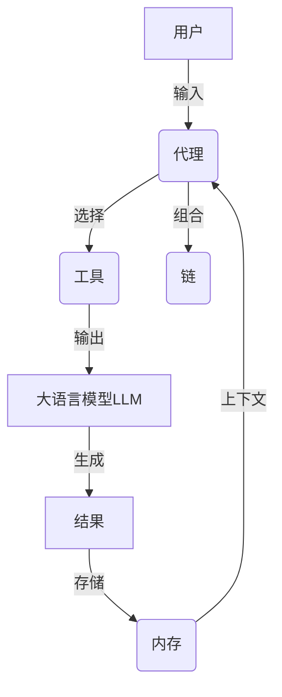
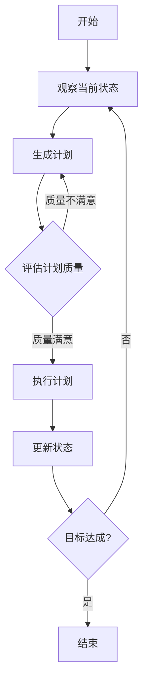

# 【LangChain编程：从入门到实践】自定义代理工具

## 1. 背景介绍

### 1.1 问题的由来

在当今快节奏的数字时代，我们被海量的信息所包围。无论是在工作还是生活中,我们都需要快速获取并处理大量数据。然而,有效地管理和利用这些信息资源仍然是一个巨大的挑战。传统的搜索引擎和数据处理工具往往效率低下,无法满足我们的需求。因此,我们需要一种更智能、更高效的解决方案来帮助我们处理复杂的信息需求。

### 1.2 研究现状

近年来,人工智能和自然语言处理技术的飞速发展为解决这一问题提供了新的契机。LangChain作为一个强大的框架,它将大语言模型(LLM)与其他工具和数据源相结合,为构建智能应用程序提供了全新的可能性。LangChain可以帮助我们更好地理解和处理自然语言,从而提高信息处理效率。

### 1.3 研究意义

LangChain的出现为我们提供了一种全新的方式来处理信息,它可以极大地提高我们的工作效率和生活质量。通过自定义代理工具,我们可以根据自己的具体需求,设计出高度个性化和智能化的应用程序。这些应用程序不仅可以帮助我们快速获取所需信息,还可以对信息进行深度分析和处理,为我们提供有价值的见解和建议。

### 1.4 本文结构

本文将详细介绍如何使用LangChain构建自定义代理工具。我们将从LangChain的核心概念和原理出发,深入探讨其算法和数学模型,并通过实际案例和代码示例,帮助读者掌握自定义代理工具的开发流程。最后,我们还将探讨LangChain在各个领域的应用前景,以及未来的发展趋势和挑战。

## 2. 核心概念与联系

LangChain是一个强大的框架,它将大语言模型(LLM)与其他工具和数据源相结合,为构建智能应用程序提供了全新的可能性。它的核心概念包括:

1. **代理(Agent)**: 代理是LangChain的核心组件,它负责协调和管理整个任务流程。代理可以与LLM和其他工具进行交互,根据用户的需求执行相应的操作。

2. **工具(Tool)**: 工具是代理可以使用的各种功能模块,如搜索引擎、数据库、API等。代理可以根据任务需求选择合适的工具,并将它们的输出结果传递给LLM进行处理。

3. **大语言模型(LLM)**: LLM是LangChain的核心驱动力,它负责理解和生成自然语言。LangChain支持多种LLM,如GPT-3、BERT等,用户可以根据需求选择合适的模型。

4. **内存(Memory)**: 内存用于存储代理在执行任务过程中的中间状态和结果,以便代理可以基于之前的上下文进行推理和决策。

5. **链(Chain)**: 链是将多个代理、工具和LLM组合在一起的逻辑流程,用于处理复杂的任务。

这些核心概念相互关联,共同构建了LangChain的智能应用程序框架。代理作为中心,与工具、LLM和内存协同工作,通过链的逻辑流程完成各种任务。

## 3. 核心算法原理 & 具体操作步骤

### 3.1 算法原理概述

LangChain的核心算法原理是基于**决策理论**和**规划算法**。代理在执行任务时,需要根据当前的状态和目标,选择合适的工具和操作,以最小化达成目标所需的步骤数。这个过程可以被建模为一个**马尔可夫决策过程(MDP)**,其中代理需要学习一个最优策略来映射状态到操作。

LangChain采用了**基于规划的方法**来解决这个问题。代理首先通过LLM生成一个潜在的行动序列(计划),然后评估这个计划的质量。如果计划不理想,代理会重新生成一个新的计划,直到找到一个满意的解决方案为止。

### 3.2 算法步骤详解

LangChain的核心算法可以概括为以下几个步骤:

1. **观察当前状态**:代理观察当前的状态,包括用户的输入、内存中的上下文信息等。

2. **生成计划**:代理通过LLM生成一个潜在的行动序列(计划),以达成目标。

3. **评估计划质量**:代理评估生成的计划的质量,判断它是否足够好。评估标准可以是计划的长度、成本或其他指标。

4. **执行计划或重新规划**:如果计划质量满意,代理就执行该计划;否则,代理会重新生成一个新的计划。

5. **更新状态**:代理执行计划后,会更新当前状态,包括内存中的上下文信息等。

6. **重复上述步骤**:代理重复上述步骤,直到达成目标或无法找到满意的解决方案。

这个算法的核心思想是通过反复生成和评估计划,逐步优化解决方案,直到找到一个满意的计划。代理利用LLM的强大语言理解和生成能力,结合规划算法的搜索策略,实现了智能化的任务执行。

### 3.3 算法优缺点

LangChain的核心算法具有以下优点:

1. **灵活性强**:基于规划的方法可以处理各种复杂的任务,并且易于扩展和定制。

2. **利用LLM的强大能力**:算法充分利用了LLM在自然语言理解和生成方面的优势,提高了任务执行的质量和效率。

3. **可解释性好**:生成的计划是可解释的,用户可以理解代理的决策过程。

然而,这种算法也存在一些缺点:

1. **计算开销大**:反复生成和评估计划的过程可能会导致较高的计算开销。

2. **依赖LLM的质量**:算法的性能在很大程度上依赖于所使用的LLM的质量。

3. **局部最优陷阱**:在某些情况下,算法可能会陷入局部最优解,无法找到全局最优解决方案。

### 3.4 算法应用领域

LangChain的核心算法可以应用于各种领域,包括但不限于:

1. **智能助手**:构建智能对话系统,为用户提供个性化的信息和建议。

2. **任务自动化**:自动化复杂的任务流程,提高效率和准确性。

3. **决策支持系统**:辅助人们做出更好的决策,提供有价值的见解和分析。

4. **知识管理**:整合和管理来自多个来源的知识,提高知识利用效率。

5. **教育和培训**:开发智能教学系统,为学习者提供个性化的学习体验。

6. **科研领域**:辅助科研人员进行文献检索、数据分析和实验设计等工作。

总的来说,LangChain的核心算法为构建智能化应用程序提供了强大的支持,在各个领域都有广阔的应用前景。

## 4. 数学模型和公式 & 详细讲解 & 举例说明

### 4.1 数学模型构建

LangChain的核心算法可以建模为一个**马尔可夫决策过程(MDP)**,它是一种用于描述序列决策问题的数学框架。在MDP中,代理的目标是学习一个最优策略$\pi^*$,将状态$s$映射到操作$a$,以最大化预期的累积回报$R$。

MDP可以用一个元组$(S, A, P, R, \gamma)$来表示,其中:

- $S$是状态空间,代表所有可能的状态
- $A$是动作空间,代表所有可能的操作
- $P(s'|s,a)$是状态转移概率,表示在状态$s$下执行动作$a$后,转移到状态$s'$的概率
- $R(s,a)$是回报函数,表示在状态$s$下执行动作$a$所获得的即时回报
- $\gamma \in [0,1)$是折现因子,用于权衡即时回报和未来回报的重要性

代理的目标是找到一个策略$\pi^*$,使预期的累积回报$G_t$最大化:

$$G_t = \sum_{k=0}^\infty \gamma^k R_{t+k+1}$$

其中$R_{t+k+1}$是在时间步$t+k+1$获得的即时回报。

### 4.2 公式推导过程

为了找到最优策略$\pi^*$,我们可以使用**值迭代**或**策略迭代**等动态规划算法。这些算法基于**贝尔曼方程**,通过迭代更新状态值函数或策略,逐步收敛到最优解。

贝尔曼方程包括两个部分:

1. **贝尔曼期望方程**,用于计算状态值函数$V(s)$:

$$V(s) = \max_a \mathbb{E}[R(s,a) + \gamma V(s')]$$

2. **贝尔曼最优方程**,用于计算最优状态值函数$V^*(s)$和最优策略$\pi^*(s)$:

$$V^*(s) = \max_a \mathbb{E}[R(s,a) + \gamma \sum_{s'} P(s'|s,a)V^*(s')]$$
$$\pi^*(s) = \arg\max_a \mathbb{E}[R(s,a) + \gamma \sum_{s'} P(s'|s,a)V^*(s')]$$

通过不断迭代更新状态值函数或策略,直到收敛,我们可以得到最优策略$\pi^*$。

### 4.3 案例分析与讲解

为了更好地理解数学模型和公式,我们来看一个简单的案例。假设我们有一个智能助手代理,它的任务是帮助用户查找特定主题的信息。代理可以选择使用不同的工具,如搜索引擎、知识库或问答系统。

我们可以将这个问题建模为一个MDP:

- 状态$s$表示当前的信息需求和已获取的信息
- 动作$a$表示选择使用哪种工具
- 状态转移概率$P(s'|s,a)$表示使用某种工具后,获取新信息的概率
- 回报函数$R(s,a)$表示使用某种工具获取信息的效用或成本

代理的目标是找到一个最优策略$\pi^*$,使预期的累积回报$G_t$最大化,即获取所需信息的效用最大化,或者获取信息的成本最小化。

假设代理可以选择三种工具:搜索引擎、知识库和问答系统。它们的状态转移概率和回报函数如下:

- 搜索引擎:$P(s'|s,a_1) = 0.6$, $R(s,a_1) = -1$
- 知识库:$P(s'|s,a_2) = 0.8$, $R(s,a_2) = -2$
- 问答系统:$P(s'|s,a_3) = 0.4$, $R(s,a_3) = -0.5$

其中,负回报表示使用该工具的成本。

通过求解贝尔曼方程,我们可以得到最优策略$\pi^*$,指导代理在不同状态下选择合适的工具,以最小化获取信息的总成本。

### 4.4 常见问题解答

1. **如何确定MDP中的状态空间和动作空间?**

   状态空间和动作空间的定义取决于具体的应用场景。通常,状态空间应该包含影响代理决策的所有相关信息,而动作