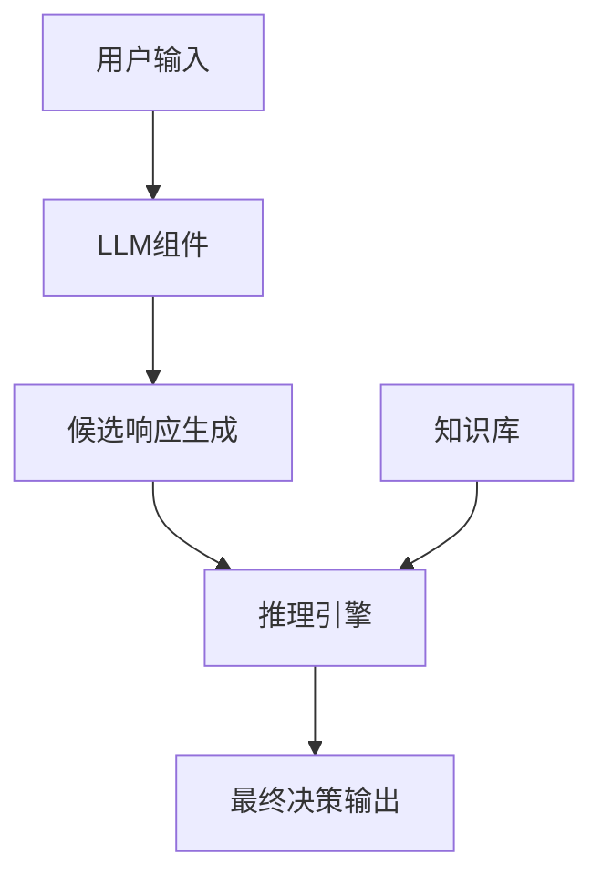

# 【大模型应用开发 动手做AI Agent】Agent的推理引擎：ReAct框架

## 1. 背景介绍

### 1.1 问题的由来

在当前的人工智能领域中,构建智能Agent系统是一个极具挑战性的任务。传统的规则引擎和决策树等方法在处理复杂的决策场景时往往显得力不从心,难以捕捉问题的全貌并作出合理的判断。随着深度学习技术的不断发展,大型语言模型(Large Language Model,LLM)凭借其强大的文本理解和生成能力,为开发智能Agent系统带来了全新的机遇。

然而,直接将LLM应用于决策系统存在着诸多挑战:

1. **一致性缺失**:LLM生成的响应往往缺乏一致性,同一输入可能产生不同的输出,这在决策系统中是无法接受的。
2. **可解释性不足**:LLM的决策过程是一个黑盒操作,难以追踪和解释其决策的依据和推理过程。
3. **缺乏结构化知识**:LLM主要依赖于文本数据进行训练,缺乏对结构化知识的有效利用。

为了解决上述挑战,我们提出了ReAct(Reasoning and Acting)框架,旨在为LLM赋予推理和决策的能力,从而构建出可解释、一致和可靠的智能Agent系统。

### 1.2 研究现状

目前,已有一些研究工作尝试将LLM应用于推理和决策任务,但大多数方法仍然存在局限性。

一种常见的方法是通过提示工程(Prompt Engineering)来指导LLM生成特定形式的输出,如使用前缀提示(Prefix Prompting)或者示例提示(Example Prompting)等技术。然而,这种方法高度依赖于人工设计的提示,难以泛化到所有场景,且缺乏对推理过程的解释能力。

另一种方法是将LLM与外部知识库相结合,如将LLM与知识图谱(Knowledge Graph)或者规则库(Rule Base)集成,以引入结构化知识。但这种方法需要预先构建高质量的知识库,工作量巨大,且知识库的覆盖面有限,难以应对所有场景。

相比之下,ReAct框架采用了一种新颖的方法,通过构建一个可解释的推理引擎,将LLM的生成能力与结构化的推理过程相结合,从而实现了一致、可解释和可靠的决策输出。

### 1.3 研究意义

ReAct框架的提出对于推动人工智能技术的发展具有重要意义:

1. **提升LLM的决策能力**:ReAct框架赋予了LLM推理和决策的能力,使其不再局限于文本生成任务,能够应用于更广泛的决策场景。
2. **增强AI系统的可解释性**:ReAct框架将LLM的黑盒决策过程转化为可解释的推理链,提高了AI系统的透明度和可信度。
3. **促进人机协作**:可解释的推理链有助于人类更好地理解AI系统的决策过程,从而促进人机协作,实现人工智能的可控发展。
4. **推动多模态AI的发展**:ReAct框架为将LLM与其他模态(如视觉、语音等)相结合奠定了基础,有望推动多模态AI技术的发展。

### 1.4 本文结构

本文将详细介绍ReAct框架的核心概念、算法原理、数学模型、项目实践、应用场景等内容,内容安排如下:

- 第2节阐述ReAct框架的核心概念及其与其他相关技术的联系。
- 第3节深入探讨ReAct框架的算法原理及具体操作步骤。
- 第4节构建ReAct框架的数学模型,并通过公式推导和案例分析加以说明。
- 第5节提供ReAct框架的代码实现,包括开发环境搭建、源代码详解和运行结果展示。
- 第6节介绍ReAct框架在实际应用场景中的应用前景。
- 第7节推荐ReAct框架相关的学习资源、开发工具和论文等。
- 第8节总结ReAct框架的研究成果,并展望其未来的发展趋势和面临的挑战。
- 第9节列出ReAct框架使用过程中的常见问题并给出解答。

## 2. 核心概念与联系

ReAct框架的核心概念是将大型语言模型(LLM)的生成能力与结构化的推理过程相结合,从而实现一致、可解释和可靠的决策输出。该框架由三个主要组件构成:

1. **LLM组件**: 基于大型语言模型,负责根据给定的上下文信息生成候选响应。
2. **推理引擎**: 根据预定义的推理规则和约束条件,对LLM生成的候选响应进行筛选和优化,输出最终的决策结果。
3. **知识库**: 存储结构化的领域知识,为推理引擎提供所需的背景信息和约束条件。

ReAct框架的工作流程如下:

在这个过程中,推理引擎扮演着关键角色,它根据知识库中的约束条件和推理规则,对LLM生成的候选响应进行筛选和优化,最终输出一致、可解释和可靠的决策结果。

ReAct框架与其他相关技术的联系如下:

- **决策支持系统(DSS)**: ReAct框架可视为一种新型的DSS,它利用LLM的生成能力和推理引擎的约束能力,为决策过程提供支持。
- **知识图谱(Knowledge Graph)**: ReAct框架的知识库可以采用知识图谱的形式,用于存储和管理结构化的领域知识。
- **自然语言处理(NLP)**: ReAct框架中的LLM组件和推理引擎都需要对自然语言进行处理,因此NLP技术是该框架的基础。
- **规则引擎(Rule Engine)**: ReAct框架的推理引擎可以视为一种特殊的规则引擎,它不仅可以处理传统的规则,还可以处理LLM生成的候选响应。

总的来说,ReAct框架将LLM的生成能力与结构化的推理过程相结合,融合了多种技术的优势,为构建智能Agent系统提供了一种全新的解决方案。

## 3. 核心算法原理 & 具体操作步骤

### 3.1 算法原理概述

ReAct框架的核心算法原理是通过迭代的方式,在LLM生成的候选响应集合中寻找最优解,并根据推理规则和约束条件对其进行优化,最终输出一致、可解释和可靠的决策结果。

该算法的主要思路如下:

1. **候选响应生成**: 利用LLM根据给定的上下文信息生成一组候选响应。
2. **候选响应评估**: 根据预定义的评估函数,对每个候选响应进行打分,评估其质量和合理性。
3. **候选响应优化**: 根据推理规则和约束条件,对得分最高的候选响应进行优化,生成新的候选响应。
4. **迭代优化**: 重复执行步骤2和步骤3,直到满足终止条件(如最大迭代次数或评分阈值)。
5. **最终输出**: 输出经过优化的最佳候选响应作为最终决策结果。

该算法的关键在于设计合理的评估函数、推理规则和约束条件,以确保输出的决策结果具有一致性、可解释性和可靠性。

### 3.2 算法步骤详解

ReAct框架的核心算法可以分为以下几个主要步骤:

1. **初始化**
   - 根据给定的上下文信息,构建LLM的输入提示。
   - 从知识库中加载相关的推理规则和约束条件。
   - 初始化评估函数、迭代次数上限和评分阈值等参数。

2. **候选响应生成**
   - 将构建好的输入提示输入到LLM中,生成一组候选响应。
   - 对生成的候选响应进行基本的文本预处理,如去除无关内容、规范化格式等。

3. **候选响应评估**
   - 遍历每个候选响应。
   - 根据预定义的评估函数,计算每个候选响应的评分。
   - 将评分结果存储在优先队列中,按照评分从高到低排序。

4. **候选响应优化**
   - 从优先队列中取出评分最高的候选响应。
   - 根据推理规则和约束条件,对该候选响应进行优化,生成新的候选响应。
   - 将新生成的候选响应加入优先队列,重新排序。

5. **迭代优化**
   - 重复执行步骤3和步骤4,直到满足终止条件。

6. **最终输出**
   - 从优先队列中取出评分最高的候选响应作为最终决策结果。
   - 根据需要,对最终结果进行后处理,如格式化、添加解释说明等。
   - 输出最终决策结果。

在整个算法过程中,评估函数、推理规则和约束条件扮演着至关重要的角色,它们共同确定了输出决策结果的质量和合理性。下面将对这三个核心组件进行详细说明。

#### 评估函数

评估函数用于评估每个候选响应的质量和合理性,通常包括以下几个方面:

1. **语义一致性评分**:衡量候选响应与上下文信息的语义一致性,可以利用语义相似度模型进行计算。
2. **语法正确性评分**:评估候选响应的语法正确性,可以使用语法分析工具进行检查。
3. **知识一致性评分**:衡量候选响应与知识库中的事实和规则的一致性,需要将候选响应与知识库进行匹配。
4. **多样性评分**:鼓励生成多样化的候选响应,避免重复性过高的输出。
5. **其他定制评分**:根据具体应用场景,可以添加其他评分项,如安全性评分、伦理性评分等。

最终的评估函数可以是上述各项评分的加权求和,权重可以根据具体需求进行调整。

#### 推理规则

推理规则用于约束和优化候选响应,确保其符合预期的逻辑和要求。推理规则可以分为以下几类:

1. **语义规则**:基于语义信息对候选响应进行约束,如确保响应与上下文信息相关、避免自相矛盾等。
2. **语法规则**:基于语法结构对候选响应进行约束,如保证句子完整性、修正语法错误等。
3. **知识规则**:基于知识库中的事实和规则对候选响应进行约束,如确保响应与已知事实一致、遵循特定的领域规则等。
4. **任务规则**:基于具体任务场景对候选响应进行约束,如满足特定的输出格式要求、包含必要的信息元素等。
5. **其他定制规则**:根据具体需求,可以添加其他类型的推理规则,如安全性规则、伦理性规则等。

推理规则可以采用各种形式,如基于模式匹配的规则、基于逻辑推理的规则、基于约束优化的规则等。在优化过程中,推理引擎会根据这些规则对候选响应进行修改和优化。

#### 约束条件

约束条件是推理过程中需要满足的限制条件,它们来源于知识库中的结构化知识,用于进一步约束和优化候选响应。常见的约束条件包括:

1. **事实约束**:基于知识库中的事实信息,确保候选响应不违背已知的事实。
2. **规则约束**:基于知识库中的规则信息,确保候选响应遵循特定的规则和约定。
3. **关系约束**:基于知识库中的实体关系信息,确保候选响应中涉及的实体之间的关系正确。
4. **属性约束**:基于知识库中的实体属性信息,确保候选响应中涉及的实体属性正确。
5. **其他定制约束**:根据具体需求,可以添加其他类型的约束条件,如安全性约束、伦理