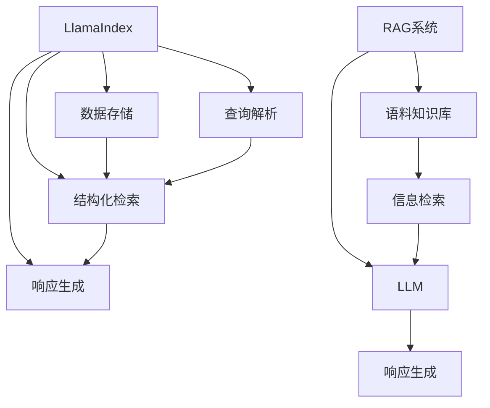

好的,我会按照您的要求,以专业的技术语言撰写这篇文章。

# 【大模型应用开发 动手做AI Agent】LlamaIndex和基于RAG的AI开发

## 1. 背景介绍

### 1.1 问题的由来

随着人工智能技术的不断发展,大型语言模型(Large Language Models,LLMs)已经成为当前最热门的研究领域之一。这些模型通过从海量文本数据中学习,能够生成看似人类写作的自然语言输出。然而,由于它们缺乏对输出内容的理解和推理能力,因此很容易产生不相关、不连贯或者矛盾的输出。

为了解决这个问题,研究人员提出了将LLMs与检索增强生成(Retrieval Augmented Generation,RAG)相结合的方法。RAG系统通过从知识库(如维基百科)中检索相关信息,为LLM提供背景知识,从而提高生成输出的质量和一致性。

### 1.2 研究现状  

目前,已有多种RAG系统被开发出来,例如FermiAI的Anthropic、OpenAI的InstructGPT等。这些系统通过不同的检索和融合策略来整合LLM和知识库。然而,由于知识库的有限性和检索算法的不完善,现有RAG系统在处理复杂查询时仍然存在一些缺陷。

### 1.3 研究意义

开发更高效、更智能的RAG系统,对于构建真正的人工智能助手(AI Agent)至关重要。一个理想的AI助手不仅需要生成自然流畅的语言输出,而且需要基于知识库提供准确、相关和连贯的信息。本文将介绍LlamaIndex和基于RAG的AI开发,探讨如何利用这些技术来构建更智能的AI助手系统。

### 1.4 本文结构  

本文首先介绍LlamaIndex和RAG的核心概念,然后详细阐述其算法原理和数学模型。接下来,我们将通过代码示例演示如何使用这些技术开发AI应用。最后,本文将探讨LlamaIndex和RAG在实际场景中的应用,并对未来的发展趋势和挑战进行展望。

## 2. 核心概念与联系



LlamaIndex和基于RAG的AI开发都旨在提高大型语言模型(LLM)的输出质量和一致性。它们的核心思想是将LLM与结构化知识库相结合,为LLM提供背景知识和上下文信息。

- **LlamaIndex**是一个Python库,用于构建基于LLM的智能应用程序。它的主要组件包括:
  - **数据存储**:用于存储文档数据的向量数据库。
  - **查询解析**:将自然语言查询转换为结构化查询。
  - **结构化检索**:基于查询从数据存储中检索相关文档。
  - **响应生成**:将检索到的文档传递给LLM,生成最终响应。

- **基于RAG的AI系统**通常包括以下核心组件:
  - **语料知识库**:存储结构化的文本知识,如维基百科等。
  - **信息检索**:根据查询从知识库中检索相关信息片段。
  - **LLM**:将检索到的信息与查询结合,生成最终响应。

LlamaIndex和RAG系统的核心思路是相似的,都是通过检索相关信息来增强LLM的输出质量。不同之处在于,LlamaIndex更侧重于构建基于LLM的应用程序,而RAG系统则更关注于将LLM与知识库相结合。

## 3. 核心算法原理与具体操作步骤

### 3.1 算法原理概述

LlamaIndex和基于RAG的AI系统都采用了类似的算法原理,可以概括为以下几个步骤:

1. **查询解析**:将自然语言查询转换为结构化查询表示。
2. **信息检索**:根据结构化查询从知识库(文档数据或语料库)中检索相关信息片段。
3. **信息融合**:将检索到的信息片段与原始查询结合,形成LLM的输入。
4. **响应生成**:将融合后的输入传递给LLM,生成最终响应。

其中,信息检索和信息融合是算法的核心部分,决定了系统的性能和输出质量。

### 3.2 算法步骤详解

1. **查询解析**
   - 自然语言查询通常是非结构化的,需要转换为结构化表示,以便进行有效的检索。
   - 常用的方法包括词干提取、词性标注、命名实体识别等自然语言处理技术。
   - 查询解析的目标是提取查询中的关键词、实体和语义信息。

2. **信息检索**
   - 根据结构化查询从知识库中检索相关信息片段。
   - 常用的检索算法包括TF-IDF、BM25、向量空间模型等。
   - 检索的目标是找到与查询最相关的文档或文本片段。

3. **信息融合**
   - 将检索到的信息片段与原始查询结合,形成LLM的输入。
   - 常用的融合策略包括拼接、注入和注意力机制等。
   - 信息融合的目标是为LLM提供足够的背景知识和上下文信息。

4. **响应生成**
   - 将融合后的输入传递给LLM,生成最终响应。
   - LLM通过自身的语言生成能力,综合输入信息生成自然语言响应。
   - 响应生成的质量取决于LLM的性能和输入的质量。

### 3.3 算法优缺点

优点:
- 通过结合结构化知识,提高了LLM输出的质量和一致性。
- 可以处理复杂的查询,提供更准确、相关的响应。
- 具有较强的可解释性和可控性。

缺点:
- 依赖于知识库的覆盖范围和质量。
- 检索和融合过程可能引入噪声和错误。
- 算法复杂度较高,计算开销较大。

### 3.4 算法应用领域

LlamaIndex和基于RAG的AI系统可以应用于多个领域,包括但不限于:

- 智能问答系统
- 信息检索和知识管理
- 任务辅助和决策支持
- 自动写作和内容生成
- 对话系统和虚拟助手

## 4. 数学模型和公式详细讲解举例说明

### 4.1 数学模型构建

为了量化评估检索和融合的效果,我们可以构建以下数学模型:

令查询为 $q$,知识库中的文档集合为 $D=\{d_1,d_2,...,d_n\}$,检索算法为 $\mathcal{R}$,融合函数为 $\mathcal{F}$,语言模型为 $\mathcal{L}$。

我们的目标是最大化响应 $r$ 与理想响应 $r^*$ 之间的相似度:

$$\max_{\mathcal{R},\mathcal{F},\mathcal{L}} \mathrm{sim}(r,r^*) \\
\text{where } r = \mathcal{L}(\mathcal{F}(q,\mathcal{R}(q,D)))$$

这里的相似度函数 $\mathrm{sim}$ 可以是语义相似度、词重叠率或其他评估指标。

### 4.2 公式推导过程

为了优化上述目标函数,我们可以将其分解为检索和融合两个子问题:

1. **检索子问题**:

$$\max_{\mathcal{R}} \sum_{d_i \in \mathcal{R}(q,D)} \mathrm{rel}(d_i,q)$$

其中 $\mathrm{rel}(d_i,q)$ 表示文档 $d_i$ 与查询 $q$ 的相关性得分。这个子问题可以通过优化检索算法 $\mathcal{R}$ 来解决,例如调整 TF-IDF 权重或改进向量空间模型。

2. **融合子问题**:

$$\max_{\mathcal{F}} \mathrm{sim}(\mathcal{L}(\mathcal{F}(q,D_q)),r^*)\\
\text{where } D_q = \mathcal{R}(q,D)$$

这个子问题旨在优化融合函数 $\mathcal{F}$,使得融合后的输入与理想响应 $r^*$ 的相似度最大化。常见的优化方法包括注意力机制、序列到序列模型等。

通过优化这两个子问题,我们可以提高整体系统的性能,生成更高质量的响应。

### 4.3 案例分析与讲解

假设我们有一个关于"人工智能"的知识库,包含以下几篇文档:

- $d_1$: 人工智能(Artificial Intelligence,AI)是一门研究如何...
- $d_2$: 机器学习是人工智能的一个重要分支,它通过...
- $d_3$: 深度学习是机器学习的一种技术,它使用...

现在,我们收到一个查询 $q$:"什么是深度学习?"

1. **查询解析**

通过自然语言处理技术,我们可以将查询 $q$ 解析为关键词"深度学习"。

2. **信息检索**

使用 TF-IDF 算法,我们可以计算每个文档与查询的相关性得分:

- $\mathrm{rel}(d_1,q) = 0.2$
- $\mathrm{rel}(d_2,q) = 0.4$
- $\mathrm{rel}(d_3,q) = 0.8$

因此,检索算法 $\mathcal{R}$ 将返回文档 $d_3$,因为它与查询最相关。

3. **信息融合**

我们可以使用拼接策略将查询 $q$ 和文档 $d_3$ 融合为语言模型的输入:

$$\text{Input} = \text{"什么是深度学习?"} + \text{"深度学习是机器学习的一种技术,它使用..."}$$

4. **响应生成**

将融合后的输入传递给语言模型 $\mathcal{L}$,生成最终响应 $r$。

通过这个案例,我们可以看到 LlamaIndex 和基于 RAG 的 AI 系统是如何处理查询并生成响应的。在实际应用中,我们需要进一步优化检索和融合算法,以提高系统的性能和输出质量。

### 4.4 常见问题解答

1. **为什么需要查询解析?**

查询解析是将自然语言查询转换为结构化表示的过程,这对于有效的信息检索至关重要。未经处理的自然语言查询通常包含很多噪声和无关信息,直接用于检索会导致性能下降。

2. **如何选择合适的检索算法?**

选择检索算法时,需要考虑知识库的特点(如文本长度、结构化程度等)和查询的类型。常见的算法包括 TF-IDF、BM25、向量空间模型等,可以根据具体情况进行选择和调优。

3. **不同的信息融合策略有何区别?**

常见的融合策略包括拼接、注入和注意力机制等。拼接策略简单但可能引入噪声;注入策略更精细但需要更多计算资源;注意力机制可以自适应地关注重要信息,但训练复杂度较高。需要根据具体需求和资源进行权衡选择。

4. **如何评估系统的性能?**

评估系统性能的常用指标包括语义相似度、词重叠率、人工评分等。另外,也可以针对特定任务(如问答、写作等)设计专门的评估指标。

## 5. 项目实践:代码实例和详细解释说明  

### 5.1 开发环境搭建

本节将演示如何使用 Python 和 LlamaIndex 库构建一个简单的 AI 问答系统。我们首先需要安装所需的依赖库:

```bash
pip install llama-index langchain openai
```

这里我们使用 LlamaIndex 作为核心库,LangChain 提供了与各种 LLM 的集成,OpenAI 则是一个常用的 LLM 提供商。

### 5.2 源代码详细实现

```python
from llama_index import GPTVectorSt