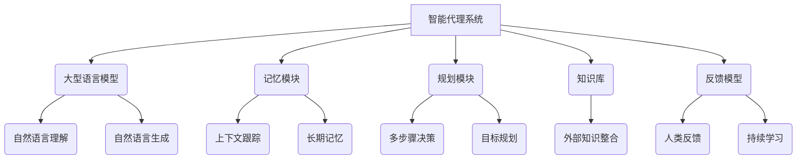

# 【大模型应用开发 动手做AI Agent】创建助手

## 1. 背景介绍

### 1.1 问题的由来

在过去几年中,大型语言模型(Large Language Models,LLMs)取得了令人瞩目的进展,展现出惊人的自然语言处理能力。这些模型通过在海量文本数据上进行预训练,学习到了丰富的语言知识和上下文理解能力。随着计算能力的不断提升和训练数据的快速增长,LLMs的性能也在不断提高,使其在自然语言处理任务中表现出色。

然而,尽管LLMs拥有强大的语言生成能力,但将它们直接应用于实际场景仍然面临诸多挑战。例如,LLMs缺乏持久的记忆和上下文跟踪能力,无法根据用户的具体需求进行个性化响应,也难以保证输出的一致性和安全性。因此,如何有效利用LLMs的强大语言能力,并克服其固有的局限性,成为了一个亟待解决的问题。

### 1.2 研究现状

为了更好地利用LLMs的潜力,研究人员提出了将其与其他组件(如记忆模块、规划模块等)相结合,构建智能代理(AI Agent)系统的方案。智能代理旨在模拟人类的认知和决策过程,能够根据用户的需求和上下文信息做出合理的响应。

目前,已有多个研究团队尝试将LLMs与其他模块相结合,以构建智能代理系统。例如,OpenAI的InstructGPT将LLMs与反馈模型、记忆模块等相结合,使其能够根据用户的指令执行任务。DeepMind的Sparrow则将LLMs与规划模块相结合,使其能够进行多步骤推理和决策。此外,还有一些研究探索了将LLMs与知识库、规则库等外部知识源相结合,以增强其推理和决策能力。

### 1.3 研究意义

构建智能代理系统对于充分发挥LLMs的潜力,并将其应用于实际场景具有重要意义。智能代理不仅能够克服LLMs的局限性,还能够为用户提供更加个性化、上下文相关的响应,提升人机交互的自然性和效率。

此外,智能代理系统还可以在诸多领域发挥作用,如智能助手、客户服务、教育辅导、医疗诊断等。通过与用户进行自然语言交互,智能代理能够更好地理解用户的需求,并提供有针对性的解决方案或建议。

因此,研究和开发智能代理系统不仅是一个富有挑战的技术课题,也是推动人工智能技术在实际场景中落地应用的关键一步。

### 1.4 本文结构

本文将详细介绍如何基于大型语言模型构建智能代理系统。我们将从智能代理的核心概念和架构出发,深入探讨其关键算法原理和数学模型,并通过代码实例和应用场景说明,为读者提供全面的理解和实践指导。

文章的主要结构如下:

1. 背景介绍
2. 核心概念与联系
3. 核心算法原理与具体操作步骤
4. 数学模型和公式详细讲解与举例说明
5. 项目实践:代码实例和详细解释说明
6. 实际应用场景
7. 工具和资源推荐
8. 总结:未来发展趋势与挑战
9. 附录:常见问题与解答

## 2. 核心概念与联系

在深入探讨智能代理系统的技术细节之前,我们先来了解一些核心概念及其相互关系。

如上图所示,智能代理系统通常由以下几个核心组件构成:

1. **大型语言模型(LLM)**: 作为系统的核心,LLM负责自然语言理解和生成,为用户提供自然语言交互界面。

2. **记忆模块**: 用于跟踪对话上下文和存储长期记忆,帮助LLM维持对话连贯性和记忆能力。

3. **规划模块**: 根据用户需求和上下文信息,进行多步骤决策和目标规划,指导LLM做出合理响应。

4. **知识库**: 整合外部知识源(如结构化数据库、规则库等),为LLM提供补充知识,增强其推理和决策能力。

5. **反馈模型**: 通过人类反馈和持续学习,不断优化和调整LLM的输出,提高响应的质量和一致性。

这些组件通过紧密协作,共同构建了一个具有上下文理解、决策规划和持续学习能力的智能代理系统。在后续章节中,我们将详细探讨每个组件的工作原理和实现方法。

## 3. 核心算法原理与具体操作步骤

### 3.1 算法原理概述

智能代理系统的核心算法原理可以概括为以下几个关键步骤:

1. **自然语言理解**: 利用LLM的语言理解能力,对用户的输入进行语义分析和意图识别。

2. **上下文整合**: 将用户输入与历史对话上下文和外部知识源进行整合,形成完整的上下文表示。

3. **决策规划**: 基于上下文表示,通过规划模块进行多步骤决策和目标分解,生成响应策略。

4. **响应生成**: 将规划好的响应策略输入LLM,利用其语言生成能力输出自然语言响应。

5. **反馈学习**: 根据人类反馈,对LLM的输出进行评估和优化,持续提高响应质量。

6. **记忆更新**: 将本次对话的上下文信息存储到记忆模块中,为下一次交互做好准备。

这一过程循环往复,直到用户的需求得到满足或对话结束。下面我们将详细介绍每个步骤的具体操作步骤。

### 3.2 算法步骤详解

#### 3.2.1 自然语言理解

自然语言理解是智能代理系统的入口,其目标是从用户的自然语言输入中提取出语义信息和意图。常见的方法包括:

1. **词法和句法分析**: 将输入文本分词、标注词性,并构建句法树,为后续的语义分析做准备。

2. **命名实体识别**: 识别出输入文本中的人名、地名、组织机构名等命名实体。

3. **意图分类**: 将输入文本归类为特定的意图类别,如查询、命令、陈述等。

4. **槽位填充**: 从输入文本中提取出与特定意图相关的信息片段,如时间、地点、数量等。

5. **上下文理解**: 结合历史对话上下文和外部知识源,对输入的语义进行更深入的理解和disambiguate。

通过这些步骤,我们可以将用户的自然语言输入转化为结构化的语义表示,为后续的决策规划提供基础。

#### 3.2.2 上下文整合

在得到用户输入的语义表示后,智能代理需要将其与历史对话上下文和外部知识源进行整合,形成完整的上下文表示。这一步骤包括:

1. **对话历史编码**: 将之前的对话历史编码为上下文向量,反映对话的主题、焦点和进展状态。

2. **知识检索**: 根据当前的对话上下文,从知识库中检索相关的结构化数据或规则,用于补充背景知识。

3. **上下文融合**: 将用户输入的语义表示、对话历史向量和检索到的知识进行融合,形成多模态的上下文表示。

有效的上下文表示对于智能代理做出恰当的响应至关重要。一个好的上下文表示应该包含足够的背景信息,同时又不会引入过多的噪声和无关信息。

#### 3.2.3 决策规划

获得完整的上下文表示后,智能代理需要通过规划模块进行多步骤决策,生成合理的响应策略。这个过程可以概括为:

1. **目标分解**: 根据用户的意图和上下文,将最终目标分解为一系列子目标或子任务。

2. **行动选择**: 对于每个子目标,根据当前的上下文状态,选择最优的行动方案。

3. **约束检查**: 检查选择的行动方案是否满足一定的约束条件,如安全性、一致性等。

4. **策略优化**: 通过搜索或强化学习等方法,优化行动方案序列,使其能够更好地达成最终目标。

5. **响应策略生成**: 将优化后的行动方案序列编码为结构化的响应策略,作为LLM生成自然语言响应的基础。

决策规划的质量直接影响智能代理的响应合理性和一致性。一个好的规划模块应该能够根据上下文做出前瞻性的决策,并生成清晰、可执行的响应策略。

#### 3.2.4 响应生成

经过前面的步骤,我们已经获得了结构化的响应策略。接下来,智能代理需要将这一策略转化为自然语言形式,以便与用户进行自然语言交互。这个过程主要由LLM完成:

1. **策略解码**: 将结构化的响应策略解码为一个或多个文本提示(prompts)。

2. **自然语言生成**: 将文本提示输入LLM,利用其强大的语言生成能力,输出自然语言响应。

3. **响应后处理**: 对LLM生成的原始响应进行后处理,如语法纠正、风格调整、安全性过滤等,以确保输出的质量和一致性。

4. **多模态融合**: 在某些情况下,响应可能需要包含除文本之外的其他模态,如图像、音频等。这时需要将不同模态的信息进行融合,形成多模态响应。

LLM作为智能代理系统的核心,其语言生成能力对最终的响应质量至关重要。合理利用LLM的优势,同时规避其局限性,是构建高质量智能代理的关键。

#### 3.2.5 反馈学习

智能代理系统并不是一成不变的,它需要通过持续的学习来优化自身的响应质量。反馈学习就是实现这一目标的关键机制:

1. **人类反馈收集**: 通过用户界面或其他渠道,收集人类对智能代理响应的反馈评价,如满意度打分、纠正等。

2. **反馈建模**: 将收集到的人类反馈数据进行建模,训练反馈模型,以量化响应的质量。

3. **LLM微调**: 将反馈模型的输出作为监督信号,对LLM进行继续预训练或微调,使其输出更符合人类期望。

4. **策略优化**: 除了优化LLM本身,反馈信号也可用于优化决策规划模块,使其生成更合理的响应策略。

通过不断的反馈学习,智能代理系统可以持续提升自身的性能,更好地适应不同场景和用户需求的变化。

#### 3.2.6 记忆更新

最后一个关键步骤是将本次对话的上下文信息存储到记忆模块中,为下一次交互做好准备。这个过程包括:

1. **上下文编码**: 将本次对话的关键信息编码为上下文向量,包括用户输入、系统响应、决策过程等。

2. **记忆存储**: 将编码后的上下文向量存储到记忆模块中,可以采用基于注意力的记忆机制或外部存储(如数据库)等方式。

3. **记忆压缩**: 为了控制记忆占用,可以对存储的记忆进行压缩或删除,保留最关键的上下文信息。

4. **记忆检索**: 在下一次交互时,从记忆模块中检索相关的历史上下文,为上下文整合提供基础。

记忆模块赋予了智能