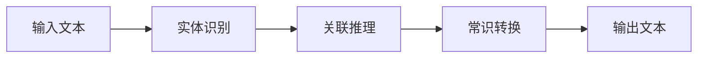
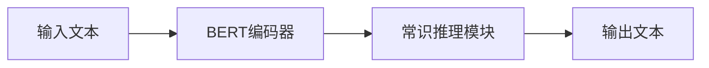

以下是对《【大模型应用开发 动手做AI Agent】执行ReAct Agent》这一主题的技术博客文章撰写。

# 【大模型应用开发 动手做AI Agent】执行ReAct Agent

## 1. 背景介绍

### 1.1 问题的由来

随着人工智能技术的不断发展,大型语言模型(Large Language Model,LLM)展现出了令人惊叹的能力。它们可以根据给定的文本输入生成高质量、连贯的文本输出,在自然语言处理、问答系统、内容生成等领域发挥着越来越重要的作用。然而,现有的大型语言模型仍然存在一些局限性和挑战。

首先,大多数语言模型都是基于单轮对话的,缺乏对话历史的记忆和理解能力,难以维持多轮对话的连贯性。其次,语言模型的输出往往缺乏交互性,无法根据用户的反馈进行动态调整。此外,语言模型的输出也可能存在事实错误、逻辑矛盾等问题,需要进一步的校正和优化。

为了解决这些问题,研究人员提出了ReAct(Reasoning with Entities, Associations and Commonsense Transformations)框架,旨在赋予语言模型更强的推理和交互能力,从而构建更加智能和人性化的对话代理(AI Agent)。

### 1.2 研究现状

目前,ReAct框架主要包括三个核心组件:实体识别、关联推理和常识转换。

实体识别模块负责从输入文本中识别出关键实体,如人物、地点、组织等。关联推理模块则基于已识别的实体,利用知识库或语料库中的信息推理出实体之间的关联关系。常识转换模块则根据上下文和常识知识,对输入文本进行必要的修正和优化,以产生更加合理、连贯的输出。

ReAct框架已经在多个任务中取得了不错的表现,如对话系统、问答系统、故事生成等。但是,该框架仍处于初期阶段,在实体识别、关联推理和常识转换等方面还有很大的提升空间。

### 1.3 研究意义

构建高度智能化的对话代理一直是人工智能领域的重要目标之一。ReAct框架为实现这一目标提供了一种全新的思路和方法。通过赋予语言模型实体理解、关联推理和常识转换等能力,ReAct有望显著提升语言模型的交互性、连贯性和合理性,从而推动对话代理向真正的"智能助理"迈进。

此外,ReAct框架中所涉及的技术,如实体识别、关联推理、常识推理等,也可以广泛应用于其他自然语言处理任务,为相关领域的发展做出贡献。

### 1.4 本文结构  

本文将全面介绍ReAct框架及其在对话代理(AI Agent)构建中的应用。具体来说,第2部分将阐述ReAct框架的核心概念及其内在联系;第3部分将详细解释ReAct框架中的核心算法原理和具体操作步骤;第4部分将介绍ReAct所涉及的数学模型和公式,并通过案例分析加以讲解;第5部分将提供ReAct框架的代码实现示例及解释说明;第6部分将探讨ReAct在实际应用场景中的运用;第7部分将推荐相关的学习资源、开发工具和论文;最后第8部分将总结ReAct框架的研究成果,展望其未来发展趋势和面临的挑战。

## 2. 核心概念与联系

ReAct框架包含三个核心组件:实体识别(Entity Recognition)、关联推理(Association Reasoning)和常识转换(Commonsense Transformation)。这三个组件相互关联、协同工作,赋予语言模型更强的理解、推理和生成能力。

### 2.1 实体识别

实体识别模块的目标是从输入文本中识别出关键实体,如人物、地点、组织等。这是理解文本语义的基础。常用的实体识别方法包括基于规则的方法、基于统计的方法(如条件随机场、最大熵模型等)和基于深度学习的方法(如BERT、SpaCy等)。

### 2.2 关联推理

关联推理模块旨在推理出输入文本中实体之间的关联关系。这些关联关系可能来自于知识库(如维基百科、WordNet等)或者语料库中的统计信息。常见的关联推理方法包括基于规则的方法、基于图的方法(如知识图谱嵌入)和基于深度学习的方法(如关系抽取模型)。

### 2.3 常识转换

常识转换模块的作用是根据上下文和常识知识,对输入文本进行必要的修正和优化,以产生更加合理、连贯的输出。这需要利用常识推理和自然语言生成技术。常见的常识推理方法包括基于规则的方法、基于案例的方法和基于深度学习的方法(如COMET、λ-Calculus等)。

上述三个模块相互关联、互为依赖。实体识别为关联推理提供基础;关联推理则为常识转换提供重要的语义信息;常识转换的结果又将影响最终的输出文本。只有三个模块协同工作,ReAct框架才能充分发挥作用。

## 3. 核心算法原理与具体操作步骤

### 3.1 算法原理概述

ReAct框架的核心算法原理可以概括为以下三个步骤:

1. **实体识别**:利用命名实体识别(Named Entity Recognition,NER)技术从输入文本中提取关键实体,如人物、地点、组织等。

2. **关联推理**:基于已识别的实体,结合知识库或语料库中的信息,推理出实体之间的语义关联关系。这一步骤通常涉及知识图谱嵌入、关系抽取等技术。

3. **常识转换**:根据上下文和常识知识,对输入文本进行必要的修正和优化,以产生更加合理、连贯的输出。这需要利用常识推理和自然语言生成技术。

该算法的关键在于将实体识别、关联推理和常识转换有机结合,充分利用语义信息和常识知识,从而提高语言模型的理解、推理和生成能力。

### 3.2 算法步骤详解

下面将详细介绍ReAct算法的具体操作步骤:

1. **输入文本预处理**:对输入文本进行分词、词性标注等基础预处理,为后续的实体识别做准备。

2. **实体识别**:使用命名实体识别(NER)模型从预处理后的文本中提取出关键实体,如人物、地点、组织等。常用的NER模型包括基于条件随机场(CRF)的模型、基于BERT的模型等。

3. **关联推理**:
    a. 构建知识图谱:基于已识别的实体,在知识库(如维基百科)或语料库中查找相关的三元组(实体-关系-实体)信息,构建知识图谱。
    b. 知识图谱嵌入:将知识图谱中的实体和关系映射到低维连续向量空间,以捕获它们之间的语义关联。常用的嵌入方法包括TransE、DistMult等。
    c. 关系推理:利用知识图谱嵌入,推理出输入文本中实体之间的语义关联关系。

4. **常识转换**:
    a. 常识知识库构建:从大规模文本语料库中提取常识知识,构建常识知识库。
    b. 常识推理:根据输入文本的上下文,结合常识知识库,利用常识推理模型(如COMET、λ-Calculus等)对文本进行修正和优化。
    c. 自然语言生成:将优化后的语义表示转换为自然语言文本,作为ReAct框架的最终输出。

该算法将实体识别、关联推理和常识转换有机结合,充分利用语义信息和常识知识,从而提高语言模型的理解、推理和生成能力。

### 3.3 算法优缺点

**优点**:

1. 将实体识别、关联推理和常识转换有机结合,充分利用语义信息和常识知识,提高了语言模型的理解、推理和生成能力。

2. 引入了知识图谱和常识推理等技术,有助于产生更加合理、连贯的输出。

3. 算法框架清晰,模块化设计,便于扩展和优化。

**缺点**:

1. 算法涉及多个复杂的子任务(如实体识别、关系抽取、常识推理等),整体实现难度较大。

2. 需要大量的知识库和语料库支持,知识库的构建和维护成本高。

3. 常识推理是一个极具挑战的任务,现有的常识推理模型性能仍有待提高。

4. 算法的计算复杂度较高,对计算资源要求较大。

### 3.4 算法应用领域

ReAct算法可以广泛应用于多个自然语言处理领域,包括但不限于:

1. **对话系统**:ReAct可以赋予对话代理更强的理解、推理和生成能力,提高对话的连贯性和人性化程度。

2. **问答系统**:ReAct可以帮助问答系统更好地理解问题,利用知识库和常识推理生成更加准确、合理的答案。

3. **文本摘要**:ReAct可以用于识别文本中的关键实体和语义关联,从而生成高质量的文本摘要。

4. **信息抽取**:ReAct中的实体识别和关联推理技术可以直接应用于信息抽取任务。

5. **事实核查**:ReAct可以利用常识推理校正文本中的错误信息,为事实核查提供支持。

6. **智能写作辅助**:ReAct可以作为智能写作辅助工具,根据上下文和常识知识优化文本表达。

总的来说,ReAct算法为多个自然语言处理任务提供了一种全新的解决思路,具有广阔的应用前景。

## 4. 数学模型和公式详细讲解举例说明

ReAct算法中涉及多个数学模型和公式,下面将对其中的关键模型和公式进行详细讲解。

### 4.1 数学模型构建

#### 4.1.1 知识图谱嵌入

知识图谱嵌入是ReAct算法中关联推理模块的核心技术。它将知识图谱中的实体和关系映射到低维连续向量空间,以捕获它们之间的语义关联。

常用的知识图谱嵌入模型包括TransE、DistMult等。以TransE为例,它的目标是学习一个映射函数$\phi$,使得对于每个三元组$(h,r,t)$,都有$\phi(h)+\phi(r)\approx\phi(t)$成立,其中$h$表示头实体,$ r$表示关系,$ t$表示尾实体。

具体来说,TransE模型的目标函数为:

$$J=\sum_{(h,r,t)\in S}\sum_{(h',r',t')\in S'}\left[\gamma+d(\phi(h)+\phi(r),\phi(t))-d(\phi(h')+\phi(r'),\phi(t'))\right]_+$$

其中$S$表示知识图谱中的三元组集合,$S'$表示负采样得到的三元组集合,$\gamma$是边距超参数,$ d$是距离函数(如$L_1$范数或$L_2$范数),$ [\cdot]_+$表示正值函数。

通过优化上述目标函数,TransE可以学习到实体和关系的嵌入向量表示,从而支持关联推理任务。

#### 4.1.2 常识推理

常识推理是ReAct算法中常识转换模块的核心技术。它旨在根据上下文和常识知识,对输入文本进行修正和优化。

常识推理模型通常采用神经网络架构,如BERT、GPT等。以COMET(Commonsense Transformers for Automatic Knowledge Graph Construction)为例,它的架构如下:

COMET首先使用BERT编码器对输入文本进行编码,得到上下文表示$\boldsymbol{c}$。然后,常识推理模块根据