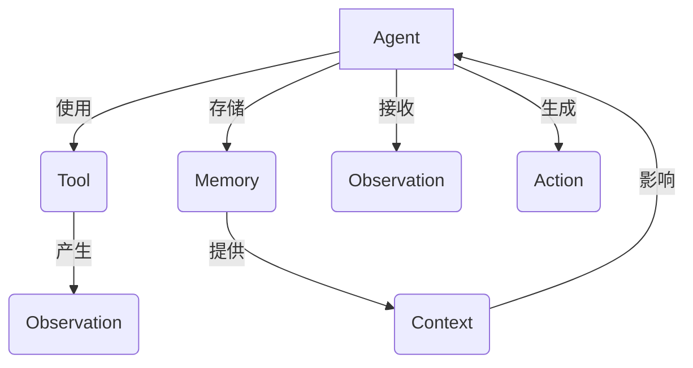

以下是对题目《【大模型应用开发 动手做AI Agent】用ReAct框架实现简单Agent》的详细解读和分析:

# 【大模型应用开发 动手做AI Agent】用ReAct框架实现简单Agent

## 1. 背景介绍

### 1.1 问题的由来

随着人工智能技术的不断发展,大型语言模型(Large Language Model, LLM)已经成为当前AI领域的研究热点。LLM通过海量数据训练,能够生成看似人类写作的自然语言文本,在对话系统、问答系统、文本生成等领域展现出了巨大的应用潜力。然而,LLM也存在一些明显的缺陷,如缺乏持久的记忆能力、无法对话历史进行推理、难以将对话状态持续传递等。为解决这些问题,AI Agent应运而生。

### 1.2 研究现状

目前,已有多种AI Agent框架应用于生产环境,如Anthropic的Constitutional AI、OpenAI的InstructGPT、Google的LaMDA等。这些系统通过将LLM与外部存储、规则系统等模块相结合,赋予了LLM一定的记忆和推理能力。但由于涉及商业利益,这些系统的技术细节并未完全开源,给学习和研究带来一定障碍。

### 1.3 研究意义  

本文将介绍一种开源的AI Agent框架ReAct,并基于该框架实现一个简单的AI Assistant,旨在为读者提供一个动手实践的机会,加深对AI Agent工作原理的理解。通过本文,读者将学习到:

- ReAct框架的核心概念和工作流程
- 如何用ReAct构建一个简单的AI Assistant
- AI Assistant的局限性及未来可能的改进方向

### 1.4 本文结构

本文首先介绍ReAct框架的核心概念,包括Agent、Tool、Memory等,并阐述它们之间的关系。接下来详细讲解ReAct的工作原理,包括Agent的响应循环、Tool的执行流程等。然后通过一个实际的代码示例,一步步构建一个简单的AI Assistant。最后总结ReAct框架的优缺点,并对AI Agent的发展趋势进行展望。

## 2. 核心概念与联系

ReAct是一个用于构建AI Agent的Python框架,其核心思想是将一个复杂的AI系统分解为多个相对简单的模块,并通过一个中央控制单元(Agent)对这些模块进行协调和组合。ReAct中的主要概念有:

1. **Agent**: 整个系统的大脑和控制中心,负责接收输入(Observation)、与Memory交互获取上下文(Context)、选择和调用合适的Tool、生成最终输出(Action)。

2. **Tool**: 代表一种特定的功能或操作,如访问网页、查询数据库、调用API等。每个Tool都有自己的输入输出接口,Agent通过调用合适的Tool来完成特定任务。

3. **Memory**: 用于存储Agent的状态和历史信息,如对话记录、知识库等。Memory为Agent提供了持久化的上下文信息。

4. **Observation**: 指Agent接收到的输入数据,如用户的文本查询。

5. **Action**: 指Agent根据Observation、Memory和Tool的输出生成的最终响应,通常是一段自然语言文本。

6. **Context**: 从Memory中获取的、与当前Observation相关的上下文信息,将影响Agent的决策和输出。

ReAct框架的核心思想是将复杂的AI系统分解为模块化的组件,使得每个组件的功能相对简单,从而降低了系统的整体复杂度。同时,Agent作为中央控制单元,负责组合和协调这些组件,生成最终的智能行为。这种模块化设计不仅提高了系统的可扩展性和可维护性,也为构建更加复杂、更加智能的AI系统奠定了基础。

## 3. 核心算法原理 & 具体操作步骤

### 3.1 算法原理概述

ReAct框架的核心算法是一个循环过程,称为Agent响应循环(Agent Response Cycle),用于生成对应于输入Observation的Action。这个过程可以概括为以下几个步骤:

1. 接收Observation
2. 从Memory获取相关Context
3. 根据Observation和Context,选择合适的Tool
4. 执行Tool,获取Tool的输出
5. 将Tool输出与Observation和Context结合,生成最终Action
6. 将本次交互的信息存储到Memory

该算法本质上是一个"观察-思考-行动"的循环过程,Agent通过不断获取输入、整合信息、选择行动来与外部世界交互,展现出智能行为。

### 3.2 算法步骤详解

我们使用一个简单的例子来详细解释每个步骤:

假设我们要构建一个简单的个人助理,它的主要功能是查询天气、查找餐馆、设置提醒等。该助理的Observation是用户的自然语言查询,如"今天上海天气怎么样?"。

1. **接收Observation**

   Agent首先接收到用户的查询"今天上海天气怎么样?"作为Observation。

2. **从Memory获取相关Context**

   Agent从Memory中获取与当前Observation相关的上下文信息,比如用户的位置、对话历史等。假设Memory中存储了用户所在城市是上海。

3. **根据Observation和Context,选择合适的Tool**

   Agent分析Observation是一个天气查询,结合用户所在城市上海的Context,选择调用"获取特定城市天气"的Tool。

4. **执行Tool,获取Tool的输出**

   Agent调用选中的Tool,并将"上海"作为输入参数。Tool执行相应的操作(如访问天气API),并输出"今天上海天气晴好,最高气温28摄氏度"。

5. **将Tool输出与Observation和Context结合,生成最终Action**

   Agent将Tool的输出"今天上海天气晴好,最高气温28摄氏度"与用户的原始Observation"今天上海天气怎么样?"结合,生成最终的Action作为回复。

6. **将本次交互的信息存储到Memory**

   Agent将本次交互的信息(如Observation、Context、使用的Tool、生成的Action等)存储到Memory中,为下一次交互提供参考。

通过上述步骤,Agent就完成了一次基于ReAct框架的智能响应。需要注意的是,在实际应用中,Agent响应循环可能会更加复杂,可能需要多次调用Tool、综合多个Tool的输出、根据上下文执行不同的策略等。

### 3.3 算法优缺点

**优点**:

1. **模块化设计**: 将复杂系统分解为多个相对简单的模块,有利于开发、维护和扩展。
2. **可组合性强**: 通过组合不同的Tool,能够构建出功能多样的AI Agent。
3. **具有记忆能力**: 借助Memory模块,Agent可以积累历史信息,保持对话状态。
4. **可解释性好**: 每一步的决策都有明确的依据,有利于系统的可解释性。

**缺点**:

1. **依赖Tool性能**: Agent的整体性能受限于所integr的Tool的性能和数量。
2. **决策依赖启发式规则**: Agent如何根据Observation和Context选择Tool,目前还缺乏通用的决策机制。
3. **上下文利用能力有限**: 如何高效地从Memory中获取和利用上下文信息仍是一个挑战。
4. **缺乏主动性和自主学习能力**: Agent目前无法主动提出新的需求,也无法自主学习和扩展功能。

### 3.4 算法应用领域  

ReAct框架及其核心算法主要应用于以下领域:

1. **对话系统**: 构建具备一定记忆和推理能力的对话助手。
2. **智能助理**: 开发个人助理、办公助理等,集成多种功能如查询、提醒、协作等。
3. **任务规划**: 将复杂任务分解为多个子任务,并协调不同Tool完成这些子任务。
4. **智能系统原型**: 快速搭建智能系统的原型,验证新的想法和架构。

总的来说,ReAct框架为构建模块化、可组合的AI系统提供了一种通用的范式,在多个领域都有一定的应用前景。

## 4. 数学模型和公式 & 详细讲解 & 举例说明

ReAct框架本身并不包含复杂的数学模型,但在具体实现过程中,我们可能需要使用一些数学模型来量化某些概念,并指导Agent的决策。下面我们给出一个示例,介绍如何使用简单的数学模型来量化Tool的执行效果,并将其纳入Agent的Tool选择过程。

### 4.1 数学模型构建

我们定义一个量化Tool执行效果的指标,称为**Tool Effectiveness Score**,用$S(t, o)$表示。其中$t$代表Tool,$o$代表Observation。该指标的值越大,表明该Tool处理该Observation的效果越好。

我们进一步将Tool Effectiveness Score拆分为两个部分:

$$S(t, o) = R(t, o) \times P(t, o)$$

其中:
- $R(t, o)$表示该Tool与Observation的**相关性**,取值区间$[0, 1]$。相关性越高,说明该Tool更适合处理该Observation。
- $P(t, o)$表示该Tool对该Observation的**处理质量**,也取值区间$[0, 1]$。处理质量越高,说明该Tool的输出对于该Observation更加有用。

### 4.2 公式推导过程

我们先定义一个简单的相关性函数$R(t, o)$:

$$R(t, o) = \frac{\sum\limits_{i=1}^{n}w_i\cdot\mathbb{1}(k_i \in o)}{\sum\limits_{i=1}^{n}w_i}$$

其中:
- $n$是与该Tool相关的关键词的数量
- $k_i$是第$i$个关键词
- $w_i$是第$i$个关键词的权重,反映了该词对该Tool的重要程度
- $\mathbb{1}(\cdot)$是指示函数,当$k_i$出现在Observation $o$中时,值为1,否则为0

该公式的含义是:如果Observation包含与该Tool高度相关的关键词,那么该Tool与该Observation的相关性就较高。

接下来,我们定义处理质量$P(t, o)$:

$$P(t, o) = \alpha \cdot \text{Precision}(t, o) + \beta \cdot \text{Coverage}(t, o)$$

其中:
- $\text{Precision}(t, o)$表示该Tool的输出与期望输出的相似度,取值区间$[0, 1]$
- $\text{Coverage}(t, o)$表示该Tool的输出覆盖了Observation的多少信息,取值区间$[0, 1]$
- $\alpha$和$\beta$是两个权重参数,满足$\alpha + \beta = 1$

该公式将处理质量分解为**准确性**和**覆盖率**两个方面,并通过加权求和的方式综合考虑。

综合以上两个公式,我们得到最终的Tool Effectiveness Score:

$$S(t, o) = \left(\frac{\sum\limits_{i=1}^{n}w_i\cdot\mathbb{1}(k_i \in o)}{\sum\limits_{i=1}^{n}w_i}\right) \cdot \left(\alpha \cdot \text{Precision}(t, o) + \beta \cdot \text{Coverage}(t, o)\right)$$

### 4.3 案例分析与讲解

假设我们有以下三个Tool:

- $t_1$: 查询天气,关键词为"天气"、"温度"等,权重为$w_1 = 0.6, w_2 = 0.4$
- $t_2$: 查找餐馆,关键词为"餐馆"、"美食"等,权重为$w_3 = 0.7, w_4 = 0.3$
- $t_3$: 设置提醒,关键词为"提醒"、"日程"等,权重为$w_5 = 0.8, w_6 = 0.2$

现在我们有一个Observation $o$为"明天上海的天气怎么样?我需要决定去哪家餐馆用餐"。

对于$t_1$,关键词"天气"和"温度"都出现在$o$中,所以:

$$R(t_1, o) = \frac{0.6 \cdot 1 + 0.4 \cdot 1}{0.6 + 0.4} = 1$$

假设$t_1