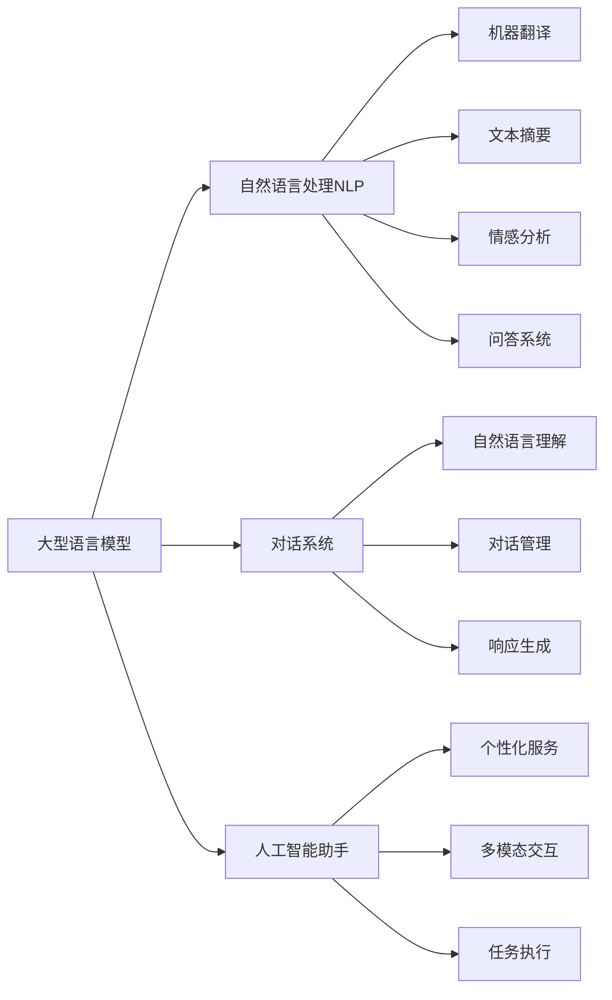

好的,我会按照您的要求,以专业的技术语言撰写这篇博客文章。

# 【大模型应用开发 动手做AI Agent】第一次调用大模型,向模型发送对话及工具定义,并获取响应

## 1. 背景介绍

### 1.1 问题的由来

在人工智能领域,大型语言模型已经成为近年来研究的热点和焦点。传统的机器学习模型通常在特定任务上表现出色,但缺乏通用性和可扩展性。而大型语言模型凭借其强大的文本生成和理解能力,展现出广阔的应用前景。

随着模型规模的不断扩大,训练数据的急剧增加,大型语言模型的性能得到了极大的提升,在自然语言处理、问答系统、内容生成等领域取得了令人瞩目的成就。但同时,也面临着诸多挑战,如模型的可解释性、安全性、效率等问题亟待解决。

### 1.2 研究现状  

目前,一些科技巨头如OpenAI、Google、Meta等公司都在大力推动大型语言模型的发展。他们相继推出了GPT-3、PaLM、LaMDA等里程碑式的大型语言模型,在自然语言理解、推理、生成等方面展现出了强大的能力。

除了商业公司,学术界也在积极开展大型语言模型的研究工作。斯坦福大学的CRRAFT项目旨在探索大型语言模型的能力边界;麻省理工学院的PALM项目则关注模型的可解释性和健壮性等问题。

### 1.3 研究意义

大型语言模型的发展对于推动人工智能技术的进步意义重大。它们不仅能够帮助我们更好地理解自然语言,还可以为诸多应用领域提供强大的支持,如智能助手、自动问答、内容生成、机器翻译等。

通过研究大型语言模型的工作原理、训练方法、部署策略等,我们可以更好地利用这一强大的技术,并探索其在各个领域的潜在应用。同时,也有助于我们认识到模型的局限性,并努力解决其中存在的问题和挑战。

### 1.4 本文结构

本文将全面介绍如何进行大模型应用开发,并动手实践调用大型语言模型,向其发送对话及工具定义,获取响应。文章将从以下几个方面进行阐述:

1. 核心概念与联系
2. 核心算法原理与具体操作步骤  
3. 数学模型和公式详细讲解与案例分析
4. 项目实践:代码实例和详细解释
5. 实际应用场景分析
6. 工具和学习资源推荐  
7. 总结:未来发展趋势与挑战
8. 附录:常见问题解答

## 2. 核心概念与联系

在深入探讨大模型应用开发之前,我们有必要先了解一些核心概念,它们之间存在着紧密的联系。

### 2.1 大型语言模型(Large Language Model)

大型语言模型指的是一种基于深度学习的自然语言处理模型,具有极大的参数量(通常超过10亿个参数)和海量的训练语料。它们能够从大规模无标注文本数据中学习语义和上下文信息,从而获得强大的语言理解和生成能力。

常见的大型语言模型包括GPT-3、PaLM、LaMDA、Jurassic-1等。它们通过自监督学习的方式在海量文本数据上进行预训练,学习到丰富的语言知识。

### 2.2 自然语言处理(Natural Language Processing)

自然语言处理(NLP)是人工智能的一个重要分支,旨在使计算机能够理解和生成人类语言。NLP技术广泛应用于机器翻译、文本摘要、情感分析、问答系统等领域。

大型语言模型在NLP领域发挥着关键作用。它们能够捕捉语言的复杂语义和上下文信息,从而更好地理解和生成自然语言。

### 2.3 对话系统(Dialogue System)

对话系统是一种能够与人类进行自然语言交互的智能系统。它们需要具备自然语言理解、对话管理、响应生成等多种能力。

大型语言模型为构建对话系统提供了强有力的支持。基于大型语言模型,我们可以开发出具有较强语境理解能力的对话代理,以更人性化、流畅的方式与用户进行交互。

### 2.4 人工智能助手(AI Assistant)

人工智能助手是一种集成了多种人工智能技术的智能系统,旨在为用户提供个性化的服务和支持。它们可以执行各种任务,如问答、日程安排、内容创作等。

大型语言模型是构建人工智能助手的关键技术之一。通过整合大型语言模型,人工智能助手能够更好地理解用户的需求,并生成相关、连贯的响应,提供更智能、人性化的服务体验。

### 2.5 Mermaid流程图

上图使用Mermaid流程图展示了大型语言模型与自然语言处理、对话系统、人工智能助手等概念之间的关系。大型语言模型是这些应用的核心支撑技术,为它们提供了强大的语言理解和生成能力。

## 3. 核心算法原理与具体操作步骤  

### 3.1 算法原理概述

大型语言模型通常采用基于Transformer的序列到序列(Seq2Seq)架构,利用自注意力(Self-Attention)机制来捕捉长距离依赖关系。该架构能够有效地并行化训练,从而支持大规模参数和数据的训练。

在训练过程中,大型语言模型通常采用自监督学习的方式,使用掩码语言模型(Masked Language Modeling)和下一句预测(Next Sentence Prediction)等任务目标,在大量无标注文本数据上进行预训练。

预训练完成后,大型语言模型可以通过微调(Fine-tuning)或提示学习(Prompt Learning)等方式,将预训练的知识迁移到下游任务中,如文本生成、机器阅读理解、对话系统等。

### 3.2 算法步骤详解

以GPT(Generative Pre-trained Transformer)系列模型为例,其核心算法步骤可概括为以下几个阶段:

#### 3.2.1 预训练(Pre-training)

1. **数据预处理**: 从大规模语料库(如网页、书籍、维基百科等)中收集无标注文本数据,进行标记化、编码等预处理。
2. **掩码语言模型**: 在输入序列中随机掩码部分词元,模型需要根据上下文预测被掩码的词元。
3. **下一句预测**: 给定两个句子,模型需要判断第二个句子是否为第一个句子的下一句。
4. **损失函数**: 使用交叉熵损失函数来优化模型参数。
5. **优化算法**: 通常采用Adam等优化算法进行参数更新。

#### 3.2.2 微调(Fine-tuning)

1. **下游任务数据**: 收集特定任务的标注数据,如文本分类、机器阅读理解等。
2. **任务头(Task Head)**: 在预训练模型的输出上添加特定的任务头,用于对应不同的下游任务。
3. **训练**: 在下游任务数据上进行有监督微调,更新模型参数以适应特定任务。
4. **评估**: 在测试集上评估模型的性能表现。

#### 3.2.3 提示学习(Prompt Learning)

1. **提示模板**: 设计包含任务说明和示例输入输出的提示模板。
2. **提示编码**: 将提示模板编码为模型可理解的输入序列。
3. **生成**: 模型根据提示生成相应的输出序列。
4. **评估**: 评估生成的输出是否符合预期。

### 3.3 算法优缺点

#### 优点:

- **强大的语言理解和生成能力**: 大型语言模型能够从海量数据中学习丰富的语言知识,展现出优秀的自然语言处理性能。
- **通用性和可迁移性**: 预训练的模型可以通过微调或提示学习等方式,快速适应新的下游任务。
- **可解释性**: 基于注意力机制,模型的决策过程具有一定的可解释性。
- **高效并行训练**: Transformer架构支持高效的并行化训练,有利于训练大规模模型。

#### 缺点:

- **训练成本高昂**: 大型语言模型需要消耗大量的计算资源进行预训练,成本高昂。
- **存在偏见和不确定性**: 由于训练数据的局限性,模型可能存在一定的偏见和不确定性。
- **缺乏常识推理能力**: 虽然语言理解能力强大,但模型在常识推理方面的表现仍有待提高。
- **安全性和隐私问题**: 模型可能会生成有害或违法内容,也可能泄露训练数据中的隐私信息。

### 3.4 算法应用领域

大型语言模型由于其强大的语言理解和生成能力,在诸多领域展现出广阔的应用前景:

- **自然语言处理**: 文本生成、机器翻译、文本摘要、情感分析、问答系统等。
- **对话系统**: 构建具有较强语境理解能力的对话代理。
- **内容创作**: 辅助写作、创意生成、自动化报告等。
- **知识挖掘**: 从大规模语料库中提取有价值的知识和见解。
- **智能助手**: 整合多种AI技术,为用户提供个性化的智能服务。

## 4. 数学模型和公式详细讲解与案例分析

### 4.1 数学模型构建

大型语言模型通常采用基于Transformer的序列到序列(Seq2Seq)架构,其核心是自注意力(Self-Attention)机制。我们将从自注意力机制入手,介绍模型的数学表示。

给定一个长度为 $n$ 的输入序列 $\boldsymbol{x} = (x_1, x_2, \ldots, x_n)$,我们首先将每个词元 $x_i$ 映射为一个连续的向量表示 $\boldsymbol{e}_i \in \mathbb{R}^{d_\text{model}}$,其中 $d_\text{model}$ 是模型的隐状态维度。

然后,我们计算查询(Query)、键(Key)和值(Value)向量,它们分别由三个不同的线性投影得到:

$$
\begin{aligned}
\boldsymbol{Q} &= \boldsymbol{X} \boldsymbol{W}^Q \\
\boldsymbol{K} &= \boldsymbol{X} \boldsymbol{W}^K \\
\boldsymbol{V} &= \boldsymbol{X} \boldsymbol{W}^V
\end{aligned}
$$

其中 $\boldsymbol{W}^Q \in \mathbb{R}^{d_\text{model} \times d_k}$、$\boldsymbol{W}^K \in \mathbb{R}^{d_\text{model} \times d_k}$ 和 $\boldsymbol{W}^V \in \mathbb{R}^{d_\text{model} \times d_v}$ 分别是查询、键和值的线性投影矩阵,并且 $d_k$ 和 $d_v$ 分别是键和值的维度。

接下来,我们计算查询和键之间的点积,并对其进行缩放和软最大值操作,得到注意力分数矩阵 $\boldsymbol{A}$:

$$
\boldsymbol{A} = \text{softmax}\left(\frac{\boldsymbol{Q}\boldsymbol{K}^\top}{\sqrt{d_k}}\right)
$$

注意力分数矩阵 $\boldsymbol{A}$ 描述了每个查询向量与所有键向量之间的相关性。通过将注意力分数与值向量相乘,我们可以获得注意力输出:

$$
\text{Attention}(\boldsymbol