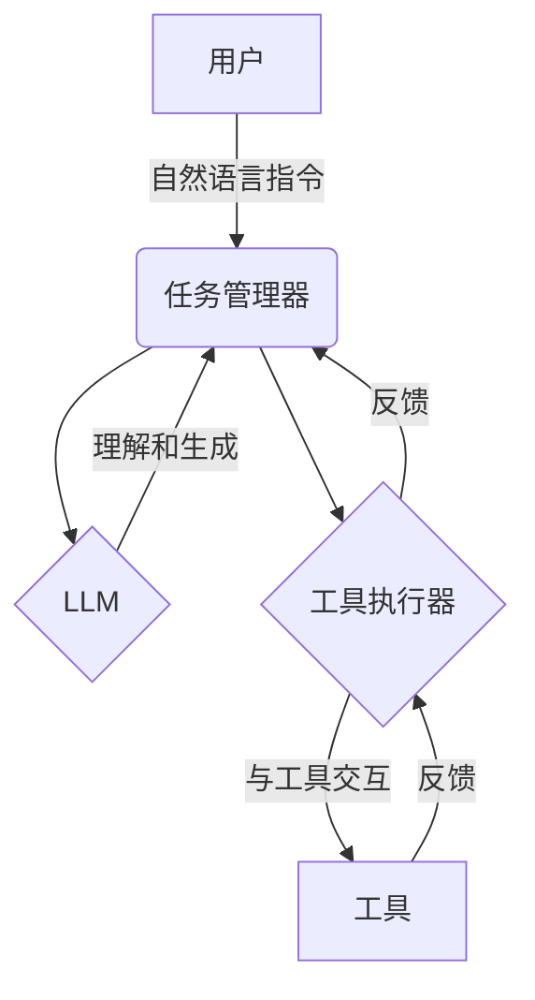

# 【大模型应用开发 动手做AI Agent】第二轮行动：工具执行计算

## 1. 背景介绍

### 1.1 问题的由来

在当今的人工智能时代，大型语言模型已经成为各大科技公司竞相开发和应用的热门领域。随着计算能力的不断提升和算法的持续优化,大模型已经展现出了令人惊叹的能力,可以执行各种复杂的任务,如自然语言处理、计算机视觉、决策推理等。然而,如何充分利用大模型的强大功能,并将其与实际应用场景无缝集成,仍然是一个亟待解决的挑战。

### 1.2 研究现状

目前,业界已经出现了一些尝试,旨在将大模型的能力与实际应用相结合。例如,OpenAI推出了ChatGPT,一个基于GPT-3.5的对话式AI助手,可以回答各种问题并执行简单的任务。另一方面,Anthropic公司开发了Claude,一个更加注重安全性和可控性的AI助理。然而,这些现有解决方案仍然存在一些局限性,如缺乏对复杂任务的支持、无法与外部工具和服务进行无缝集成等。

### 1.3 研究意义

开发一种能够与外部工具和服务无缝集成的AI Agent,将大大扩展大模型的应用范围和实用性。通过将大模型的自然语言理解和生成能力与外部工具的专业功能相结合,我们可以创建出一种全新的人机交互模式,让用户只需使用自然语言就能完成复杂的任务。这不仅能够提高工作效率,还能为普通用户提供更加智能和人性化的体验。

### 1.4 本文结构

本文将详细介绍如何开发一种能够与外部工具和服务集成的AI Agent。我们将首先探讨核心概念和算法原理,然后深入研究数学模型和公式推导。接下来,我们将通过代码实例和应用场景,展示如何将理论付诸实践。最后,我们将总结未来发展趋势和面临的挑战,并提供相关资源推荐。

## 2. 核心概念与联系

在开发AI Agent时,我们需要理解几个核心概念及其相互关系:

1. **大型语言模型(Large Language Model, LLM)**: 这是整个系统的核心,负责自然语言理解和生成。常见的LLM包括GPT-3、PaLM、Chinchilla等。

2. **工具(Tool)**: 指各种外部应用程序、API或服务,用于执行特定任务。例如,搜索引擎、文件管理器、计算器等。

3. **工具执行器(Tool Executor)**: 负责与工具进行交互,将LLM的指令转化为具体的操作。

4. **任务管理器(Task Manager)**: 协调整个流程,将用户的自然语言指令分解为多个子任务,并将子任务分配给LLM和工具执行器。

5. **反馈循环(Feedback Loop)**: 在执行任务的过程中,LLM和工具执行器会不断地向任务管理器提供反馈,以便调整策略和优化结果。

这些核心概念通过有机的协作,构成了一个完整的AI Agent系统。下面的Mermaid流程图展示了它们之间的交互关系:

## 3. 核心算法原理 & 具体操作步骤

### 3.1 算法原理概述

AI Agent的核心算法原理可以概括为以下几个步骤:

1. **自然语言理解**: 将用户的自然语言指令输入到LLM,对指令进行语义理解和分析。

2. **任务分解**: 任务管理器将原始指令分解为多个子任务,并确定每个子任务是由LLM还是工具执行器来完成。

3. **LLM执行**: 对于需要LLM处理的子任务,LLM会生成相应的自然语言响应。

4. **工具执行**: 对于需要外部工具处理的子任务,任务管理器会将子任务分配给相应的工具执行器,并将执行结果返回给LLM。

5. **结果整合**: LLM将自身生成的响应与工具执行器的结果进行整合,形成最终的输出。

6. **反馈循环**: 在整个过程中,LLM和工具执行器会不断向任务管理器提供反馈,以便优化策略和改进结果。

### 3.2 算法步骤详解

1. **自然语言理解**

   在这一步骤中,我们需要将用户的自然语言指令输入到LLM中进行语义理解和分析。LLM会基于其内部的语言模型和知识库,对指令进行tokenization、语义解析和意图识别等处理。

2. **任务分解**

   任务管理器会根据LLM的语义分析结果,将原始指令分解为多个子任务。每个子任务都会被标记为由LLM还是工具执行器来完成。这一步骤需要设计一个高效的任务分解策略,以确保子任务的合理性和可执行性。

3. **LLM执行**

   对于需要LLM处理的子任务,LLM会基于其内部的语言模型和知识库,生成相应的自然语言响应。这一步骤需要注意LLM的输出质量和一致性,以确保响应的准确性和可读性。

4. **工具执行**

   对于需要外部工具处理的子任务,任务管理器会将子任务分配给相应的工具执行器。工具执行器需要将LLM的自然语言指令转化为具体的操作,并与外部工具进行交互。执行结果会以适当的格式返回给LLM。

5. **结果整合**

   LLM需要将自身生成的响应与工具执行器的结果进行整合,形成最终的输出。这一步骤需要设计一个合理的结果整合策略,以确保输出的连贯性和可读性。

6. **反馈循环**

   在整个过程中,LLM和工具执行器会不断向任务管理器提供反馈,包括执行过程中遇到的问题、需要优化的地方等。任务管理器会根据这些反馈,动态调整任务分解策略、结果整合策略等,以优化整个系统的性能。

### 3.3 算法优缺点

**优点**:

- 将大模型的自然语言能力与外部工具的专业功能相结合,大大扩展了AI Agent的应用范围和实用性。
- 通过任务分解和结果整合,可以有效地处理复杂的任务,提高了系统的灵活性和可扩展性。
- 反馈循环机制可以不断优化系统的性能,提高任务执行的准确性和效率。

**缺点**:

- 系统的设计和实现相对复杂,需要精心设计任务分解、结果整合等策略。
- 需要与大量外部工具和服务进行集成,增加了系统的复杂性和维护成本。
- 对LLM的自然语言理解和生成能力有较高的要求,需要进一步优化语言模型。

### 3.4 算法应用领域

该算法可以广泛应用于各种需要人机交互的场景,包括但不限于:

- 智能助手和虚拟助理
- 自动化办公和工作流程
- 客户服务和技术支持
- 教育和在线学习
- 个人生活助理
- 等等

只要有合适的外部工具和服务,该算法就可以为用户提供智能化的解决方案,极大提高工作效率和生活质量。

## 4. 数学模型和公式 & 详细讲解 & 举例说明

### 4.1 数学模型构建

在AI Agent系统中,我们需要构建一个数学模型来量化任务分解和结果整合的过程。我们可以将整个过程建模为一个马尔可夫决策过程(Markov Decision Process, MDP)。

MDP可以用一个元组 $(S, A, P, R, \gamma)$ 来表示,其中:

- $S$ 是状态空间,表示系统可能处于的所有状态。
- $A$ 是动作空间,表示系统可以执行的所有动作。
- $P(s'|s,a)$ 是状态转移概率,表示在状态 $s$ 下执行动作 $a$ 后,系统转移到状态 $s'$ 的概率。
- $R(s,a)$ 是回报函数,表示在状态 $s$ 下执行动作 $a$ 所获得的即时回报。
- $\gamma \in [0,1)$ 是折现因子,用于权衡即时回报和长期回报的重要性。

在我们的场景中,状态 $s$ 可以表示当前任务的执行状态,包括已完成的子任务、正在执行的子任务等。动作 $a$ 可以表示分配给LLM或工具执行器的子任务。状态转移概率 $P(s'|s,a)$ 反映了执行某个子任务后,系统转移到新状态的概率。回报函数 $R(s,a)$ 可以根据子任务的执行质量和效率来设计,以量化每个动作的收益。

我们的目标是找到一个最优策略 $\pi^*(s)$,使得在任意初始状态 $s_0$ 下,按照该策略执行动作序列可以最大化预期的累积回报:

$$
\max_\pi \mathbb{E}\left[\sum_{t=0}^\infty \gamma^t R(s_t, \pi(s_t))\right]
$$

其中 $\pi(s_t)$ 表示在状态 $s_t$ 下按策略 $\pi$ 执行的动作。

### 4.2 公式推导过程

为了求解最优策略 $\pi^*$,我们可以使用强化学习算法,如Q-Learning或策略梯度方法。这里我们以Q-Learning为例,推导出更新Q值的公式。

Q值函数 $Q(s,a)$ 表示在状态 $s$ 下执行动作 $a$,之后按最优策略执行所能获得的预期累积回报。根据贝尔曼方程,我们有:

$$
Q(s,a) = \mathbb{E}_{s'\sim P(\cdot|s,a)}\left[R(s,a) + \gamma \max_{a'} Q(s',a')\right]
$$

我们可以使用以下迭代更新规则来逼近真实的Q值:

$$
Q(s_t,a_t) \leftarrow Q(s_t,a_t) + \alpha\left(R(s_t,a_t) + \gamma \max_{a'} Q(s_{t+1},a') - Q(s_t,a_t)\right)
$$

其中 $\alpha$ 是学习率,控制更新的步长。通过不断更新Q值,我们可以逐渐找到最优策略 $\pi^*(s) = \arg\max_a Q(s,a)$。

### 4.3 案例分析与讲解

假设我们需要开发一个AI Agent,能够根据用户的自然语言指令执行"查找餐馆"的任务。该任务可以分解为以下几个子任务:

1. 理解用户的查找偏好(如地点、菜系、价格范围等)。
2. 在搜索引擎中查找符合条件的餐馆列表。
3. 从搜索结果中筛选出最佳选择。
4. 提供餐馆的详细信息(如地址、营业时间、菜单等)。

我们可以将整个过程建模为一个MDP,其中:

- 状态 $s$ 表示当前执行到哪个子任务,以及已获得的信息(如用户偏好、搜索结果等)。
- 动作 $a$ 表示分配给LLM或工具执行器的具体子任务。
- 状态转移概率 $P(s'|s,a)$ 反映了执行某个子任务后,系统转移到新状态的概率。
- 回报函数 $R(s,a)$ 可以根据子任务的执行质量和效率来设计,例如用户满意度、搜索结果的相关性等。

通过不断更新Q值并优化策略,我们可以找到一个最优的任务分解和执行方式,从而为用户提供高质量的餐馆推荐服务。

### 4.4 常见问题解答

**Q: 如何设计合理的回报函数?**

A: 回报函数的设计需要根据具体的应用场景和目标。