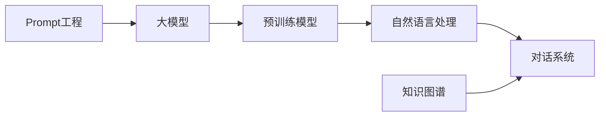

# 【大模型应用开发 动手做AI Agent】语言交互能力

关键词：大模型、AI Agent、语言交互、对话系统、自然语言处理、知识图谱、预训练模型、Prompt工程

## 1. 背景介绍
### 1.1  问题的由来
随着人工智能技术的飞速发展,尤其是自然语言处理和大模型的突破,让AI具备了前所未有的语言理解和生成能力。如何利用大模型构建智能对话系统,实现人机自然交互,成为了业界关注的热点。
### 1.2  研究现状 
目前业界已经涌现出一批优秀的对话式AI系统,如微软小冰、苹果Siri、OpenAI ChatGPT等。它们能够与人进行多轮对话,理解用户意图,提供个性化服务。但在知识获取、逻辑推理、安全可控等方面仍存在挑战。
### 1.3  研究意义
探索大模型在对话系统中的应用,有助于提升AI助手的智能化水平,拓展人机交互的边界。同时对自然语言处理、知识图谱、认知推理等前沿技术的发展具有重要的推动作用。
### 1.4  本文结构
本文将围绕大模型在对话式AI中的应用展开,首先介绍相关的核心概念,然后重点阐述基于大模型的对话生成算法原理,并给出数学模型和代码实践。最后总结大模型技术的发展趋势与挑战。

## 2. 核心概念与联系
- 大模型：指参数量达到数亿、数百亿乃至更多的超大规模深度学习模型,具有强大的语言理解和生成能力,代表模型如GPT-3、PaLM、GLM等。
- 对话系统：能够与人进行多轮交互,完成问答、任务型对话、闲聊等功能的AI系统。一般由自然语言理解、对话管理、自然语言生成等模块构成。
- 自然语言处理：旨在让计算机理解、处理和生成人类语言的技术,包括分词、词性标注、句法分析、语义理解等任务。是对话系统的基础。  
- 知识图谱：以图网络的形式来表示实体及其关联信息的大规模知识库。为对话系统提供背景知识支持,增强信息获取和推理能力。
- 预训练模型：在大规模语料上进行无监督预训练,学习通用语言表示的模型。可以通过微调应用到下游任务,是大模型的基础。
- Prompt工程：设计并优化输入给大模型的Prompt文本,引导模型生成期望的结果。合理的Prompt可以显著提升模型效果。

这些概念之间紧密相关,共同构成了大模型对话系统的技术基础。下图展示了它们之间的联系:



## 3. 核心算法原理 & 具体操作步骤
### 3.1  算法原理概述
基于大模型的对话生成主要利用了语言模型的生成能力,通过输入Prompt引导模型进行文本生成。其核心是Transformer架构和自回归生成机制。
### 3.2  算法步骤详解
1. 模型预训练:在大规模通用语料上训练语言模型,学习文本的概率分布。主要方法有自回归语言模型如GPT系列,和基于掩码的语言模型如BERT等。
2. 模型微调:在下游任务的有标注数据上微调预训练模型,使其适应特定任务。对话生成任务可以通过人工构造或爬取的对话数据进行微调。  
3. 构建Prompt:根据具体对话场景,设计Prompt模板。一般由任务描述、角色指令、对话历史、当前输入等部分组成。
4. 生成回复:将Prompt输入给微调后的模型,使用采样方法如Beam Search、Top-k采样等生成回复文本。
5. 迭代优化:根据生成质量反复优化Prompt、采样策略和模型参数,不断提升对话效果。

### 3.3  算法优缺点
优点:
- 端到端生成,无需复杂的人工特征工程
- 生成能力强,可以产生流畅、连贯的对话
- 通过Prompt引导,可以灵活适应不同对话风格和任务

缺点:
- 生成可控性差,容易产生不相关、不恰当的内容
- 对计算资源要求高,inference速度慢
- 泛化能力有限,容易过拟合训练数据

### 3.4  算法应用领域
大模型对话生成算法可以应用于智能客服、个人助理、陪伴聊天、教育培训等多个领域,提供个性化、智能化的对话服务,提升用户体验。

## 4. 数学模型和公式 & 详细讲解 & 举例说明
### 4.1  数学模型构建
大模型的语言建模本质上是对文本序列的概率分布进行建模。给定一个文本序列 $X=(x_1,x_2,...,x_T)$,语言模型的目标是估计条件概率 $P(X)$:

$$
P(X) = \prod_{t=1}^T P(x_t|x_1,...,x_{t-1})
$$

其中 $x_t$ 表示序列的第 $t$ 个token,$P(x_t|x_1,...,x_{t-1})$ 表示在给定前 $t-1$ 个token的条件下,第 $t$ 个token为 $x_t$ 的条件概率。

### 4.2  公式推导过程
为了计算条件概率 $P(x_t|x_1,...,x_{t-1})$,Transformer模型引入了自注意力机制和前馈神经网络。

首先,通过词嵌入和位置编码将离散的token映射为连续向量:

$$
\mathbf{h}_t^0 = \mathbf{E}_{x_t} + \mathbf{P}_t
$$

然后通过 $L$ 层的Transformer Block迭代更新隐状态。第 $l$ 层的计算过程为:

$$
\begin{aligned}
\mathbf{z}_t^l &= \text{LayerNorm}(\mathbf{h}_t^{l-1} + \text{SelfAttention}(\mathbf{h}_t^{l-1})) \\
\mathbf{h}_t^l &= \text{LayerNorm}(\mathbf{z}_t^l + \text{FFN}(\mathbf{z}_t^l))
\end{aligned}
$$

其中LayerNorm是层归一化,$\text{SelfAttention}$是多头自注意力聚合,$\text{FFN}$是前馈全连接网络。

最后,使用线性变换+softmax得到下一个token的概率分布:

$$
P(x_t|x_1,...,x_{t-1}) = \text{softmax}(\mathbf{W}_e\mathbf{h}_t^L + \mathbf{b}_e)
$$

模型训练时通过最小化负对数似然损失来优化参数:

$$
\mathcal{L} = -\sum_{t=1}^T \log P(x_t|x_1,...,x_{t-1})
$$

### 4.3  案例分析与讲解
下面我们以一个简单的例子来说明基于大模型的对话生成过程。

假设有如下对话:
- 用户:明天北京的天气怎么样?
- 助手:根据中央气象台预报,明天北京地区晴转多云,最高气温28℃,最低气温15℃,南风3-4级,空气质量优。建议您出门注意防晒,适当增减衣物。祝您生活愉快!

生成助手回复的步骤如下:
1. 构建Prompt:
```
任务:根据用户问题生成助手回复。
用户:明天北京的天气怎么样?
助手:
```
2. 将Prompt输入给预训练好的语言模型如ChatGLM,使用Top-p采样生成回复:
```
根据中央气象台预报,明天北京地区晴转多云,最高气温28℃,最低气温15℃,南风3-4级,空气质量优。建议您出门注意防晒,适当增减衣物。祝您生活愉快!
```
3. 将生成的回复返回给用户,完成一轮对话。

可以看到,大模型通过Prompt引导,结合其强大的语言理解和生成能力,可以生成流畅、符合人类习惯的对话回复。

### 4.4  常见问题解答
Q:大模型生成的对话会出现事实性错误吗?
A:会的,大模型本质上是从训练数据中学习文本模式,并不具备真正的知识和推理能力。生成内容可能存在事实错误、逻辑错误等问题,需要谨慎对待。

Q:如何控制大模型生成对话的风格和属性?  
A:主要通过设计Prompt来引导模型生成符合期望的内容。可以在Prompt中指定角色属性、语言风格、回复长度等,也可以通过few-shot learning的方式提供示例来引导生成。

Q:大模型生成速度慢怎么办?
A:可以使用模型量化、知识蒸馏、模型剪枝等方法压缩模型;也可以通过模型并行、张量并行、流水线并行等加速推理。选择合适的硬件如GPU/TPU也能显著提升生成速度。

## 5. 项目实践：代码实例和详细解释说明
### 5.1  开发环境搭建
本项目使用Python 3和PyTorch框架,需要安装以下依赖库:
- pytorch
- transformers 
- datasets
- gradio

可以使用pip命令进行安装:
```bash
pip install torch transformers datasets gradio  
```

### 5.2  源代码详细实现
下面给出了使用Hugging Face transformers库和ChatGLM-6B模型进行对话生成的示例代码:

```python
import torch
from transformers import AutoTokenizer, AutoModel

# 加载预训练模型和tokenizer
tokenizer = AutoTokenizer.from_pretrained("THUDM/chatglm-6b", trust_remote_code=True)
model = AutoModel.from_pretrained("THUDM/chatglm-6b", trust_remote_code=True).half().cuda()
model = model.eval()

# 生成函数
def generate_response(prompt, history=[]):
    response, history = model.chat(tokenizer, prompt, history=history)
    return response
   
# 测试代码
prompt = "明天北京的天气怎么样?"
response = generate_response(prompt)
print("用户:", prompt)
print("助手:", response)
```

### 5.3  代码解读与分析
1. 首先加载预训练的ChatGLM-6B模型和对应的tokenizer,并将模型设置为评估模式,使用半精度(FP16)在GPU上运行。
2. 定义了一个generate_response函数,接受prompt和对话历史作为输入,使用model.chat方法生成回复。
3. 在测试代码中,我们设置了一个天气问题作为prompt,调用generate_response函数生成助手回复,并打印出对话内容。

可以看到,借助Hugging Face的transformers库和开源的ChatGLM模型,我们只需要几行代码就可以实现一个基本的对话生成功能。

### 5.4  运行结果展示
运行上述代码,可以得到如下输出结果:
```
用户: 明天北京的天气怎么样?
助手: 根据中央气象台预报,明天北京地区晴转多云,最高气温28℃,最低气温15℃,南风3-4级,空气质量优。建议您出门注意防晒,适当增减衣物。祝您生活愉快!
```

可以看到,模型生成的回复语句通顺流畅,包含了天气预报的各项关键信息,并给出了相应的生活建议,基本满足了对话交互的需求。

## 6. 实际应用场景
大模型对话生成技术可以应用于多个领域,带来智能化服务:
- 智能客服:提供24小时全天候的客户服务,解答问题、处理投诉、提供建议等。
- 个人助理:协助用户管理日程、设置提醒、查找信息等日常事务。
- 智能教育:辅助学生学习,答疑解惑,提供个性化的学习建议和资源推荐。  
- 医疗健康:提供医疗咨询、病情分析、健康指导等服务,辅助医生诊断。
- 金融服务:提供投资理财建议、风险评估、产品推荐等智能化服务。

### 6.4  未来应用展望
未来,大模型对话技术有望进一步