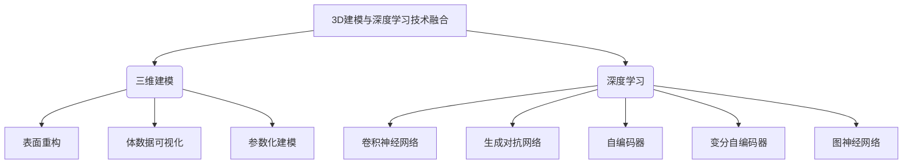
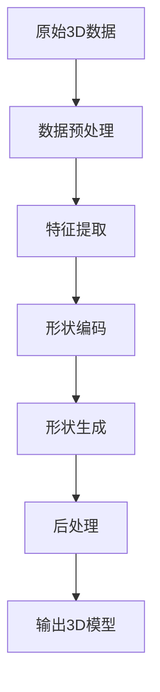

正文部分如下：

# 一切皆是映射：3D建模与深度学习技术的融合

## 1. 背景介绍

### 1.1 问题的由来

在过去的几十年里，三维(3D)建模技术取得了长足的进步,为各个领域带来了革命性的变化。从工业设计到影视制作,从医疗可视化到虚拟现实,3D模型已经成为不可或缺的数字资产。然而,传统的3D建模过程通常是手动的、耗时的,需要专业人员投入大量的时间和精力。随着深度学习技术的兴起,人工智能(AI)正在为3D建模带来新的可能性。

### 1.2 研究现状 

近年来,研究人员已经开始探索将深度学习与3D建模相结合的方法。一些突破性的工作已经展示了利用深度神经网络从2D图像或3D数据直接生成3D模型的潜力。这些方法旨在自动化和加速3D建模过程,减轻人工劳动的负担。然而,目前的技术仍然存在一些局限性,例如生成模型的质量和多样性有待提高,对复杂场景的建模能力有限等。

### 1.3 研究意义

将3D建模与深度学习技术相融合,可以带来诸多潜在的好处。首先,它有望极大地提高3D建模的效率,降低成本,使更多人能够访问和利用3D内容。其次,通过机器学习的方式,可以从大量数据中自动发现模式和规律,从而生成更加丰富多样的3D模型。此外,深度学习在处理复杂数据方面的强大能力,可以帮助我们更好地捕捉和表示真实世界的细节。

### 1.4 本文结构

本文将全面探讨3D建模与深度学习技术的融合。我们将首先介绍相关的核心概念和技术,然后深入探讨核心算法的原理和具体实现步骤。接下来,我们将重点讲解数学模型和公式推导,并通过案例分析加深理解。之后,我们将提供一个完整的项目实践,包括代码实现和结果展示。最后,我们将讨论实际应用场景、工具和资源推荐,并总结未来发展趋势和面临的挑战。

## 2. 核心概念与联系

在深入探讨3D建模与深度学习技术的融合之前,我们需要先了解一些核心概念和技术。

### 2.1 三维建模

三维建模是指使用计算机软件创建数字化的三维对象或场景的过程。它广泛应用于各个领域,包括工业设计、动画制作、游戏开发、科学可视化等。常见的三维建模技术包括:

- **表面重构(Surface Reconstruction)**: 从点云数据或深度图像重建物体的表面几何形状。
- **体数据可视化(Volume Rendering)**: 将三维体数据(如CT或MRI扫描数据)可视化为三维图像或模型。
- **参数化建模(Parametric Modeling)**: 使用参数化的几何形状和约束来构建复杂的三维模型。

### 2.2 深度学习

深度学习是机器学习的一个子领域,它利用深层神经网络模型从数据中自动学习特征表示。深度学习在计算机视觉、自然语言处理等领域取得了巨大的成功。在3D建模领域,常见的深度学习技术包括:

- **卷积神经网络(Convolutional Neural Networks, CNNs)**: 擅长从图像或体数据中提取特征,可用于3D形状分析和重构。
- **生成对抗网络(Generative Adversarial Networks, GANs)**: 可用于生成逼真的3D模型或图像。
- **自编码器(Autoencoders)和变分自编码器(Variational Autoencoders, VAEs)**: 可用于学习3D数据的紧凑表示,并生成新的3D模型。
- **图神经网络(Graph Neural Networks, GNNs)**: 可以处理具有图结构的数据,如三维网格或点云,用于3D形状分析和生成。

通过将三维建模技术与深度学习技术相结合,我们可以实现自动化的3D建模、高质量的3D模型生成,以及对复杂3D数据的高效处理和理解。

## 3. 核心算法原理 & 具体操作步骤

在本节中,我们将深入探讨3D建模与深度学习技术融合的核心算法原理和具体操作步骤。

### 3.1 算法原理概述

将3D建模与深度学习技术相结合的核心思想是利用深度神经网络从数据中自动学习三维形状的表示和生成规则。具体来说,这种方法通常包括以下几个关键步骤:

1. **数据预处理**: 将原始的3D数据(如点云、网格或体数据)转换为适合神经网络处理的格式,例如体素(voxel)格式或点云格式。

2. **特征提取**: 使用卷积神经网络或图神经网络等模型从预处理后的数据中提取有意义的特征表示。

3. **形状编码**: 将提取的特征映射到一个紧凑的潜在空间,即形状的编码表示。这种编码通常是一个低维的向量,捕捉了形状的关键特征。

4. **形状生成**: 从编码的潜在空间中采样,并使用解码器网络(如生成对抗网络或变分自编码器)将编码还原为三维形状。

5. **后处理**: 对生成的三维形状进行优化、平滑或其他后处理操作,以提高质量和真实感。

通过端到端的训练,神经网络可以自动学习从输入数据到输出三维形状的映射函数,实现自动化的3D建模。

### 3.2 算法步骤详解

接下来,我们将详细介绍上述算法的具体实现步骤。

#### 3.2.1 数据预处理

在将原始3D数据输入到神经网络之前,我们需要对其进行预处理,将其转换为适合神经网络处理的格式。常见的预处理方法包括:

- **体素化(Voxelization)**: 将三维物体或场景离散化为一个三维体素网格,每个体素代表一个小的三维单元。这种表示方式类似于二维图像中的像素,可以直接输入到三维卷积神经网络中进行处理。

- **点云采样(Point Cloud Sampling)**: 从原始三维物体或场景中采样一定数量的三维点,形成一个无序的点云。这种表示方式保留了原始数据的几何信息,可以输入到专门设计的点云神经网络中进行处理。

- **网格简化(Mesh Simplification)**: 对原始三维网格进行简化,减少面片数量,从而降低计算复杂度。这种预处理方法通常用于处理高分辨率的三维网格数据。

#### 3.2.2 特征提取

特征提取是深度学习算法的核心步骤之一。在3D建模领域,我们可以使用以下神经网络模型从预处理后的数据中提取有意义的特征表示:

- **三维卷积神经网络(3D Convolutional Neural Networks, 3D CNNs)**: 这是处理体素数据的常用模型。它通过三维卷积和池化操作从体素网格中提取局部和全局特征。

- **点云神经网络(Point Cloud Neural Networks, PCNNs)**: 专门设计用于处理无序点云数据的神经网络模型。它们通常包括特征变换模块、对称函数和注意力机制等组件,以有效地捕捉点云的几何结构。

- **图神经网络(Graph Neural Networks, GNNs)**: 可以处理具有图结构的数据,如三维网格。它们通过在网格上传播信息来提取局部和全局特征。

#### 3.2.3 形状编码

特征提取后,我们需要将提取的特征映射到一个紧凑的潜在空间,即形状的编码表示。常见的编码方法包括:

- **自编码器(Autoencoders)**: 通过训练一个编码器-解码器网络,将高维的输入数据压缩为低维的潜在编码,并能够从编码中重建原始输入。

- **变分自编码器(Variational Autoencoders, VAEs)**: 在自编码器的基础上引入了变分推理,使得潜在编码空间具有良好的概率分布性质,便于从中采样生成新的形状。

- **生成对抗网络(Generative Adversarial Networks, GANs)**: 通过对抗训练,生成器网络学习从潜在空间中采样并生成逼真的三维形状,而判别器网络则判断生成的形状是否真实。

#### 3.2.4 形状生成

从编码的潜在空间中采样,并使用解码器网络将编码还原为三维形状。常见的生成方法包括:

- **体素解码器**: 将编码解码为三维体素网格,可以直接渲染或进一步处理。

- **点云生成器**: 将编码解码为一组三维点,形成无序的点云表示。

- **网格解码器**: 将编码解码为三维网格表面,包括顶点坐标和面片拓扑结构。

#### 3.2.5 后处理

生成的三维形状可能存在一些artifact或噪声,因此需要进行后处理以提高质量和真实感。常见的后处理操作包括:

- **网格平滑(Mesh Smoothing)**: 对生成的三维网格进行平滑处理,减少表面粗糙或锯齿状的artifact。

- **拓扑修复(Topology Repair)**: 修复生成网格中的拓扑错误,如孔洞、自相交等。

- **细节增强(Detail Enhancement)**: 通过纹理映射或细化细节等方法,增强生成形状的细节和真实感。

- **约束优化(Constrained Optimization)**: 在保持形状主要特征的同时,对生成的形状进行优化,使其满足某些约束条件(如对称性、平滑度等)。

### 3.3 算法优缺点

像任何其他技术一样,将3D建模与深度学习技术相结合也存在一些优缺点。

**优点**:

- **自动化**: 通过机器学习的方式,可以自动化和加速3D建模过程,减轻人工劳动的负担。

- **数据驱动**: 利用大量的3D数据进行训练,可以从中学习丰富的形状变化模式,生成多样化和新颖的3D模型。

- **端到端学习**: 通过端到端的训练,神经网络可以直接从原始数据(如点云或图像)生成三维形状,无需手动设计复杂的几何处理管线。

- **泛化能力**: 经过适当的训练,神经网络具有一定的泛化能力,可以处理看不见的新数据,而不仅限于训练集中的样本。

**缺点**:

- **数据需求**: 训练高质量的深度神经网络通常需要大量的3D数据,而获取和标注这些数据本身就是一个挑战。

- **计算资源**: 训练和推理深度神经网络通常需要大量的计算资源,包括GPU加速和大量内存。

- **黑盒操作**: 深度神经网络的内部工作机制通常是一个黑盒,缺乏可解释性,难以保证生成结果的合理性和一致性。

- **模式偏差**: 由于训练数据的局限性,生成的3D模型可能存在模式偏差,无法很好地捕捉数据分布之外的形状变化。

### 3.4 算法应用领域

将3D建模与深度学习技术相结合的算法可以应用于多个领域,包括但不限于:

- **计算机辅助设计(CAD)**: 自动生成工业零件、产品设计等三维模型,加速设计流程。

-