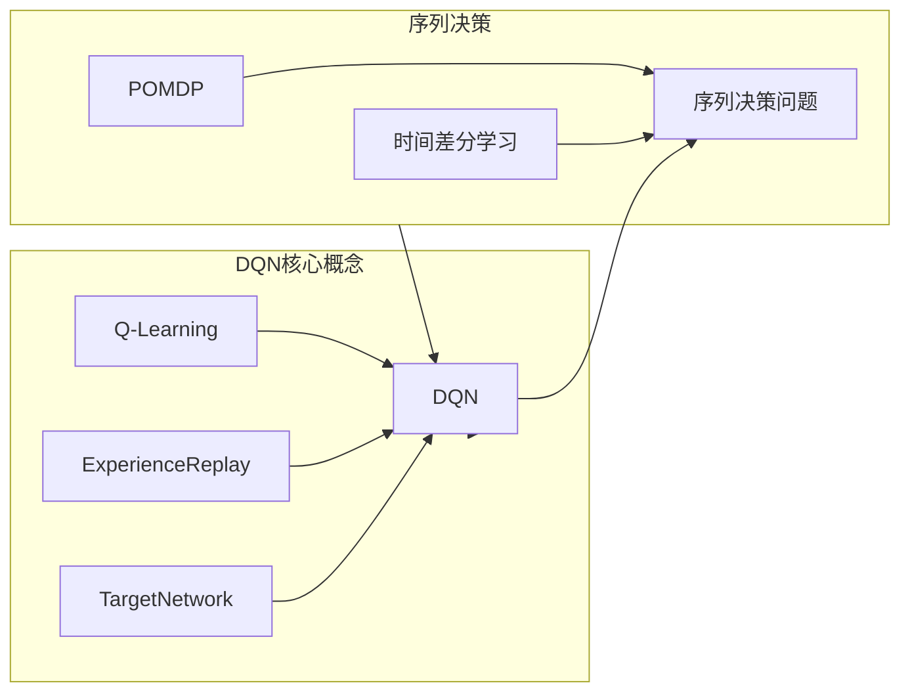
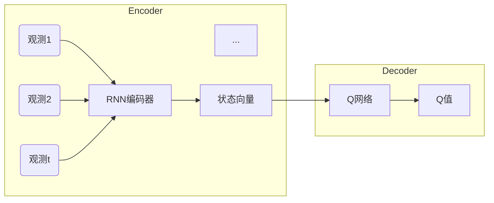

# 一切皆是映射：DQN中的序列决策与时间差分学习

## 1. 背景介绍

### 1.1 问题的由来

在强化学习领域中,智能体与环境的交互过程可以被建模为马尔可夫决策过程(Markov Decision Process, MDP)。传统的强化学习算法如Q-Learning和Sarsa等,通常假设环境状态是完全可观测的,并且在每个时间步做出的决策只依赖于当前状态。然而,在现实世界的许多应用场景中,智能体所获得的观测值往往是环境状态的部分或有噪声的表示,同时智能体的决策也可能需要依赖之前的历史观测序列。这种情况被称为部分可观测马尔可夫决策过程(Partially Observable Markov Decision Process, POMDP)。

### 1.2 研究现状

传统的POMDP求解算法如点基值迭代(Point-Based Value Iteration)和期望规划者(Expected Planner)等,通常假设环境的状态转移概率和观测概率模型已知,并且基于这些模型进行值函数或策略的计算。然而,在实际应用中,我们很少能够获得环境的精确模型,因此这类基于模型的算法在很多情况下难以直接应用。

近年来,结合深度学习的模型无关的POMDP求解方法引起了广泛关注。其中,深度Q网络(Deep Q-Network, DQN)是一种结合Q-Learning与深度神经网络的强化学习算法,它能够直接从原始观测数据中学习出最优策略,而无需事先了解环境的状态转移和奖励模型。DQN在处理部分可观测环境中的序列决策问题方面表现出了优异的性能。

### 1.3 研究意义

序列决策问题广泛存在于计算机视觉、自然语言处理、机器人控制等领域。能够有效解决这类问题,不仅具有重要的理论意义,也将为实际应用带来巨大的价值。DQN作为一种前沿的深度强化学习算法,在处理序列决策问题方面展现出了巨大的潜力,因此深入研究DQN在这一领域的应用具有重要的意义。

### 1.4 本文结构

本文将首先介绍DQN算法的核心思想和基本原理,包括Q-Learning、经验回放(Experience Replay)和目标网络(Target Network)等关键概念。接下来,我们将重点探讨DQN在解决序列决策问题中所采用的时间差分学习(Temporal Difference Learning)方法,并给出相应的数学模型和公式推导。然后,我们将通过一个实际案例,详细演示DQN算法在处理序列决策问题中的实现细节和代码解读。最后,我们将总结DQN在序列决策领域的应用前景,并对其未来的发展趋势和挑战进行展望。

## 2. 核心概念与联系

DQN算法的核心思想源自于传统的Q-Learning算法,它利用神经网络来近似状态-动作值函数Q(s,a)。为了提高学习效率和稳定性,DQN引入了两个关键技术:

1. **经验回放(Experience Replay)**: 将智能体与环境的交互过程中获得的转换样本(状态、动作、奖励、下一状态)存储在经验回放池中,并从中随机采样出小批量数据用于神经网络的训练,这种方式打破了数据样本之间的相关性,提高了数据的利用效率。

2. **目标网络(Target Network)**: 在训练过程中,使用一个单独的目标网络来计算Q值目标,而不是直接使用当前的Q网络。目标网络的参数是当前Q网络参数的复制,但只在一定步数后才会被更新,这种延迟更新的方式增强了算法的稳定性。

在处理序列决策问题时,DQN需要面对部分可观测马尔可夫决策过程(POMDP)的挑战。由于智能体无法直接获取环境的完整状态信息,它必须基于历史观测序列来做出决策。为了解决这一问题,DQN采用了时间差分学习(Temporal Difference Learning)的方法,通过估计当前状态-动作对的长期回报,从而学习出最优策略。

时间差分学习是一种基于采样的增量式学习方法,它利用智能体与环境的实际交互数据,根据当前的状态-动作对及其后续的奖励和状态转移,来更新Q值估计。这种在线学习的方式,使得DQN能够在没有环境模型的情况下,直接从原始观测数据中学习出最优策略,从而有效解决了POMDP中的序列决策问题。

## 3. 核心算法原理 & 具体操作步骤

### 3.1 算法原理概述

DQN算法的核心思想是使用一个深度神经网络来近似状态-动作值函数Q(s,a),即给定当前状态s和可选动作a,预测执行动作a后的长期累积奖励。神经网络的参数通过minimizing以下损失函数进行训练:

$$J(\theta) = \mathbb{E}_{(s,a,r,s')\sim D}\left[ \left(y_t^{Q} - Q(s,a;\theta)\right)^2\right]$$

其中,$y_t^{Q}$是基于贝尔曼最优方程(Bellman Optimality Equation)计算出的Q值目标:

$$y_t^{Q} = r + \gamma \max_{a'} Q(s',a';\theta^-)$$

$\gamma$是折扣因子,$\theta^-$表示目标网络的参数。通过minimizing上述损失函数,我们可以使Q网络的输出值Q(s,a;$\theta$)逐渐逼近真实的Q值$y_t^{Q}$。

在处理序列决策问题时,DQN算法的关键在于如何从部分可观测的历史观测序列$o_1,o_2,...,o_t$中估计出当前的状态s。DQN采用了一种基于递归神经网络(Recurrent Neural Network)的编码器-解码器(Encoder-Decoder)架构,将观测序列编码为一个内部状态向量,作为Q网络的输入,从而实现了对POMDP的建模和求解。

### 3.2 算法步骤详解

DQN算法在处理序列决策问题时,主要包括以下几个步骤:

1. **观测编码(Observation Encoding)**: 使用递归神经网络(如LSTM或GRU)对历史观测序列$o_1,o_2,...,o_t$进行编码,得到一个内部状态向量$h_t$,作为Q网络的输入。

2. **动作选择(Action Selection)**: 将编码后的状态向量$h_t$输入到Q网络中,得到所有可选动作对应的Q值$Q(h_t,a_1),Q(h_t,a_2),...,Q(h_t,a_n)$。根据一定的策略(如$\epsilon$-greedy或者Boltzmann探索),从这些Q值中选择一个动作$a_t$执行。

3. **环境交互(Environment Interaction)**: 执行选择的动作$a_t$,获得新的观测$o_{t+1}$和即时奖励$r_{t+1}$。

4. **经验存储(Experience Storage)**: 将转换样本$(h_t,a_t,r_{t+1},h_{t+1})$存储到经验回放池中,其中$h_{t+1}$是基于新的观测序列$o_1,o_2,...,o_{t+1}$编码得到的新状态向量。

5. **经验采样(Experience Sampling)**: 从经验回放池中随机采样出一个小批量的转换样本$(h_j,a_j,r_j,h_{j+1})$。

6. **Q值目标计算(Q-value Target Computation)**: 对于每个转换样本,计算其Q值目标:
   $$y_j^Q = r_j + \gamma \max_{a'} Q(h_{j+1},a';\theta^-)$$
   其中,$\theta^-$是目标网络的参数。

7. **网络训练(Network Training)**: 使用均方误差损失函数,并采用梯度下降等优化算法,更新Q网络的参数$\theta$,使得Q网络的输出值$Q(h_j,a_j;\theta)$逼近Q值目标$y_j^Q$。

8. **目标网络更新(Target Network Update)**: 每隔一定步数,将Q网络的参数$\theta$复制到目标网络的参数$\theta^-$中,以提高训练稳定性。

重复上述步骤,直到Q网络收敛,得到最优的状态-动作值函数近似,从而解决了序列决策问题。

### 3.3 算法优缺点

**优点**:

1. **无需环境模型**: DQN算法无需事先了解环境的状态转移和奖励模型,可以直接从原始观测数据中学习出最优策略,具有很强的通用性和适用性。

2. **高效稳定**: 经验回放和目标网络等技术的引入,大大提高了DQN算法的学习效率和训练稳定性。

3. **处理POMDP**: 通过编码器-解码器架构,DQN能够有效地处理部分可观测马尔可夫决策过程中的序列决策问题。

4. **端到端学习**: DQN算法实现了从原始观测到最优策略的端到端学习,无需人工设计特征,具有很强的表现力和泛化能力。

**缺点**:

1. **样本效率低**: 虽然引入了经验回放,但DQN算法的样本效率仍然较低,需要大量的环境交互数据才能收敛。

2. **过估计问题**: Q-Learning算法本身存在过估计(Overestimation)的问题,在DQN中也会产生一定的影响。

3. **局部最优陷阱**: 由于使用的是贪婪策略,DQN算法容易陷入局部最优解,难以找到全局最优解。

4. **观测空间限制**: DQN算法需要将观测序列编码为固定长度的状态向量,因此对于长期依赖的序列决策问题,其表现可能会受到一定影响。

### 3.4 算法应用领域

DQN算法及其变体在以下领域有广泛的应用:

1. **计算机游戏**: DQN最初就是应用于Atari游戏,展现出了出色的游戏控制能力。

2. **机器人控制**: 在机器人导航、操作等任务中,DQN可以直接从传感器数据中学习出最优控制策略。

3. **自然语言处理**: 将文本序列作为观测输入,DQN可以用于文本生成、机器翻译等任务。

4. **计算机视觉**: DQN能够从视频序列中学习出目标检测、跟踪等视觉任务的最优策略。

5. **金融决策**: 在投资组合管理、交易决策等金融领域,DQN可以根据历史数据序列做出最优决策。

6. **推荐系统**: 将用户历史行为序列作为观测输入,DQN可以学习出个性化的推荐策略。

总的来说,DQN算法为解决现实世界中的序列决策问题提供了一种有效且通用的方法,在人工智能的诸多领域都有广阔的应用前景。

## 4. 数学模型和公式 & 详细讲解 & 举例说明

### 4.1 数学模型构建

在DQN算法中,我们需要从部分可观测的历史观测序列$o_1,o_2,...,o_t$中估计出当前的状态s,并基于状态s选择最优动作a。为此,我们构建了一个基于递归神经网络(Recurrent Neural Network)的编码器-解码器(Encoder-Decoder)架构,如下所示:

在编码器部分,我们使用一个RNN(如LSTM或GRU)对观测序列$o_1,