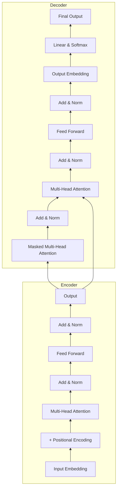

# 一切皆是映射：Transformer架构全面解析

## 1. 背景介绍
### 1.1 问题的由来
自然语言处理(NLP)是人工智能领域的一个重要分支,旨在让计算机能够理解、生成和处理人类语言。传统的NLP模型如循环神经网络(RNN)和长短期记忆网络(LSTM)虽然在许多任务上取得了不错的效果,但仍然存在难以并行化、难以捕捉长距离依赖等问题。2017年,Google提出了Transformer模型[1],开创性地采用了完全基于注意力机制的结构,实现了并行计算,并在机器翻译任务上取得了state-of-the-art的效果。Transformer的出现掀起了NLP领域的一场革命,各种上下文语言模型如BERT[2]、GPT[3]等纷纷采用了Transformer作为骨干网络,并在多个NLP任务上取得了突破性的进展。

### 1.2 研究现状
近年来,Transformer在学术界和工业界得到了广泛的应用和研究。一方面,研究人员针对Transformer的各个组件如注意力机制[4]、前馈网络[5]、归一化层[6]等进行了深入分析和改进,提出了许多Transformer的变体模型。另一方面,Transformer被应用到越来越多的场景中,如语音识别[7]、图像分类[8]、推荐系统[9]等,展现出了其强大的泛化能力。同时,预训练语言模型的发展也极大地推动了Transformer的应用,使得Transformer能够在更多下游任务上发挥威力。

### 1.3 研究意义
尽管Transformer已经被广泛研究和应用,但对其内在原理的理解还不够透彻。Transformer中的自注意力机制常被比喻为一种"映射",但这种映射的具体含义是什么?Transformer的结构设计有什么独特之处?为什么Transformer能够在众多任务上取得优异表现?这些问题的解答对于我们理解Transformer乃至设计更好的模型都有重要意义。本文将从"映射"的角度对Transformer架构进行全面解析,力图揭示其内在机理,为相关研究提供参考。

### 1.4 本文结构
本文的结构安排如下:第2部分介绍Transformer中的核心概念;第3部分详细解析Transformer的算法原理;第4部分阐述Transformer背后的数学模型;第5部分通过代码实例演示Transformer的实现;第6部分总结Transformer的实际应用场景;第7部分推荐Transformer相关的工具和资源;第8部分对Transformer的研究现状和未来趋势进行总结展望;第9部分列举了一些常见问题。

## 2. 核心概念与联系
Transformer的核心是自注意力机制(Self-Attention Mechanism),它可以看作是一种特殊的"映射"。所谓映射,就是将一个集合A中的元素a对应到另一个集合B中的元素b。而在自注意力中,A和B实际上是同一个集合,即输入序列的集合。具体来说,自注意力将输入序列中的每个元素映射为一个权重向量,这个向量表示该元素与序列中其他元素的相关性。自注意力的计算可以分为三步:

1. 根据输入序列生成Query矩阵Q、Key矩阵K和Value矩阵V。这三个矩阵是通过将输入乘以三个可学习的权重矩阵得到的。
2. 计算Q和K的点积并除以 $\sqrt{d_k}$ ,再经过Softmax函数得到注意力权重矩阵。其中 $d_k$ 是K的维度。
3. 将注意力权重矩阵与V相乘得到输出。

通过自注意力,Transformer实现了两个重要的功能:一是建立了序列中不同位置之间的长距离依赖;二是实现了并行计算。此外,Transformer中还使用了多头注意力(Multi-Head Attention),即将输入进行多次线性变换,然后分别进行自注意力计算,最后再将结果拼接。这种机制增强了模型的表示能力。

除了自注意力,Transformer中还有其他一些关键组件,如位置编码(Positional Encoding)、前馈网络(Feed-Forward Network)、残差连接(Residual Connection)和层归一化(Layer Normalization)。它们分别扮演着不同的角色:

- 位置编码:由于自注意力是无序的,因此需要位置编码来引入序列的位置信息。Transformer使用了基于三角函数的位置编码方式。
- 前馈网络:在自注意力之后,Transformer使用了一个简单的前馈网络来增强特征表示。该网络由两个线性变换和一个ReLU激活函数组成。
- 残差连接和层归一化:为了促进梯度传播和稳定训练,Transformer在每个子层之后都使用了残差连接和层归一化。

下图展示了Transformer的整体架构,其中左半部分为编码器,右半部分为解码器:

总的来说,Transformer通过巧妙的结构设计,充分利用了自注意力机制的强大表示能力,同时克服了其固有的缺陷,最终实现了并行、高效、鲁棒的序列建模。这也是Transformer能够在诸多任务上取得突破性进展的根本原因。

## 3. 核心算法原理 & 具体操作步骤
### 3.1 算法原理概述
Transformer的核心是自注意力机制和多头注意力机制。对于一个长度为n的输入序列,自注意力的计算过程可以用下面的公式表示:

$$
Attention(Q,K,V) = softmax(\frac{QK^T}{\sqrt{d_k}})V
$$

其中Q、K、V分别表示Query矩阵、Key矩阵和Value矩阵,它们都是通过将输入进行线性变换得到的:

$$
Q = XW^Q, K = XW^K, V = XW^V
$$

这里X是输入序列的嵌入表示,维度为 $n \times d_{model}$ 。 $W^Q, W^K, W^V$ 是三个可学习的权重矩阵,维度分别为 $d_{model} \times d_k, d_{model} \times d_k, d_{model} \times d_v$ 。

在多头注意力中,上述过程被重复h次,每次使用不同的权重矩阵。最终将h个头的输出拼接起来,再经过一个线性变换:

$$
MultiHead(Q,K,V) = Concat(head_1,...,head_h)W^O \\
head_i = Attention(QW_i^Q, KW_i^K, VW_i^V)
$$

其中 $W^O$ 是一个可学习的权重矩阵,维度为 $hd_v \times d_{model}$ 。

### 3.2 算法步骤详解
下面我们以编码器的自注意力为例,详细说明Transformer的计算步骤:

**Step 1**: 将输入序列X通过词嵌入(Word Embedding)和位置编码(Positional Encoding)相加,得到输入的嵌入表示。词嵌入将每个词映射为一个 $d_{model}$ 维的稠密向量,位置编码则为每个位置生成一个 $d_{model}$ 维的向量,用于表示词的位置信息。

**Step 2**: 根据嵌入表示计算Q、K、V矩阵。具体地,使用三个不同的权重矩阵 $W^Q, W^K, W^V$ 对输入进行线性变换。

**Step 3**: 将Q、K、V分别切分为h份,每一份形状为 $\frac{n}{h} \times \frac{d_{model}}{h}$ 。

**Step 4**: 对每一份Q、K、V,先计算 $\frac{QK^T}{\sqrt{d_k}}$ ,再经过Softmax函数,得到h个注意力矩阵。这h个注意力矩阵分别表示序列中每个位置与其他位置的相关性。

**Step 5**: 将每个注意力矩阵与对应的V相乘,得到h个上下文表示。

**Step 6**: 将h个上下文表示拼接起来,经过一个线性变换得到多头注意力的输出。

**Step 7**: 将多头注意力的输出与输入进行残差连接,再经过Layer Norm得到最终的输出。

**Step 8**: 将Step 7的输出送入前馈网络,前馈网络由两个线性变换和ReLU激活函数组成。

**Step 9**: 将前馈网络的输出与Step 7的输出进行残差连接,再经过Layer Norm得到编码器的最终输出。

解码器的计算过程与编码器类似,只是在第4步中引入了Mask操作,以避免解码时看到未来的信息。此外,解码器还多了一个编码-解码注意力层,用于关联编码器的输出。

### 3.3 算法优缺点
Transformer相比传统的RNN/LSTM有以下优点:
1. 并行计算:Transformer摒弃了RNN的顺序结构,采用了全注意力机制,可以充分利用GPU等硬件进行并行计算,大大提高了训练和推理速度。
2. 长程依赖:通过自注意力机制,Transformer可以直接建模任意两个位置之间的依赖关系,更好地捕捉长程依赖。
3. 可解释性:Transformer中的注意力矩阵提供了直观的解释,我们可以清楚地看到模型关注了输入序列的哪些部分。

当然,Transformer也存在一些局限性:
1. 计算复杂度:自注意力的计算复杂度是平方级的,对于过长的序列(如超过512)会非常耗时。因此Transformer更适合处理中等长度的序列。
2. 位置信息:由于缺乏RNN那种天然的位置偏差,Transformer需要额外引入位置编码,而现有的位置编码方式可能不够理想。
3. 训练不稳定:Transformer中的组件如残差连接、Layer Norm等虽然一定程度上缓解了训练不稳定的问题,但在某些任务上Transformer的训练仍不够稳定。

### 3.4 算法应用领域
得益于其强大的特征提取和泛化能力,Transformer已在多个领域得到广泛应用,如:

1. 机器翻译:Transformer最初就是在机器翻译任务上提出的,并迅速取代了RNN/LSTM成为主流翻译模型。
2. 语言理解:基于Transformer的预训练语言模型如BERT、XLNet等在多个自然语言理解任务上取得了SOTA的表现,极大地推动了NLP的发展。
3. 文本生成:GPT系列模型使用Transformer解码器作为生成模型,可以生成连贯、流畅的长文本。
4. 语音识别:Transformer在语音识别领域也展现出了巨大的潜力,并逐渐成为主流的声学模型。
5. 计算机视觉:Transformer不仅可以处理序列数据,也可以处理图像数据。ViT等模型将图像切块后输入Transformer,在图像分类等任务上取得了不错的效果。
6. 推荐系统:Transformer可以建模用户和物品之间的交互行为,在推荐系统领域也有广泛的应用。

可以预见,Transformer将在更多领域发挥重要作用,成为人工智能技术的基石。

## 4. 数学模型和公式 & 详细讲解 & 举例说明
### 4.1 数学模型构建
Transformer的数学模型可以用一个编码器-解码器结构来表示。设输入序列为 $(x_1,...,x_n)$ ,编码器将其映射为一组隐藏状态 $(z_1,...,z_n)$ :