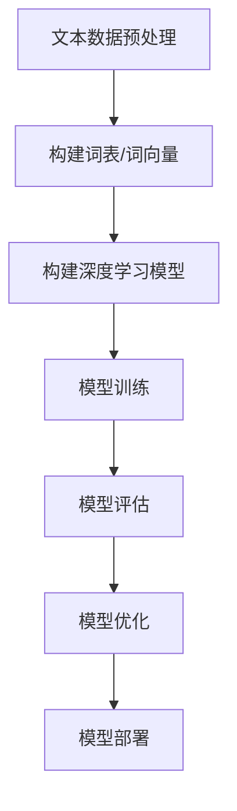

# 一切皆是映射：使用深度学习进行情感分析

## 1. 背景介绍

### 1.1 问题的由来

在当今信息时代,网络上产生的海量非结构化文本数据,如社交媒体评论、新闻报道、产品评论等,蕴含着宝贵的情感信息。能够有效地从这些文本数据中提取情感信息,对于企业了解用户需求、制定营销策略、监测舆情等具有重要意义。然而,由于文本数据的多样性和复杂性,传统的基于规则的方法难以准确捕捉情感信息。因此,如何利用深度学习技术自动从文本数据中提取情感信息成为一个亟待解决的问题。

### 1.2 研究现状

情感分析是自然语言处理领域的一个重要研究方向。早期的情感分析方法主要基于词典和规则,但这些方法受制于词典覆盖范围和规则设计的局限性。近年来,随着深度学习技术的快速发展,基于深度学习的情感分析方法逐渐占据主导地位。深度学习模型能够自动从大量数据中学习文本特征表示,克服了传统方法的缺陷。

目前,基于深度学习的情感分析方法主要分为以下几类:

1. **基于词向量的方法**: 将文本表示为词向量的加权平均,然后输入到神经网络进行分类。典型模型有TextCNN、TextRNN等。
2. **基于注意力机制的方法**: 引入注意力机制捕捉文本中的关键信息,提高分类性能。代表模型有HAN、Transformer等。
3. **基于预训练语言模型的方法**: 利用大规模无监督语料预训练语言模型(如BERT、GPT),获得强大的文本表示能力,再进行微调适应情感分析任务。
4. **基于图神经网络的方法**: 将文本建模为异构图,利用图神经网络捕捉词与词、词与句子之间的关系,提升情感分析性能。
5. **基于多模态融合的方法**: 除了文本信息,还融合图像、声音等其他模态信息,提高情感分析的准确性。

虽然深度学习方法取得了长足进展,但仍面临一些挑战,如对长文本、隐喻、讽刺等的处理能力有限,缺乏可解释性等。

### 1.3 研究意义

情感分析技术在多个领域具有重要应用价值:

1. **社交媒体监测**: 分析用户在社交媒体上的评论、言论,了解公众情绪和舆情走向。
2. **电商产品评价**: 自动分析产品评论的情感倾向,为产品优化和营销决策提供参考。
3. **智能客服**: 判断用户查询或反馈的情感,提供个性化的响应和服务。
4. **政治舆论分析**: 分析公众对政策的情感态度,为政策制定提供决策依据。
5. **金融风险监控**: 监测财经新闻和社交媒体对金融市场的情绪影响,预测潜在风险。

因此,研究高效准确的情感分析技术对于多个领域的发展具有重要意义。

### 1.4 本文结构

本文首先介绍情感分析任务的背景和研究现状,阐述其重要意义。然后系统地介绍了基于深度学习的情感分析方法的核心概念、算法原理和数学模型,并通过实例详细解释相关技术细节。接下来,讨论了该技术在实际应用中的场景,以及未来的发展趋势和面临的挑战。最后,推荐了相关的学习资源、开发工具和论文,并总结了常见问题和解答。

## 2. 核心概念与联系

情感分析任务的核心是从文本数据中提取情感信息,可分为以下几个关键步骤:

1. **文本表示**: 将原始文本转化为计算机可识别的数值向量表示,作为深度学习模型的输入。常用的文本表示方法有One-hot、Word Embedding、序列模型等。

2. **特征提取**: 利用深度神经网络自动从文本表示中提取高阶语义特征,捕捉情感相关的关键信息。常用的网络结构有CNN、RNN、Transformer等。

3. **情感分类**: 将提取的特征输入分类器(如全连接层),得到文本所属的情感类别,如正面、负面或中性等。

4. **模型训练**: 以标注好的情感数据集为监督信号,通过反向传播算法不断调整深度模型的参数,使其能够学习到准确的情感映射规律。

5. **模型评估**: 在保留的测试集上评估模型的分类性能,常用指标有准确率、精确率、召回率、F1分数等。

这些步骤相互关联、环环相扣,构成了完整的情感分析流程。下面将详细介绍其中的核心算法原理和数学模型。

## 3. 核心算法原理 & 具体操作步骤

### 3.1 算法原理概述

基于深度学习的情感分析算法的核心思想是:利用多层非线性变换网络从原始数据中自动学习有效的特征表示,并在此基础上对文本的情感类别进行判别。

常用的深度学习模型包括:

1. **卷积神经网络(CNN)**: 通过卷积和池化操作提取局部特征,适用于捕捉文本的 n-gram 模式。
2. **循环神经网络(RNN)**: 利用循环结构捕捉序列数据的长程依赖关系,常用于建模文本的上下文语义。
3. **注意力机制(Attention)**: 自动学习分配不同词语的权重,突出对情感判别至关重要的词语。
4. **预训练语言模型(PLM)**: 利用大规模无监督语料预训练获得通用的语义表示能力,再进行有监督微调适应情感分析任务。

这些模型可以单独使用,也可以组合使用,形成更加强大的情感分析框架。

算法的具体操作步骤包括:

### 3.2 算法步骤详解

1. **文本数据预处理**: 对原始文本数据进行清洗、分词、去除停用词等预处理,转化为标准的文本序列格式。

2. **构建词表/词向量**: 统计语料库中的词汇并构建词表,将每个词映射为一个固定维度的词向量表示,作为神经网络的输入。常用的词向量有Word2Vec、GloVe等。

3. **构建深度学习模型**: 设计神经网络的具体架构,包括输入层、卷积层、循环层、注意力层、全连接层等,用于从词向量中自动提取情感相关特征。

4. **模型训练**: 以标注好的情感数据集为监督信号,通过反向传播算法不断调整神经网络的参数,使其能够学习到准确的情感映射规律。

5. **模型评估**: 在保留的测试集上评估模型的分类性能,常用指标有准确率、精确率、召回率、F1分数等。

6. **模型优化**: 根据评估结果对模型进行优化,如调整超参数、增加训练数据、改进网络结构等。

7. **模型部署**: 将训练好的模型部署到实际的生产环境中,用于在线进行情感分析。

在整个过程中,预处理、词向量构建、模型设计和优化等步骤对最终的情感分析性能至关重要。

### 3.3 算法优缺点

基于深度学习的情感分析算法相比传统方法具有以下优点:

1. **自动特征学习**: 能够自动从数据中学习有效的特征表示,无需人工设计复杂的特征工程。
2. **泛化能力强**: 通过在大规模数据上训练,模型能够很好地泛化到未见过的数据。
3. **建模能力强**: 深度神经网络能够有效捕捉文本数据的复杂语义和上下文信息。
4. **持续改进**: 深度学习算法的性能可以通过增加数据、改进模型结构等方式不断提升。

但同时也存在一些不足:

1. **需要大量标注数据**: 训练深度模型通常需要大量的人工标注数据,标注成本较高。
2. **缺乏可解释性**: 神经网络的内部运作机制较为黑箱,缺乏可解释性。
3. **对噪声数据敏感**: 深度模型对训练数据中的噪声和异常值较为敏感。
4. **长文本处理能力有限**: 目前的深度模型在处理长文本时仍有一定局限性。

### 3.4 算法应用领域

基于深度学习的情感分析算法在多个领域都有广泛应用:

1. **社交媒体监测**: 分析用户在微博、Facebook等社交媒体上的评论、言论,了解公众的情绪和舆情走向。

2. **电商产品评价**: 自动分析电商网站上的产品评论,判断用户对产品的情感倾向,为产品优化和营销决策提供参考。

3. **智能客服**: 分析用户的查询或反馈信息,判断其情感状态,为客户提供个性化的响应和服务。

4. **政治舆论分析**: 分析公众对政策、政治事件的情感态度,为政策制定提供决策依据。

5. **金融风险监控**: 监测财经新闻和社交媒体对金融市场的情绪影响,预测潜在的系统性风险。

6. **品牌形象监测**: 分析网民对品牌的评论,了解品牌在公众心目中的正负面情绪,为品牌营销提供建议。

7. **影视作品评价**: 分析观众对影视作品的评论,了解受众的喜好,为创作提供参考。

## 4. 数学模型和公式 & 详细讲解 & 举例说明

### 4.1 数学模型构建

深度学习模型本质上是一种由多层非线性变换单元组成的函数逼近器,其目标是学习一个从输入数据 $X$ 映射到目标输出 $Y$ 的复杂函数 $f(X)$。对于情感分析任务,输入 $X$ 为文本数据的特征表示(如词向量序列),输出 $Y$ 为文本的情感类别标签。

以textCNN模型为例,其核心思想是应用卷积神经网络从局部 n-gram 特征中自动学习对情感判别有用的模式。textCNN的基本结构如下:

其中:

- 输入层 $X$: 将文本表示为词向量序列 $X = [x_1, x_2, ..., x_n]$,其中 $x_i \in \mathbb{R}^k$ 为第 $i$ 个词的 $k$ 维词向量。

- 卷积层: 对输入序列 $X$ 应用多个不同窗口大小的一维卷积核 $\omega \in \mathbb{R}^{h \times k}$,捕捉不同尺度的 n-gram 特征:

$$c_i = f(\omega \cdot x_{i:i+h-1} + b)$$

其中 $f$ 为非线性激活函数(如ReLU),  $b$ 为偏置项, $\cdot$ 表示卷积操作。

- 池化层: 对卷积特征图进行最大池化操作,捕捉每个卷积核窗口内的最prominant特征,形成固定长度的特征向量。

- 全连接层: 将池化后的特征向量输入到全连接层,进一步提取高阶特征。

- Softmax输出层: 将全连接层的输出 $o$ 输入到 Softmax 层,得到各个情感类别的概率分布 $P(y|X) = \text{softmax}(Wo + b)$。

在训练过程中,以交叉熵损失函数为目标,通过反向传播算法不断调整卷积核、全连接层权重等参数,使模型能够学习到从文本映射到情感标签的最优函数。

### 4.2 公式推导过程

以textC