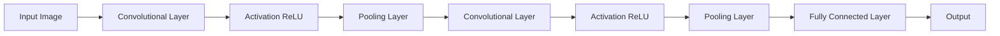

# 一切皆是映射：卷积神经网络(CNNs)在图像处理中的应用

关键词：卷积神经网络、图像处理、深度学习、特征提取、目标检测、图像分割、迁移学习

## 1. 背景介绍
### 1.1 问题的由来
随着数字图像技术的飞速发展,图像处理已经渗透到各行各业。传统的图像处理方法依赖于人工设计的特征,面临特征表达能力不足、泛化能力差等问题。如何设计一种能够自动学习图像特征表示的方法,成为了一个亟待解决的问题。

### 1.2 研究现状
近年来,深度学习技术的兴起为图像处理领域带来了革命性的变革。其中,卷积神经网络(Convolutional Neural Networks, CNNs)以其强大的特征学习能力和空间不变性,在图像分类、目标检测、语义分割等任务中取得了巨大成功。目前,CNNs已经成为图像处理领域的主流方法。

### 1.3 研究意义 
深入研究CNNs在图像处理中的应用,对于推动计算机视觉、人工智能等领域的发展具有重要意义。一方面,CNNs为图像处理提供了新的技术路线,有望突破传统方法的瓶颈,实现更加智能化、精准化的图像分析。另一方面,图像处理作为人工智能的重要应用场景,是检验深度学习算法性能的重要试金石,对深度学习理论的发展也有重要促进作用。

### 1.4 本文结构
本文将围绕卷积神经网络在图像处理中的应用展开深入探讨。第2部分介绍CNNs的核心概念与基本原理。第3部分重点阐述CNNs的核心算法。第4部分给出CNNs涉及的数学模型与公式推导。第5部分通过代码实例演示CNNs的实现细节。第6部分总结CNNs在图像处理实际应用中的典型场景。第7部分推荐CNNs相关的学习资源与工具。第8部分对CNNs的研究现状进行总结,并对其未来发展趋势与面临的挑战进行展望。

## 2. 核心概念与联系
卷积神经网络的核心思想是利用卷积运算提取图像的局部特征,并通过逐层抽象形成高级语义特征。CNNs的基本构建模块包括:

- 卷积层(Convolutional Layer):通过卷积运算提取图像的局部特征
- 池化层(Pooling Layer):对卷积特征进行降采样,减小参数量并提供平移不变性  
- 激活函数(Activation Function):引入非线性变换,增强网络的表达能力
- 全连接层(Fully Connected Layer):对卷积特征进行分类或回归预测

下图展示了一个典型的卷积神经网络结构:



CNN通过交替使用卷积层和池化层逐步提取图像的高级特征,并用全连接层完成最终的分类或预测任务。卷积层和池化层可以看作一种"特征提取器",全连接层则类似于传统的"分类器"。多个这样的层级串联起来,就形成了一个完整的卷积神经网络。

卷积神经网络的核心特点包括:

1. 局部连接:每个神经元只与前一层的一个局部区域连接,这种稀疏连接方式大大减少了参数量。
2. 权值共享:同一个卷积核在整个图像上滑动,检测相同的特征,减少了参数量。  
3. 层级结构:通过逐层卷积和池化操作,可以形成层次化的特征表示,从简单到复杂,从具体到抽象。

正是由于这些独特的结构设计,卷积神经网络能够在保持空间位置信息的同时,有效地学习到图像的内在特征表示。

## 3. 核心算法原理 & 具体操作步骤
### 3.1 算法原理概述
卷积神经网络的前向传播过程可以分为以下几个步骤:

1. 卷积运算:输入图像与卷积核进行卷积,得到卷积特征图
2. 激活函数:对卷积特征图中每个元素施加非线性变换
3. 池化运算:对激活后的卷积特征图进行降采样
4. 重复步骤1~3,得到一系列卷积特征图
5. 全连接:将最后一个卷积层的特征图展平为向量,送入全连接层进行分类或回归

其中最为核心的是卷积运算,其数学定义为:

$$
\mathbf{Y}[i,j] = \sum_{k=1}^K \sum_{l=1}^L \mathbf{W}[k,l] \cdot \mathbf{X}[i+k-1,j+l-1]
$$

其中$\mathbf{X}$为输入图像,$\mathbf{W}$为卷积核,$\mathbf{Y}$为输出特征图。卷积核在输入图像上滑动,通过加权求和得到输出特征图的每个元素。

### 3.2 算法步骤详解

下面我们以一个具体的例子来演示卷积运算的过程。假设输入图像$\mathbf{X}$和卷积核$\mathbf{W}$分别为:

$$
\mathbf{X}=
\begin{bmatrix}
1 & 0 & 2 \\
2 & 1 & 0 \\ 
0 & 1 & 2
\end{bmatrix}, \quad
\mathbf{W} = 
\begin{bmatrix}
1 & 0 \\
0 & 1
\end{bmatrix}
$$

卷积核在输入图像上滑动,每次滑动计算加权求和,得到输出特征图$\mathbf{Y}$的一个元素。例如,计算$\mathbf{Y}[0,0]$时,卷积核与输入图像的左上角$2\times 2$区域对应:

$$
\mathbf{Y}[0,0] = 1\times1 + 0\times0 + 0\times2 + 1\times1 = 2
$$

同理,计算其他位置的元素,最终得到输出特征图为:

$$
\mathbf{Y}= 
\begin{bmatrix}
2 & 3 \\
3 & 3
\end{bmatrix}
$$

可以看到,卷积运算可以提取输入图像的局部特征,使得输出特征图能够反映输入图像的局部模式。

### 3.3 算法优缺点

卷积神经网络相比传统方法的优点包括:

1. 端到端的训练方式,避免了手工设计特征的繁琐
2. 卷积运算具有平移不变性,对图像的空间位置变化具有鲁棒性
3. 多层次的特征提取,可以学习到图像的层次化语义表示
4. 参数共享机制,大大减少了参数量,降低了过拟合风险

但CNN也存在一些局限性:

1. 需要大量标注数据进行训练,获取成本较高
2. 模型参数量大,训练时间长,对计算资源要求高
3. 模型可解释性差,难以解释学习到的特征含义
4. 对旋转、尺度变化等几何变换缺乏鲁棒性

### 3.4 算法应用领域

得益于其强大的特征学习能力,卷积神经网络被广泛应用于计算机视觉的各个任务,主要包括:

- 图像分类:将图像划分到预定义的类别中,如ImageNet分类
- 目标检测:检测图像中感兴趣的目标,并给出其位置和类别,如行人检测
- 语义分割:对图像中的每个像素进行类别标注,如场景解析
- 行为识别:对视频中的人体行为进行分类,如行为异常检测
- 人脸识别:识别图像中的人脸身份,如人脸考勤系统

此外,卷积神经网络还被用于医学图像分析、遥感图像解译、无人驾驶等诸多领域。随着CNN模型的不断发展,其应用领域也在不断扩展。

## 4. 数学模型和公式 & 详细讲解 & 举例说明
### 4.1 数学模型构建
卷积神经网络可以看作一个复合函数,将输入图像$\mathbf{X}$映射为输出$\mathbf{\hat{y}}$:

$$
\mathbf{\hat{y}} = f(\mathbf{X}; \theta) = f_L(...f_2(f_1(\mathbf{X})))
$$

其中$f_l$表示第$l$层的映射函数,$\theta$为网络参数。CNN的目标是学习最优参数$\theta^*$,使得预测输出$\mathbf{\hat{y}}$尽可能接近真实标签$\mathbf{y}$。

常见的CNN层级映射包括:

- 卷积层:$f(\mathbf{X}) = \mathbf{W} * \mathbf{X} + \mathbf{b}$
- 激活层:$f(\mathbf{X}) = \sigma(\mathbf{X})$,如ReLU函数$\sigma(x)=max(0,x)$
- 池化层:$f(\mathbf{X}) = pool(\mathbf{X})$,如最大池化$pool(x)=max(x)$
- 全连接层:$f(\mathbf{x}) = \mathbf{W}\mathbf{x} + \mathbf{b}$

其中$*$表示卷积运算,$\mathbf{W},\mathbf{b}$分别为权重和偏置。将这些层级映射复合在一起,就构成了完整的卷积神经网络模型。

### 4.2 公式推导过程
以二分类任务为例,CNN的损失函数可以定义为交叉熵:

$$
\mathcal{L}(\theta)=-\frac{1}{N}\sum_{i=1}^N [y_i \log \hat{y}_i + (1-y_i) \log (1-\hat{y}_i)]
$$

其中$y_i$为样本$i$的真实标签,$\hat{y}_i$为预测概率。CNN的训练过程就是求解最小化损失函数的参数$\theta^*$:

$$
\theta^* = \arg\min_\theta \mathcal{L}(\theta)
$$

常用的优化算法包括随机梯度下降(SGD)及其变体。以SGD为例,参数更新公式为:

$$
\theta_{t+1} = \theta_t - \eta \nabla_\theta \mathcal{L}(\theta_t)
$$

其中$\eta$为学习率,$\nabla_\theta \mathcal{L}(\theta_t)$为损失函数对参数的梯度,可通过反向传播算法高效计算。

### 4.3 案例分析与讲解
下面我们以手写数字识别为例,演示如何使用卷积神经网络进行图像分类。我们使用MNIST数据集,其中包含60000张训练图像和10000张测试图像,每张图像为$28\times28$的灰度图,共10个类别(0~9)。

我们构建一个简单的CNN模型,包含两个卷积层、两个池化层和两个全连接层:

```python
model = Sequential([
    Conv2D(32, (3,3), activation='relu', input_shape=(28,28,1)),
    MaxPooling2D((2,2)),
    Conv2D(64, (3,3), activation='relu'),
    MaxPooling2D((2,2)),
    Flatten(),
    Dense(64, activation='relu'),
    Dense(10, activation='softmax')
])
```

模型的输入为$28\times28\times1$的图像,经过两次卷积和池化后,特征图的尺寸降为$7\times7\times64$。将其展平后接两个全连接层,最后输出10个类别的概率。

使用Adam优化器和交叉熵损失函数对模型进行训练:

```python
model.compile(optimizer='adam',
              loss='categorical_crossentropy',
              metrics=['accuracy'])

model.fit(x_train, y_train, epochs=5, batch_size=64)
```

在测试集上评估模型性能:

```python
loss, accuracy = model.evaluate(x_test, y_test)
print('Test loss:', loss)
print('Test accuracy:', accuracy)
```

最终在测试集上可以达到约99%的分类准确率,说明卷积神经网络可以有效地学习到手写数字图像的特征表示,实现高精度的分类。

### 4.4 常见问题解答
**Q: 卷积核的大小如何选择?**