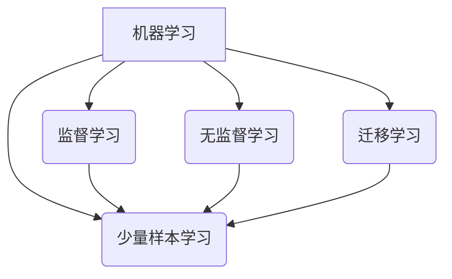
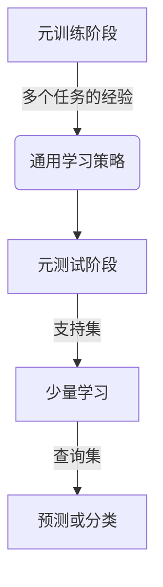

以下是根据你的要求撰写的技术博客文章正文内容：

# 一切皆是映射：少量样本学习和神经网络的挑战

## 1. 背景介绍

### 1.1 问题的由来

在现实世界中,我们经常会遇到数据稀缺的情况。比如在医疗诊断、自然语言处理、计算机视觉等领域,获取大量高质量的标注数据往往是一个巨大的挑战。这种数据稀缺问题给传统的机器学习算法带来了严重的性能bottleneck。

### 1.2 研究现状  

为了解决数据稀缺问题,研究人员提出了少量样本学习(Few-Shot Learning)的概念。少量样本学习旨在利用少量的标注样本,结合先验知识,快速学习新的概念和任务。这种学习方式更加贴近人类的认知方式,具有广阔的应用前景。

### 1.3 研究意义

少量样本学习不仅能够解决数据稀缺问题,还能够大幅降低数据标注的成本,提高模型的泛化能力。此外,它还能够促进人工智能系统向通用人工智能(Artificial General Intelligence)迈进。因此,少量样本学习研究具有重要的理论意义和应用价值。

### 1.4 本文结构

本文将首先介绍少量样本学习的核心概念,然后详细阐述其核心算法原理和数学模型。接下来,我们将通过实例项目对算法进行实践,并探讨其在不同领域的应用场景。最后,我们将总结少量样本学习的发展趋势和面临的挑战。

## 2. 核心概念与联系

少量样本学习(Few-Shot Learning)是机器学习领域的一个新兴研究方向,旨在利用少量的标注样本快速学习新的概念和任务。它与传统的监督学习、无监督学习、迁移学习等机器学习范式有着密切的联系。

少量样本学习通常包含以下几个核心概念:

1. **支持集(Support Set)**: 包含少量标注样本的数据集,用于学习新的概念或任务。
2. **查询集(Query Set)**: 包含未标注样本的数据集,需要基于支持集学习到的知识进行预测或分类。
3. **元学习(Meta-Learning)**: 利用多个任务的经验,学习一种通用的学习策略,从而快速适应新的任务。
4. **注意力机制(Attention Mechanism)**: 在神经网络中引入注意力机制,使模型能够自适应地关注输入数据的不同部分,提高少量样本学习的效果。

少量样本学习与其他机器学习范式的区别在于,它专注于利用极少量的标注数据快速学习新的任务,而不是依赖大量的训练数据。这种学习方式更加贴近人类的认知过程,具有重要的理论意义和应用价值。

## 3. 核心算法原理与具体操作步骤

少量样本学习算法的核心思想是利用元学习的方法,从多个任务中学习一种通用的学习策略,从而快速适应新的任务。常见的少量样本学习算法包括基于度量的算法、基于生成模型的算法和基于优化的算法等。

### 3.1 算法原理概述

少量样本学习算法通常分为两个阶段:

1. **元训练(Meta-Training)阶段**: 在这个阶段,算法利用多个任务的经验,学习一种通用的学习策略。具体来说,算法会从一个任务的支持集中学习,然后在该任务的查询集上进行评估,根据评估结果调整学习策略的参数。这个过程在多个任务上重复进行,直到学习策略收敛。

2. **元测试(Meta-Testing)阶段**: 在这个阶段,算法利用元训练阶段学习到的策略,快速适应新的任务。具体来说,算法会在新任务的支持集上进行少量学习,然后在该任务的查询集上进行预测或分类。

少量样本学习算法的关键在于设计一种高效的学习策略,能够从少量的样本中快速提取任务相关的知识,并将其泛化到新的任务上。不同的算法采用不同的策略,例如基于度量的算法利用相似性度量,基于生成模型的算法利用生成模型捕获数据分布,基于优化的算法则直接优化模型参数。

### 3.2 算法步骤详解

以基于优化的模型卷积网络(Model-Agnostic Meta-Learning,MAML)算法为例,其具体步骤如下:

1. **初始化**: 随机初始化模型参数 $\theta$。

2. **采样任务批次**: 从任务分布 $p(\mathcal{T})$ 中采样一个任务批次 $\mathcal{T}_i$。对于每个任务 $\mathcal{T}_i$,它包含一个支持集 $\mathcal{D}_i^{tr}$ 和一个查询集 $\mathcal{D}_i^{val}$。

3. **内循环**: 对于每个任务 $\mathcal{T}_i$,在支持集 $\mathcal{D}_i^{tr}$ 上进行少量学习,得到任务特定的模型参数 $\phi_i$:

$$\phi_i = \theta - \alpha \nabla_\theta \mathcal{L}_{\mathcal{T}_i}(f_\theta)$$

其中 $\alpha$ 是学习率, $\mathcal{L}_{\mathcal{T}_i}(f_\theta)$ 是任务 $\mathcal{T}_i$ 在支持集上的损失函数。

4. **外循环**: 在查询集 $\mathcal{D}_i^{val}$ 上计算损失,并对模型参数 $\theta$ 进行更新:

$$\theta \leftarrow \theta - \beta \nabla_\theta \sum_{\mathcal{T}_i \sim p(\mathcal{T})} \mathcal{L}_{\mathcal{T}_i}(f_{\phi_i})$$

其中 $\beta$ 是元学习率。

5. **重复步骤 2-4**: 重复执行步骤 2-4,直到模型收敛。

MAML算法的核心思想是在内循环中通过梯度下降快速适应每个任务,在外循环中则优化一个能够快速适应新任务的初始参数。通过这种双循环优化,MAML能够学习一种通用的学习策略,从而在元测试阶段快速适应新的任务。

### 3.3 算法优缺点

少量样本学习算法相比传统机器学习算法具有以下优点:

1. **数据效率高**: 能够利用极少量的标注数据快速学习新的任务,降低了数据标注的成本。
2. **泛化能力强**: 通过学习一种通用的学习策略,模型能够很好地泛化到新的任务上。
3. **贴近人类认知**: 少量样本学习的方式更加贴近人类的认知过程,有助于促进通用人工智能的发展。

但同时,少量样本学习算法也存在一些缺点和挑战:

1. **任务相关性**: 算法的性能很大程度上依赖于训练任务和测试任务之间的相关性。如果相关性不高,算法的泛化能力会受到影响。
2. **优化困难**: 涉及双循环优化的算法往往存在优化困难,容易陷入次优解。
3. **理论缺失**: 缺乏足够的理论支持,很多算法都是基于经验设计的,缺乏深入的理论解释。

### 3.4 算法应用领域

少量样本学习算法由于其数据效率高、泛化能力强的特点,在多个领域都有广泛的应用前景:

1. **计算机视觉**: 在目标检测、图像分类等任务中,能够利用少量的标注样本快速学习新的视觉概念。
2. **自然语言处理**: 在机器翻译、文本分类等任务中,能够利用少量的语料快速适应新的领域或语言。
3. **医疗健康**: 在疾病诊断、药物开发等任务中,能够利用少量的病例数据快速学习新的疾病模型。
4. **机器人控制**: 在机器人控制任务中,能够利用少量的示范数据快速学习新的控制策略。

总的来说,少量样本学习算法为解决数据稀缺问题提供了一种有效的方法,具有广阔的应用前景。

## 4. 数学模型和公式详细讲解与举例说明

少量样本学习算法通常涉及到一些复杂的数学模型和公式,下面我们将对其中的一些核心模型和公式进行详细讲解和案例分析。

### 4.1 数学模型构建

在少量样本学习中,常见的数学模型包括基于度量的模型、基于生成模型的模型和基于优化的模型等。

**基于度量的模型**

基于度量的模型旨在学习一个合适的距离度量,使得同类样本之间的距离小于异类样本之间的距离。常见的模型包括匹配网络(Matching Networks)、原型网络(Prototypical Networks)等。

匹配网络的核心思想是将支持集中的样本编码为一个高维向量,然后将查询样本与支持集中的每个样本进行匹配,根据匹配分数进行预测。具体来说,给定一个支持集 $S=\{(x_i, y_i)\}_{i=1}^{N}$ 和一个查询样本 $x_q$,匹配网络首先将支持集中的每个样本编码为一个向量 $f_\phi(x_i)$,然后计算查询样本与每个支持集样本之间的匹配分数:

$$a(x_q, x_i) = \frac{f_\phi(x_q)^\top f_\phi(x_i)}{\|f_\phi(x_q)\|\|f_\phi(x_i)\|}$$

最后,根据匹配分数和支持集中的标签,计算查询样本属于每个类别的概率:

$$P(y=k|x_q) = \sum_{(x_i, y_i) \in S_k} a(x_q, x_i)$$

其中 $S_k$ 表示支持集中属于第 $k$ 类的样本集合。

**基于生成模型的模型**

基于生成模型的模型旨在学习数据的潜在分布,然后利用这个分布进行少量样本学习。常见的模型包括贝叶斯程序学习(Bayesian Program Learning)、生成对抗网络(Generative Adversarial Networks)等。

以生成对抗网络为例,它由一个生成器(Generator)和一个判别器(Discriminator)组成。生成器的目标是生成逼真的样本,使判别器无法区分真实样本和生成样本;而判别器的目标是正确区分真实样本和生成样本。通过生成器和判别器之间的对抗训练,生成对抗网络能够学习数据的潜在分布。

在少量样本学习中,我们可以利用生成对抗网络生成大量的合成样本,然后将这些合成样本与原始的少量样本一起用于训练分类器或其他模型。这种方法能够有效增加训练数据的多样性,提高模型的泛化能力。

**基于优化的模型**

基于优化的模型直接优化模型参数,使其能够快速适应新的任务。常见的模型包括模型卷积网络(Model-Agnostic Meta-Learning, MAML)、基于优化的神经网络(Optimization as a Model for Few-Shot Learning)等。

我们在前面已经详细介绍了MAML算法的原理和步骤,它通过双循环优化的方式,学习一种通用的学习策略,从而能够快速适应新的任务。

### 4.2 公式推导过程

在少量样本学习中,常常需要推导一些复杂的公式,下面我们以MAML算法为例,推导其损失函数的梯度。

MAML算法的目标是找到一个初始参数 $\theta$,使得在任务分布 $p(\mathcal{T})$ 上,通过少量学习得到的任务特定参数 $\phi$ 能够最小化查