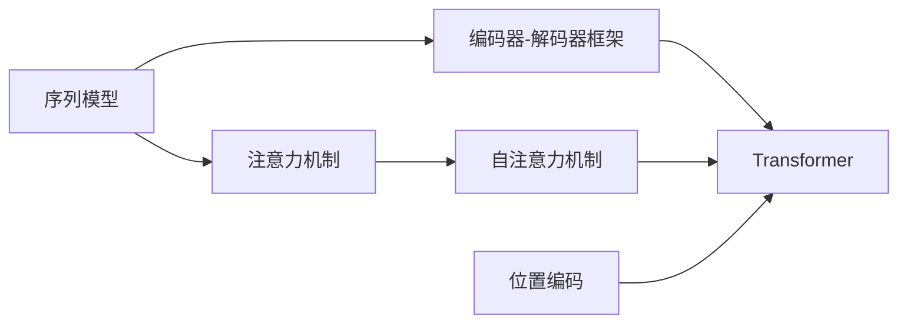

# 一切皆是映射：序列模型和注意力机制

作者：禅与计算机程序设计艺术 / Zen and the Art of Computer Programming

关键词：序列模型、注意力机制、Transformer、自然语言处理、深度学习

## 1. 背景介绍

### 1.1 问题的由来

自然语言处理(Natural Language Processing, NLP)是人工智能领域的一个重要分支,旨在让计算机能够理解、生成和处理人类语言。传统的NLP方法主要基于人工设计的特征和规则,难以应对语言的复杂性和多样性。近年来,深度学习技术的发展为NLP带来了革命性的变化,使得计算机能够从大规模语料中自动学习语言知识,显著提升了NLP任务的性能。

### 1.2 研究现状

在深度学习时代,NLP领域涌现出了大量新的模型和方法。其中,基于序列模型(如RNN、LSTM等)和注意力机制(Attention Mechanism)的方法取得了显著成功,广泛应用于机器翻译、文本分类、问答系统、对话生成等任务中。2017年,Google提出的Transformer模型[1]进一步发展了序列模型和注意力机制,引入了自注意力机制和位置编码,在多个NLP任务上取得了当时最优的效果,成为后来BERT、GPT等预训练语言模型的基础。

### 1.3 研究意义

深入理解序列模型和注意力机制的原理,对于掌握现代NLP技术和开展相关研究具有重要意义。一方面,这些技术是当前NLP领域的核心方法,在工业界得到了广泛应用;另一方面,通过对这些技术的学习和研究,我们可以洞察深度学习在NLP中的内在机理,为设计更加先进的模型和算法提供启发。此外,序列模型和注意力机制的思想也可以扩展到其他领域,如计算机视觉、语音识别、推荐系统等。

### 1.4 本文结构

本文将系统地介绍序列模型和注意力机制在NLP中的原理和应用。第2节介绍相关的核心概念;第3节详细讲解序列模型和注意力机制的算法原理;第4节给出相关的数学模型和公式推导;第5节通过代码实例演示如何实现这些模型;第6节讨论它们在实际场景中的应用;第7节推荐相关的学习资源;第8节总结全文并展望未来;第9节列出一些常见问题。通过对这些内容的学习,读者将全面掌握序列模型和注意力机制的相关知识,并能够将其应用到实际的NLP任务中去。

## 2. 核心概念与联系

在介绍序列模型和注意力机制之前,我们先来了解一些相关的核心概念:

- 序列模型:将输入和输出看作是一个序列,通过建模序列内部的依赖关系来完成特定任务的模型。常见的序列模型包括循环神经网络(RNN)、长短期记忆网络(LSTM)、门控循环单元(GRU)等。

- 注意力机制:一种在序列模型中引入的机制,用于动态地聚焦到输入序列中与当前输出最相关的部分。通过注意力机制,模型可以在生成每个输出时,有选择地利用输入序列的信息。

- 编码器-解码器(Encoder-Decoder)框架:一种常用的序列模型框架,由编码器和解码器两部分组成。编码器将输入序列编码为一个固定长度的向量表示,解码器根据该表示生成输出序列。

- 自注意力机制(Self-Attention):一种特殊的注意力机制,用于计算序列内部不同位置之间的依赖关系。自注意力机制是Transformer模型的核心组件。

- 位置编码(Positional Encoding):在序列模型中引入位置信息的一种方式,通过将位置信息编码到输入向量中,使模型能够捕捉序列的顺序信息。

- Transformer:由自注意力机制和位置编码构建的一种序列模型,不依赖RNN结构,通过堆叠多层自注意力和前馈网络来实现编码器和解码器。

这些概念之间存在着紧密的联系。序列模型是注意力机制的载体,注意力机制是序列模型的重要组成部分。编码器-解码器框架为序列到序列任务提供了一种通用的建模范式。自注意力机制和位置编码是Transformer的核心创新点,使其能够在并行计算的同时捕捉长距离依赖。下图展示了这些概念之间的关系:

## 3. 核心算法原理 & 具体操作步骤

### 3.1 算法原理概述

序列模型和注意力机制的核心思想可以概括为:通过映射(Mapping)来建模序列内部和序列之间的依赖关系。具体来说:

- 序列模型使用RNN等结构,将输入序列中的每个元素映射为一个隐藏状态,隐藏状态之间通过递归连接来建模序列的依赖关系。

- 注意力机制通过引入注意力分布,将输入序列中的每个元素映射为一个权重,表示该元素对当前输出的重要程度。解码器在生成每个输出时,利用注意力权重来聚焦到输入序列的不同部分。

- 自注意力机制通过计算序列内部不同位置之间的相似度,将每个位置映射为一个注意力分布,用于聚合其他位置的信息。

- 位置编码通过映射将位置信息编码到输入向量中,使模型能够区分不同位置的输入。

可以看到,映射的思想贯穿了序列模型和注意力机制的各个方面。通过灵活地设计映射函数,我们可以建模不同类型的依赖关系,从而实现对序列数据的有效建模。

### 3.2 算法步骤详解

下面我们以Transformer模型为例,详细说明其中的关键步骤:

1. 输入表示:将输入序列中的每个元素(如单词)映射为一个实值向量,称为嵌入向量(Embedding Vector)。同时,将位置编码向量与嵌入向量相加,得到最终的输入表示。

2. 自注意力计算:对于输入序列的每个位置,通过线性变换将其映射为查询向量(Query)、键向量(Key)和值向量(Value),然后计算查询向量与所有键向量的相似度得到注意力分布,最后根据注意力分布对值向量进行加权求和。

3. 多头自注意力:将自注意力计算独立地执行多次,得到多个注意力输出,然后将它们拼接起来并经过线性变换,作为该层的输出。多头机制增强了模型的表达能力。

4. 前馈网络:在每个自注意力层之后,通过两层前馈神经网络对序列中的每个位置进行非线性变换,增强模型的容量和非线性能力。

5. 残差连接和层归一化:在每个子层(自注意力层和前馈层)之后,通过残差连接和层归一化来促进梯度传播和训练稳定性。

6. 编码器-解码器交互:编码器通过堆叠多层自注意力和前馈网络,将输入序列编码为一个上下文表示;解码器在生成每个输出时,先通过自注意力聚焦已生成的输出序列,然后通过编码-解码注意力聚焦编码器的输出,最后通过前馈网络生成当前输出。

7. 输出生成:将解码器的输出通过线性变换和softmax函数,得到下一个词的概率分布,从中采样或选择概率最大的词作为输出。

以上步骤通过巧妙地设计映射函数和组合方式,实现了对输入序列的编码、对输出序列的解码以及两者之间的交互,从而完成了序列到序列的转换任务。

### 3.3 算法优缺点

Transformer模型和注意力机制具有以下优点:

- 并行计算:不同于RNN按顺序计算,Transformer中的自注意力计算可以高度并行,大大提高了训练和推理速度。

- 长距离依赖:通过自注意力机制,Transformer能够直接建模序列中任意两个位置之间的依赖关系,更好地捕捉长距离依赖。

- 灵活性:注意力机制提供了一种灵活的方式来聚焦输入序列的不同部分,使模型能够动态地适应不同的任务需求。

- 可解释性:注意力分布提供了一种直观的方式来解释模型的决策过程,我们可以通过可视化注意力来分析模型聚焦的重点。

同时,Transformer模型也存在一些局限性:

- 计算复杂度:自注意力计算涉及输入序列中所有位置的两两交互,计算复杂度随序列长度呈平方级增长,在处理很长的序列时面临挑战。

- 位置信息:虽然位置编码能够引入一定的位置信息,但相比RNN,Transformer对位置信息的建模能力相对较弱。

- 先验知识:Transformer是一个通用的序列模型,缺乏对特定任务的先验知识,在某些任务上可能需要引入额外的归纳偏置。

### 3.4 算法应用领域

序列模型和注意力机制,特别是Transformer模型,在NLP领域得到了广泛应用,主要包括:

- 机器翻译:将源语言序列转换为目标语言序列,如Google的神经机器翻译系统。

- 文本摘要:将长文本压缩为简洁的摘要,保留关键信息。

- 对话系统:根据上下文生成恰当的对话回复,如小冰、Siri等智能助手。

- 语言模型:根据上文预测下一个词,如GPT系列模型。

- 命名实体识别:识别文本中的人名、地名、机构名等命名实体。

- 关系抽取:从文本中抽取实体之间的关系,如"CEO_of"、"located_in"等。

除了NLP,序列模型和注意力机制也被应用到其他领域,如语音识别、图像字幕生成、视频理解等,体现了其广泛的适用性。

## 4. 数学模型和公式 & 详细讲解 & 举例说明

### 4.1 数学模型构建

我们以Transformer的自注意力机制为例,给出其数学模型。对于输入序列$\mathbf{X} \in \mathbb{R}^{n \times d}$,其中$n$为序列长度,$d$为嵌入维度,自注意力的计算过程可以表示为:

$$
\begin{aligned}
\mathbf{Q} &= \mathbf{X} \mathbf{W}^Q \\
\mathbf{K} &= \mathbf{X} \mathbf{W}^K \\
\mathbf{V} &= \mathbf{X} \mathbf{W}^V \\
\mathbf{A} &= \text{softmax}(\frac{\mathbf{Q} \mathbf{K}^T}{\sqrt{d_k}}) \\
\text{head} &= \mathbf{A} \mathbf{V}
\end{aligned}
$$

其中,$\mathbf{W}^Q, \mathbf{W}^K, \mathbf{W}^V \in \mathbb{R}^{d \times d_k}$分别为查询、键、值的线性变换矩阵,$d_k$为注意力头的维度。$\mathbf{A} \in \mathbb{R}^{n \times n}$为注意力分布矩阵,通过查询矩阵$\mathbf{Q}$和键矩阵$\mathbf{K}$的乘积计算得到,然后经过softmax归一化。最后,注意力输出head通过注意力分布$\mathbf{A}$对值矩阵$\mathbf{V}$进行加权求和得到。

多头自注意力可以表示为:

$$
\begin{aligned}
\text{MultiHead}(\mathbf{X}) &= \text{Concat}(\text{head}_1, \dots, \text{head}_h) \mathbf{W}^O \\
\text{head}_i &= \text{Attention}(\mathbf{X} \mathbf{W}_i^Q, \mathbf{X} \mathbf{W}_i^K, \mathbf{X} \mathbf