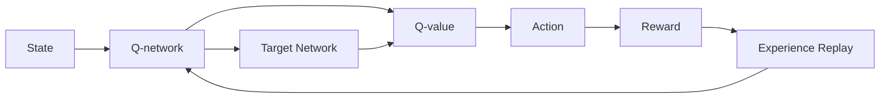
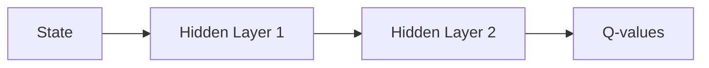

# 一切皆是映射：深度Q网络DQN的异构计算优化实践

关键词：深度Q网络、DQN、异构计算、强化学习、CUDA、OpenCL、Tensor Cores、FPGA

## 1. 背景介绍
### 1.1  问题的由来
深度强化学习是人工智能领域近年来的研究热点之一。其中，深度Q网络(Deep Q-Network, DQN)作为一种典型的深度强化学习算法，在Atari游戏、机器人控制等领域取得了令人瞩目的成果。然而，DQN算法的训练过程对计算资源要求较高，尤其在处理大规模状态空间和动作空间时，往往需要消耗大量的计算时间和存储空间。因此，如何利用异构计算平台加速DQN的训练和推理过程，成为了一个亟待解决的问题。

### 1.2  研究现状
目前，学术界和工业界已经开展了一些针对DQN异构计算优化的研究工作。一些研究者利用GPU加速DQN的训练过程，通过并行计算显著提升了训练效率。还有研究者尝试将DQN算法移植到FPGA平台，利用其低功耗、可定制化的特点，实现了能效比更高的DQN硬件加速器。此外，tensor cores、OpenCL等新兴的异构计算技术，也逐渐被应用到DQN的优化当中。

### 1.3  研究意义
DQN的异构计算优化研究具有重要的理论和实践意义。在理论层面，异构计算平台为DQN算法的优化提供了新的思路，有助于探索深度强化学习算法与计算架构的融合。在实践层面，高效的DQN异构计算方案可以大幅降低算法的训练成本，促进其在更广泛领域的应用。同时，DQN的异构计算优化经验也可以为其他深度学习算法的异构加速提供有益参考。

### 1.4  本文结构
本文将重点探讨DQN算法在异构计算平台上的优化实践。第2节介绍DQN的核心概念和关键环节；第3节重点阐述DQN的核心算法原理和具体操作步骤；第4节给出DQN的数学模型和关键公式，并进行详细讲解和举例说明；第5节展示DQN异构计算优化的代码实例，并对其进行解释说明；第6节分析DQN异构计算优化的实际应用场景；第7节推荐DQN异构计算优化相关的工具和资源；第8节总结全文，并展望DQN异构计算优化的未来发展趋势和面临的挑战；第9节给出常见问题解答。

## 2. 核心概念与联系
DQN的核心概念包括：
- 状态(State)：智能体(Agent)当前所处的环境状态。
- 动作(Action)：智能体在某状态下可以采取的动作。
- 奖励(Reward)：智能体执行动作后，环境给出的即时奖励。
- Q值(Q-value)：状态-动作对的长期累积奖励期望。
- Q网络(Q-network)：用深度神经网络拟合Q值函数。
- 经验回放(Experience Replay)：用于打破数据相关性和提高样本利用率。
- 目标网络(Target Network)：用于生成稳定的Q值目标。

这些核心概念间的关系可以用下面的Mermaid流程图表示：



从上图可以看出，DQN的核心是Q网络，它以状态为输入，输出各个动作的Q值。智能体根据Q值选择动作，获得即时奖励，并将状态、动作、奖励、下一状态等信息存入经验回放池。训练时，从经验回放池中随机采样一批数据，利用目标网络计算Q值目标，并优化Q网络，最小化TD误差。目标网络定期从Q网络复制参数，以保持目标Q值的相对稳定。整个过程不断迭代，使Q网络逐渐收敛到最优Q值函数。

## 3. 核心算法原理 & 具体操作步骤
### 3.1  算法原理概述
DQN算法的核心是Q学习，其基本思想是利用值迭代的方法，通过不断试错和更新来逼近最优Q值函数。传统Q学习使用Q表存储每个状态-动作对的Q值，但在状态空间和动作空间很大时，这种做法面临维度灾难问题。DQN的创新之处在于，用深度神经网络近似Q值函数，将高维状态映射为紧凑的特征表示，从而有效解决了维度灾难问题。此外，DQN还引入了经验回放和目标网络，以解决数据相关性和训练不稳定性问题。

### 3.2  算法步骤详解
DQN算法的主要步骤如下：

1. 初始化Q网络和目标网络，参数随机初始化。
2. 初始化经验回放池，用于存储智能体的交互数据。
3. for episode = 1, M do
4.    初始化环境状态s
5.    for t = 1, T do
6.        根据ε-greedy策略，用Q网络选择动作a
7.        执行动作a，得到奖励r和下一状态s'
8.        将(s, a, r, s')存入经验回放池
9.        从经验回放池中随机采样一批数据(s_i, a_i, r_i, s'_i)
10.       计算Q值目标：
           $$y_i = 
            \begin{cases}
            r_i & \text{if episode terminates at step } i+1\\
            r_i + \gamma \max_{a'} Q(s'_i, a'; \theta^-) & \text{otherwise}
            \end{cases}$$
           其中，$Q(s'_i, a'; \theta^-)$是目标网络输出的下一状态Q值，$\theta^-$是目标网络参数。
11.       用采样数据，通过最小化TD误差来更新Q网络：
           $$L(\theta) = \mathbb{E}_{(s,a,r,s')\sim U(D)} \left[ \left( y - Q(s, a; \theta) \right)^2 \right]$$
           其中，$U(D)$表示从经验回放池$D$中均匀采样。
12.       每隔C步，将Q网络参数复制给目标网络。
13.    end for
14. end for

### 3.3  算法优缺点
DQN算法的主要优点包括：
- 端到端训练，不需要人工设计特征。
- 可以处理高维连续状态空间。
- 通过深度神经网络提取高层特征，泛化能力强。
- 引入经验回放和目标网络，提高了训练效率和稳定性。

DQN算法的主要缺点包括：
- 训练时间长，样本效率低。
- 不适合处理连续动作空间。
- 需要大量调参，对超参数敏感。
- 难以适应非平稳环境。

### 3.4  算法应用领域
DQN算法在许多领域得到了成功应用，例如：
- 游戏：Atari游戏、围棋、星际争霸等。
- 机器人控制：机械臂操作、自动驾驶、四足机器人等。
- 推荐系统：电商推荐、新闻推荐、广告投放等。
- 通信：无线资源分配、基站休眠、缓存策略等。
- 金融：股票交易、资产定价、风险控制等。

## 4. 数学模型和公式 & 详细讲解 & 举例说明
### 4.1  数学模型构建
DQN算法可以用马尔可夫决策过程(MDP)来建模，其主要元素包括：
- 状态空间 $\mathcal{S}$：有限状态集合。
- 动作空间 $\mathcal{A}$：有限动作集合。
- 转移概率 $\mathcal{P}$：$\mathcal{P}_{ss'}^a = P(s'|s,a)$ 表示在状态$s$下执行动作$a$后转移到状态$s'$的概率。
- 奖励函数 $\mathcal{R}$：$\mathcal{R}_s^a = \mathbb{E}[R|s,a]$ 表示在状态$s$下执行动作$a$后获得的期望即时奖励。
- 折扣因子 $\gamma \in [0,1]$：表示未来奖励的折算比例。
- 策略 $\pi(a|s)$：在状态$s$下选择动作$a$的概率。

MDP的目标是寻找最优策略$\pi^*$，使得长期累积奖励最大化：

$$\pi^* = \arg\max_\pi \mathbb{E}\left[\sum_{t=0}^{\infty} \gamma^t R_t | \pi \right]$$

其中，$R_t$表示第$t$步获得的即时奖励。

Q学习算法通过值迭代的方式，不断更新状态-动作值函数$Q(s,a)$，直到收敛到最优值函数$Q^*(s,a)$：

$$Q^*(s,a) = \mathcal{R}_s^a + \gamma \sum_{s' \in \mathcal{S}} \mathcal{P}_{ss'}^a \max_{a'} Q^*(s',a')$$

最优策略可以通过贪心选择最大Q值的动作得到：

$$\pi^*(a|s) = 
\begin{cases}
1 & \text{if } a = \arg\max_{a'} Q^*(s,a')\\
0 & \text{otherwise}
\end{cases}$$

### 4.2  公式推导过程
DQN算法用深度神经网络$Q(s,a;\theta)$来近似最优值函数$Q^*(s,a)$，其中$\theta$为网络参数。假设最优值函数满足Bellman最优方程：

$$Q^*(s,a) = \mathbb{E}_{s' \sim \mathcal{P}_{ss'}^a} \left[ \mathcal{R}_s^a + \gamma \max_{a'} Q^*(s',a') \right]$$

将Q网络的输出$Q(s,a;\theta)$视为对$Q^*(s,a)$的无偏估计，可以得到Q网络的目标值：

$$y = \mathcal{R}_s^a + \gamma \max_{a'} Q(s',a';\theta^-)$$

其中，$\theta^-$为目标网络参数，用于生成稳定的Q值目标。

Q网络的训练目标是最小化TD误差，即Q网络输出与目标值之间的均方误差：

$$L(\theta) = \mathbb{E}_{(s,a,r,s')\sim U(D)} \left[ \left( y - Q(s, a; \theta) \right)^2 \right]$$

对损失函数关于参数$\theta$求梯度，并用随机梯度下降法更新参数：

$$\nabla_\theta L(\theta) = \mathbb{E}_{(s,a,r,s')\sim U(D)} \left[ \left( y - Q(s, a; \theta) \right) \nabla_\theta Q(s, a; \theta) \right]$$

$$\theta \leftarrow \theta - \alpha \nabla_\theta L(\theta)$$

其中，$\alpha$为学习率。

### 4.3  案例分析与讲解
下面以一个简单的迷宫游戏为例，说明DQN算法的建模和求解过程。

考虑一个$3 \times 3$的网格迷宫，智能体从起点S出发，目标是尽快到达终点G。

```
+---+---+---+
| S |   |   |
+---+---+---+
|   | X |   |
+---+---+---+
|   |   | G |
+---+---+---+
```

其中，X表示障碍物。

可以将迷宫建模为MDP：
- 状态空间 $\mathcal{S} = \{(i,j) | i,j=0,1,2\}$，共9个状态。
- 动作空间 $\mathcal{A} = \{up, down, left, right\}$，共4个动作。
- 转移概率 $\mathcal{P}_{ss'}^a = 1$，表示动作确定性。
- 奖励函数 $\mathcal{R}_s^a = -1$，每走一步奖励-1，到达终点奖励0。
- 折扣因子 $\gamma = 0.9$。

我们用一个2层的MLP作为Q网络，输入状态，输出各动作的Q值。网络结构如下：



训练过程中，智能体不断与环境交互，