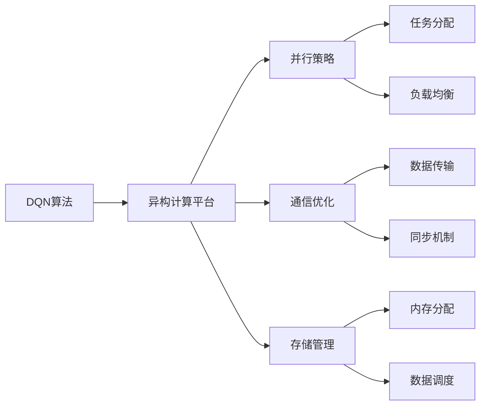

# 一切皆是映射：深度Q网络DQN的异构计算优化实践

关键词：深度Q网络、DQN、强化学习、异构计算、优化

## 1. 背景介绍
### 1.1 问题的由来
随着人工智能技术的飞速发展,强化学习作为一个重要的研究方向,在游戏、机器人控制等领域取得了显著成果。深度Q网络(Deep Q-Network,DQN)作为将深度学习与强化学习相结合的代表性算法,为智能体的决策提供了强大工具。然而,DQN算法在实际应用中仍面临计算效率和资源消耗等问题,亟需进行优化。
### 1.2 研究现状
目前,国内外学者对DQN算法的优化研究主要集中在网络结构设计、探索策略改进、并行计算等方面。但针对异构计算平台的DQN优化实践相对较少,尚未充分发掘异构硬件的潜力。因此,探索DQN在异构计算环境下的优化方法具有重要意义。
### 1.3 研究意义  
DQN算法的异构计算优化不仅可以提升模型训练和推理效率,节约计算资源,还能推动强化学习在更广泛场景下的应用。同时,异构优化实践也为其他深度学习算法在复杂计算平台的部署提供了思路和借鉴。
### 1.4 本文结构
本文将首先介绍DQN的核心概念和基本原理,然后重点阐述异构计算环境下的DQN优化方法,包括并行策略、通信优化、存储管理等。接着,通过实际项目案例和代码实现,展示优化后的性能提升。最后,总结全文内容并展望DQN优化的未来方向。

## 2. 核心概念与联系
- 强化学习：智能体通过与环境的交互,根据反馈信号调整策略,最大化长期累积奖励。
- Q-Learning：一种常见的强化学习算法,通过值函数逼近动作价值(Q值),指导智能体做出决策。
- 深度Q网络(DQN)：采用深度神经网络作为值函数近似器,将深度学习与Q-Learning相结合,增强了处理高维状态空间的能力。
- 异构计算：采用多种不同类型的处理器(如CPU、GPU、FPGA等)协同工作,发挥各自的计算优势,提升整体性能。
- 并行策略：将任务分配到不同处理器,实现并发执行,加速计算过程。
- 通信优化：改善处理器之间数据传输和同步方式,减少通信开销。
- 存储管理：合理分配和调度异构存储资源,优化数据读写效率。

下图展示了DQN在异构计算环境下的优化框架:



## 3. 核心算法原理 & 具体操作步骤
### 3.1 算法原理概述
DQN通过深度神经网络拟合最优动作价值函数Q*(s,a),将状态映射到对应动作的长期回报预期。在训练过程中,DQN利用经验回放和目标网络等技术,解决了数据相关性和不稳定性问题。同时,DQN引入ε-贪婪探索策略,平衡了探索和利用。
### 3.2 算法步骤详解  
1. 初始化经验回放缓冲区D,容量为N；
2. 初始化动作价值函数Q,参数为θ,目标网络参数为θ'=θ；
3. for episode = 1 to M do:
   1. 初始化状态s_1；
   2. for t = 1 to T do:
      1. 以ε的概率随机选择动作a_t,否则a_t=argmax_a Q(s_t,a；θ)；
      2. 执行动作a_t,观察奖励r_t和下一状态s_{t+1}；
      3. 将转移(s_t,a_t,r_t,s_{t+1})存储到D中；
      4. 从D中随机采样一个批次的转移样本(s_j,a_j,r_j,s_{j+1})；
      5. 计算目标值y_j：
         - 若s_{j+1}为终止状态,y_j = r_j；
         - 否则,y_j = r_j + γ max_{a'} Q(s_{j+1},a'；θ')。
      6. 最小化损失: L(θ) = E_j[(y_j - Q(s_j,a_j；θ))^2]；
      7. 每C步将目标网络参数θ'更新为θ。
   3. end for
4. end for
### 3.3 算法优缺点
优点：
- 采用深度神经网络,增强了状态空间表示能力；
- 引入经验回放,打破了数据相关性；
- 使用目标网络,提高了训练稳定性。

缺点：  
- 离线训练,难以适应动态环境；
- 对数据质量和数量要求较高；
- 计算复杂度高,训练时间长。
### 3.4 算法应用领域
DQN广泛应用于以下领域：
- 游戏智能体：Atari视频游戏、围棋、星际争霸等；
- 机器人控制：自主导航、操纵任务等；
- 推荐系统：广告投放、个性化推荐等；
- 资源调度：网络路由、负载均衡等。

## 4. 数学模型和公式 & 详细讲解 & 举例说明  
### 4.1 数学模型构建
马尔可夫决策过程(MDP)为强化学习提供了数学框架。MDP由状态集合S、动作集合A、转移概率P、奖励函数R和折扣因子γ组成。智能体与环境交互,根据策略π选择动作,获得即时奖励和下一状态,目标是最大化累积期望奖励：

$$G_t = \sum_{k=0}^{\infty} \gamma^k R_{t+k+1}$$

Q-Learning算法通过值函数逼近动作价值函数Q(s,a),表示在状态s下选择动作a的长期回报期望。最优动作价值函数Q*(s,a)满足贝尔曼最优方程：

$$Q*(s,a) = \mathbb{E}[R_{t+1} + \gamma \max_{a'} Q*(S_{t+1},a') | S_t=s, A_t=a]$$

DQN使用深度神经网络作为值函数近似器,参数为θ,损失函数为均方误差：

$$L(\theta) = \mathbb{E}[(r + \gamma \max_{a'} Q(s',a';\theta') - Q(s,a;\theta))^2]$$

其中,θ'为目标网络参数,每C步从在线网络复制而来。
### 4.2 公式推导过程
由贝尔曼最优方程,可得Q-Learning的更新公式：

$$Q(s,a) \leftarrow Q(s,a) + \alpha [r + \gamma \max_{a'} Q(s',a') - Q(s,a)]$$

将值函数近似引入,可得DQN的参数更新公式：

$$\theta \leftarrow \theta + \alpha [r + \gamma \max_{a'} Q(s',a';\theta') - Q(s,a;\theta)] \nabla_{\theta} Q(s,a;\theta)$$

其中,α为学习率,∇_θ Q(s,a；θ)为Q网络关于θ的梯度。
### 4.3 案例分析与讲解
以Atari游戏Breakout为例,说明DQN的工作流程。Breakout的状态为游戏画面,动作空间为{左移,右移,不动}。DQN接收当前画面帧,计算每个动作的Q值,选择Q值最大的动作执行。获得分数奖励和下一帧画面后,将(s_t,a_t,r_t,s_{t+1})转移样本存入回放缓冲区。从缓冲区采样一批样本,计算目标Q值,并最小化预测Q值与目标Q值间的均方误差,更新Q网络参数θ。重复上述过程,不断优化策略,提升游戏得分。
### 4.4 常见问题解答
Q: DQN能否处理连续动作空间？
A: DQN适用于离散动作空间,对于连续动作空间,可使用深度确定性策略梯度(DDPG)等算法。

Q: DQN的收敛性如何保证？ 
A: DQN通过目标网络、经验回放等技术提高收敛性,但仍可能出现发散。可通过调节超参数、改进探索策略等方法改善。

Q: DQN能否进行迁移学习？
A: 可以利用预训练的DQN网络初始化新任务的Q网络,实现知识迁移和加速学习。

## 5. 项目实践：代码实例和详细解释说明
### 5.1 开发环境搭建
- 操作系统: Ubuntu 18.04
- 深度学习框架: PyTorch 1.8.1
- 强化学习库: Stable-Baselines3 
- Python版本: 3.8
- CUDA版本: 11.1
- 硬件配置: Intel Core i9-10900K, NVIDIA GeForce RTX 3090, 64GB RAM
### 5.2 源代码详细实现
```python
import torch
import torch.nn as nn
import torch.optim as optim
import numpy as np
import gym

class DQN(nn.Module):
    def __init__(self, state_dim, action_dim):
        super(DQN, self).__init__()
        self.fc1 = nn.Linear(state_dim, 64)
        self.fc2 = nn.Linear(64, 64)
        self.fc3 = nn.Linear(64, action_dim)
        
    def forward(self, x):
        x = torch.relu(self.fc1(x))
        x = torch.relu(self.fc2(x))
        x = self.fc3(x)
        return x

class ReplayBuffer:
    def __init__(self, capacity):
        self.capacity = capacity
        self.buffer = []
        self.position = 0
    
    def push(self, state, action, reward, next_state, done):
        if len(self.buffer) < self.capacity:
            self.buffer.append(None)
        self.buffer[self.position] = (state, action, reward, next_state, done)
        self.position = (self.position + 1) % self.capacity
    
    def sample(self, batch_size):
        batch = random.sample(self.buffer, batch_size)
        state, action, reward, next_state, done = zip(*batch)
        return state, action, reward, next_state, done
    
    def __len__(self):
        return len(self.buffer)

def train(env, agent, episodes, batch_size, gamma, tau, epsilon_start, epsilon_end, epsilon_decay):
    replay_buffer = ReplayBuffer(10000)
    epsilon = epsilon_start
    optimizer = optim.Adam(agent.parameters(), lr=1e-3)
    
    for episode in range(episodes):
        state = env.reset()
        done = False
        total_reward = 0
        
        while not done:
            if np.random.rand() <= epsilon:
                action = env.action_space.sample()
            else:
                state_tensor = torch.FloatTensor(state).unsqueeze(0)
                q_values = agent(state_tensor)
                action = q_values.argmax().item()
            
            next_state, reward, done, _ = env.step(action)
            replay_buffer.push(state, action, reward, next_state, done)
            state = next_state
            total_reward += reward
            
            if len(replay_buffer) >= batch_size:
                states, actions, rewards, next_states, dones = replay_buffer.sample(batch_size)
                states_tensor = torch.FloatTensor(states)
                actions_tensor = torch.LongTensor(actions).unsqueeze(1)
                rewards_tensor = torch.FloatTensor(rewards).unsqueeze(1)
                next_states_tensor = torch.FloatTensor(next_states)
                dones_tensor = torch.FloatTensor(dones).unsqueeze(1)
                
                current_q_values = agent(states_tensor).gather(1, actions_tensor)
                max_next_q_values = agent(next_states_tensor).max(1)[0].unsqueeze(1)
                expected_q_values = rewards_tensor + (1 - dones_tensor) * gamma * max_next_q_values
                
                loss = nn.MSELoss()(current_q_values, expected_q_values.detach())
                optimizer.zero_grad()
                loss.backward()
                optimizer.step()
                
        epsilon = max(epsilon_end, epsilon_decay * epsilon)
        print(f"Episode: {episode+1}, Total Reward: {total_reward}, Epsilon: {epsilon}")
        
    return agent

if __name__ == "__main__":
    env = gym.make("CartPole-v1")
    state_dim = env.observation_space.shape[0]
    action_dim = env.action_space.n
    agent = DQN(state_dim, action