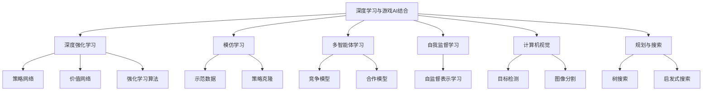

# 一切皆是映射：深度学习与游戏AI的结合

## 1. 背景介绍

### 1.1 问题的由来

游戏人工智能(Game AI)是人工智能领域的一个重要分支,旨在创建智能代理以与人类玩家进行互动和竞争。传统的游戏AI系统主要依赖于手工设计的规则和算法,这些算法通常基于特定领域的知识和经验,难以推广到新的环境和游戏场景。随着深度学习技术的兴起,研究人员开始探索将深度神经网络应用于游戏AI,希望能够通过从大量数据中自动学习,来构建更加通用和强大的游戏AI系统。

### 1.2 研究现状

近年来,结合深度学习的游戏AI取得了令人瞩目的进展。2016年,DeepMind的AlphaGo系统在围棋对抗赛中战胜了世界冠军李世乭,这被视为是人工智能发展的一个里程碑。AlphaGo的核心是一种基于深度神经网络的强化学习算法,能够从大量的游戏对局数据中自主学习策略。此后,DeepMind又相继推出了AlphaZero、MuZero等通用游戏AI系统,展现出了深度学习在游戏AI领域的巨大潜力。

除了经典棋类游戏,深度学习也被广泛应用于视频游戏AI。例如,DeepMind的DQN(Deep Q-Network)算法可以直接从原始像素数据中学习控制策略,在多款Atari视频游戏中表现出色。OpenAI的PPO(Proximal Policy Optimization)算法则被用于训练机器人代理在3D环境中完成复杂任务。此外,imitation learning(模仿学习)、multi-agent reinforcement learning(多智能体强化学习)等技术也为游戏AI的发展做出了贡献。

### 1.3 研究意义

将深度学习与游戏AI相结合,不仅可以推动游戏AI系统的性能提升,还对人工智能理论和实践具有重要意义:

1. **通用智能**:游戏环境提供了一个理想的测试平台,可以评估AI系统在复杂、多变的环境中学习和决策的能力。通过在游戏中训练,有望开发出更加通用和智能的AI系统。

2. **模型可解释性**:游戏AI系统的决策过程相对可解释,有利于研究人员分析和理解深度学习模型的内在机制。

3. **人机协作**:游戏AI代理可以作为人类玩家的辅助或对手,促进人机协作,并为研究人机交互提供新的视角。

4. **多智能体系统**:多人游戏场景为研究多智能体系统之间的竞争、合作和交互提供了理想的试验场。

5. **安全性和鲁棒性**:游戏AI系统需要应对来自对手的欺骗性策略,这为研究AI系统的安全性和鲁棒性提供了契机。

综上所述,深度学习与游戏AI的结合不仅可以推动游戏AI性能的提升,更重要的是为通用人工智能的发展提供了宝贵的理论基础和实践经验。

### 1.4 本文结构

本文将全面介绍深度学习与游戏AI结合的理论和实践。第2章将阐述该领域的核心概念和技术,包括深度强化学习、模仿学习、多智能体学习等。第3章将重点讲解核心算法的原理和具体实现步骤。第4章将构建数学模型,并推导相关公式,辅以案例分析加深理解。第5章将通过实际项目实践,展示代码实现细节。第6章将探讨该领域的实际应用场景。第7章将推荐相关学习资源和开发工具。最后,第8章将总结研究成果,展望未来发展趋势和面临的挑战。

## 2. 核心概念与联系

在深度学习与游戏AI结合的领域中,有几个核心概念和技术值得重点关注:

1. **深度强化学习(Deep Reinforcement Learning)**

   深度强化学习是将深度神经网络与传统强化学习相结合的技术,它使得智能体能够直接从原始环境数据(如像素、状态等)中学习策略,而无需手工设计特征。深度强化学习在游戏AI领域取得了巨大成功,如AlphaGo、DQN等。

2. **模仿学习(Imitation Learning)**

   模仿学习旨在从示范数据(如人类专家的游戏记录)中学习策略,常与强化学习相结合,形成"示范+探索"的学习范式。模仿学习在游戏AI中可以加速策略学习,并提高最终策略的质量。

3. **多智能体学习(Multi-Agent Learning)**

   多人游戏场景涉及多个智能体之间的竞争和合作,需要采用多智能体学习算法。这些算法关注智能体如何相互影响、如何达成协作、如何应对对手欺骗等问题。

4. **自我监督学习(Self-Supervised Learning)**

   在游戏环境中,可以利用游戏引擎生成大量的模拟数据,并通过自我监督学习从中挖掘有用的表示,为策略学习提供有力支持。

5. **计算机视觉(Computer Vision)**

   视频游戏环境通常以像素形式呈现,需要计算机视觉技术从像素中提取有用的视觉特征,为策略学习提供输入。

6. **规划与搜索(Planning and Search)**

   在一些具有明确规则的游戏中,如国际象棋、围棋等,通常需要结合规划和搜索算法,在有限的计算资源下寻找最优策略。

上述概念和技术相互关联、相辅相成,共同推动了深度学习与游戏AI结合的发展。例如,AlphaGo系统集成了深度策略网络(基于深度强化学习)、深度价值网络(基于深度监督学习)和蒙特卡罗树搜索,实现了卓越的表现。

## 3. 核心算法原理与具体操作步骤

### 3.1 算法原理概述

在深度学习与游戏AI结合的领域中,有几种核心算法值得重点关注:

1. **深度Q网络(Deep Q-Network, DQN)**

   DQN是将深度神经网络应用于Q-Learning的经典算法,它使用一个卷积神经网络从原始像素数据中估计Q值,并通过经验回放和目标网络等技巧提高训练稳定性。DQN在Atari视频游戏中取得了突破性进展。

2. **深度策略梯度(Deep Policy Gradient)**

   深度策略梯度算法直接使用深度神经网络来表示策略,并通过策略梯度方法进行优化。这种方法在连续控制任务中表现出色,如机器人控制等。在游戏AI中,它常与其他技术(如价值函数估计、模仿学习等)相结合。

3. **AlphaGo/AlphaZero**

   AlphaGo/AlphaZero是DeepMind提出的里程碑性算法,它将深度策略网络、深度价值网络和蒙特卡罗树搜索相结合,在围棋、国际象棋、圍棋等游戏中展现出超人的表现。这种"深度学习+搜索"的范式为解决复杂游戏任务提供了有力方法。

4. **PPO(Proximal Policy Optimization)**

   PPO是一种新型的策略梯度算法,它通过限制新旧策略之间的差异,实现了更加稳定的训练过程。PPO在连续控制任务和游戏环境中表现出色,被广泛应用。

5. **多智能体算法(Multi-Agent Algorithms)**

   多智能体算法关注多个智能体之间的竞争和合作,包括独立学习(Independent Learners)、同步学习(Simultaneous Learners)、中心化训练分布式执行(Centralized Training with Decentralized Execution)等范式。这些算法在多人游戏中发挥重要作用。

上述算法各有特色,需要根据具体的游戏场景和任务要求选择合适的算法。通常情况下,会将多种算法进行组合和扩展,以获得更好的性能。

### 3.2 算法步骤详解

以下将详细解释DQN(Deep Q-Network)算法的具体实现步骤:

1. **构建深度Q网络**

   使用卷积神经网络(CNN)作为Q网络的核心,输入为游戏画面的原始像素数据,输出为每个可能动作的Q值估计。网络结构可以采用成熟的模型,如AlexNet、VGGNet等。

2. **经验回放(Experience Replay)**

   将智能体与环境的交互过程存储在经验回放池中,每次训练时从中随机采样一个批次的转换(状态、动作、奖励、下一状态)进行学习,这种方式可以打破数据间的相关性,提高数据利用效率。

3. **目标网络(Target Network)**

   除了Q网络之外,还维护一个目标网络,用于生成期望的Q值目标。目标网络的参数是Q网络参数的复制,但更新频率较低,这种技术可以增加训练的稳定性。

4. **损失函数**

   使用均方误差损失函数,将Q网络输出的Q值估计与目标Q值之间的差异最小化:

   $$J(\theta) = \mathbb{E}_{(s,a,r,s')\sim U(D)}\left[(r + \gamma\max_{a'}Q(s',a';\theta^-) - Q(s,a;\theta))^2\right]$$

   其中,$\theta$是Q网络的参数,$\theta^-$是目标网络的参数,$\gamma$是折现因子,$(s,a,r,s')$是从经验回放池中采样的转换。

5. **优化算法**

   使用优化算法(如RMSProp、Adam等)根据损失函数的梯度,更新Q网络的参数$\theta$。

6. **$\epsilon$-贪婪策略(Epsilon-Greedy Policy)**

   在与环境交互时,智能体根据$\epsilon$-贪婪策略选择动作:以$\epsilon$的概率选择随机动作(探索),以$1-\epsilon$的概率选择当前Q值最大的动作(利用)。$\epsilon$会随着训练的进行而逐渐递减。

7. **周期性更新目标网络**

   每隔一定步数,将Q网络的参数复制到目标网络,从而"固定"目标Q值的估计,增加训练稳定性。

以上步骤反复执行,直至算法收敛或达到预期性能。DQN算法的关键在于利用深度神经网络从原始数据中直接估计Q值,并通过经验回放、目标网络等技巧提高训练稳定性,从而实现了在Atari视频游戏中的突破性进展。

### 3.3 算法优缺点

**DQN算法的优点:**

1. **端到端学习**:DQN算法可以直接从原始像素数据中学习控制策略,无需手工设计特征,体现了深度学习的优势。

2. **通用性强**:DQN算法可以应用于各种基于离散动作空间的任务,如Atari视频游戏、棋类游戏等,具有很好的通用性。

3. **高效利用数据**:通过经验回放技术,DQN算法可以有效利用之前的经验数据,提高数据利用效率。

4. **增强探索**:$\epsilon$-贪婪策略可以在利用和探索之间达成平衡,促进算法探索未知领域。

5. **提高稳定性**:目标网络技术可以增加训练过程的稳定性,避免振荡或发散。

**DQN算法的缺点:**

1. **离散动作空间**:DQN算法只适用于离散动作空间的任务,无法直接应用于连续控制问题。

2. **