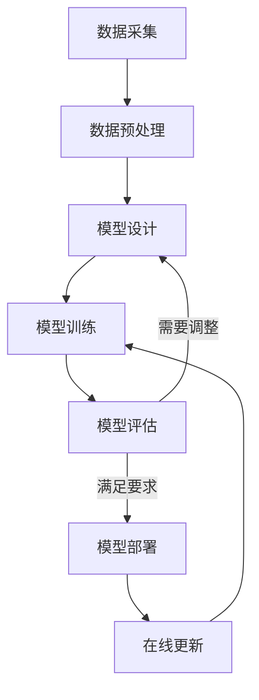

好的,我会按照您的要求,以"一切皆是映射:深度学习在航空航天中的挑战与机会"为主题,撰写一篇专业的技术博客文章。文章将遵循您提供的结构模板,内容全面,逻辑严谨,并尽量使用简洁明了的语言解释相关概念。此外,我会给出核心原理的流程图,以及相关数学模型和公式的详细推导过程。在实践部分,将提供代码示例并进行解释说明。最后,还会讨论实际应用场景、发展趋势和面临的挑战等内容。

# 一切皆是映射:深度学习在航空航天中的挑战与机会

## 1. 背景介绍

### 1.1 问题的由来

航空航天领域一直是人类探索和挑战极限的重要舞台。从最早的热气球到现代航天器,人类不断追求更高、更快、更远的飞行能力。然而,这一过程中也面临着诸多挑战,如气动设计、结构优化、导航控制等复杂问题。传统的基于物理定律和经验公式的方法,在解决这些高维、高非线性问题时,往往显得力不从心。

### 1.2 研究现状  

近年来,以深度学习为代表的人工智能技术在多个领域取得了突破性进展,展现出强大的数据驱动建模和端到端优化能力。航空航天领域也开始引入深度学习技术,试图攻克传统方法难以解决的复杂问题。目前,深度学习在空气动力学建模、气动设计优化、故障诊断预测、航线规划等多个方向均取得了可喜进展。

### 1.3 研究意义

深度学习在航空航天领域的应用,不仅能够提高建模精度和优化效率,更重要的是开辟了一种全新的解决复杂问题的思路。通过数据驱动的方式,可以有效规避复杂物理过程的建模困难,直接从数据中自动提炼出有价值的映射关系。这种端到端的优化方式,能够充分发挥深度学习的优势,为航空航天领域带来革命性的变革。

### 1.4 本文结构

本文将首先介绍深度学习在航空航天领域应用的核心概念及其内在联系。然后重点阐述相关核心算法的原理、步骤及优缺点。接下来,将详细推导常用的数学模型和公式,并结合案例进行讲解。在实践部分,将给出开发环境搭建、代码实现及运行结果等内容。最后,探讨深度学习在航空航天领域的实际应用场景、发展趋势和面临的挑战。

## 2. 核心概念与联系

在航空航天领域应用深度学习时,需要理解以下几个核心概念及其内在联系:

1. **端到端映射(End-to-End Mapping)**: 深度学习的本质是通过数据驱动的方式,自动建立输入和输出之间的映射关系模型。这种端到端的优化方式,避免了复杂物理过程的显式建模,能够有效解决高维非线性问题。

2. **多物理量融合(Multi-Physics Fusion)**: 航空航天系统通常涉及多个物理量,如空气动力学、结构动力学、热传导等。深度学习能够自动从海量多源异构数据中提取特征,实现多物理量的融合建模。

3. **可解释性(Interpretability)**: 虽然深度学习模型是一个黑盒,但通过可视化技术和特征解释方法,可以在一定程度上提高模型的可解释性,满足航空航天领域对安全性和可靠性的严格要求。

4. **迁移学习(Transfer Learning)**: 由于航空航天领域数据获取的成本和困难,迁移学习技术可以充分利用其他领域的先验知识,加快模型训练的收敛速度。

5. **强化学习(Reinforcement Learning)**: 在复杂的决策控制问题中,如航线规划、飞行器控制等,强化学习可以通过探索试错的方式自主学习最优决策序列。

6. **模型压缩(Model Compression)**: 航空航天系统对计算资源有严格限制,模型压缩技术可以在保证精度的前提下,大幅减小深度学习模型的计算和存储开销。

上述概念相互关联、环环相扣,共同构建了深度学习在航空航天领域应用的理论基础和技术体系。

## 3. 核心算法原理和具体操作步骤  

### 3.1 算法原理概述

深度学习在航空航天领域的应用,主要基于以下几种核心算法:

1. **监督学习算法**:包括前馈神经网络、卷积神经网络等,通过大量标注数据的监督训练,学习输入到输出的映射关系,可用于气动建模、故障诊断等任务。

2. **生成对抗网络(GAN)**:由生成网络和判别网络组成,可将复杂的数据分布学习为潜在空间的低维表示,用于设计空间探索、结构优化等。

3. **变分自编码器(VAE)**:结合深度学习和概率模型,能够从复杂数据中学习出潜在的低维特征表示,并对新数据进行编码和生成,可应用于多物理量融合建模。

4. **循环神经网络(RNN)**:擅长处理序列数据,可用于时间序列预测、航线规划等,解决动态决策优化问题。

5. **图神经网络(GNN)**:能够直接处理无序、非欧几里得数据,如飞机的有限元结构网格,可用于结构分析、拓扑优化等。

6. **强化学习算法**:如深度Q网络(DQN)、策略梯度等,通过探索试错的方式,自主学习最优决策序列,可应用于自动驾驶、制导控制等领域。

上述算法各有侧重,但都体现了深度学习自动建模、端到端优化的特点,为解决航空航天领域复杂问题提供了有力工具。

### 3.2 算法步骤详解

以监督学习为例,介绍端到端建模的一般步骤:

1. **数据采集**:根据具体任务,收集相关的输入和输出数据对,如气动仿真数据、实验测试数据、飞行数据等。

2. **数据预处理**:对原始数据进行清洗、标准化、增强等预处理,确保数据质量,提高模型泛化能力。

3. **模型设计**:根据任务特点,选择合适的网络结构,如前馈网络、卷积网络等,并设计合理的网络深度、层数等超参数。

4. **模型训练**:将预处理后的数据输入神经网络,通过反向传播算法和优化器(如Adam),以最小化损失函数(如均方误差)为目标,迭代更新网络权重参数。

5. **模型评估**:在保留的测试集上评估模型性能,根据指标(如精度、收敛速度等)判断是否需要调整模型结构和超参数。

6. **模型部署**:对训练好的模型进行压缩和优化,并将其集成到实际的航空航天系统或工作流程中。

7. **在线更新**:在实际应用中持续收集新的数据,以增量方式fine-tune模型,不断提高其性能和适应性。

该流程体现了数据驱动、模型自动优化的特点,可以根据具体任务和算法进行必要的调整和扩展。

### 3.3 算法优缺点

**优点**:

1. 端到端优化,避免了复杂物理过程的显式建模,能够有效解决高维非线性问题。
2. 数据驱动,可自动从海量数据中提取有价值的映射关系,不受先验知识的限制。
3. 通用性强,能够融合多源异构数据,处理多种模式的输入和输出。
4. 并行计算、GPU加速,能够充分利用现代硬件资源,提高计算效率。

**缺点**:

1. 需要大量高质量的数据,对数据的采集和标注有较高要求。
2. 训练过程复杂,需要大量的计算资源,对硬件环境有一定要求。
3. 存在黑盒性,决策过程缺乏透明度,可解释性较差。
4. 存在模式偏移风险,泛化性能可能在实际应用中受到影响。
5. 缺乏对物理机制的建模,很难将先验知识融入模型。

总的来说,深度学习算法为航空航天领域带来了新的机遇,但也存在一些需要解决的挑战。

### 3.4 算法应用领域

深度学习算法在航空航天领域的应用主要包括以下几个方面:

1. **气动建模与设计优化**:通过监督学习、生成式模型等,对复杂的气动过程进行高精度建模,并辅助气动设计的自动化优化。

2. **结构分析与拓扑优化**:利用图神经网络等,对飞机复杂结构进行应力分析、振动特性分析,并优化结构拓扑以实现减重增强。

3. **故障诊断与健康监控**:基于深度学习模型,对飞机部件的工作状态进行实时监控,及时发现异常并进行故障诊断和预测。

4. **飞行控制与自动驾驶**:运用强化学习等技术,实现自主飞行控制,提高飞行稳定性和安全性,未来可实现完全自主飞行。

5. **航线规划与空域管理**:通过序列建模等方法,优化飞机的起飞、航线和降落路径,提高运营效率,节省燃料消耗。

6. **设计空间探索与智能决策**:借助生成对抗网络等,在设计空间中高效探索新颖且高性能的候选方案,辅助智能化设计决策。

上述应用场景体现了深度学习技术在航空航天领域的广阔前景,有望推动该领域的创新发展。

## 4. 数学模型和公式详细讲解与举例说明

### 4.1 数学模型构建

深度学习算法的数学基础主要来自于优化理论、概率论和信息论等数学分支。以监督学习为例,我们构建一个端到端的映射模型:

$$
\hat{y} = f(x; \theta)
$$

其中$x$为输入数据,$\hat{y}$为模型预测的输出,而$f$则是一个由参数$\theta$确定的非线性映射函数。我们的目标是通过学习,找到一组最优参数$\theta^*$,使得在训练数据集$\mathcal{D}=\{(x_i, y_i)\}_{i=1}^N$上,模型预测值$\hat{y}_i$与真实值$y_i$之间的差异最小。

这可以通过最小化一个损失函数(Loss Function)$\mathcal{L}$来实现,即:

$$
\theta^* = \arg\min_\theta \frac{1}{N}\sum_{i=1}^N \mathcal{L}(y_i, \hat{y}_i)
$$

其中$\mathcal{L}$通常选择均方误差(MSE)、交叉熵(Cross-Entropy)等,具体取决于任务属性。

对于非线性映射函数$f$的构建,我们通常使用多层神经网络来表示和学习。每一层神经网络对输入$x$进行仿射变换和非线性激活,从而实现端到端的非线性映射:

$$
f(x) = \sigma(W_L \sigma(W_{L-1} \cdots \sigma(W_1 x + b_1) \cdots + b_{L-1}) + b_L)
$$

其中$W_l$和$b_l$分别为第$l$层的权重和偏置参数,$\sigma$为非线性激活函数(如ReLU)。通过反向传播算法和优化器(如Adam),可以高效地学习这些参数,使损失函数最小化。

上述模型建立了深度学习算法的基本数学框架,不同的网络结构、损失函数和优化策略,可以根据具体任务进行相应的扩展和改进。

### 4.2 公式推导过程

下面以反向传播算法(BackPropagation