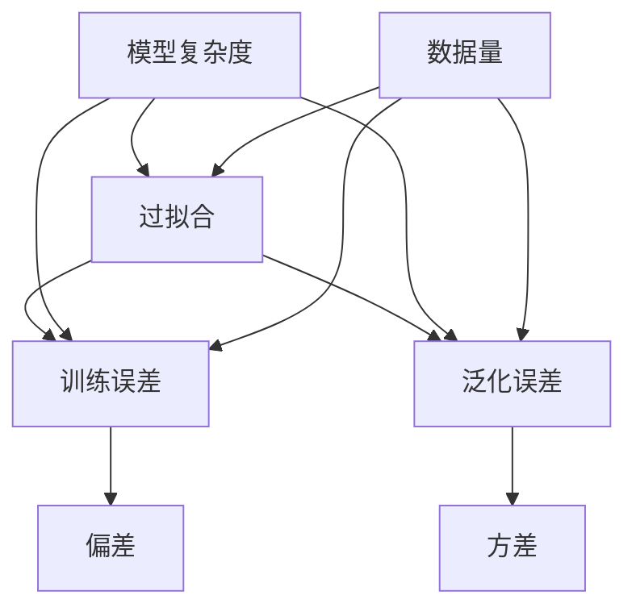

# 一切皆是映射：深度学习实战：如何应对过拟合

## 1. 背景介绍

### 1.1 问题的由来

在深度学习的实践中,过拟合是一个常见且棘手的问题。当模型过于复杂时,它可能会过度捕捉训练数据中的噪声和细节,从而导致在新的未见数据上表现不佳。这种现象被称为过拟合,会严重影响模型的泛化能力。

过拟合通常发生在以下几种情况:

1. **训练数据量不足**: 如果训练数据集的规模较小,模型可能会记住训练数据中的细节和噪声,而无法有效地捕捉数据的内在规律。

2. **模型复杂度过高**: 当模型的复杂度(如神经网络的层数和参数数量)过高时,它可能会过度拟合训练数据,从而丧失泛化能力。

3. **训练过程不当**: 如果训练过程不当,例如训练时间过长或学习率设置不当,都可能导致过拟合。

过拟合会导致模型在训练数据上表现良好,但在新的未见数据上表现不佳,这严重限制了模型在实际应用中的效果。因此,应对过拟合是深度学习实践中一个至关重要的问题。

### 1.2 研究现状

为了解决过拟合问题,研究人员提出了多种有效的方法,包括:

1. **数据增强(Data Augmentation)**: 通过对训练数据进行一些变换(如旋转、平移、缩放等)来人为扩大数据集的规模,从而提高模型的泛化能力。

2. **正则化(Regularization)**: 在模型的损失函数中引入惩罚项,限制模型的复杂度,防止过拟合。常见的正则化方法包括L1/L2正则化、Dropout等。

3. **提前停止(Early Stopping)**: 在训练过程中监控模型在验证集上的表现,当验证集上的性能不再提升时,停止训练以避免过拟合。

4. **集成学习(Ensemble Learning)**: 将多个基础模型的预测结果进行组合,从而提高模型的泛化能力。常见的集成方法包括Bagging、Boosting等。

5. **模型压缩(Model Compression)**: 通过模型剪枝、量化等技术压缩模型的大小,降低模型的复杂度,从而减轻过拟合。

尽管已有多种有效的方法,但由于深度学习模型的复杂性和应用场景的多样性,如何更好地应对过拟合仍然是一个值得深入研究的重要课题。

### 1.3 研究意义

解决过拟合问题对于提高深度学习模型的泛化能力至关重要。具有以下重要意义:

1. **提高模型性能**: 通过有效应对过拟合,可以显著提高深度学习模型在实际应用中的性能和稳定性。

2. **节省计算资源**: 减轻过拟合有助于降低模型的复杂度,从而节省计算资源和存储空间。

3. **促进理论研究**: 深入研究过拟合机理有助于更好地理解深度学习模型的行为,推动相关理论的发展。

4. **扩大应用领域**: 提高模型的泛化能力将促进深度学习在更多领域的应用,推动人工智能技术的发展。

因此,研究如何更好地应对过拟合问题,对于深度学习理论与实践都具有重要的意义。

### 1.4 本文结构

本文将从以下几个方面深入探讨如何应对深度学习中的过拟合问题:

1. 介绍过拟合的核心概念及其与其他相关概念的联系。

2. 阐述主流的应对过拟合的算法原理及具体操作步骤。

3. 详细讲解相关数学模型和公式,并结合案例进行分析。

4. 介绍实际项目中的代码实现,并进行详细解释和说明。

5. 探讨应对过拟合的实际应用场景及未来发展趋势。

6. 推荐相关的学习资源、开发工具和论文等。

7. 总结研究成果,分析未来发展趋势和面临的挑战。

8. 附录部分解答常见的相关问题。

## 2. 核心概念与联系

在深入探讨应对过拟合的方法之前,我们需要先理解过拟合及其相关的核心概念。这些概念之间存在着紧密的联系,对它们的理解有助于更好地把握过拟合的本质。

1. **过拟合(Overfitting)**: 指模型在训练数据上表现良好,但在新的未见数据上表现较差的现象。过拟合会导致模型丧失泛化能力。

2. **训练误差(Training Error)**: 模型在训练数据集上的误差,反映了模型对训练数据的拟合程度。过拟合通常会导致训练误差较小。

3. **泛化误差(Generalization Error)**: 模型在新的未见数据上的预测误差,反映了模型的泛化能力。过拟合会导致泛化误差较大。

4. **偏差(Bias)**: 模型本身的固有误差,反映了模型与真实函数之间的差距。偏差过高会导致欠拟合。

5. **方差(Variance)**: 模型对训练数据的微小变化的敏感程度。方差过高会导致过拟合。

6. **模型复杂度(Model Complexity)**: 模型的复杂程度,通常与模型的参数数量和非线性程度有关。复杂度过高容易导致过拟合。

7. **数据量(Data Size)**: 训练数据的规模。数据量过小会增加过拟合的风险。

这些概念之间存在着密切的联系。例如,过高的模型复杂度和过小的数据量都会增加过拟合的风险。同时,过拟合也会导致训练误差较小但泛化误差较大。通过理解这些概念及其相互关系,我们可以更好地把握过拟合的本质,从而采取有效的应对措施。

## 3. 核心算法原理 & 具体操作步骤

为了应对过拟合问题,研究人员提出了多种有效的算法和方法。在这一部分,我们将重点介绍几种主流的算法原理及其具体操作步骤。

### 3.1 算法原理概述

1. **正则化(Regularization)**

正则化是应对过拟合的一种常用方法。其基本思想是在模型的损失函数中引入惩罚项,限制模型的复杂度,从而提高模型的泛化能力。常见的正则化方法包括L1正则化(Lasso)、L2正则化(Ridge)和Dropout等。

2. **提前停止(Early Stopping)**

提前停止是一种基于验证集的方法。在训练过程中,我们会定期评估模型在验证集上的性能。当验证集上的性能不再提升时,即认为模型开始过拟合,此时停止训练以避免进一步过拟合。

3. **数据增强(Data Augmentation)**

数据增强是通过对训练数据进行一些变换(如旋转、平移、缩放等)来人为扩大数据集的规模,从而提高模型的泛化能力。常见的数据增强方法包括图像翻转、裁剪、噪声添加等。

4. **集成学习(Ensemble Learning)**

集成学习的思想是将多个基础模型的预测结果进行组合,从而提高模型的泛化能力。常见的集成方法包括Bagging、Boosting等。集成学习可以有效减轻单一模型过拟合的风险。

5. **模型压缩(Model Compression)**

模型压缩是通过模型剪枝、量化等技术压缩模型的大小,降低模型的复杂度,从而减轻过拟合。常见的模型压缩方法包括网络剪枝、知识蒸馏等。

### 3.2 算法步骤详解

接下来,我们将详细介绍几种主流算法的具体操作步骤。

#### 3.2.1 L1/L2正则化

L1正则化(Lasso)和L2正则化(Ridge)是两种常见的正则化方法,它们通过在损失函数中引入惩罚项来限制模型的复杂度。

**L1正则化(Lasso)步骤**:

1. 定义模型的损失函数 $J(w)$,其中 $w$ 表示模型参数。
2. 在损失函数中加入 L1 正则化项 $\lambda \sum_{i=1}^{n} |w_i|$,其中 $\lambda$ 是正则化强度的超参数。
3. 优化目标函数 $J(w) + \lambda \sum_{i=1}^{n} |w_i|$,得到模型参数 $w$。

L1正则化会使得部分参数变为精确的零,从而实现自动特征选择,但可能导致参数估计偏差。

**L2正则化(Ridge)步骤**:

1. 定义模型的损失函数 $J(w)$。
2. 在损失函数中加入 L2 正则化项 $\lambda \sum_{i=1}^{n} w_i^2$,其中 $\lambda$ 是正则化强度的超参数。
3. 优化目标函数 $J(w) + \lambda \sum_{i=1}^{n} w_i^2$,得到模型参数 $w$。

L2正则化会使得所有参数值变小,但不会使参数精确为零,因此不具有自动特征选择的能力,但参数估计无偏。

在实际应用中,我们需要根据具体问题选择合适的正则化方法,并调整正则化强度 $\lambda$ 以获得最佳效果。

#### 3.2.2 Dropout

Dropout是一种常用的正则化技术,它通过在训练过程中随机丢弃一部分神经元来防止过拟合。具体步骤如下:

1. 在神经网络的每一层,为每个神经元随机生成一个服从伯努利分布的掩码向量 $r$,其中 $r_i \sim Bernoulli(p)$,即以概率 $p$ 保留该神经元,以概率 $1-p$ 丢弃该神经元。
2. 在前向传播时,将输入向量 $x$ 与掩码向量 $r$ 进行元素wise乘积,得到 $\tilde{x} = r \odot x$,并将 $\tilde{x}$ 传递给下一层。
3. 在反向传播时,将梯度乘以保留比例 $p$,即 $\frac{\partial C}{\partial x} = p \frac{\partial C}{\partial \tilde{x}}$,以保证期望值不变。
4. 在测试时,不进行Dropout操作,但需要将每个神经元的输出乘以保留比例 $p$,以保证期望值不变。

Dropout可以看作是一种极端形式的模型集成,每次前向传播相当于训练了一个子模型。通过随机丢弃神经元,Dropout可以有效防止神经元之间的共适应,从而减轻过拟合。

#### 3.2.3 提前停止(Early Stopping)

提前停止是一种基于验证集的方法,其步骤如下:

1. 将数据集划分为训练集、验证集和测试集。
2. 在训练过程中,定期评估模型在验证集上的性能(如损失值或准确率)。
3. 如果验证集上的性能在连续若干个epoch内没有提升,则认为模型开始过拟合,停止训练。
4. 选择验证集上性能最佳时的模型参数作为最终模型。
5. 在测试集上评估最终模型的性能。

提前停止的关键在于确定合适的停止条件,通常需要设置一个patience参数,表示在连续多少个epoch内验证集性能没有提升时停止训练。过小的patience值可能导致模型欠拟合,而过大的值则可能无法有效防止过拟合。

提前停止可以有效防止模型在训练集上过度拟合,从而提高模型的泛化能力。但是,它也存在一些缺陷,例如需要额外的验证集,并且无法保证在测试集上的性能。

#### 3.2.4 数据增强

数据增强是通过对训练数据进行一些变换来人为扩大数