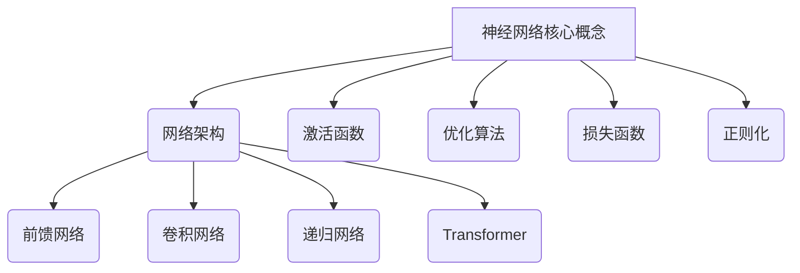

以下是技术博客文章《一切皆是映射：神经网络的常见架构比较》的正文内容：

# 一切皆是映射：神经网络的常见架构比较

## 1. 背景介绍

### 1.1 问题的由来

在过去的几十年里，人工神经网络在各种机器学习和深度学习任务中取得了巨大的成功。神经网络被广泛应用于图像识别、自然语言处理、语音识别、推荐系统等诸多领域。然而,随着问题的复杂性不断增加,单一的神经网络架构往往难以满足所有任务的需求。因此,研究和比较不同神经网络架构的优缺点、适用场景等就显得尤为重要。

### 1.2 研究现状  

目前,学术界和工业界已经提出了多种神经网络架构,如前馈神经网络、卷积神经网络、递归神经网络、transformer等。每种架构都有其独特的结构和工作原理,适用于不同的任务类型。但由于缺乏系统性的比较和分析,开发人员在选择合适的神经网络架构时往往面临困难。

### 1.3 研究意义

本文旨在系统性地比较常见的神经网络架构,包括前馈网络、卷积网络、递归网络、transformer等。通过剖析每种架构的核心思想、数学原理、优缺点和适用场景,帮助读者全面了解不同神经网络架构,为实际应用选择合适的架构提供参考。

### 1.4 本文结构

本文首先介绍神经网络的基本概念,然后分别详细探讨前馈网络、卷积网络、递归网络和transformer的原理、实现细节和应用场景。接下来,对这些架构进行比较分析,阐明各自的优缺点。最后,总结未来的发展趋势和挑战。

## 2. 核心概念与联系

神经网络的核心概念包括网络架构、激活函数、优化算法、损失函数和正则化等。不同的网络架构决定了网络的计算流程和信息传递方式,而激活函数、优化算法、损失函数和正则化则影响着网络的表达能力和泛化性能。

本文重点探讨四种常见的网络架构:前馈网络、卷积网络、递归网络和Transformer。这些架构在设计思路和应用场景上存在显著差异,但都遵循着基本的神经网络原理。

## 3. 核心算法原理 & 具体操作步骤  

### 3.1 算法原理概述

#### 3.1.1 前馈神经网络

前馈神经网络是最基本的神经网络架构,信息只能单向传播,没有反馈连接。它由输入层、隐藏层和输出层组成,每层由多个神经元构成。神经元接收来自上一层的加权输入,经过激活函数后输出给下一层。

$$
y = f\left(\sum_{i=1}^{n}w_ix_i + b\right)
$$

其中 $y$ 为神经元输出, $f$ 为激活函数, $w_i$ 为权重, $x_i$ 为输入, $b$ 为偏置项。

#### 3.1.2 卷积神经网络

卷积神经网络在图像、语音等领域表现出色,其核心思想是利用卷积操作提取局部特征。卷积层通过滤波器对输入数据进行卷积操作,提取不同的特征图。池化层则对特征图进行下采样,降低计算量。

$$
y_{ij} = f\left(\sum_{m}\sum_{n}w_{mn}x_{i+m,j+n} + b\right)
$$

其中 $y_{ij}$ 为输出特征图, $w_{mn}$ 为卷积核权重, $x_{i+m,j+n}$ 为输入数据, $b$ 为偏置项。

#### 3.1.3 递归神经网络

递归神经网络擅长处理序列数据,如自然语言和语音。它在隐藏层中引入了循环连接,能够捕捉序列中的长期依赖关系。常见的递归神经网络包括简单递归网络和长短期记忆网络(LSTM)等。

$$
h_t = f_H(Wx_t + Uh_{t-1} + b_H)\\
y_t = f_Y(Vh_t + b_Y)
$$

其中 $h_t$ 为时刻 $t$ 的隐藏状态, $x_t$ 为输入, $W$、$U$、$V$ 为权重矩阵, $b_H$、$b_Y$ 为偏置项, $f_H$、$f_Y$ 为激活函数。

#### 3.1.4 Transformer

Transformer 是一种全新的基于注意力机制的架构,不需要递归和卷积操作。它通过自注意力机制捕捉输入序列中任意两个位置之间的依赖关系,在机器翻译、语言模型等任务中表现优异。

$$
\text{Attention}(Q, K, V) = \text{softmax}\left(\frac{QK^T}{\sqrt{d_k}}\right)V
$$

其中 $Q$、$K$、$V$ 分别为查询(Query)、键(Key)和值(Value)矩阵, $d_k$ 为缩放因子。

### 3.2 算法步骤详解

#### 3.2.1 前馈神经网络

1. **前向传播**：输入数据通过输入层传递到隐藏层,每个隐藏层神经元根据加权输入和激活函数计算输出,并传递到下一层,直至输出层。
2. **反向传播**：根据输出层的损失函数值,利用链式法则计算每个权重对损失函数的梯度。
3. **权重更新**：使用优化算法(如梯度下降)根据梯度更新网络权重。
4. **重复迭代**：重复前向传播和反向传播,直至模型收敛或达到最大迭代次数。

#### 3.2.2 卷积神经网络

1. **卷积层**：输入数据通过一个或多个卷积核进行卷积操作,得到多个特征图。
2. **池化层**：对特征图进行下采样,降低计算量和提取更加鲁棒的特征。
3. **全连接层**：将池化层的输出展平,并输入到全连接层进行分类或回归。
4. **损失计算**：根据输出和真实标签计算损失函数值。
5. **反向传播**：利用链式法则计算梯度,并使用优化算法更新网络参数。

#### 3.2.3 递归神经网络

1. **初始化**：初始化隐藏状态和其他参数。
2. **前向计算**：对于每个时间步,根据当前输入和上一时间步的隐藏状态计算当前隐藏状态和输出。
3. **损失计算**：根据输出序列和真实标签计算损失函数值。
4. **反向传播**：利用反向传播算法计算梯度,并使用优化算法更新网络参数。

#### 3.2.4 Transformer

1. **输入编码**：将输入序列编码为嵌入向量。
2. **位置编码**：为每个位置添加位置编码,赋予位置信息。
3. **多头注意力**：计算查询、键和值之间的注意力分数,并生成注意力输出。
4. **前馈网络**：对注意力输出通过全连接层进行处理。
5. **残差连接**：将处理后的输出与输入相加,构成残差连接。
6. **规范化**：对残差连接的输出进行层规范化。
7. **解码**：重复3-6步骤,生成输出序列。
8. **损失计算**：根据输出序列和真实标签计算损失函数值。
9. **反向传播**：利用反向传播算法计算梯度,并使用优化算法更新网络参数。

### 3.3 算法优缺点

#### 3.3.1 前馈神经网络

**优点**：
- 结构简单,易于理解和实现。
- 对于简单的模式识别任务表现良好。

**缺点**：
- 缺乏捕捉输入数据内在结构和关系的能力。
- 对于高维输入数据,参数空间会急剧增大,容易过拟合。
- 无法很好地处理序列数据和结构化数据。

#### 3.3.2 卷积神经网络

**优点**：
- 通过权重共享减少了参数量,降低了过拟合风险。
- 能够有效捕捉输入数据的局部特征,如图像的边缘和纹理等。
- 对于平移不变性的任务表现出色,如图像识别。

**缺点**：
- 对于长期依赖关系的建模能力较弱。
- 难以直接处理非欧几里得数据,如图和树等。
- 卷积核的设计需要人工干预和大量实验。

#### 3.3.3 递归神经网络

**优点**：
- 能够有效捕捉序列数据中的长期依赖关系。
- 适用于处理自然语言、语音和时间序列等序列数据。
- 具有参数共享的特性,参数量相对较少。

**缺点**：
- 存在梯度消失和梯度爆炸问题,训练过程不稳定。
- 无法有效利用并行计算加速训练。
- 对于长序列,计算效率较低。

#### 3.3.4 Transformer

**优点**：
- 完全基于注意力机制,能够有效捕捉任意距离的依赖关系。
- 并行计算能力强,训练速度快。
- 适用于各种序列数据,如文本、语音和图像等。

**缺点**：
- 计算复杂度较高,对长序列的处理效率较低。
- 需要大量的训练数据,否则容易过拟合。
- 对于一些特定任务,性能可能不如专门设计的模型。

### 3.4 算法应用领域

- **前馈神经网络**：适用于简单的模式识别任务,如手写数字识别、图像分类等。
- **卷积神经网络**：在计算机视觉、语音识别等领域表现出色,如图像分类、目标检测、语音识别等。
- **递归神经网络**：擅长处理序列数据,如自然语言处理、机器翻译、语音识别等。
- **Transformer**：在自然语言处理、机器翻译、图像分类等领域取得了卓越的成绩。

## 4. 数学模型和公式 & 详细讲解 & 举例说明

### 4.1 数学模型构建

#### 4.1.1 前馈神经网络

前馈神经网络的数学模型可以表示为:

$$
\begin{aligned}
h^{(l)} &= f\left(W^{(l)}h^{(l-1)} + b^{(l)}\right)\\
y &= f\left(W^{(L)}h^{(L-1)} + b^{(L)}\right)
\end{aligned}
$$

其中 $h^{(l)}$ 为第 $l$ 层的隐藏状态, $W^{(l)}$ 和 $b^{(l)}$ 分别为第 $l$ 层的权重矩阵和偏置向量, $f$ 为激活函数, $y$ 为最终输出。

#### 4.1.2 卷积神经网络

卷积神经网络的核心操作是卷积,其数学表达式为:

$$
y_{ij}^{l} = f\left(\sum_{m}\sum_{n}w_{mn}^{l}x_{i+m,j+n}^{l-1} + b^{l}\right)
$$

其中 $y_{ij}^{l}$ 为第 $l$ 层的输出特征图, $w_{mn}^{l}$ 为第 $l$ 层的卷积核权重, $x_{i+m,j+n}^{l-1}$ 为第 $l-1$ 层的输入特征图, $b^{l}$ 为第 $l$ 层的偏置项, $f$ 为激活函数。

#### 4.1.3 递归神经网络

递归神经网络的数学模型可以表示为:

$$
\begin{aligned}
h_t &= f_H(W_hx_t + U_hh_{t-1} + b_h)\\
y_t &= f_Y(W_yh_t + b_y)
\end{aligned}
$$

其中 $h_t$