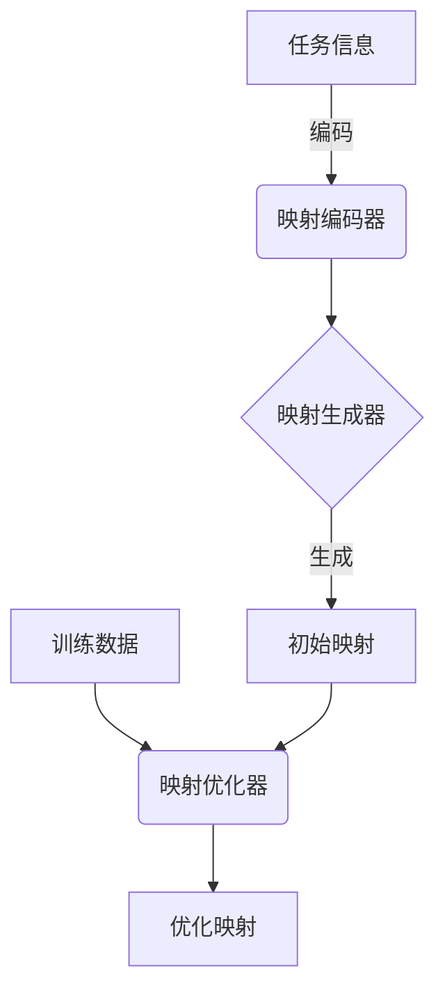

以下是题为《一切皆是映射：终身学习与元学习的关系》的技术博客文章正文:

# 一切皆是映射：终身学习与元学习的关系

## 1. 背景介绍

### 1.1 问题的由来

在当今快节奏的技术发展时代，机器学习和人工智能领域的突破层出不穷。然而,大多数现有模型都是为解决特定任务而设计的,当面临新的环境或任务时,它们的泛化能力往往受到限制。这种"灵活性"的缺乏使得这些模型难以适应不断变化的现实世界。

### 1.2 研究现状 

为了克服这一挑战,研究人员提出了"终身学习"(Lifelong Learning)和"元学习"(Meta-Learning)的概念。终身学习旨在开发能够持续学习并从经验中累积知识的人工智能系统。而元学习则是一种"学习如何学习"的范式,它探索了提高学习效率和泛化能力的方法。

### 1.3 研究意义

终身学习和元学习的融合有望产生能够不断适应新环境、高效获取新知识的智能系统。这不仅能推动人工智能领域的发展,也有望为解决现实世界中的复杂问题提供新的思路。

### 1.4 本文结构

本文将首先介绍终身学习和元学习的核心概念,并探讨它们之间的内在联系。接下来,我们将深入探讨一种将二者结合的创新算法——"一切皆是映射"(All is Mapping),并详细阐述其原理、数学模型和代码实现。最后,我们将讨论该算法在实际应用中的场景,以及未来的发展趋势和挑战。

## 2. 核心概念与联系

终身学习(Lifelong Learning)和元学习(Meta-Learning)虽然起源不同,但在本质上存在内在联系。

**终身学习**旨在开发能够持续学习的人工智能系统。这种系统不仅能够在单一任务上表现出色,而且能够从过去的经验中积累知识,并将其应用于新的任务和环境中。这种"知识迁移"的能力使得系统可以快速适应新情况,避免从头开始学习的低效率。

**元学习**则关注于"学习如何学习"。它探索了提高学习效率和泛化能力的方法,旨在开发出能够快速习得新任务的学习算法。一些常见的元学习方法包括:

1. **学习率优化**(Learning Rate Optimization):自动调整模型的学习率,以提高收敛速度和泛化性能。
2. **优化器学习**(Optimizer Learning):直接从数据中学习优化算法的参数。
3. **模型卷积**(Model Convolution):将多个预训练模型"卷积"以生成新模型,从而实现快速适应新任务。

虽然终身学习和元学习的目标不尽相同,但它们都致力于提高人工智能系统的"灵活性"和"通用性"。事实上,元学习可以被视为终身学习的一种手段——通过提高学习效率,系统能够更快地适应新环境,从而实现持续学习。

因此,将终身学习和元学习相结合,是实现通用人工智能的一条有前途的途径。下面我们将介绍一种创新算法"一切皆是映射",它正是在这一思路的指导下诞生的。

## 3. 核心算法原理与具体操作步骤

### 3.1 算法原理概述

"一切皆是映射"(All is Mapping)算法的核心思想是:将所有的学习任务视为从输入到输出的映射,并通过一种统一的方式来学习这些映射。具体来说,算法包含以下三个关键部分:

1. **映射编码器**(Mapping Encoder):将任务及其相关信息编码为一个紧凑的向量表示。
2. **映射生成器**(Mapping Generator):根据编码向量,生成解决该任务所需的映射(即模型)。
3. **映射优化器**(Mapping Optimizer):在新任务的训练数据上,优化生成的映射,得到最终的解决方案。

该算法的工作流程如下所示:

通过将所有任务统一为"映射"的形式,该算法实现了知识的有效共享和迁移。映射编码器能够从先前任务中学习任务之间的共性,而映射生成器则能够基于这些共性为新任务快速生成一个良好的初始映射,从而加速后续的优化过程。

### 3.2 算法步骤详解

1. **映射编码器训练**

   - 输入:一系列已解决的任务 $\{T_1, T_2, \cdots, T_n\}$ 及其对应的解决方案(映射) $\{f_1, f_2, \cdots, f_n\}$。
   - 目标:学习一个映射 $\phi: T \mapsto z$,将任务 $T$ 编码为一个紧凑的向量表示 $z$。
   - 训练过程:使用监督学习,最小化以下损失函数:

   $$\mathcal{L}_\phi = \sum_{i=1}^n \left\Vert \phi(T_i) - z_i^* \right\Vert^2$$

   其中 $z_i^*$ 是对应于映射 $f_i$ 的"理想"编码,可通过另一个编码器网络获得。

2. **映射生成器训练**

   - 输入:一系列编码向量 $\{z_1, z_2, \cdots, z_n\}$ 及其对应的映射 $\{f_1, f_2, \cdots, f_n\}$。
   - 目标:学习一个映射 $\psi: z \mapsto f$,根据编码向量生成解决方案映射。
   - 训练过程:使用监督学习,最小化以下损失函数:

   $$\mathcal{L}_\psi = \sum_{i=1}^n d(f_i, \psi(z_i))$$

   其中 $d(\cdot, \cdot)$ 是映射之间的某种距离度量。

3. **映射优化器**

   - 输入:新任务 $T_{\text{new}}$ 的训练数据 $\mathcal{D}_{\text{new}}$,以及由映射生成器生成的初始映射 $f_0 = \psi(\phi(T_{\text{new}}))$。
   - 目标:在训练数据上优化初始映射,得到解决该任务的最终映射 $f^*$。
   - 优化过程:使用常规的机器学习优化算法(如梯度下降),最小化损失函数 $\mathcal{L}(f_0, \mathcal{D}_{\text{new}})$。

通过上述三个步骤,算法能够快速获得新任务的解决方案,实现高效的终身学习。

### 3.3 算法优缺点

**优点**:

1. **高效性**:由于映射生成器能够为新任务提供一个良好的初始映射,因此后续的优化过程可以快速收敛,大大提高了学习效率。
2. **泛化能力**:算法能够从先前任务中学习共性知识,并将其应用于新任务,提高了模型的泛化能力。
3. **灵活性**:算法可以处理各种类型的任务,只要它们能够表示为"映射"的形式。
4. **可解释性**:通过分析映射编码器学习到的编码向量,可以揭示不同任务之间的内在联系。

**缺点**:

1. **训练复杂度**:需要同时训练三个不同的模型(编码器、生成器和优化器),训练过程复杂。
2. **数据需求**:算法需要大量的任务数据进行训练,获取这些数据可能是一个挑战。
3. **编码向量瓶颈**:编码向量的维度限制了它所能表示的信息量,可能影响算法的性能上限。

### 3.4 算法应用领域

"一切皆是映射"算法具有广泛的应用前景,可以用于以下领域:

1. **计算机视觉**:将图像分类、目标检测、语义分割等视觉任务视为映射,实现跨任务知识迁移。
2. **自然语言处理**:将文本分类、机器翻译、问答系统等语言任务视为映射,提高模型的泛化能力。
3. **强化学习**:将不同的控制策略视为映射,实现策略之间的快速迁移,加速训练过程。
4. **机器人学习**:将不同的机器人控制任务视为映射,提高机器人在新环境下的适应能力。
5. **元学习**:算法本身就是一种元学习方法,可以应用于各种需要快速习得新任务的场景。

## 4. 数学模型和公式详细讲解与举例说明

在上一节中,我们介绍了"一切皆是映射"算法的核心原理和步骤。现在,让我们深入探讨该算法的数学模型,并通过具体案例来加深理解。

### 4.1 数学模型构建

我们将任务 $T$ 视为一个映射 $f: \mathcal{X} \rightarrow \mathcal{Y}$,它将输入空间 $\mathcal{X}$ 映射到输出空间 $\mathcal{Y}$。例如,在图像分类任务中,输入空间 $\mathcal{X}$ 是所有可能的图像,而输出空间 $\mathcal{Y}$ 是一组离散的类别标签。

我们的目标是学习三个映射:

1. 映射编码器 $\phi: \mathcal{T} \rightarrow \mathcal{Z}$,将任务 $T$ 编码为向量 $z \in \mathcal{Z}$。
2. 映射生成器 $\psi: \mathcal{Z} \rightarrow \mathcal{F}$,根据编码向量 $z$ 生成映射 $f \in \mathcal{F}$。
3. 映射优化器 $\omega: \mathcal{F} \times \mathcal{D} \rightarrow \mathcal{F}$,在训练数据 $\mathcal{D}$ 上优化映射 $f$。

我们将这三个映射统一在一个框架内进行学习和优化。

### 4.2 公式推导过程

首先,我们定义映射编码器 $\phi$ 的损失函数:

$$\mathcal{L}_\phi(\phi) = \mathbb{E}_{T \sim p(T), f \sim q(f|T)} \left[ \left\Vert \phi(T) - z^*(f) \right\Vert^2 \right]$$

其中 $p(T)$ 是任务的分布, $q(f|T)$ 是给定任务 $T$ 时映射 $f$ 的条件分布, $z^*(f)$ 是映射 $f$ 的"理想"编码,可以通过另一个编码器网络获得。我们的目标是最小化这个损失函数,使得编码向量 $\phi(T)$ 尽可能接近理想编码 $z^*(f)$。

接下来,我们定义映射生成器 $\psi$ 的损失函数:

$$\mathcal{L}_\psi(\psi) = \mathbb{E}_{z \sim p(z), f \sim q(f|z)} \left[ d(f, \psi(z)) \right]$$

其中 $p(z)$ 是编码向量的分布, $q(f|z)$ 是给定编码向量 $z$ 时映射 $f$ 的条件分布, $d(\cdot, \cdot)$ 是映射之间的某种距离度量(如均方误差)。我们的目标是最小化这个损失函数,使得生成的映射 $\psi(z)$ 尽可能接近真实的映射 $f$。

最后,我们定义映射优化器 $\omega$ 的损失函数为:

$$\mathcal{L}_\omega(\omega) = \mathbb{E}_{T \sim p(T), \mathcal{D} \sim p(\mathcal{D}|T)} \left[ \mathcal{L}(\omega(\psi(\phi(T))), \mathcal{D}) \right]$$

其中 $p(\mathcal{D}|T)$ 是给定任务 $T$ 时训练数据 $\mathcal{D}$ 的条件分布, $\mathcal{L}(\cdot, \mathcal{D})$ 是映射在训练数据上的损失函数(如交叉熵损失)。我们的目标是最小化这个损失函数,使得优化后的映射 $\omega(\psi(\phi(