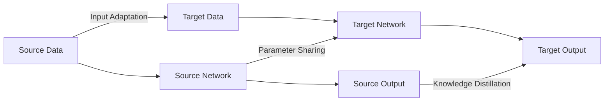

# 一切皆是映射：迁移学习在神经网络的应用

关键词：迁移学习、神经网络、深度学习、领域自适应、参数共享

## 1. 背景介绍
### 1.1  问题的由来
随着深度学习的快速发展,神经网络在计算机视觉、自然语言处理等领域取得了巨大成功。然而,训练一个高性能的神经网络通常需要大量的标注数据和计算资源,这在很多实际应用中是难以满足的。如何利用已有的知识和模型,快速适应新的任务,成为了一个亟待解决的问题。
### 1.2  研究现状
迁移学习作为一种利用已有知识解决新问题的机器学习范式,为上述问题提供了一种有效的解决方案。近年来,迁移学习在神经网络领域得到了广泛关注和应用,涌现出许多创新性的方法。比如fine-tuning[1]通过在预训练模型上微调适应新任务；Domain Adaptation[2]通过最小化源域和目标域的分布差异来实现自适应；Meta-Learning[3]通过学习如何学习提升小样本学习能力等。
### 1.3  研究意义 
迁移学习让神经网络模型可以在缺乏大量标注数据的情况下,仍然能取得不错的性能,大大降低了模型开发的门槛和成本。同时,迁移学习也为神经网络的可解释性和鲁棒性带来了新的思路。深入研究神经网络的迁移学习,对于推动人工智能在更多实际场景的应用具有重要意义。
### 1.4  本文结构
本文将重点探讨迁移学习在神经网络领域的应用。第2部分介绍迁移学习的核心概念；第3部分阐述几种主要的迁移学习算法；第4部分给出相关数学模型；第5部分通过代码实例演示如何使用迁移学习；第6部分讨论迁移学习的应用场景；第7部分推荐相关工具和资源；第8部分对全文进行总结并展望未来。

## 2. 核心概念与联系
迁移学习的核心思想是利用已有的知识来学习新的任务,从而减少对数据和计算资源的依赖。形式化地说,给定一个源领域$\mathcal{D}_s$和对应的学习任务$\mathcal{T}_s$,一个目标领域$\mathcal{D}_t$和对应的学习任务$\mathcal{T}_t$,迁移学习旨在利用从$\mathcal{D}_s$和$\mathcal{T}_s$学到的知识来改善在$\mathcal{D}_t$上学习$\mathcal{T}_t$的性能[4]。根据$\mathcal{D}_s$和$\mathcal{D}_t$、$\mathcal{T}_s$和$\mathcal{T}_t$之间的相似性,迁移学习可以分为以下几种情况:
- 同领域迁移:$\mathcal{D}_s=\mathcal{D}_t$,即源领域和目标领域相同,只是任务不同。比如在ImageNet上预训练好的模型用于其他图像分类任务。  
- 跨领域迁移:$\mathcal{D}_s \neq \mathcal{D}_t$,即源领域和目标领域不同。比如将文本分类的知识迁移到图像分类任务。
- 同任务迁移:$\mathcal{T}_s=\mathcal{T}_t$,即源任务和目标任务相同,只是领域不同。比如将MNIST手写数字识别模型迁移到USPS数据集。
- 跨任务迁移:$\mathcal{T}_s \neq \mathcal{T}_t$,即源任务和目标任务不同。比如将图像分类模型迁移用于目标检测。

在神经网络中,知识一般以网络参数的形式存在。因此,神经网络的迁移学习主要通过参数在不同网络间的共享和转移来实现。一般分为以下三个层次:
1. 输入层特征迁移:通过对输入数据进行变换,将其映射到一个共享的特征空间,从而实现跨领域迁移。典型方法有MMD[5]、CORAL[6]等。
2. 网络层参数迁移:通过共享或微调源网络的部分参数来初始化目标网络,从而实现知识迁移。典型方法有fine-tuning、LwF[7]等。  
3. 输出层知识迁移:通过蒸馏(distillation)将源网络的输出作为目标网络的监督信号,从而将知识从教师网络迁移到学生网络。典型方法有KD[8]、FitNet[9]等。

下图展示了这三个层次的迁移学习示意:

## 3. 核心算法原理 & 具体操作步骤
### 3.1  算法原理概述
本节重点介绍几种代表性的神经网络迁移学习算法:fine-tuning、DAN、ADDA和元学习。它们分别对应了前面提到的不同层次的迁移方式。
### 3.2  算法步骤详解
#### 3.2.1 Fine-tuning
Fine-tuning是最简单和常用的迁移学习方法。其基本思路是在源任务上训练一个基础网络,然后将其参数复制到目标网络,并在目标数据上进行微调。具体步骤如下:
1. 在源数据$\mathcal{D}_s$上训练一个神经网络$\mathcal{M}_s$
2. 移除$\mathcal{M}_s$的输出层,得到一个特征提取子网络$\mathcal{F}_s$
3. 复制$\mathcal{F}_s$的参数来初始化目标网络$\mathcal{M}_t$的特征提取部分$\mathcal{F}_t$
4. 随机初始化$\mathcal{M}_t$的输出层参数
5. 在目标数据$\mathcal{D}_t$上训练$\mathcal{M}_t$,并适当微调$\mathcal{F}_t$的参数

Fine-tuning的优点是简单高效,不需要对网络结构做大的改动。但其假设源任务和目标任务具有较高的相关性,否则效果会大打折扣。

#### 3.2.2 DAN
DAN(Deep Adaptation Network)[10]是一种无监督的领域自适应方法。其思想是通过最小化源域和目标域特征的分布差异,来学习一个领域不变的特征表示。DAN在多个层次引入了MMD(Maximum Mean Discrepancy)度量来进行领域对齐。算法步骤如下:
1. 分别用源域数据$\mathcal{D}_s$和目标域数据$\mathcal{D}_t$训练特征提取器$\mathcal{F}$,得到源域特征$\mathcal{F}(\mathcal{D}_s)$和目标域特征$\mathcal{F}(\mathcal{D}_t)$
2. 计算$\mathcal{F}(\mathcal{D}_s)$和$\mathcal{F}(\mathcal{D}_t)$在不同层的MMD距离
3. 加入MMD距离作为正则项,在源域上进行分类任务的训练
4. 测试时直接用训练好的$\mathcal{F}$对目标域数据提取特征,送入分类器

DAN能够在特征层面减小领域差异,从而获得更好的迁移效果。但其需要源域和目标域数据同时参与训练,不够灵活。

#### 3.2.3 ADDA 
ADDA(Adversarial Discriminative Domain Adaptation)[11]结合了对抗学习的思想,设计了一个领域对抗网络来最小化源域和目标域的分布差异。其包含了三个模块:源域特征编码器$\mathcal{F}_s$、目标域特征编码器$\mathcal{F}_t$和领域判别器$\mathcal{D}$。训练过程分为两个阶段:
- 预训练阶段:在源域数据上训练特征编码器$\mathcal{F}_s$和分类器$\mathcal{C}$
- 对抗适应阶段:
    1. 固定$\mathcal{F}_s$,用目标域数据训练$\mathcal{F}_t$,初始参数复制自$\mathcal{F}_s$
    2. 训练领域判别器$\mathcal{D}$来区分$\mathcal{F}_s(\mathcal{D}_s)$和$\mathcal{F}_t(\mathcal{D}_t)$
    3. 训练$\mathcal{F}_t$来欺骗$\mathcal{D}$,使其无法区分源域和目标域
    4. 重复2-3直到收敛,此时$\mathcal{F}_t$与$\mathcal{F}_s$对齐
- 测试时用$\mathcal{F}_t$提取目标域特征,送入$\mathcal{C}$进行预测

ADDA引入了对抗训练,可以自适应地学习领域不变表示。但其需要为每个新领域训练一个新的编码器,计算开销较大。

#### 3.2.4 元学习
与前面的方法相比,元学习(Meta-Learning)更关注从多个不同任务中学习如何快速适应新任务。MAML(Model-Agnostic Meta-Learning)[12]是一种经典的元学习算法,它通过元训练来学习一个对新任务具有良好初始化效果的参数。训练过程如下:
1. 随机初始化一个模型参数$\theta$
2. 采样一批任务$\{\mathcal{T}_1,\cdots,\mathcal{T}_B\}$,每个任务包含支持集$\mathcal{S}_i$和查询集$\mathcal{Q}_i$  
3. 对每个任务$\mathcal{T}_i$:
    - 在支持集$\mathcal{S}_i$上计算梯度$\nabla_\theta \mathcal{L}_{\mathcal{T}_i}(f_\theta)$
    - 计算内循环更新参数$\theta'_i=\theta-\alpha \nabla_\theta \mathcal{L}_{\mathcal{T}_i}(f_\theta)$
    - 在查询集$\mathcal{Q}_i$上计算损失$\mathcal{L}_{\mathcal{T}_i}(f_{\theta'_i})$
4. 对所有任务的查询集损失求和,计算外循环梯度$\nabla_\theta \sum_{\mathcal{T}_i} \mathcal{L}_{\mathcal{T}_i}(f_{\theta'_i})$  
5. 更新初始参数$\theta \leftarrow \theta-\beta \nabla_\theta \sum_{\mathcal{T}_i} \mathcal{L}_{\mathcal{T}_i}(f_{\theta'_i})$
6. 重复2-5直到收敛

测试时,对于新任务只需几步梯度下降即可快速适应。MAML能够通过元学习找到对不同任务都有良好初始化效果的参数,但其需要大量的任务进行训练,且对超参数较为敏感。

### 3.3  算法优缺点
- Fine-tuning:简单高效,但要求源任务和目标任务高度相关
- DAN:能够减小领域差异,但需要源域和目标域数据同时参与训练
- ADDA:引入对抗学习自适应地对齐领域,但对每个目标领域都要训练新的编码器
- MAML:通过元学习寻找良好的初始化参数,但需要大量任务训练,对超参敏感

### 3.4  算法应用领域
- 计算机视觉:物体识别、检测、分割等
- 自然语言处理:文本分类、序列标注、机器翻译等  
- 语音识别:说话人自适应、环境自适应等
- 强化学习:跨任务知识迁移、仿真到实物迁移等

## 4. 数学模型和公式 & 详细讲解 & 举例说明
本节我们详细介绍迁移学习涉及的几个关键数学模型,并给出直观的例子帮助理解。
### 4.1  数学模型构建
#### 4.1.1 领域和任务的形式化定义
记号说明:
- 领域$\mathcal{D}=\{\mathcal{X},P(X)\}$,其中$\mathcal{X}$为特征空间,$P(X)$为边缘概率分布
- 任务$\mathcal{T}=\{\mathcal{Y},f(\cdot)\}$,其中$\mathcal{Y}$为标签空间,$f(\cdot)$为目标预测函数
- 