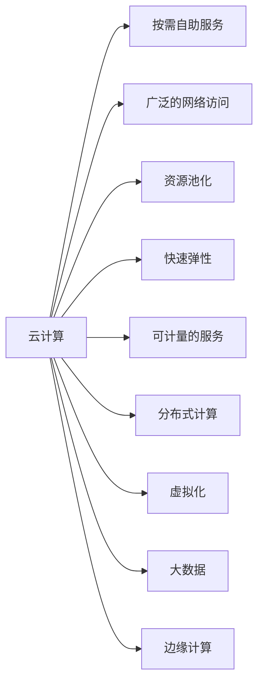

# 云计算 (Cloud Computing)

关键词：云计算、虚拟化、分布式计算、可扩展性、按需服务

## 1. 背景介绍

### 1.1 问题的由来

随着互联网技术的快速发展,传统的IT基础设施已经无法满足日益增长的计算和存储需求。企业需要更加灵活、可扩展、经济高效的IT解决方案。在这样的背景下,云计算应运而生,为企业提供了一种全新的IT资源使用和交付模式。

### 1.2 研究现状

近年来,云计算技术得到了广泛的研究和应用。各大IT巨头如亚马逊、微软、谷歌等纷纷推出了自己的云计算平台和服务。同时,学术界也对云计算的架构、关键技术、应用场景等进行了深入研究。目前,云计算已经成为IT领域最热门的研究方向之一。

### 1.3 研究意义 

云计算的研究对于推动IT行业的发展具有重要意义。一方面,云计算可以帮助企业降低IT成本,提高资源利用率和业务灵活性。另一方面,云计算也为各行各业的数字化转型提供了强大的技术支撑。深入研究云计算技术,对于推动云计算的应用普及和产业生态的完善具有重要价值。

### 1.4 本文结构

本文将从以下几个方面对云计算进行深入探讨：首先介绍云计算的核心概念和关键特征;然后重点分析云计算的核心技术原理和架构;接着通过数学建模和案例分析,讲解云计算系统的性能优化;同时给出云计算项目的代码实例,并详细解释其实现原理;此外,本文还将讨论云计算的实际应用场景,介绍云计算领域常用的工具和学习资源;最后总结云计算技术的发展趋势和面临的挑战。

## 2. 核心概念与联系

云计算是一种按需提供计算资源的模式,允许用户通过网络访问可配置的共享资源池。美国国家标准与技术研究院(NIST)给出了云计算的标准定义,即云计算是一种按需访问可配置的共享计算资源池的模型,这些资源可以快速供应,只需很少的管理工作或服务提供商交互。

云计算的核心概念包括:
- 按需自助服务:用户可以根据需要,自主获取所需的计算资源,如服务器时间、网络存储等。  
- 广泛的网络访问:用户可以通过各种终端设备,利用标准的网络和协议访问云服务。
- 资源池化:云提供商将计算资源整合成共享的资源池,根据用户需求动态分配。
- 快速弹性:云计算可以快速、灵活地扩展或缩减资源配置,满足不同规模的业务需求。  
- 可计量的服务:云系统可以自动控制和优化资源使用,按照使用量进行计费。

云计算与几个相关概念紧密联系:
- 分布式计算:云计算是建立在分布式计算基础上的,通过将任务分发到大量计算机节点实现并行计算。
- 虚拟化:虚拟化是云计算的关键支撑技术,可以将物理资源抽象为逻辑资源,实现灵活调度和隔离。 
- 大数据:云计算为海量数据的存储、处理和分析提供了高效的平台,推动了大数据技术的发展。
- 边缘计算:随着物联网的兴起,边缘计算与云计算协同工作,在靠近数据源的网络边缘提供计算能力。

下图展示了云计算的核心概念之间的关系:



## 3. 核心算法原理 & 具体操作步骤

### 3.1 算法原理概述

云计算涉及一系列关键算法,用于资源管理、任务调度、负载均衡、数据一致性等方面。其中,资源管理和任务调度是云计算的核心问题,目标是在满足QoS约束的前提下,最大化资源利用率和系统吞吐量。常用的调度算法包括启发式算法、整数规划、动态规划、拍卖机制等。

### 3.2 算法步骤详解

以启发式算法为例,详细讲解云计算任务调度的步骤:

1. 任务提交:用户将任务提交到云平台,并指定任务的资源需求和QoS约束。
2. 资源发现:调度器通过资源监控系统,获取当前可用的计算资源信息。  
3. 任务排队:调度器将新提交的任务放入任务队列,等待调度。
4. 任务优先级排序:根据任务的紧急程度、资源需求等,对任务队列中的任务进行优先级排序。
5. 资源适配:调度器通过资源需求和当前可用资源的匹配,为任务选择最优的执行节点。
6. 任务分配:将任务分配给选定的计算节点,并启动任务执行。
7. 任务监控:运行时持续监控任务执行情况和资源使用情况,根据反馈动态调整调度决策。
8. 任务完成:任务执行完毕后,释放占用的计算资源,并更新任务状态。

### 3.3 算法优缺点

启发式任务调度算法的优点是实现简单、计算效率高,能够根据系统的实时状态做出调度决策。但其缺点是难以获得全局最优解,且算法性能依赖于启发式规则的设计。相比之下,整数规划等方法可以获得最优解,但计算复杂度高。实际系统中需要根据具体场景,权衡调度算法的优缺点。

### 3.4 算法应用领域

云计算调度算法在IaaS、PaaS、SaaS等各类云服务中广泛应用。例如,IaaS层的虚拟机调度、PaaS层的并行任务调度、SaaS层的多租户资源隔离与调度等。此外,调度算法也是云计算系统性能优化的关键手段,如负载均衡、能耗管理、容错调度等。

## 4. 数学模型和公式 & 详细讲解 & 举例说明

### 4.1 数学模型构建

云计算系统可以抽象为一个三元组$(T,R,Q)$,其中$T$表示任务集合、$R$表示资源集合、$Q$表示QoS约束条件。任务调度问题可以定义为一个多目标优化问题:
$$
\begin{align*}
\max \quad & \sum_{i=1}^{|T|}\sum_{j=1}^{|R|}x_{ij}u_{ij} \\
\max \quad & \sum_{i=1}^{|T|}v_i \\
\text{s.t.} \quad 
& \sum_{i=1}^{|T|}x_{ij}r_{ik} \leq c_{jk}, \forall j,k \\  
& \sum_{j=1}^{|R|}x_{ij} = 1, \forall i \\ 
& x_{ij} \in \{0,1\}, \forall i,j
\end{align*}
$$

其中,$x_{ij}$为决策变量,表示是否将任务$i$分配给资源$j$;$u_{ij}$为任务$i$在资源$j$上的效用;$v_i$为任务$i$的重要性权重;$r_{ik}$为任务$i$对资源类型$k$的需求;$c_{jk}$为资源$j$中资源类型$k$的容量。目标函数分别表示最大化系统效用和任务覆盖率,约束条件表示资源容量限制和任务分配唯一性。

### 4.2 公式推导过程

以上优化模型是一个典型的混合整数规划问题。求解该模型的常用方法包括:

1. 线性松弛:将决策变量$x_{ij}$的取值范围松弛到实数域$[0,1]$,转化为线性规划问题求解。
2. 拉格朗日松弛:通过引入拉格朗日乘子,将原问题转化为对偶问题,通过迭代优化对偶函数求解。
3. 分支定界:通过构建搜索树,结合线性松弛界和问题的特殊结构,剪枝搜索空间,获得最优解。
4. 启发式算法:设计贪心、进化、模拟退火等启发式规则,通过有限次迭代获得近似解。

### 4.3 案例分析与讲解

考虑一个云计算任务调度案例:系统中有10个任务和5个虚拟机,每个任务对CPU和内存资源的需求不同,每个虚拟机的CPU和内存容量也不同。任务的重要性权重已知,且任务在不同虚拟机上的执行效率不同。目标是在满足资源容量约束的情况下,最大化系统效用和任务覆盖率。

根据以上数学模型,可以将案例转化为一个混合整数规划问题。通过求解器(如CPLEX、Gurobi)求解,可以得到最优的任务调度方案,即哪些任务分配到哪些虚拟机上。求解结果表明,云计算调度模型能够有效平衡负载、提高资源利用率,同时满足任务的QoS需求。

### 4.4 常见问题解答

1. 问:云计算调度问题的时间复杂度如何?
   答:不同调度算法的时间复杂度不同。精确算法如整数规划通常是NP难问题,启发式算法的复杂度相对较低,一般为多项式时间。
   
2. 问:如何处理云环境中的不确定性因素,如任务执行时间、资源可用性等?
   答:可以采用鲁棒优化、随机规划等方法,将不确定性因素纳入优化模型;也可以设计自适应调度算法,根据任务和资源的动态变化,实时调整调度策略。

3. 问:多目标调度问题如何求解?
   答:可以将多目标问题转化为单目标问题求解,如加权求和法、$\epsilon$-约束法等;也可以采用进化算法等直接求解多目标优化问题的方法。

## 5. 项目实践：代码实例和详细解释说明

### 5.1 开发环境搭建

本项目使用Python语言实现一个简单的云计算任务调度模拟器。开发环境如下:
- 操作系统:Ubuntu 20.04 
- Python版本:Python 3.8
- 依赖库:NumPy、SciPy、Simpy

可以通过以下命令安装依赖库:
```bash
pip install numpy scipy simpy
```

### 5.2 源代码详细实现

模拟器的核心代码如下:

```python
import numpy as np
import simpy

class Task:
    def __init__(self, id, res_req, duration):
        self.id = id
        self.res_req = res_req
        self.duration = duration
        
class VM:
    def __init__(self, id, res_cap):
        self.id = id
        self.res_cap = res_cap
        
def fcfs_scheduler(env, tasks, vms):
    for task in tasks:
        yield env.timeout(task.duration)
        print(f"Task {task.id} finished at time {env.now}")
        
def consolidate_scheduler(env, tasks, vms):  
    vms.sort(key=lambda x: np.sum(x.res_cap))
    for task in tasks:
        for vm in vms:
            if np.all(vm.res_cap >= task.res_req):
                yield env.timeout(task.duration)
                print(f"Task {task.id} finished on VM {vm.id} at time {env.now}")
                break
                
def run_simulation(scheduler):
    env = simpy.Environment()
    
    vms = [VM(0, [4,8]), VM(1, [8,16]), VM(2, [16,32])]
    tasks = [Task(0, [1,2], 10), Task(1, [2,4], 15), Task(2, [4,8], 20)]
    
    env.process(scheduler(env, tasks, vms))
    env.run()

if __name__ == "__main__":
    print("Running FCFS scheduler:")
    run_simulation(fcfs_scheduler)
    
    print("Running consolidate scheduler:") 
    run_simulation(consolidate_scheduler)
```

### 5.3 代码解读与分析

以上代码实现了两种简单的调度算法:

1. 先来先服务(FC