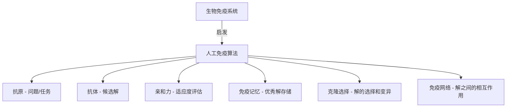
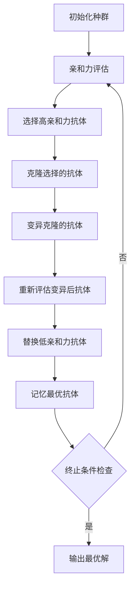

# 人工免疫算法(Artificial Immune Systems) - 原理与代码实例讲解

## 1. 背景介绍

### 1.1 问题的由来

在现代计算机科学领域中,人工智能(AI)已经成为一个备受关注和研究的热门话题。人工智能旨在模拟人类的智能行为,并将其应用于各种复杂的问题领域。然而,传统的人工智能算法往往存在一些局限性,例如缺乏适应性、鲁棒性和自主性。为了克服这些挑战,研究人员开始探索生物启发算法(Bio-inspired Algorithms),其中人工免疫算法(Artificial Immune Systems,AIS)就是一种极具潜力的方法。

人工免疫算法的灵感来源于生物体内的免疫系统,这是一个复杂而精密的保护机制,能够识别和消除入侵的病原体。免疫系统展现出了令人惊叹的特性,如分布式计算、自我组织、自适应性、异常检测和模式识别等。这些特性使得免疫系统成为了一种极具吸引力的计算模型,可以应用于各种优化、分类、检测和安全领域。

### 1.2 研究现状

人工免疫算法的研究可以追溯到20世纪90年代初期,当时一些先驱者开始探索将免疫系统的原理应用于计算机科学领域。自那以后,人工免疫算法已经在多个领域取得了令人瞩目的成就,例如:

- **计算机安全**: 利用人工免疫算法进行入侵检测、病毒检测和网络安全监控。
- **数据挖掘和模式识别**: 使用人工免疫算法进行数据聚类、分类和异常检测。
- **机器学习**: 将人工免疫算法应用于机器学习任务,如特征选择、降维和增强学习。
- **优化问题**: 利用人工免疫算法解决组合优化、路径规划和调度问题。
- **机器人和控制系统**: 使用人工免疫算法实现自适应控制和故障诊断。

尽管取得了这些进展,但人工免疫算法仍然面临着一些挑战,例如算法复杂性、参数调整和计算效率等问题。因此,持续的研究和改进对于充分发挥人工免疫算法的潜力至关重要。

### 1.3 研究意义

人工免疫算法的研究具有重要的理论和实际意义:

1. **理论意义**:
   - 为计算机科学领域提供了一种全新的生物启发计算范式。
   - 深入探索免疫系统的复杂性和自适应性,为发展新的计算模型提供了启发。
   - 促进了不同学科之间的交叉融合,如计算机科学、生物学、数学和工程学等。

2. **实际意义**:
   - 为解决复杂的现实世界问题提供了有效的计算工具。
   - 在计算机安全、数据挖掘、机器学习等领域展现出了广阔的应用前景。
   - 可以设计出具有自适应性、鲁棒性和自主性的智能系统。
   - 为发展新一代智能系统奠定了基础。

### 1.4 本文结构

本文将全面介绍人工免疫算法的原理、数学模型、实现方法和实际应用。文章结构如下:

1. 背景介绍
2. 核心概念与联系
3. 核心算法原理与具体操作步骤
4. 数学模型和公式详细讲解与举例说明
5. 项目实践:代码实例和详细解释说明
6. 实际应用场景
7. 工具和资源推荐
8. 总结:未来发展趋势与挑战
9. 附录:常见问题与解答

## 2. 核心概念与联系

人工免疫算法借鉴了生物免疫系统的多个核心概念,并将其应用于计算机科学领域。以下是一些关键概念及其在算法中的对应关系:

1. **抗原(Antigen)**: 在生物免疫系统中,抗原是指能够刺激免疫反应的外来物质,如病毒或细菌。在人工免疫算法中,抗原通常表示需要解决的问题或任务,例如优化函数、数据样本或安全威胁等。

2. **抗体(Antibody)**: 抗体是免疫系统产生的蛋白质分子,专门识别和中和特定的抗原。在人工免疫算法中,抗体对应于潜在的解决方案或候选解,它们与抗原进行匹配和评估。

3. **亲和力(Affinity)**: 亲和力描述了抗体与抗原之间的结合强度。在算法中,亲和力通常用于衡量候选解与目标问题之间的匹配程度或适应度。

4. **免疫记忆(Immune Memory)**: 免疫系统能够记住以前遇到的病原体,并在再次遇到相同的病原体时快速作出反应。在人工免疫算法中,免疫记忆可以用于存储优秀的解决方案,以便在后续迭代中加快搜索速度。

5. **克隆选择(Clonal Selection)**: 克隆选择是免疫系统的一个关键过程,它允许具有高亲和力的抗体进行扩增和变异,以产生更好的抗体。在算法中,这一过程对应于选择和变异优秀的候选解,以探索更广阔的搜索空间。

6. **免疫网络(Immune Network)**: 免疫网络描述了免疫细胞之间的相互作用和调节机制。在人工免疫算法中,免疫网络可以用于建模候选解之间的相互影响和协作关系。

这些核心概念为人工免疫算法提供了理论基础和启发,并且它们在算法的不同变体中以不同的方式得到了体现和应用。

## 3. 核心算法原理与具体操作步骤

### 3.1 算法原理概述

人工免疫算法的核心原理是模拟生物免疫系统的行为,包括抗体的产生、选择、变异和记忆等过程。算法通常包括以下几个主要步骤:

1. **初始化**: 生成一组初始抗体(候选解)的种群。

2. **亲和力评估**: 计算每个抗体与抗原(问题)之间的亲和力(适应度)。

3. **选择**: 根据亲和力选择具有较高适应度的抗体。

4. **克隆**: 对选择的抗体进行克隆(复制),克隆数量与其亲和力成正比。

5. **变异**: 对克隆的抗体施加一定程度的变异,以增加种群的多样性。

6. **重新评估**: 计算变异后抗体的亲和力,并将其与原始种群合并。

7. **替换**: 根据一定的替换策略,用新的高亲和力抗体替换原始种群中的低亲和力抗体。

8. **记忆**: 将具有最高亲和力的抗体存储在免疫记忆中,以供后续使用。

9. **终止条件检查**: 如果满足终止条件(如达到最大迭代次数或目标适应度),则算法终止;否则返回步骤2,进行下一轮迭代。

该过程反复进行,直到找到满足要求的解或达到终止条件。通过模拟免疫系统的自适应性和多样性,人工免疫算法能够有效地探索复杂的搜索空间,并逐步逼近最优解。

### 3.2 算法步骤详解

下面将详细解释人工免疫算法的每个步骤:

1. **初始化**:
   - 根据问题的特征和约束条件,随机生成一组初始抗体(候选解)的种群。
   - 初始种群的大小和抗体的表示方式需要根据具体问题进行设计和调整。

2. **亲和力评估**:
   - 对于每个抗体(候选解),计算其与抗原(问题)之间的亲和力(适应度)。
   - 亲和力的计算方式取决于问题的目标函数或评估指标。

3. **选择**:
   - 根据抗体的亲和力,选择具有较高适应度的抗体。
   - 常用的选择方法包括锦标赛选择、轮盘赌选择和排名选择等。

4. **克隆**:
   - 对选择的高亲和力抗体进行克隆(复制)操作。
   - 克隆数量通常与抗体的亲和力成正比,亲和力越高,克隆数量越多。

5. **变异**:
   - 对克隆的抗体施加一定程度的变异操作,以增加种群的多样性。
   - 变异的方式可以是随机改变抗体的部分特征或应用特定的变异算子。
   - 变异强度通常与抗体的亲和力成反比,亲和力越高,变异强度越小。

6. **重新评估**:
   - 计算变异后抗体的亲和力。
   - 将变异后的抗体与原始种群合并,形成一个扩展的种群。

7. **替换**:
   - 根据一定的替换策略,用新的高亲和力抗体替换原始种群中的低亲和力抗体。
   - 常用的替换策略包括基于亲和力排名的截断替换和基于概率的替换等。

8. **记忆**:
   - 将具有最高亲和力的抗体存储在免疫记忆中。
   - 免疫记忆可以在后续迭代中加速搜索过程,或用于生成最终解。

9. **终止条件检查**:
   - 检查是否满足终止条件,如达到最大迭代次数或目标适应度。
   - 如果满足终止条件,则算法终止并输出最优解(通常来自免疫记忆)。
   - 否则,返回步骤2,进行下一轮迭代。

通过反复执行这些步骤,人工免疫算法能够逐步优化种群中的抗体(候选解),最终converge到一个或多个满足要求的解。

### 3.3 算法优缺点

人工免疫算法具有以下优点:

1. **自适应性强**: 借鉴了免疫系统的自适应机制,能够有效地应对动态环境和不确定性。

2. **分布式计算**: 算法中的抗体相当于分布式的计算单元,可以并行处理和探索解空间。

3. **鲁棒性好**: 由于种群的多样性和记忆机制,算法对局部最优陷阱的敏感性较低。

4. **异常检测能力**: 利用免疫系统的异常检测原理,可以应用于异常值检测和模式识别任务。

5. **无需梯度信息**: 算法不需要目标函数的梯度信息,因此可以应用于非连续、非线性和非凸优化问题。

然而,人工免疫算法也存在一些缺点和挑战:

1. **参数敏感性**: 算法的性能受到多个参数(如种群大小、变异率等)的影响,参数调整较为困难。

2. **计算复杂度高**: 特别是在高维搜索空间中,算法的计算开销可能会很大。

3. **理论基础薄弱**: 与其他经典算法相比,人工免疫算法的理论基础相对薄弱,缺乏严格的数学分析。

4. **编码困难**: 对于一些复杂问题,如何有效地编码抗体(候选解)可能是一