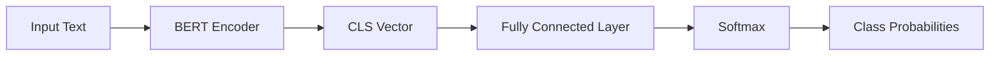

# 从零开始大模型开发与微调：BERT实战文本分类

关键词：BERT, 文本分类, 大模型, 微调, NLP

## 1. 背景介绍
### 1.1  问题的由来
随着互联网的快速发展,海量的文本数据正在以前所未有的速度增长。如何从这些海量的文本数据中快速准确地提取有价值的信息,已经成为自然语言处理(NLP)领域的一个重要课题。文本分类是NLP中的一项基础任务,旨在将文本按照预定义的类别进行自动归类。传统的文本分类方法主要基于词袋模型和浅层神经网络,难以捕捉文本中的语义信息。近年来,以BERT为代表的预训练语言模型的出现,为文本分类任务带来了新的突破。
### 1.2  研究现状
BERT(Bidirectional Encoder Representations from Transformers)是谷歌在2018年提出的一种预训练语言模型,通过在大规模无标注语料上进行双向Transformer编码,可以学习到富含语义信息的通用语言表示。在多个NLP任务上,基于BERT的模型都取得了SOTA的效果。目前,BERT已经成为NLP领域的标配模型,在工业界得到了广泛应用。但是,对于特定领域的文本分类任务,直接使用通用的BERT模型效果往往不够理想,需要在特定领域数据上进行模型微调,以提高分类性能。
### 1.3  研究意义
探索如何利用BERT等大模型进行文本分类,对于提高文本分类的效果具有重要意义。通过在特定领域数据上微调BERT模型,可以充分利用预训练模型学习到的通用语言知识,同时针对特定任务进行优化,从而获得更好的分类效果。本文将详细介绍如何利用BERT进行文本分类,并通过实战案例演示模型微调的完整过程,为相关研究提供参考。
### 1.4  本文结构
本文将从以下几个方面展开:
- 介绍BERT的核心概念与原理
- 阐述基于BERT的文本分类算法步骤
- 推导相关的数学模型与公式
- 给出基于PyTorch的BERT文本分类代码实现
- 讨论BERT在文本分类中的应用场景
- 总结全文并展望未来研究方向

## 2. 核心概念与联系
BERT的核心是基于Transformer的双向语言模型。与传统的CBOW、Skip-Gram等词嵌入模型不同,BERT采用了Transformer的Encoder结构,引入自注意力机制来学习词与词之间的关系。Transformer最初是在机器翻译任务中提出的,通过Self-Attention的方式,可以一次性地计算整个句子中任意两个词之间的关系,克服了RNN/LSTM等模型难以并行、长距离依赖问题等缺陷。

BERT模型的训练分为两个阶段:预训练和微调。在预训练阶段,BERT在大规模无标注语料上进行自监督学习,通过Masked Language Model和Next Sentence Prediction两个任务来学习通用的语言表示。在微调阶段,将预训练好的BERT模型应用到下游的NLP任务中,通过在任务特定的标注数据上进行supervised fine-tuning,可以进一步提升模型性能。

对于文本分类任务,我们可以将整个文本输入到BERT模型中,取[CLS]位置对应的Transformer输出向量作为整个文本的表示,再通过一个全连接层+Softmax得到各个类别的概率分布。通过端到端的supervised fine-tuning,可以使BERT学习到任务相关的知识,从而提高文本分类的效果。

下图展示了基于BERT的文本分类模型的总体架构:

## 3. 核心算法原理 & 具体操作步骤
### 3.1  算法原理概述
BERT的核心是Transformer的Encoder结构,通过多层的Self-Attention和Feed Forward计算,可以学习文本的深层语义表示。对于文本分类任务,我们将文本首尾分别加上[CLS]和[SEP]特殊标记,然后将文本输入BERT模型。取最后一层[CLS]位置的hidden state作为整个文本的表示向量,再通过一个全连接层映射到类别数维度,最后通过Softmax计算各个类别的概率。模型通过最小化交叉熵损失函数来进行端到端的fine-tuning训练。
### 3.2  算法步骤详解
基于BERT的文本分类可以分为以下几个步骤:

(1) 加载预训练的BERT模型

这里我们使用Huggingface的Transformers库加载BERT的PyTorch版本模型,可以方便地在下游任务上进行fine-tuning。

(2) 构建文本分类数据集

将原始文本和标签转化为BERT模型接受的输入格式。对于每个文本,如下构建模型输入:
- input_ids: 将文本转为BERT词表中的token id序列,如[CLS] t1 t2 ... tn [SEP]
- attention_mask: 指示每个token是否为pad token的二值mask序列,pad部分为0,其余为1
- token_type_ids: 指示每个token属于第一个句子还是第二个句子的二值序列,文本分类任务中全为0
- labels: 文本对应的标签,通常是一个整数

(3) 定义文本分类模型

在预训练BERT模型之上添加一个全连接分类层,取[CLS]对应的hidden state经过Dense+Softmax作为文本的类别概率分布。

(4) 定义优化器和损失函数

一般使用AdamW优化器,以一个较小的学习率(如2e-5)对分类层进行训练。损失函数使用交叉熵函数。

(5) 开始训练并验证

将数据分为训练集和验证集,训练时每个epoch结束评估模型在验证集上的性能,保存效果最好的模型权重。

(6) 在测试集上评估

使用在验证集上效果最优的模型权重在测试集上进行推理,计算准确率、F1值等分类指标。

### 3.3  算法优缺点

优点:
- 通过在大规模语料上的预训练,BERT可以学习到语义丰富的通用语言表示
- 利用预训练模型进行迁移学习,可以显著提升下游任务性能,缓解标注数据不足问题
- Transformer结构可以一次性计算长距离依赖,并行计算效率高

缺点:  
- BERT模型参数量巨大(Base版110M,Large版340M),对计算资源要求较高
- 模型微调需要一定的标注数据,样本太少时效果提升有限
- inference阶段计算开销大,不适合对响应速度要求高的在线场景

### 3.4  算法应用领域
基于BERT的文本分类在很多领域都有应用,如:
- 情感分析:判断文本表达的情感是正向还是负向
- 意图识别:判断用户query的意图,如查天气、订机票等  
- 内容分类:如新闻主题分类、论文学科分类等
- 过滤识别:如垃圾评论识别、虚假新闻检测等

## 4. 数学模型和公式 & 详细讲解 & 举例说明
### 4.1  数学模型构建
BERT的核心是基于Transformer的Encoder结构。Transformer的本质是一个Seq2Seq模型,通过Encoder-Decoder结构实现Sequence到Sequence的映射。BERT只使用了Transformer的Encoder部分,通过自注意力机制来学习文本表示。

假设输入文本序列为$\mathbf{x}=(x_1,\ldots,x_n)$,每个$x_i$是一个token(词或子词)。BERT首先将每个token映射为一个embedding向量:

$$\mathbf{e}_i=\mathbf{E}(x_i)+\mathbf{p}_i+\mathbf{s}_i$$

其中$\mathbf{E}$是token embedding矩阵,$\mathbf{p}_i$是position embedding向量,$\mathbf{s}_i$是segment embedding向量。

然后,将embedding序列$\mathbf{e}=(\mathbf{e}_1,\ldots,\mathbf{e}_n)$输入Transformer Encoder的L层Self-Attention和Feed Forward层,得到L层的hidden states序列$\mathbf{h}^l=(\mathbf{h}_1^l,\ldots,\mathbf{h}_n^l),l=1,\ldots,L$。

Self-Attention的计算公式为:

$$\mathbf{Q},\mathbf{K},\mathbf{V}=\mathbf{h}_{l-1}\mathbf{W}_q,\mathbf{h}_{l-1}\mathbf{W}_k,\mathbf{h}_{l-1}\mathbf{W}_v$$

$$\alpha_{ij}=\frac{\exp(\mathbf{Q}_i\mathbf{K}_j^T/\sqrt{d})}{\sum_k\exp(\mathbf{Q}_i\mathbf{K}_k^T/\sqrt{d})}$$

$$\mathbf{head}_i=\sum_j\alpha_{ij}\mathbf{V}_j$$

$$\mathbf{a}=\mathrm{Concat}(\mathbf{head}_1,\ldots,\mathbf{head}_h)\mathbf{W}_o$$

其中$\mathbf{Q},\mathbf{K},\mathbf{V}$分别是query,key,value矩阵,$\mathbf{W}_q,\mathbf{W}_k,\mathbf{W}_v,\mathbf{W}_o$是可学习的参数矩阵,$d$是每个head的维度,$h$是head的数量。

Feed Forward层的计算为:

$$\mathbf{f}=\mathrm{ReLU}(\mathbf{a}\mathbf{W}_1+\mathbf{b}_1)\mathbf{W}_2+\mathbf{b}_2$$

最终,取最后一层的[CLS]位置hidden state $\mathbf{h}_{cls}^L$作为整个文本的表示向量,经过一个全连接层和Softmax计算各个类别的概率:

$$\mathbf{p}=\mathrm{Softmax}(\mathbf{h}_{cls}^L\mathbf{W}_{cls}+\mathbf{b}_{cls})$$

模型通过最小化交叉熵损失函数进行训练:

$$\mathcal{L}=-\sum_{i=1}^N\sum_{j=1}^Cy_{ij}\log p_{ij}$$

其中$N$是样本数量,$C$是类别数量,$y_{ij}$是第$i$个样本属于第$j$类的真实标签,$p_{ij}$是模型预测的概率。

### 4.2  公式推导过程
(1) Self-Attention公式推导

Query,Key,Value矩阵的计算:
$$\mathbf{Q}=\mathbf{h}_{l-1}\mathbf{W}_q\in\mathbb{R}^{n\times d_k}, \mathbf{K}=\mathbf{h}_{l-1}\mathbf{W}_k\in\mathbb{R}^{n\times d_k},\mathbf{V}=\mathbf{h}_{l-1}\mathbf{W}_v\in\mathbb{R}^{n\times d_v}$$

其中$\mathbf{W}_q\in\mathbb{R}^{d\times d_k},\mathbf{W}_k\in\mathbb{R}^{d\times d_k},\mathbf{W}_v\in\mathbb{R}^{d\times d_v}$是可学习的参数矩阵。

Scaled Dot-Product Attention的计算:
$$\alpha_{ij}=\frac{\exp(\mathbf{Q}_i\mathbf{K}_j^T/\sqrt{d_k})}{\sum_{k=1}^n\exp(\mathbf{Q}_i\mathbf{K}_k^T/\sqrt{d_k})},\quad \mathbf{head}_i=\sum_{j=1}^n\alpha_{ij}\mathbf{V}_j$$

其中$\alpha_{ij}$表示第$i$个query对第$j$个key的注意力权重,$\mathbf{head}_i$表示第$i$个query的attention输出。

Multi-Head Attention的计算:
$$\mathbf{a}=\mathrm{Concat}(\mathbf{head}_1,\ldots,\mathbf{head}_h)\mathbf{W}_o$$

其中$\mathbf{W}_o\in\mathbb{R}^{hd_v\times d}$是可学习的参数矩阵。

(2) Feed Forward公式推导

$$\mathbf{f}=\mathrm{ReLU}(\mathbf{a}\mathbf{W}_1+\mathbf{b}_1)\mathbf{W}_2+\mathbf{b}_2$$

其中$\mathbf{W}_1\in\mathbb{R}