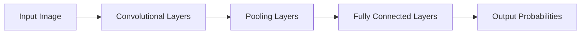

# 从零开始大模型开发与微调：实战基于PyTorch 2.0的手写体识别模型

关键词：大模型、微调、手写体识别、PyTorch 2.0、深度学习、计算机视觉

## 1. 背景介绍
### 1.1  问题的由来
随着人工智能技术的飞速发展，计算机视觉领域取得了令人瞩目的成就。其中，手写体识别一直是计算机视觉中的一个重要研究方向。手写体识别在实际生活中有着广泛的应用，如邮政编码识别、银行支票识别、历史文献数字化等。然而，由于手写体的多样性和复杂性，实现高精度的手写体识别仍然面临着诸多挑战。

### 1.2  研究现状
近年来，深度学习技术的兴起为手写体识别带来了新的突破。基于卷积神经网络（CNN）的手写体识别模型取得了优异的性能，成为了主流的解决方案。然而，传统的CNN模型在处理大规模手写体数据集时，仍然存在训练时间长、模型泛化能力不足等问题。

最近，大模型（Large-scale Models）和微调（Fine-tuning）技术的出现，为解决这些问题提供了新的思路。大模型通过在海量数据上进行预训练，学习到了丰富的特征表示，具有强大的迁移学习能力。通过在特定任务上微调预训练的大模型，可以显著提升模型的性能，同时大大减少训练时间和计算资源的消耗。

### 1.3  研究意义
本文旨在探索如何利用大模型和微调技术，构建高效、高精度的手写体识别模型。我们将基于PyTorch 2.0框架，从零开始搭建一个手写体识别模型，并通过微调预训练的大模型来提升模型性能。通过详细介绍模型的构建过程、数学原理和实践经验，为读者提供一个全面、系统的学习指南。

本文的研究意义在于：
1. 展示如何利用大模型和微调技术，快速构建高性能的手写体识别模型。
2. 提供详细的模型构建步骤和代码实现，帮助读者掌握手写体识别模型的开发流程。
3. 深入分析模型的数学原理和优化技巧，加深读者对深度学习算法的理解。
4. 探讨手写体识别模型的实际应用场景和未来发展趋势，为相关研究提供参考和启发。

### 1.4  本文结构
本文将按照以下结构展开：

第二部分介绍手写体识别中的核心概念和它们之间的联系。

第三部分详细阐述手写体识别模型的核心算法原理和具体操作步骤。

第四部分建立手写体识别模型的数学模型，推导相关公式，并通过案例进行详细讲解。

第五部分展示基于PyTorch 2.0框架实现手写体识别模型的完整代码，并对关键代码进行解读。

第六部分讨论手写体识别模型的实际应用场景和未来应用前景。

第七部分推荐手写体识别领域的学习资源、开发工具和相关论文。

第八部分总结全文的研究成果，展望手写体识别技术的未来发展趋势和面临的挑战。

第九部分附录中列出了常见问题与解答，以帮助读者更好地理解和应用手写体识别模型。

## 2. 核心概念与联系

在手写体识别领域，有几个核心概念需要了解和掌握：

1. 手写体识别（Handwritten Character Recognition）：指利用计算机自动识别手写字符的技术。手写体识别可以分为在线识别和离线识别两种模式。在线识别是指实时识别书写过程中的笔迹，而离线识别则是对已经写好的手写图像进行识别。

2. 卷积神经网络（Convolutional Neural Network, CNN）：一种广泛应用于图像识别任务的深度学习模型。CNN通过卷积层和池化层提取图像的局部特征，并通过全连接层进行分类预测。CNN在手写体识别中取得了优异的性能。

3. 大模型（Large-scale Models）：指在海量数据上预训练得到的大规模深度学习模型。大模型通过学习数据中的通用特征表示，具有强大的迁移学习能力。常见的大模型包括BERT、GPT等。

4. 微调（Fine-tuning）：指在预训练的大模型基础上，针对特定任务进行进一步训练和调整的过程。微调可以显著提升模型在目标任务上的性能，同时大大减少训练时间和计算资源的消耗。

5. 迁移学习（Transfer Learning）：指将在一个任务上学习到的知识迁移到另一个相关任务上，以提高模型的性能和泛化能力。大模型和微调技术就是迁移学习的典型应用。

6. PyTorch：一个开源的深度学习框架，提供了灵活、高效的工具和库，用于构建和训练深度学习模型。PyTorch 2.0是PyTorch的最新版本，引入了许多新特性和性能优化。

这些核心概念之间存在着紧密的联系。手写体识别是一个具体的应用场景，而CNN是实现手写体识别的主要模型架构。大模型和微调技术则为手写体识别提供了新的解决方案，通过迁移学习的方式，显著提升了模型的性能和效率。PyTorch则是构建和训练手写体识别模型的重要工具和平台。

理解这些核心概念及其联系，对于开发高性能的手写体识别模型至关重要。下面，我们将详细介绍如何利用这些技术，从零开始构建一个基于PyTorch 2.0的手写体识别模型。

## 3. 核心算法原理 & 具体操作步骤
### 3.1  算法原理概述
手写体识别模型的核心算法是卷积神经网络（CNN）。CNN通过卷积层和池化层提取图像的局部特征，并通过全连接层进行分类预测。下图展示了一个典型的CNN模型架构：

1. 输入层（Input Layer）：将手写体图像输入到模型中。
2. 卷积层（Convolutional Layers）：通过卷积操作提取图像的局部特征。卷积层由多个卷积核组成，每个卷积核学习不同的特征模式。
3. 池化层（Pooling Layers）：对卷积层的输出进行下采样，减小特征图的尺寸，同时保留重要的特征信息。常用的池化操作包括最大池化（Max Pooling）和平均池化（Average Pooling）。
4. 全连接层（Fully Connected Layers）：将提取到的特征展平，并通过全连接的神经网络进行分类预测。
5. 输出层（Output Layer）：输出每个类别的概率分布，表示图像属于各个类别的可能性。

在手写体识别任务中，我们可以利用预训练的大模型作为特征提取器，将手写体图像输入到大模型中，提取出高级别的特征表示。然后，我们在这些特征的基础上，添加一些任务特定的层（如全连接层），并通过微调的方式训练整个模型，以适应手写体识别任务。

### 3.2  算法步骤详解
下面详细介绍手写体识别模型的构建和训练步骤：

1. 数据准备：
   - 收集和标注手写体数据集，如MNIST、EMNIST等。
   - 对数据进行预处理，如尺寸归一化、数据增强等。
   - 将数据集划分为训练集、验证集和测试集。

2. 模型构建：
   - 选择合适的预训练大模型作为特征提取器，如ResNet、EfficientNet等。
   - 在预训练模型的基础上，添加任务特定的层，如全连接层、分类器等。
   - 定义损失函数和优化器，用于模型训练。

3. 模型训练：
   - 加载预训练的大模型权重，并冻结其参数。
   - 使用训练集数据对模型进行微调，更新任务特定层的参数。
   - 在训练过程中，监控模型在验证集上的性能，以防止过拟合。
   - 根据需要调整学习率、批次大小等超参数，以优化模型性能。

4. 模型评估：
   - 在测试集上评估模型的性能，计算准确率、精确率、召回率等指标。
   - 分析模型的错误样本，识别可能的改进方向。

5. 模型部署：
   - 将训练好的模型保存为可部署的格式，如ONNX、TorchScript等。
   - 将模型集成到实际应用系统中，如移动应用、Web服务等。
   - 持续监控模型在实际场景中的性能，并根据需要进行更新和优化。

### 3.3  算法优缺点
基于大模型和微调的手写体识别算法具有以下优点：

1. 高性能：通过利用预训练大模型学习到的丰富特征表示，可以显著提升手写体识别的准确率。
2. 高效率：通过微调预训练模型，可以大大减少训练时间和计算资源的消耗，实现快速开发和迭代。
3. 可迁移性：预训练的大模型具有强大的迁移学习能力，可以轻松适应不同的手写体数据集和任务。

然而，该算法也存在一些局限性：

1. 依赖大规模数据：预训练大模型需要海量的数据支持，对数据的质量和数量有较高要求。
2. 计算资源消耗：尽管微调可以减少训练时间，但在推理阶段，大模型仍然需要较大的计算资源，对部署环境有一定要求。
3. 模型可解释性：大模型通常是黑盒模型，其内部决策过程难以解释，可能影响模型的可信度和可调试性。

### 3.4  算法应用领域
手写体识别算法在多个领域有广泛的应用，包括：

1. 邮政编码识别：自动识别信封上手写的邮政编码，提高邮件分拣效率。
2. 银行支票识别：自动识别支票上手写的金额和签名，简化支票处理流程。
3. 历史文献数字化：将手写的历史文献转换为数字化文本，方便存储、检索和分析。
4. 笔迹鉴定：通过分析手写体的特征，进行笔迹鉴定和身份验证。
5. 手写输入法：实现手写字符的实时识别，提供更自然的输入方式。

随着手写体识别技术的不断发展，其应用领域也将不断扩展，为各行各业带来更多便利和创新。

## 4. 数学模型和公式 & 详细讲解 & 举例说明
### 4.1  数学模型构建
手写体识别模型的核心是卷积神经网络（CNN）。CNN通过卷积操作和池化操作提取图像的局部特征，并通过全连接层进行分类预测。下面我们详细介绍CNN的数学模型。

1. 卷积层（Convolutional Layer）：
   卷积层通过卷积操作提取图像的局部特征。给定输入特征图 $X$ 和卷积核 $W$，卷积操作可以表示为：

   $$ Y[i, j] = \sum_{m}\sum_{n} X[i+m, j+n] \cdot W[m, n] $$

   其中，$Y$ 表示输出特征图，$i$ 和 $j$ 表示输出特征图上的位置索引，$m$ 和 $n$ 表示卷积核的大小。

2. 激活函数（Activation Function）：
   激活函数在卷积层之后应用，引入非线性变换，提高模型的表达能力。常用的激活函数包括ReLU、Sigmoid、Tanh等。以ReLU为例，其数学表达式为：

   $$ f(x) = max(0, x) $$

   ReLU函数将负值输入映射为0，正值输入保持不变。

3. 池化层（Pooling Layer）：
   池化层对卷积层的输出进行下采样，减小特征图的尺寸，同时保留重要的特征信息。常用的池化操作包括最大池化和平均池化。以最大池化为例，其数