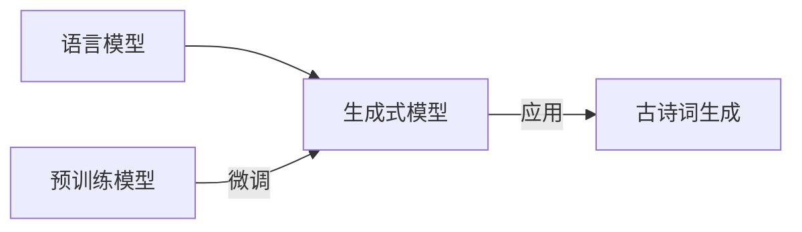

# 从零开始大模型开发与微调：生成式模型实战：古诗词的生成

关键词：大模型、生成式模型、模型微调、古诗词生成、自然语言处理

## 1. 背景介绍

### 1.1 问题的由来

随着人工智能技术的飞速发展,自然语言处理(NLP)领域取得了令人瞩目的成就。其中,大模型的出现为NLP任务带来了新的突破。大模型通过在海量数据上进行预训练,可以学习到丰富的语言知识和生成能力。而生成式模型作为一种重要的NLP模型,在文本生成、对话系统、机器翻译等任务中发挥着关键作用。

近年来,中文古诗词生成受到了广泛关注。传统的古诗词创作需要深厚的文学功底和灵感,而利用AI技术实现古诗词自动生成,不仅可以降低创作门槛,还能探索计算机在艺术创作领域的应用。如何利用大模型和生成式模型,实现高质量的古诗词生成,成为了一个值得研究的课题。

### 1.2 研究现状

目前,国内外学者已经在古诗词生成领域开展了一系列研究。早期的工作主要基于模板和规则方法,通过定义韵律、平仄等规则来生成古诗词。随着深度学习的发展,研究者开始尝试利用循环神经网络(RNN)、长短期记忆网络(LSTM)等模型进行古诗词生成。这些模型可以学习古诗词的语言模式和风格特征,生成形式和内容兼具的作品。

近年来,预训练语言模型如BERT、GPT等的出现,为古诗词生成带来了新的契机。这些大模型在海量文本数据上进行预训练,学习到了丰富的语言知识。通过在特定任务上微调预训练模型,可以显著提升古诗词生成的质量。一些研究者还探索了结合知识图谱、情感分析等技术,来增强生成诗词的主题相关性和情感表达能力。

### 1.3 研究意义

研究古诗词生成具有重要的理论和实践意义:

1. 推动NLP技术在文学创作领域的应用,拓展AI在艺术领域的边界。
2. 降低古诗词创作门槛,为更多人提供体验传统文化魅力的机会。  
3. 丰富文学创作形式,激发人们对传统文化的兴趣和热情。
4. 为诗词教学、文化传承提供新的思路和工具。
5. 探索计算机在创意性任务中的潜力,推动人机协作的发展。

### 1.4 本文结构

本文将从以下几个方面展开论述:

1. 介绍古诗词生成中的核心概念与联系。
2. 阐述生成式模型的核心算法原理和具体操作步骤。
3. 建立古诗词生成的数学模型,并给出详细的公式推导和案例分析。
4. 提供基于预训练模型的古诗词生成代码实现,并解释关键部分。
5. 探讨古诗词生成技术的实际应用场景。
6. 推荐相关的学习资源、开发工具和研究文献。
7. 总结古诗词生成领域的研究成果、发展趋势与面临的挑战。
8. 提供常见问题解答,帮助读者加深理解。

## 2. 核心概念与联系

在古诗词生成中,涉及到以下几个核心概念:

- **语言模型**:用于刻画自然语言中词语序列概率分布的模型。它可以根据前面的词语预测下一个词出现的概率。语言模型是实现古诗词生成的基础。

- **生成式模型**:一类可以生成与训练数据相似样本的模型。生成式模型通过学习数据的概率分布,然后从这个分布中采样生成新的样本。常见的生成式模型有VAE、GAN、GPT等。

- **预训练模型**:在大规模无标注数据上进行预训练,学习通用语言知识的模型。预训练模型可以在下游任务上进行微调,显著提升任务性能。代表性的预训练模型有BERT、GPT、XLNet等。

- **微调**:在预训练模型的基础上,使用任务特定的数据对模型进行进一步训练,使其适应特定任务的过程。微调可以显著提升预训练模型在特定任务上的表现。

- **古诗词**:中国古代诗歌和词的总称。古诗词讲究格律、韵律、对仗等,是中华文化的瑰宝。代表作有李白的《静夜思》、苏轼的《水调歌头》等。

下图展示了这些概念之间的关系:

语言模型是生成式模型的基础,生成式模型可以通过在预训练模型上微调来实现。微调后的生成式模型可以应用于古诗词生成任务,生成优美的诗词。

## 3. 核心算法原理 & 具体操作步骤

### 3.1 算法原理概述

生成式模型的核心思想是学习数据的概率分布,然后从这个分布中采样生成新的样本。在古诗词生成中,我们可以使用基于Transformer架构的语言模型,如GPT系列模型。这些模型通过自注意力机制捕捉词语之间的长距离依赖关系,并使用深度神经网络学习复杂的语言模式。

具体来说,GPT模型的生成过程如下:

1. 将输入序列编码为词嵌入向量。
2. 通过多层Transformer编码器对词嵌入进行编码,捕捉词语之间的上下文信息。
3. 在每个位置上,通过线性变换和softmax函数计算下一个词的概率分布。
4. 根据概率分布采样或选择概率最大的词作为生成的下一个词。
5. 将生成的词加入到输入序列中,重复步骤2-4,直到达到预设的生成长度或遇到终止符。

通过这种自回归的生成方式,GPT模型可以生成流畅、连贯的文本序列。

### 3.2 算法步骤详解

下面我们详细介绍使用预训练的GPT模型进行古诗词生成的步骤:

1. **数据准备**:收集大量的古诗词数据,并进行清洗、分词等预处理操作。将古诗词转换为模型可以接受的格式,如token序列。

2. **模型选择与加载**:选择合适的预训练GPT模型,如GPT-2、GPT-3等。加载预训练的模型权重和配置文件。

3. **模型微调**:使用准备好的古诗词数据对预训练模型进行微调。通过设置适当的学习率、训练轮数等超参数,使模型适应古诗词的语言风格和特点。

4. **生成古诗词**:使用微调后的模型进行古诗词生成。可以通过以下方式控制生成的结果:
   - 设置生成的最大长度,控制诗词的字数。
   - 设置生成的起始词或主题词,引导诗词的主题和意境。
   - 调节生成过程中的采样策略,如贪婪搜索、束搜索等,平衡生成的流畅性和多样性。
   - 引入额外的约束条件,如平仄、押韵等,使生成的诗词更符合格律要求。

5. **结果评估与优化**:对生成的古诗词进行评估,可以从格律、语义、创意等角度进行评判。根据评估结果,可以进一步优化模型、调整生成策略,以提高生成质量。

### 3.3 算法优缺点

使用预训练的GPT模型进行古诗词生成有以下优点:

1. 利用大规模预训练数据,学习到丰富的语言知识和生成能力。
2. 通过微调,可以快速适应古诗词的语言风格和特点。
3. 生成的诗词流畅、连贯,有一定的创意和意境。
4. 可以通过调节生成策略,控制生成结果的多样性和特点。

同时,该算法也存在一些局限性:

1. 生成的诗词可能存在语义不连贯、主题偏离等问题。
2. 对于复杂的格律要求,如平仄、对仗等,生成的诗词可能不够精准。
3. 生成的诗词可能缺乏深层次的意境和情感表达。
4. 需要大量的计算资源和训练时间,对硬件要求较高。

### 3.4 算法应用领域

古诗词生成算法可以应用于以下领域:

1. 文学创作:辅助诗人、作家进行创作灵感的生成和激发。
2. 教育教学:用于诗词学习、赏析、创作等教学活动,提高学生的文学素养。
3. 文化传播:生成优美的古诗词,促进传统文化的传播和普及。
4. 娱乐应用:开发诗词生成小游戏、微信小程序等,增加用户互动性和趣味性。
5. 人机交互:将古诗词生成功能集成到智能对话系统中,提供更加人性化的交互体验。

## 4. 数学模型和公式 & 详细讲解 & 举例说明

### 4.1 数学模型构建

我们以GPT模型为例,介绍古诗词生成的数学模型。GPT模型基于Transformer架构,使用自注意力机制和前馈神经网络对输入序列进行编码和生成。

给定一个古诗词序列 $x=(x_1,x_2,...,x_T)$,其中 $x_i$ 表示第 $i$ 个字,GPT模型的目标是最大化序列的概率:

$$P(x)=\prod_{t=1}^T P(x_t|x_1,x_2,...,x_{t-1})$$

其中, $P(x_t|x_1,x_2,...,x_{t-1})$ 表示在给定前 $t-1$ 个字的情况下,生成第 $t$ 个字 $x_t$ 的条件概率。

GPT模型通过以下步骤计算这个条件概率:

1. 将输入序列 $x$ 转换为词嵌入向量 $E=(e_1,e_2,...,e_T)$。

2. 通过 $L$ 层Transformer编码器对词嵌入进行编码:

$$H^0=E$$
$$H^l=\text{Transformer}(H^{l-1}), l=1,2,...,L$$

其中, $H^l=(h_1^l,h_2^l,...,h_T^l)$ 表示第 $l$ 层Transformer编码器的输出。

3. 在每个位置 $t$,通过线性变换和softmax函数计算下一个字的概率分布:

$$P(x_t|x_1,x_2,...,x_{t-1})=\text{softmax}(W_o h_t^L+b_o)$$

其中, $W_o$ 和 $b_o$ 是可学习的参数矩阵和偏置向量。

### 4.2 公式推导过程

下面我们详细推导GPT模型中的关键公式。

1. **自注意力机制**

在Transformer编码器中,自注意力机制用于捕捉词语之间的依赖关系。对于第 $l$ 层编码器的输入 $H^{l-1}$,自注意力机制的计算过程如下:

$$Q=H^{l-1}W_q, K=H^{l-1}W_k, V=H^{l-1}W_v$$
$$\text{Attention}(Q,K,V)=\text{softmax}(\frac{QK^T}{\sqrt{d_k}})V$$

其中, $W_q, W_k, W_v$ 是可学习的参数矩阵, $d_k$ 是查询向量和键向量的维度。

2. **前馈神经网络**

在自注意力机制之后,Transformer编码器使用前馈神经网络对特征进行非线性变换:

$$\text{FFN}(x)=\max(0, xW_1+b_1)W_2+b_2$$

其中, $W_1, b_1, W_2, b_2$ 是可学习的参数矩阵和偏置向量。

3. **残差连接和层归一化**

为了促进训练的收敛和稳定性,Transformer编码器在自注意力机制和前馈神经网络之后使用残