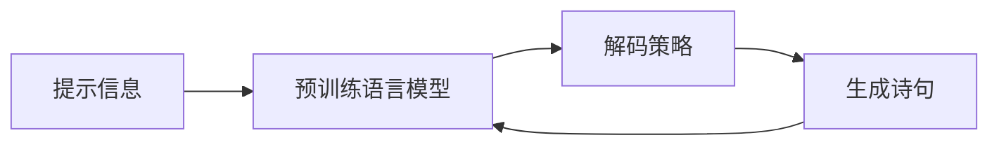

# 从零开始大模型开发与微调：生成式模型实战：古诗词的生成

作者：禅与计算机程序设计艺术 / Zen and the Art of Computer Programming

## 1. 背景介绍

### 1.1 问题的由来

近年来，随着深度学习技术的飞速发展，自然语言处理(NLP)领域取得了巨大进步。特别是随着Transformer模型的提出和发展，大规模预训练语言模型(PLM)如GPT、BERT等相继问世，在多个NLP任务上取得了SOTA成绩，展现了强大的语言理解和生成能力。

其中，生成式语言模型以其强大的文本生成能力而备受关注。这类模型能够根据给定的上下文或提示，自动生成连贯、流畅、富有创意的文本内容，在机器写作、对话生成、知识问答等领域有广泛应用前景。而古诗词作为中华文化的瑰宝，以其精炼的语言、优美的意境、丰富的情感而著称。利用生成式语言模型来自动创作古诗词，不仅是一个极具挑战性和创新性的任务，更有助于传承和弘扬中华优秀传统文化。

### 1.2 研究现状

目前，利用深度学习技术进行古诗词自动生成的研究已有一些进展。主要可分为基于规则的方法和基于端到端神经网络的方法两大类。

基于规则的方法通过总结古诗创作的格律、对仗、平仄等规则，利用启发式搜索、进化算法等方法来生成符合规则的古诗。代表工作如Zhou等人提出的宋词生成系统，通过将格律规则转化为约束条件，利用模拟退火算法进行宋词生成。这类方法生成的古诗能较好地遵循格律，但灵活性和创造性不足。  

基于端到端神经网络的方法利用大规模古诗词数据训练序列到序列(seq2seq)模型或语言模型，实现端到端的古诗词生成。如Zhang等人利用基于注意力机制的seq2seq模型，实现了给定诗题、诗句、意境的藏头诗生成。Yi等人则利用预训练语言模型BERT进行宋词生成，取得了不错的创作质量。这类方法能生成语义连贯、创意十足的古诗，但在格律、对仗等方面还有待加强。

### 1.3 研究意义

利用生成式大模型进行古诗词自动创作，具有重要的理论和实践意义：

1. 探索利用人工智能技术传承和创新传统文化的新途径，为中华优秀传统文化的数字化、智能化注入新动力。

2. 推动自然语言生成技术在文学创作领域的应用，拓展人工智能在人文艺术领域的边界。

3. 为诗词爱好者提供辅助创作工具，激发更多人对古诗词的兴趣，让传统诗词焕发新的生命力。

4. 丰富人机交互和智能创意生成的应用场景，为构建更加智能、人性化的人工智能系统提供思路。

### 1.4 本文结构

本文将围绕利用生成式大模型进行古诗词自动创作这一主题，分别从以下几个方面展开论述：

- 介绍相关的核心概念，包括生成式预训练语言模型、微调、诗词格律等。 

- 详细阐述基于生成式预训练语言模型的古诗词生成算法原理，包括模型结构、训练方法、解码策略等。

- 构建古诗词生成的数学模型，推导相关公式，并结合案例进行分析讲解。

- 基于开源的中文预训练语言模型如CPM、GLM等，搭建古诗词生成项目，给出详细的代码实现、运行结果展示和分析。  

- 讨论该方法在教育、文化传播、创意生成等领域的实际应用场景和未来应用前景。

- 总结全文的研究成果，展望未来的发展趋势和面临的挑战，并对进一步的研究方向提出展望。

## 2. 核心概念与联系

在利用生成式大模型进行古诗词自动创作的研究中，有几个核心概念需要理解：

- **生成式预训练语言模型**：如GPT、BART、T5等，通过在大规模无标注文本语料上进行自监督预训练，学习到强大的语言理解和生成能力，可用于文本续写、摘要、对话、问答等任务。古诗词生成可看作一种特殊的文本续写任务。

- **微调(Fine-tuning)**：将预训练好的语言模型在下游任务的标注数据集上进一步训练，使其适应特定任务。古诗词生成需要在古诗词语料上对预训练模型进行微调，学习古诗词的风格特征和创作规律。

- **诗词格律**：即诗词创作需要遵循的一系列规则，如平仄、押韵、对仗等。将格律要求引入古诗词生成模型的训练过程，可提升生成诗词的格律合规性。

- **文本生成策略**：包括beam search、top-k sampling、nucleus sampling等，用于从语言模型的输出概率分布中采样生成下一个词。选择合适的解码策略对提升生成诗词的质量至关重要。

- **评价指标**：如BLEU、ROUGE、METEOR等，用于评估生成文本与参考文本之间的相似度。由于古诗词生成属于开放式生成任务，缺乏客观的评价指标，需要结合人工评判。  

这些概念之间紧密联系、相互配合，共同构成了利用生成式大模型进行古诗词创作的技术框架。预训练模型提供语言生成的基础能力，微调使其适应古诗词语料的特点，诗词格律进一步约束生成结果，解码策略决定生成过程，评价指标用于评估生成质量。

理解这些概念之间的联系，有助于更好地把握古诗词生成的核心技术路线，设计出高质量的生成方案。下面将详细阐述基于生成式预训练语言模型的古诗词生成算法原理。

## 3. 核心算法原理 & 具体操作步骤

### 3.1 算法原理概述

基于生成式预训练语言模型的古诗词生成，其核心是将古诗词创作建模为一个文本续写任务。即给定若干诗句作为提示信息(prompt)，由语言模型自回归地生成后续诗句，直至生成完整的诗篇。其基本原理可用下图表示：

具体来说，主要涉及以下几个关键技术点：

1. **模型结构**：一般采用Transformer的Decoder结构，如GPT系列模型。模型的输入为已生成的诗句，输出为下一个字的概率分布。模型参数在预训练阶段学习语言建模能力，在微调阶段适应古诗词语料的风格特点。

2. **训练方法**：分为预训练和微调两个阶段。预训练阶段在大规模通用语料上，以自回归的方式最大化语言模型的似然概率。微调阶段在古诗词语料上，以teacher forcing的方式最小化交叉熵损失，同时可加入格律相关的损失项，引导模型学习格律知识。  

3. **解码策略**：采用top-k sampling、nucleus sampling等基于采样的方法，从输出概率分布中采样生成下一个字。相比贪心搜索和beam search，采样策略能生成更加多样化和创新性的结果。同时可引入一些启发式规则，如押韵、平仄等，辅助解码过程。

4. **格律建模**：将平仄、押韵、对仗等格律要求融入模型训练和推理的各个环节。如在数据预处理时加入平仄标注，在模型训练时加入平仄相关的损失项，在解码时引入平仄相关的约束条件等。

### 3.2 算法步骤详解

下面以利用GPT模型进行绝句(五言或七言)生成为例，详细说明算法的实现步骤。

**Step 1: 数据准备**

- 收集大量绝句数据，如全唐诗、全宋诗等。每首诗包含标题、作者、诗句等信息。  

- 对诗句进行分词、平仄标注。可利用规则或基于统计的方法实现。

- 将诗句通过特殊符号连接成一个长序列。如 "题目：登鹳雀楼 作者：王之涣 白日依山尽，
黄河入海流。
欲穷千里目，
更上一层楼。<sep>"

**Step 2: 模型微调**

- 在通用中文语料上预训练好的GPT模型基础上，使用准备好的古诗词数据进行微调。

- 构造训练样本，将每首诗的token序列作为输入，同时将其向右移动一位作为目标输出。

- 微调时，损失函数包含两部分：a. 语言模型的交叉熵损失；b. 平仄模式的交叉熵损失，即预测每个字的平仄类别。两部分损失加权求和作为总的优化目标。

- 微调若干轮次，直至损失函数收敛。得到微调后的古诗词生成模型。

**Step 3: 诗句生成**

- 给定若干诗句(或关键词)作为提示信息(prompt)，输入到模型中。

- 设置解码参数，如top-k、top-p值、生成长度等。

- 自回归地生成诗句。每次根据已生成的序列，预测下一个字，从输出概率分布中根据top-k或top-p sampling策略采样得到。同时考虑平仄、押韵规则，对采样概率进行调整。

- 重复生成过程，直至生成完整的绝句。

- 对生成的诗句进行后处理，如过滤、排序、修饰，提升诗句的可读性和美感。

**Step 4: 结果评价**

- 采用BLEU、ROUGE等指标，评估生成诗句与原诗句的n-gram覆盖度。 

- 从语义连贯性、主题相关性、格律合规性、创新性等维度，由人工对生成诗句进行定性评判。

- 收集用户反馈，动态优化模型和生成策略。

### 3.3 算法优缺点

基于生成式预训练语言模型的古诗词生成算法，具有以下优点：

- 端到端的生成方式，无需人工定义规则，只需准备好数据，即可训练出诗词生成模型。

- 预训练模型提供了强大的语言理解和生成能力，生成的诗句在流畅度、连贯性上有保障。  

- 引入格律相关的信息，可在一定程度上控制生成诗句的格律合规性。

- 采样策略使得生成结果更加灵活多样，体现创造性。

同时也存在一些局限性：

- 生成质量很大程度上依赖预训练模型的性能，需要在大规模高质量语料上进行预训练，成本较高。

- 生成结果的可控性有限，难以针对性地生成主题、情感等特定风格的诗句。

- 对于一些复杂的诗词体裁，如词牌、曲等，仅凭格律规则难以完全约束。

- 评价方法有待进一步丰富，难以全面衡量生成诗句的整体质量。

### 3.4 算法应用领域

基于生成式预训练语言模型的古诗词生成算法，可应用于以下几个领域：

- **辅助创作**：为诗词爱好者提供灵感和素材，激发创作灵感，降低创作门槛。

- **教育娱乐**：开发诗词学习和游戏应用，寓教于乐，提升用户的诗词素养和兴趣。

- **文化传播**：将古诗词与现代科技结合，创新传播方式，拉近古诗词与大众的距离。 

- **智能写作**：集成到智能写作助手中，提供诗词创作功能，丰富文学创作形式。

- **人机交互**：用于构建诗词对话系统，实现人机诗词唱和、问答等交互场景。

## 4. 数学模型和公式 & 详细讲解 & 举例说明