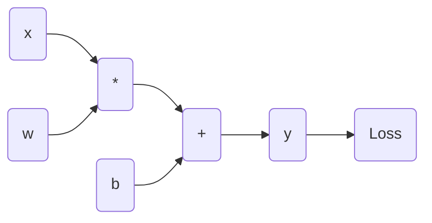

# 从零开始大模型开发与微调：神经网络框架的抽象实现

## 1. 背景介绍

### 1.1 问题的由来

随着深度学习在各领域的广泛应用,大型神经网络模型的需求与日俱增。然而,训练和部署这些大型模型通常需要大量的计算资源和专业知识,对于普通开发者来说存在着不小的挑战。因此,如何降低大模型开发的门槛,简化模型微调的流程,成为了当前亟待解决的问题。

### 1.2 研究现状 

目前,已有一些开源框架如TensorFlow、PyTorch等,为开发者提供了构建和训练神经网络模型的工具。但这些框架往往过于底层和通用,需要开发者对神经网络有深入的理解,才能充分利用它们的强大功能。同时,对于模型微调任务,开发者还需要手动处理预训练模型的加载、微调策略等繁琐细节。

### 1.3 研究意义

本文旨在设计一个高度抽象的神经网络框架,使开发者能够在最小的代码量下,快速构建和微调大型神经网络模型。该框架将屏蔽底层细节,提供直观的API接口,极大降低了模型开发的门槛。同时,它还支持灵活的模型定制和插件化扩展,满足不同场景的需求。

### 1.4 本文结构

本文首先介绍框架的核心概念和抽象层次,然后详细阐述模型构建和微调的算法原理。接下来,我们将推导相关的数学模型,并通过案例分析加深理解。之后,文章将展示框架的实际代码实现,并介绍其在不同领域的应用场景。最后,我们将总结框架的优缺点,分析未来的发展趋势和挑战。

## 2. 核心概念与联系

该神经网络框架的核心思想是将模型构建过程高度抽象化,使开发者只需关注模型的逻辑结构,而不必关心具体的实现细节。框架的设计遵循以下几个关键概念:

1. **层(Layer)抽象**: 将神经网络的基本运算单元(如卷积、池化等)封装为不同的层对象,开发者可以像搭建积木一样组合这些层,构建出所需的网络结构。

2. **模块(Module)组合**: 将多个层组合成模块,模块可以嵌套和复用,提高了模型构建的灵活性和可维护性。

3. **动态计算图**: 与静态计算图不同,该框架采用动态计算图,可以在运行时动态构建和修改网络结构,支持更加灵活的模型定制。

4. **自动微分**: 框架内置自动微分引擎,可以自动计算模型参数的梯度,简化了训练过程。

5. **插件化扩展**: 框架提供了插件接口,允许开发者定制新的层、优化器、损失函数等,满足不同场景的需求。

这些核心概念相互关联,共同构建了一个高度抽象和灵活的神经网络开发框架。下面,我们将详细介绍模型构建和微调的算法原理。

## 3. 核心算法原理 & 具体操作步骤

### 3.1 算法原理概述

该框架的核心算法可以分为两个主要部分:模型构建和模型微调。

**模型构建**部分采用了基于对象的设计模式,将神经网络的各个组件(如层、模块等)封装为对象。开发者可以通过组合这些对象,快速构建出所需的网络结构。在内部,框架使用动态计算图来表示和计算网络,支持在运行时动态修改网络结构。

**模型微调**部分则利用了迁移学习的思想。开发者可以加载一个预训练的大型模型,然后根据具体任务对模型进行微调。框架提供了多种微调策略,如冻结部分层、逐层微调等,并支持自定义微调流程。

### 3.2 算法步骤详解

#### 3.2.1 模型构建步骤

1. **定义层对象**: 开发者首先定义所需的层对象,如卷积层、池化层、激活层等。每个层对象都封装了相应的前向计算和反向传播逻辑。

2. **组合层对象**: 将层对象按照所需的网络结构进行组合,构建出模块对象。模块对象可以嵌套和复用,提高了模型构建的灵活性。

3. **构建动态计算图**: 在模型的前向计算过程中,框架会动态构建计算图,记录各个层和模块之间的计算过程。

4. **自动微分**: 在反向传播过程中,框架利用动态计算图和自动微分引擎,自动计算每个层的梯度,简化了训练过程。

5. **自定义扩展**: 开发者可以通过插件接口,自定义新的层、优化器、损失函数等,满足特殊需求。

#### 3.2.2 模型微调步骤

1. **加载预训练模型**: 开发者可以加载一个在大型数据集上预训练的模型,如BERT、GPT等。

2. **选择微调策略**: 框架提供了多种微调策略,如冻结部分层、逐层微调等,开发者可以根据具体任务选择合适的策略。

3. **准备数据**: 开发者需要准备用于微调的数据集,并进行必要的预处理。

4. **微调模型**: 执行微调过程,根据选择的策略对模型进行训练,直到达到所需的性能。

5. **模型评估**: 在验证集上评估微调后的模型性能,根据需要进行进一步的调整和迭代。

6. **模型部署**: 将微调后的模型部署到实际的生产环境中,用于推理和预测任务。

### 3.3 算法优缺点

**优点**:

- **简化开发流程**: 高度抽象的API接口,极大降低了模型开发的门槛和复杂度。
- **灵活性强**: 支持动态构建和修改网络结构,满足不同场景的需求。
- **可扩展性好**: 插件化设计,方便开发者定制和扩展新的组件。
- **高效的微调**: 提供多种微调策略,简化了大型模型的微调流程。

**缺点**:

- **性能overhead**: 动态计算图和自动微分机制可能会带来一定的性能开销。
- **可解释性差**: 高度抽象化的设计可能会降低模型的可解释性。
- **依赖第三方库**: 框架内部依赖一些底层的张量计算库,可能会增加部署的复杂性。

### 3.4 算法应用领域

该神经网络框架可以广泛应用于以下领域:

- **自然语言处理(NLP)**: 构建和微调大型语言模型,如BERT、GPT等。
- **计算机视觉(CV)**: 构建和微调图像分类、目标检测、语义分割等模型。
- **推荐系统**: 构建和微调个性化推荐模型。
- **时序预测**: 构建和微调时序数据预测模型,如股票预测、天气预报等。
- **多模态学习**: 构建和微调融合多种模态数据(如文本、图像、视频等)的模型。

## 4. 数学模型和公式 & 详细讲解 & 举例说明

### 4.1 数学模型构建

为了更好地理解神经网络框架的工作原理,我们需要建立相应的数学模型。首先,我们定义一个神经网络模型 $f$ 由多个层 $l_i$ 组成,每一层都是一个函数变换:

$$f(x) = l_n \circ l_{n-1} \circ \dots \circ l_1(x)$$

其中 $\circ$ 表示函数复合操作。

每一层 $l_i$ 都有一组可学习的参数 $\theta_i$,因此整个模型的参数集合为:

$$\Theta = \{\theta_1, \theta_2, \dots, \theta_n\}$$

在训练过程中,我们需要优化模型参数 $\Theta$,使得模型在训练数据集上的损失函数 $\mathcal{L}$ 最小化:

$$\min_\Theta \mathcal{L}(f(x; \Theta), y)$$

其中 $y$ 是训练数据的标签。

为了优化参数,我们需要计算损失函数相对于每个参数的梯度:

$$\frac{\partial \mathcal{L}}{\partial \theta_i} = \frac{\partial \mathcal{L}}{\partial f} \cdot \frac{\partial f}{\partial l_i} \cdot \frac{\partial l_i}{\partial \theta_i}$$

这就是著名的链式法则,用于计算复合函数的梯度。在实际计算中,我们可以利用自动微分技术来高效计算这些梯度。

### 4.2 公式推导过程

接下来,我们将推导出一种高效的自动微分算法——反向传播算法(Backpropagation)。

假设我们有一个计算图 $G$,其中每个节点表示一个张量操作,边表示数据流。我们定义 $v_j$ 为计算图中的第 $j$ 个节点,其输入张量为 $x_j$,输出张量为 $y_j$,操作为 $\mathrm{op}_j$:

$$y_j = \mathrm{op}_j(x_j)$$

我们的目标是计算输出张量 $y_j$ 相对于输入张量 $x_j$ 的梯度 $\frac{\partial y_j}{\partial x_j}$。

根据链式法则,我们有:

$$\frac{\partial y_j}{\partial x_j} = \prod_{k \in \mathrm{parents}(j)} \frac{\partial y_j}{\partial y_k} \cdot \frac{\partial y_k}{\partial x_j}$$

其中 $\mathrm{parents}(j)$ 表示节点 $j$ 的所有父节点的集合。

我们定义 $\frac{\partial y_j}{\partial y_k}$ 为 $v_j$ 相对于其父节点 $v_k$ 的局部梯度,记为 $\frac{\partial \mathrm{op}_j}{\partial y_k}$。同时,我们定义 $\frac{\partial y_k}{\partial x_j}$ 为 $v_k$ 相对于 $v_j$ 的梯度,记为 $\overline{\mathrm{grad}}_k^j$。

则上式可以改写为:

$$\frac{\partial y_j}{\partial x_j} = \overline{\mathrm{grad}}_j^j = \sum_{k \in \mathrm{parents}(j)} \frac{\partial \mathrm{op}_j}{\partial y_k} \cdot \overline{\mathrm{grad}}_k^j$$

利用动态规划的思想,我们可以自底向上计算每个节点的 $\overline{\mathrm{grad}}_k^j$,最终得到输出节点相对于输入的梯度。这就是反向传播算法的核心思想。

### 4.3 案例分析与讲解

为了更好地理解上述公式和算法,我们来分析一个简单的线性回归案例。

假设我们有一个线性回归模型 $f(x) = w x + b$,其中 $w$ 和 $b$ 是可学习的参数。我们的目标是最小化均方误差损失函数:

$$\mathcal{L}(y, \hat{y}) = \frac{1}{2}(y - \hat{y})^2$$

其中 $y$ 是真实标签,而 $\hat{y} = f(x)$ 是模型的预测值。

我们可以构建如下的计算图:

根据反向传播算法,我们可以计算出每个节点相对于其父节点的局部梯度:

$$\frac{\partial \mathrm{op}_2}{\partial y} = 1$$
$$\frac{\partial \mathrm{op}_2}{\partial \mathrm{op}_1} = 1, \quad \frac{\partial \mathrm{op}_2}{\partial b} = 1$$
$$\frac{\partial \mathrm{op}_1}{\partial w} = x, \quad \frac{\partial \mathrm{op}_1}{\partial x} = w$$

接下来,我们可以自底向上计算每个节点的梯度:

$$\overline{\mathrm{grad}}_{\mathrm{loss}}^y = \frac{\partial \mathcal{L}}{\partial y} = y - \hat{y}$$
$$\overline{\mathrm{grad}}_y^{\mathrm{op}_2} = \overline{\mathrm{grad}}_