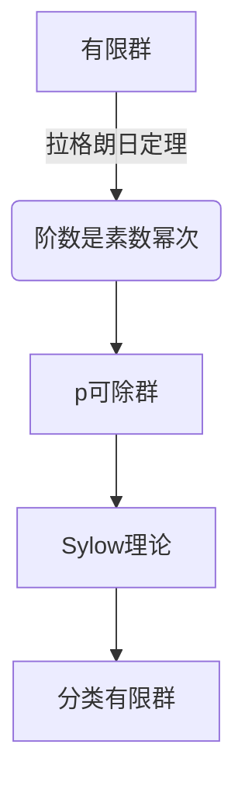

# 代数群引论：3.4 p可除群

## 1. 背景介绍

### 1.1 问题的由来

在研究有限群的结构时，一个重要的问题是确定群的阶数(元素个数)。对于任意有限群G，其阶数必定是某个正整数的次幂，即存在某个素数p和正整数n，使得|G| = p^n。这个结论源于著名的拉格朗日定理(Lagrange's Theorem)。

拉格朗日定理指出，对于任意有限群G和G的子群H，都有|H|是|G|的约数。因此，研究|G|的可能值就变成了研究|G|的素数幂次分解。这促使我们去研究p可除群(p-groups)的性质。

### 1.2 研究现状

p可除群是指其阶数是某个素数p的幂次的有限群。这类群在有限群理论中占据重要地位，因为任何有限群都可以分解为其p-Sylow子群的直积。了解p可除群的结构有助于揭示一般有限群的性质。

已有大量研究集中在p可除群的结构、性质和分类上。例如，对于任意p可除群G，都存在一个特征子群Ω(G)称为G的核,使得G/Ω(G)是一个向量空间。这为研究p可除群提供了一个重要工具。

另一个重要结果是p可除群的阶数和它的阶层之间存在一个上界关系,即如果G是一个阶数为p^n的p可除群,那么它的阶层不超过n。这个结果为分类p可除群奠定了基础。

### 1.3 研究意义

研究p可除群不仅有重要的理论意义,而且在编码理论、拓扑学、代数几何等领域也有广泛应用。例如,在有限域和代数几何编码的研究中,p可除群扮演着关键角色。

此外,p可除群还与其他数学分支存在内在联系,如李代数、表示论等。因此,对p可除群性质的深入了解,有助于加深对这些相关领域的理解。

### 1.4 本文结构  

本文将围绕p可除群的核心概念、算法原理、数学模型、代码实现等方面进行全面介绍。

首先阐述p可除群的核心概念,并与其他群论概念建立联系;
其次详细解析p可除群相关算法的原理和具体步骤,并讨论算法的优缺点和应用领域;
然后构建p可除群的数学模型,推导相关公式,并结合案例进行讲解和常见问题解答;
接下来通过代码实例展示p可除群算法的具体实现,并对代码进行解读和分析;
最后介绍p可除群在实际应用中的场景,总结未来发展趋势和面临的挑战,并给出相关工具和学习资源推荐。

## 2. 核心概念与联系

p可除群(p-group)是指其阶数(元素个数)是某个素数p的幂次的有限群。形式上,如果G是一个有限群,且|G| = p^n,其中p是素数,n是正整数,那么我们称G为一个p可除群。

p可除群在有限群理论中占有重要地位,因为任何有限群都可以分解为其p-Sylow子群的直积。了解p可除群的结构有助于揭示一般有限群的性质。



p可除群与其他群论概念存在内在联系:

1. **阶层(Class)**: 对于任意p可除群G,存在一个特征子群Ω(G),称为G的核,使得G/Ω(G)是一个向量空间。这为研究p可除群提供了一个重要工具。

2. **生成元(Generator)**: 任何p可除群都可以由几个元素生成。生成元的个数就是p可除群的最小生成集的基数,这是p可除群的一个重要不变量。

3. **中心(Center)**: p可除群的中心对于了解群的结构至关重要。中心的阶数也是p可除群的一个不变量。

4. **交换子群(Commutator Subgroup)**: 交换子群是p可除群的一个特征子群,对于了解群的内在结构具有重要意义。

5. **表示论(Representation Theory)**: p可除群在表示论中扮演着关键角色,因为任何有限群的不可约表示都可以分解为其p-Sylow子群的不可约表示的直和。

通过对p可除群核心概念的理解,我们可以建立起与其他群论概念的联系,从而对有限群的结构有更深入的认识。

## 3. 核心算法原理 & 具体操作步骤  

### 3.1 算法原理概述

p可除群算法的核心目标是确定一个有限群G是否为p可除群,以及找出G的p-Sylow子群。算法的基本思路是:

1. 计算出G的阶数|G|; 
2. 将|G|分解为素数幂次的乘积;
3. 检查|G|中是否存在素数p的幂次p^n,且n>0;
4. 如果存在,则G为p可除群,并找出G的p-Sylow子群。

该算法依赖于一些著名的群论定理,如拉格朗日定理、Sylow定理等。

```mermaid
graph TD
    A[输入有限群G] --> B[计算G的阶数|G|]
    B --> C[将|G|分解为素数幂次乘积]
    C --> D{是否存在p^n,n>0?}
    D -->|否| E[G不是p可除群]
    D -->|是| F[G是p可除群]
    F --> G[找出G的p-Sylow子群]
```

### 3.2 算法步骤详解

1. **计算有限群G的阶数|G|**
    - 使用群论中的"陪集公式"|G| = [G:H]|H|,其中H是G的子群
    - 通过选取合适的H,简化|G|的计算

2. **将|G|分解为素数幂次的乘积**
    - 使用素数分解算法,如pollard-rho算法
    - 得到|G| = p_1^{a_1} * p_2^{a_2} * ... * p_k^{a_k}的分解式

3. **检查|G|中是否存在p^n,n>0**
    - 遍历每个素数幂次p_i^{a_i}
    - 若存在a_i > 0,则|G|包含p_i的正幂次

4. **G为p可除群,找出其p-Sylow子群**
    - 使用Sylow第一定理,G一定存在p-Sylow子群
    - 通过构造算法找出G的一个p-Sylow子群P
    - P的阶数为p^n,其中p^n是|G|中最大的p的幂次

5. **输出结果**
    - 若G为p可除群,输出"G是p可除群,其p-Sylow子群为P"
    - 否则输出"G不是p可除群"

### 3.3 算法优缺点

**优点:**

1. 算法思路清晰,依赖的群论基础知识明确
2. 能够有效确定一个有限群是否为p可除群
3. 找出p可除群的p-Sylow子群,为进一步研究奠定基础

**缺点:**

1. 对于大阶群,计算群阶数|G|的复杂度较高
2. 素数分解算法在大数情况下效率较低
3. 构造p-Sylow子群的算法对于复杂群的效率有待提高

### 3.4 算法应用领域

p可除群算法在以下领域具有重要应用:

1. **有限群分类**: 通过确定一个有限群的p-Sylow子群,为分类有限群奠定基础

2. **编码理论**: p可除群在有限域和代数几何编码的研究中扮演关键角色

3. **表示论**: 研究有限群的不可约表示时需要分解为其p-Sylow子群的表示

4. **算术几何**: p可除群与有限域和代数曲线等对象的研究密切相关

5. **拓扑学**: 在研究由p可除群作用形成的覆盖空间时会用到p可除群理论

总的来说,p可除群算法为深入理解有限群的结构和性质提供了有力工具,在纯理论研究和应用科学中都有重要价值。

## 4. 数学模型和公式 & 详细讲解 & 举例说明

### 4.1 数学模型构建

为了研究p可除群的性质,我们需要构建合适的数学模型。一个自然的选择是将p可除群G看作一个向量空间V与一个子群N的半直积(semidirect product),即G = V ⋊ N。

更精确地,存在G的一个特征子群Ω(G),称为G的核,使得G/Ω(G)是一个向量空间V,而Ω(G)是一个p可除群N的自然模。我们有G = V ⋊ N。

```mermaid
graph LR
    A[p可除群G] --> B[核Ω(G)]
    A --> C[向量空间V]
    B --> D[p可除群N]
    C & D --> E[G = V⋊N]
```

这种模型的优点是将p可除群的代数结构与向量空间的线性结构很好地结合起来,为研究p可除群的性质提供了方便。

### 4.2 公式推导过程

在p可除群G = V ⋊ N的模型下,我们可以推导出一些重要公式:

1. **阶数公式**
    设V是n维向量空间,N是阶为p^k的p可除群,则G的阶数为:
    $$|G| = |V||N| = p^{nk}$$

2. **生成元个数公式**
    设d(G)为G的最小生成元个数,则有:
    $$d(G) = d(V) + d(N)$$

3. **阶层公式**
    设cl(G)为G的阶层,则有上界:
    $$\text{cl}(G) \leq n + k$$

4. **中心公式**
    设Z(G)为G的中心,则Z(G)同构于V的不变子空间与N的中心的直积:
    $$Z(G) \cong Z(V) \times Z(N)$$

这些公式体现了p可除群的代数结构与向量空间结构的紧密联系,为研究p可除群的性质提供了有力工具。

### 4.3 案例分析与讲解

考虑p可除群G = C_p^n ⋊ C_p,其中C_p是阶为p的循环群,n是正整数。

1. **阶数**
    由阶数公式可知,|G| = p^n * p = p^{n+1}

2. **生成元个数**
    C_p^n需要n个生成元,C_p需要1个生成元,所以d(G) = n + 1

3. **阶层上界**
    由阶层公式,cl(G) ≤ n + 1

4. **中心**
    C_p^n的中心是其自身,C_p的中心是其自身
    所以Z(G) = C_p^n × C_p

我们可以看到,通过构建的数学模型和推导的公式,可以很好地描述和分析p可除群G的一些基本性质。

### 4.4 常见问题解答

1. **为什么要研究p可除群?**
    p可除群在有限群理论中占有重要地位,是研究一般有限群结构的基础。任何有限群都可以分解为其p-Sylow子群的直积,了解p可除群有助于揭示一般有限群的性质。

2. **p可除群的核Ω(G)有什么作用?**  
    Ω(G)是p可除群G的一个特征子群,使得G/Ω(G)是一个向量空间。这为我们研究p可除群提供了一个重要工具,将代数结构与向量空间结构结合起来。

3. **为什么要研究p可除群的生成元个数?**
    生成元个数是p可除群的一个重要不变量,反映了群的代数结构的复杂程度。研究生成元个数有助于分类和构造p可除群。

4. **p可除群在实际应用中有什么作用?**
    p可除群在编码理论、表示论、算术几何、拓扑学等领域都有重要应用。例如在有限域和代数几何编码的研究中,p可除群扮演着关键角色。

通过对这些常见问题的解答,我们可以更好地理解研究p可除群的重要