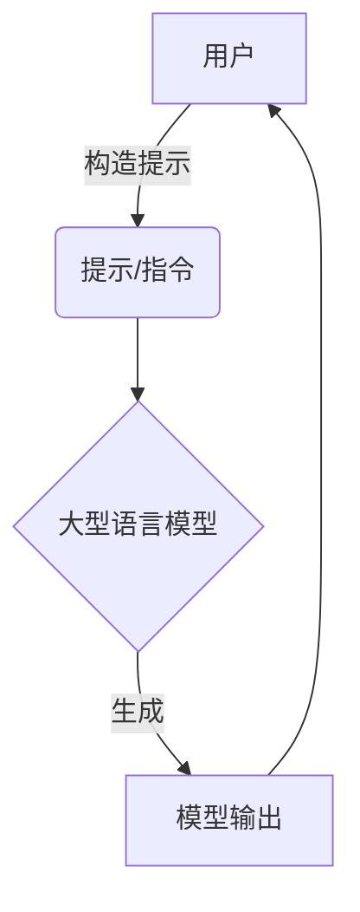

以下是以《以提示/指令模式直接使用大模型》为题的技术博客正文：

# 以提示/指令模式直接使用大模型

## 1. 背景介绍

### 1.1 问题的由来

随着人工智能和大型语言模型的不断发展,直接与模型进行交互以获取所需信息和完成任务的需求日益增长。传统的模型使用方式通常需要编写复杂的代码,对用户来说存在较高的学习和使用门槛。因此,探索一种更加简单直观的模型交互方式迫在眉睫。

### 1.2 研究现状 

目前,一种新兴的模型交互范式——提示/指令模式(Prompt/Instruction Paradigm)逐渐引起研究人员的关注。该范式允许用户直接向大型语言模型输入自然语言提示或指令,模型会根据提示生成相应的输出。这种方式降低了使用门槛,为各类用户提供了一种友好的模型交互体验。

### 1.3 研究意义

提示/指令模式的出现,为大型语言模型的应用开辟了新的可能性。通过探索该范式的原理、实现方法和应用场景,我们可以更好地利用模型强大的生成能力,将其应用于各种领域,为用户提供高效、智能的辅助。同时,研究该范式也有助于我们更深入地理解大型语言模型的工作机制,促进人工智能技术的发展。

### 1.4 本文结构

本文将全面介绍提示/指令模式的相关内容。首先阐述该范式的核心概念和原理;然后详细讲解核心算法的工作流程和数学模型;接着通过代码示例展示该范式的实现方法;最后探讨该范式在实际应用中的场景,并对未来发展趋势和挑战进行展望。

## 2. 核心概念与联系

提示/指令模式(Prompt/Instruction Paradigm)是一种新兴的大型语言模型交互范式。其核心思想是:用户直接向模型输入自然语言提示或指令,模型根据提示生成相应的输出,从而实现各种任务。

该范式的关键概念包括:

1. **提示(Prompt)**: 用户输入的自然语言文本,用于指导模型生成所需输出。
2. **指令(Instruction)**: 一种特殊的提示形式,明确告知模型需要完成的任务类型。
3. **上下文(Context)**: 提示中除了指令之外的其他信息,如背景知识、输入数据等,为模型生成提供参考。
4. **模型输出(Model Output)**: 模型根据提示生成的自然语言文本输出。

提示/指令模式与传统的模型使用方式有着明显区别。传统方式需要编写复杂的代码来调用模型API并处理输入输出;而提示/指令模式则更加直观,只需构造合适的自然语言提示即可直接与模型交互,获取所需输出。这种范式降低了使用门槛,使得非专业用户也能方便地利用大型语言模型的强大功能。

该范式的核心在于构建高质量的提示,使模型能够准确理解用户的意图并生成期望的输出。这就需要探索提示的最优表达方式、结构和组成部分,并研究模型如何理解和响应不同类型的提示。

## 3. 核心算法原理 & 具体操作步骤

### 3.1 算法原理概述

提示/指令模型的核心算法原理可以概括为:根据用户提供的自然语言提示,模型生成最可能的相应自然语言输出序列。该过程可视为一个序列到序列(Sequence-to-Sequence)的生成任务。

具体来说,算法会将用户提示作为输入序列,利用模型的编码器(Encoder)对其进行编码,获取其语义表示;然后,解码器(Decoder)会基于该语义表示,自回归地生成输出序列的每个词元,直至生成完整序列。在生成过程中,解码器会综合考虑输入提示的语义信息、上下文知识和任务目标,以产生与提示相关且满足任务需求的自然语言输出。

算法的关键在于模型的参数,这些参数通过在大规模语料库上进行预训练而获得,能够有效捕获自然语言的语义和逻辑规律。在具体的提示/指令任务中,模型会根据输入提示,结合预训练获得的语言知识,生成与之相关的高质量输出。

### 3.2 算法步骤详解

提示/指令模型算法的具体步骤如下:

1. **输入处理**:将用户输入的自然语言提示/指令进行标记化(Tokenization)和编码,转换为模型可以识别的数字序列表示。

2. **编码器(Encoder)处理**:将编码后的输入序列输入编码器,编码器会计算每个词元的上下文语义表示,并将整个序列的语义信息编码为一个上下文向量(Context Vector)。

3. **解码器(Decoder)初始化**:使用特殊的起始标记(Start Token)初始化解码器的初始状态和输入。

4. **自回归生成**:
    a. 解码器根据当前状态和上下文向量,计算出下一个词元的概率分布。
    b. 根据概率分布,采样或选取概率最大的词元作为输出。
    c. 将该词元输入解码器,更新解码器状态。
    d. 重复上述步骤,直至生成终止标记(End Token)或达到最大长度。

5. **输出处理**:将解码器生成的数字序列解码为自然语言文本序列,作为最终输出。

该算法的优点是能够充分利用大型语言模型在海量语料上学习到的语言知识,生成高质量、与提示相关的自然语言输出。同时,由于算法的端到端性质,用户只需提供自然语言提示,无需进行复杂的数据预处理和特征工程,大大降低了使用门槛。

### 3.3 算法优缺点

**优点**:

1. **简单直观**:用户只需提供自然语言提示,无需编写复杂代码,降低了使用门槛。
2. **通用性强**:能够处理各种自然语言任务,如问答、摘要、创作等,应用场景广泛。
3. **生成质量高**:利用大型语言模型的强大语言理解和生成能力,输出质量优秀。
4. **高效性**:端到端的生成过程,无需复杂的数据预处理和特征工程,效率较高。

**缺点**:

1. **缺乏可解释性**:模型内部的决策过程是一个黑箱,难以解释生成结果的原因。
2. **存在偏差风险**:模型可能会受训练数据中的偏差影响,产生不公平或有害的输出。
3. **对抗攻击风险**:模型可能会被针对性的对抗样本攻击所欺骗,产生错误输出。
4. **幻觉风险**:模型有可能生成看似合理但实际上是错误或虚构的输出。

### 3.4 算法应用领域

提示/指令模型算法由于其通用性和简便性,可以应用于自然语言处理的各个领域,主要包括但不限于:

1. **问答系统**:根据用户的自然语言问题,生成相应的答案。
2. **文本摘要**:根据输入文本,生成其摘要。
3. **机器翻译**:将一种语言的文本翻译成另一种语言。
4. **文本创作**:根据给定的提示,生成诗歌、小说、新闻等创作性文本。
5. **代码生成**:根据自然语言描述,生成相应的计算机程序代码。
6. **对话系统**:根据上下文,生成自然的对话响应。
7. **数据分析报告生成**:根据数据集,自动生成分析报告。

除了自然语言处理领域,该算法还可以扩展应用于其他领域,如根据提示生成图像、音频、视频等多模态输出。总的来说,只要是需要根据某种输入生成相应输出的任务,都可以尝试使用提示/指令模型算法。

## 4. 数学模型和公式 & 详细讲解 & 举例说明

提示/指令模型算法通常基于Transformer等序列到序列(Seq2Seq)模型的变体,其核心数学模型是基于自注意力(Self-Attention)机制的编码器-解码器(Encoder-Decoder)结构。

### 4.1 数学模型构建

假设输入提示为序列 $X = (x_1, x_2, ..., x_n)$,期望输出为序列 $Y = (y_1, y_2, ..., y_m)$。我们的目标是最大化条件概率 $P(Y|X)$,即给定输入 $X$ 时,输出序列 $Y$ 的概率。根据链式法则,我们有:

$$P(Y|X) = \prod_{t=1}^m P(y_t|y_{<t}, X)$$

其中 $y_{<t}$ 表示长度为 $t-1$ 的输出序列的前缀。

为了计算上式中的条件概率,我们引入编码器-解码器架构:

1. **编码器(Encoder)**: 将输入序列 $X$ 映射为上下文向量 $c$,用于捕获输入的语义信息。

$$c = f(x_1, x_2, ..., x_n)$$

2. **解码器(Decoder)**: 基于上下文向量 $c$ 和已生成的输出序列前缀 $y_{<t}$,预测下一个词元 $y_t$ 的概率分布。

$$P(y_t|y_{<t}, X) = g(y_{<t}, c)$$

其中 $f$ 和 $g$ 分别表示编码器和解码器的函数。

在实践中,编码器和解码器通常都采用基于自注意力机制的Transformer模型,能够有效捕获长距离依赖关系。具体来说,编码器由多层自注意力和前馈网络组成,对输入序列进行编码;解码器则在编码器的基础上,增加了对已生成输出序列的自注意力,以捕获输出序列的内部依赖关系。

### 4.2 公式推导过程

现在我们来推导解码器在时间步 $t$ 预测下一个词元 $y_t$ 的具体计算过程。

首先,解码器会计算已生成输出序列 $y_{<t}$ 的自注意力表示 $H^l_{<t}$:

$$H^l_{<t} = \text{Attention}(Q^l_{<t}, K^l_{<t}, V^l_{<t})$$

其中 $Q^l_{<t}$、$K^l_{<t}$、$V^l_{<t}$ 分别为查询(Query)、键(Key)和值(Value)向量,通过自注意力机制计算得到。

然后,解码器会将上下文向量 $c$ 和自注意力表示 $H^l_{<t}$ 进行融合,得到当前时间步的表示 $S^l_t$:

$$S^l_t = \text{Combine}(H^l_{<t}, c)$$

其中 $\text{Combine}$ 可以是简单的拼接或加权求和等操作。

接下来,解码器会通过前馈网络层对 $S^l_t$ 进行变换,得到输出表示 $O^l_t$:

$$O^l_t = \text{FFN}(S^l_t)$$

最后,解码器根据输出表示 $O^l_t$,计算下一个词元 $y_t$ 的概率分布:

$$P(y_t|y_{<t}, X) = \text{Softmax}(W_o O^l_t + b_o)$$

其中 $W_o$ 和 $b_o$ 为可训练参数。

通过上述计算过程,解码器能够综合考虑输入提示的语义信息(通过上下文向量 $c$)、已生成输出的内部依赖关系(通过自注意力表示 $H^l_{<t}$),从而预测出与提示相关且语义连贯的下一个词元。重复该过程,直至生成完整的输出序列。

在训练阶段,模型会最大化输出序列 $Y$ 的条件概率 $P(Y|X)$,通过反向传播算法学习模型参数。在推理阶段,则根据上述公式,自回归地生成最可能的输出序列。