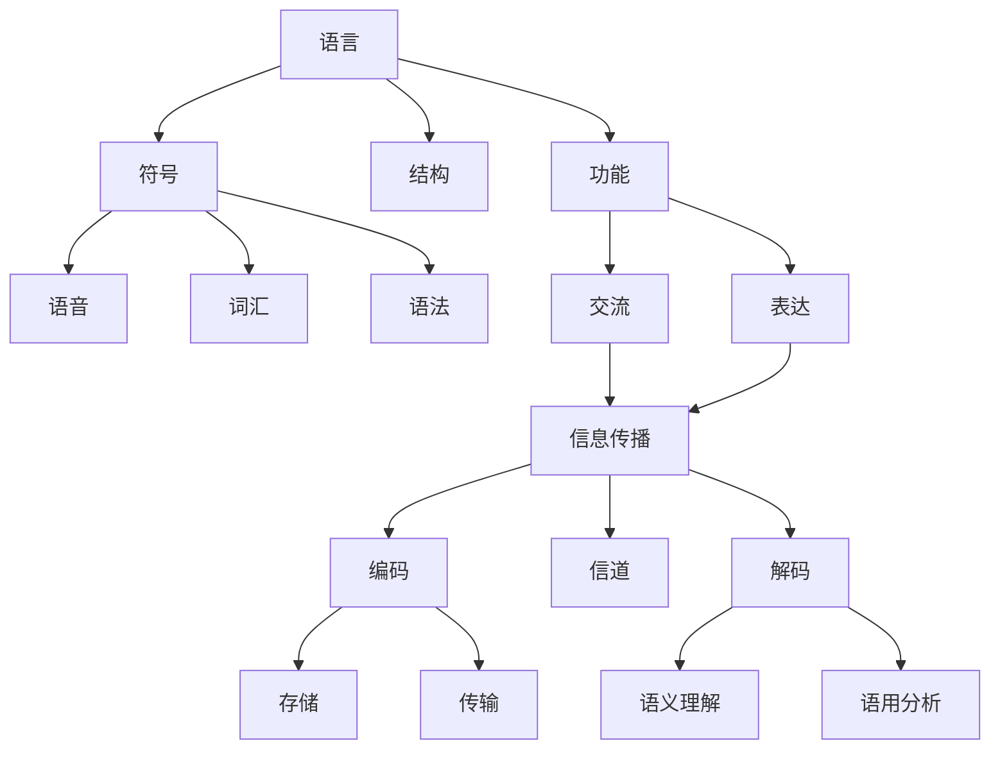

# 何为语言？信息又如何传播？

作者：禅与计算机程序设计艺术 / Zen and the Art of Computer Programming

## 1. 背景介绍
### 1.1 问题的由来
语言是人类社会交流和传递信息的基础工具。自从人类诞生以来,语言就扮演着至关重要的角色。随着人类文明的发展,语言也在不断演变。而在当今信息时代,语言和信息传播更是成为了研究的热点。那么,何为语言?信息又是如何传播的呢?这是一个值得深入探讨的问题。

### 1.2 研究现状
目前,语言学和信息论等领域都对语言和信息传播进行了大量研究。语言学主要从语音、语义、语法等角度研究语言的结构和功能。而信息论则主要研究信息的编码、传输、处理等问题。近年来,随着人工智能的发展,自然语言处理也成为了研究的重点,如何让计算机理解和生成自然语言成为了一大挑战。

### 1.3 研究意义 
深入研究语言的本质和信息传播的机制,对于推动人工智能的发展具有重要意义。一方面,揭示语言的奥秘有助于我们开发出更加智能的自然语言处理系统。另一方面,理解信息传播的规律,可以帮助我们优化信息传输和处理,提高通信效率。同时,这些研究也为认知科学、心理学等领域提供了新的视角。

### 1.4 本文结构
本文将从以下几个方面展开讨论:
- 首先,我们将探讨语言的定义和基本属性,分析语言的结构和功能。 
- 然后,介绍信息论的基本概念,说明信息是如何编码和传输的。
- 接下来,我们将语言和信息传播联系起来,揭示语言在信息传播中的作用机制。
- 在此基础上,进一步阐述自然语言处理的原理和方法,并给出代码实例。
- 最后,展望语言和信息传播研究的发展趋势,提出未来的挑战和机遇。

## 2. 核心概念与联系

要理解语言和信息传播,首先需要明确一些核心概念:

- 语言:语言是人类用于交流和表达思想的符号系统,由语音、词汇、语法等要素构成。
- 信息:信息是消除不确定性的东西,可以被编码、存储、传输和处理。香农信息论奠定了现代信息科学的基础。
- 信道:信息从信源传输到接收者的通路,可能受到噪声的影响。
- 编码:将信息转换为便于传输和存储的形式,如二进制编码等。
- 语义:语言符号所表示的意义,是语言理解的关键。
- 语用:语言在具体场景中的使用,受到说话者、听话者、语境等因素的影响。

这些概念相互关联、相互作用:


从上图可以看出,语言作为一种符号系统,通过语音、词汇、语法等要素构成,发挥交流和表达的功能,在信息传播过程中起到了编码和解码的作用。信息通过信道从信源传递到接收者,期间可能受到噪声干扰。接收者通过语义理解和语用分析来解读信息的内容。

## 3. 核心算法原理 & 具体操作步骤
### 3.1 算法原理概述
自然语言处理的核心是让计算机理解和生成人类语言。其基本原理可以概括为:
1. 将语言数学化,用计算机可以处理的形式(如向量、概率模型等)表示语言要素。
2. 利用统计学习、深度学习等方法,从大规模语料中学习语言知识。
3. 运用学习到的语言知识,对新的语言输入进行分析、理解、生成等处理。

### 3.2 算法步骤详解
以基于深度学习的端到端机器翻译为例,其主要步骤包括:
1. 语料预处理:对平行语料进行清洗、分词、编码等处理,转换为神经网络可接受的输入。
2. 搭建编码器-解码器框架:使用RNN、Transformer等结构,将源语言编码为中间向量表示,再解码生成目标语言。
3. 训练模型:通过最小化交叉熵损失函数,反向传播更新模型参数,学习翻译知识。
4. 解码和后处理:使用训练好的模型,对源语言输入进行翻译解码,再对翻译结果进行去BPE、去重等后处理。
5. 评估优化:使用BLEU等自动评价指标评估翻译质量,不断迭代优化模型。

### 3.3 算法优缺点
基于深度学习的端到端翻译相比传统的统计机器翻译,有以下优点:
- 不需要人工设计复杂的特征工程,端到端学习翻译知识
- 充分利用海量数据,学习深层次的语义表示
- 翻译质量更高,更加流畅自然

但同时也存在一些局限:
- 需要大量高质量的平行语料,对低资源语言支持有限
- 模型复杂度高,训练推理耗时长
- 可解释性差,难以调试和控制

### 3.4 算法应用领域
自然语言处理技术已经在多个领域得到广泛应用,如:
- 机器翻译:Google Translate、DeepL等
- 智能问答:Siri、Alexa、小爱同学等
- 舆情分析:分析社交媒体言论情感倾向
- 文本分类:新闻分类、垃圾邮件识别等
- 知识图谱:从文本中提取结构化知识
- 文本生成:写作助手、对话生成等

随着算法的进步和算力的提升,NLP技术必将在更多场景发挥重要作用。

## 4. 数学模型和公式 & 详细讲解 & 举例说明
### 4.1 数学模型构建
信息论中的重要概念是信息熵,表示随机变量的不确定性。对于离散型随机变量X,其信息熵定义为:

$$H(X)=-\sum_{i=1}^{n}p_i\log p_i$$

其中,$p_i$为X取值为$x_i$的概率。

信息熵的一个重要性质是:当随机变量的取值概率分布越均匀,信息熵就越大。直观地说,就是事件发生的不确定性越大,所携带的信息量就越多。

### 4.2 公式推导过程
为什么信息熵的定义是$-\sum_{i=1}^{n}p_i\log p_i$,而不是其他形式呢?这需要从公理化的角度推导。

首先,我们期望信息熵$H$满足以下性质:
1. $H$是概率分布${p_i}$的连续函数。 
2. 若$p_i=\frac{1}{n},\forall i$,则$H$应随着$n$的增大而增大。因为均匀分布的不确定性越大。
3. 若将原问题分解为两个子问题,则原问题的不确定性应等于子问题不确定性的加权和。

可以证明,对数函数$\log$是满足这些性质的唯一函数形式。因此有:

$$H(p_1,\dots,p_n)=-K\sum_{i=1}^{n}p_i\log p_i$$

其中$K$为正常数,通常取$K=1$。

### 4.3 案例分析与讲解
以掷骰子为例,分析不同情况下的信息熵。

假设骰子有6个面,每个面朝上的概率分别为$p_1,\dots,p_6$。则掷一次骰子获得的信息熵为:

$$H=-\sum_{i=1}^{6}p_i\log_2 p_i$$

- 情况1:骰子是均匀的,每个面朝上的概率都是$\frac{1}{6}$。此时:

$$H=-\sum_{i=1}^{6}\frac{1}{6}\log_2 \frac{1}{6}=\log_2 6\approx 2.58$$

- 情况2:骰子被做了手脚,1-4点的概率都是$\frac{1}{8}$,5和6点的概率是$\frac{1}{4}$。此时:

$$H=-4\times\frac{1}{8}\log_2 \frac{1}{8}-2\times\frac{1}{4}\log_2 \frac{1}{4}=2.5$$

可以看出,相比情况1,此时的信息熵略有下降。直观地说,此时掷骰子的结果更容易预测,不确定性降低了。

### 4.4 常见问题解答
Q:信息熵的单位是什么?
A:信息熵的单位取决于公式中对数的底数。通常取2为底,此时信息熵的单位是比特(bit)。如果取自然对数$\ln$,则单位是纳特(nat)。一纳特等于$\log_2 e$比特。

Q:信息熵与热力学中的熵有何联系?
A:信息熵和热力学熵有相似的数学形式,都表示系统的无序程度。但二者研究的对象不同,信息熵描述的是概率分布的不确定性,而热力学熵描述的是物理系统的混乱程度。在某些特定情况下,二者可以等价。

## 5. 项目实践:代码实例和详细解释说明
### 5.1 开发环境搭建
以Python为例,自然语言处理常用的库有:
- NLTK:自然语言处理入门工具包,提供了语料库和常用算法
- SpaCy:工业级自然语言处理库,速度快,适合大规模应用
- Gensim:主题模型工具包,支持LDA、LSA等算法
- PyTorch、TensorFlow:深度学习框架,支持搭建各种NLP模型

可以使用pip安装这些库:
```bash
pip install nltk spacy gensim torch tensorflow
```

### 5.2 源代码详细实现
下面以PyTorch实现一个简单的文本分类模型为例。该模型使用RNN对文本进行编码,然后通过线性层输出分类结果。

首先,定义数据加载和预处理函数:
```python
import torch
from torch.utils.data import Dataset, DataLoader

class TextDataset(Dataset):
    def __init__(self, data, word2id, max_len):
        self.data = data
        self.word2id = word2id
        self.max_len = max_len

    def __len__(self):
        return len(self.data)

    def __getitem__(self, index):
        text, label = self.data[index]
        text = [self.word2id.get(word, 1) for word in text.split()]
        text = text[:self.max_len] + [0] * (self.max_len - len(text))
        return torch.LongTensor(text), torch.LongTensor([label])
```

然后,定义模型结构:
```python
import torch.nn as nn

class TextRNN(nn.Module):
    def __init__(self, vocab_size, embed_dim, hidden_size, num_classes):
        super().__init__()
        self.embedding = nn.Embedding(vocab_size, embed_dim)
        self.rnn = nn.GRU(embed_dim, hidden_size, batch_first=True)
        self.fc = nn.Linear(hidden_size, num_classes)

    def forward(self, x):
        x = self.embedding(x)
        _, h = self.rnn(x)
        return self.fc(h.squeeze(0))
```

最后,定义训练和评估函数:
```python
import torch.optim as optim

def train(model, dataloader, criterion, optimizer, device):
    model.train()
    for batch, (text, label) in enumerate(dataloader):
        text, label = text.to(device), label.to(device)
        optimizer.zero_grad()
        output = model(text)
        loss = criterion(output, label.view(-1))
        loss.backward()
        optimizer.step()

def evaluate(model, dataloader, criterion, device):
    model.eval()
    total_loss, total_acc = 0, 0
    with torch.no_grad():
        for text, label in dataloader:
            text, label = text.to(device), label.to(device)
            output = model(text)
            loss = criterion(output, label.view(-1))
            total_loss += loss.item() * label.size(0)
            pred = output.argmax(dim=1)
            total_acc