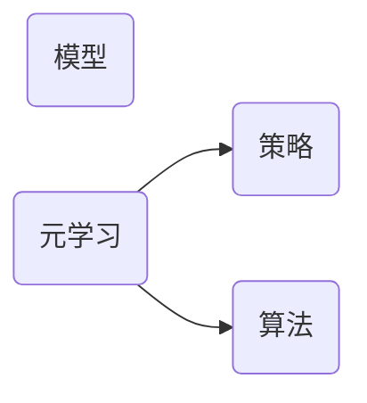
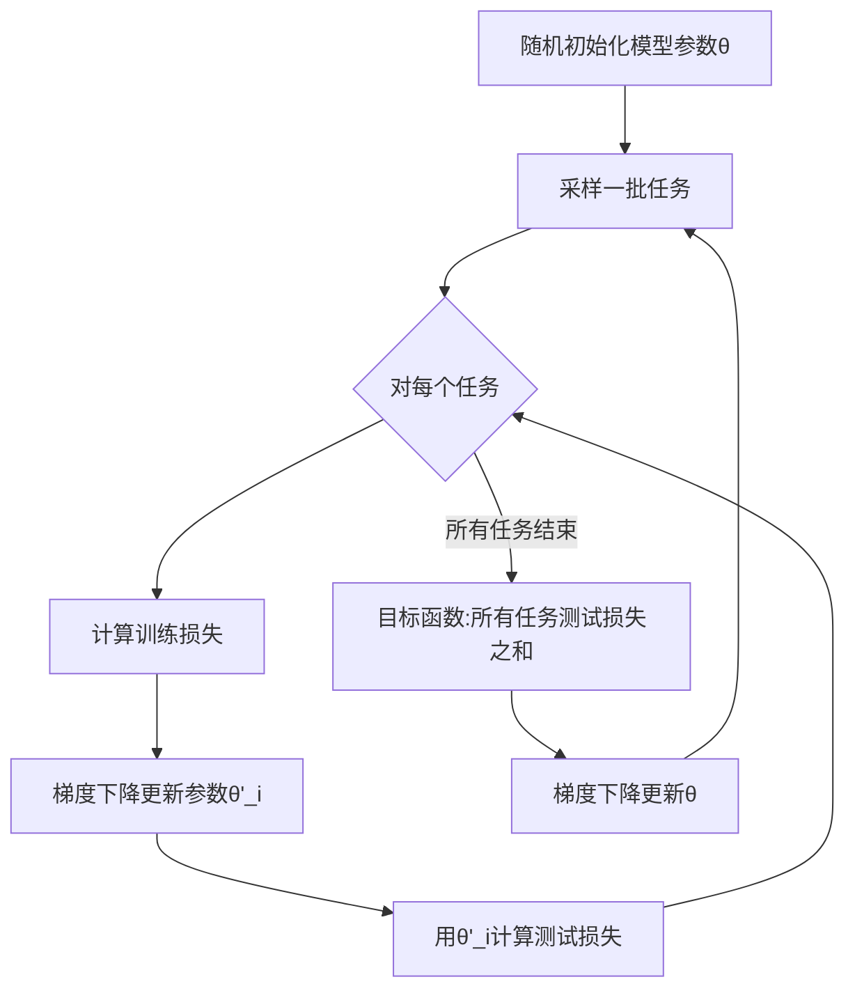

# 元学习Meta Learning原理与代码实例讲解

## 1. 背景介绍
### 1.1 问题的由来
在机器学习的发展历程中,我们一直在追求一个目标:让机器像人一样拥有学习的能力。传统的机器学习方法通常针对特定任务从头开始训练模型,当面临新任务时往往需要重新训练,这导致模型的泛化能力较差。而人类却可以在学习过多个不同但相关的任务后,快速地学会一个新任务。这启发我们去思考:机器是否也可以像人类一样,通过学习如何学习来快速适应新任务呢?由此,元学习(Meta Learning)的研究应运而生。
### 1.2 研究现状
近年来,元学习引起了学术界的广泛关注。一些代表性的工作包括:
- Schmidhuber[1]最早在1987年提出了元学习的概念,他的工作为后来的研究奠定了基础。 
- Bengio等[2]提出了一种学习优化算法的元学习方法,通过学习优化器参数来自适应不同任务。
- Finn等[3]提出了MAML(Model-Agnostic Meta-Learning)算法,通过学习模型初始化参数,使模型能在新任务上快速适应。
- Snell等[4]提出了原型网络(Prototypical Networks),通过学习任务的原型表示来实现Few-Shot Learning。
- Mishra等[5]提出了SNAIL(Simple Neural Attentive Learner),利用时间卷积和注意力机制来meta学习。
### 1.3 研究意义
元学习的研究具有重要意义:
1. 提高模型的泛化和适应能力,使其能快速适应新任务,这对于解决现实世界中的许多问题至关重要。
2. 探索机器学习的奥秘,让我们对智能的本质有更深刻的认识。通过研究元学习,我们或许能揭示人脑学习的一些基本原理。
3. 推动人工智能领域的进一步发展。元学习有望成为实现通用人工智能(AGI)的关键技术之一。
### 1.4 本文结构
本文将围绕元学习展开深入探讨,内容安排如下:第2部分介绍元学习的核心概念;第3部分讲解元学习的主要算法原理;第4部分给出元学习涉及的数学模型和公式;第5部分通过代码实例演示如何实现元学习;第6部分讨论元学习的应用场景;第7部分推荐相关学习资源;第8部分对全文进行总结并展望元学习的未来发展方向。

## 2. 核心概念与联系
元学习,又称学会学习(Learning to Learn),它的核心思想是学习如何学习。具体而言,元学习旨在设计一种学习机制,使得机器学习模型能够在多个不同但相关的任务上进行训练,从而学会快速适应新任务。这里的"元"体现在,我们要学习的不是某个具体任务,而是学习本身这个过程。通过元学习,模型能习得一种通用的学习策略,从而在新任务上表现出色。

元学习与迁移学习(Transfer Learning)和多任务学习(Multi-task Learning)有一定联系,它们都涉及在多个任务间进行知识的转移和共享。但元学习更强调学习算法层面的优化,目标是学得一个适应各种任务的学习器。迁移学习侧重于把已学习任务的知识迁移到新任务,多任务学习则在同时学习多个任务。

从机器学习的三要素"模型、策略、算法"来看,元学习主要关注后两者。通过设计高效的学习策略和算法,让模型具备快速学习的能力。这体现了元学习"Learning to Learn"的内涵。

## 3. 核心算法原理 & 具体操作步骤
### 3.1 算法原理概述
元学习的主要算法思路可以概括为:
1. 构建一个元学习器(Meta-Learner),它接受一系列训练任务作为输入,输出各任务对应的学习器参数。
2. 每个学习器在对应任务上进行训练,然后在验证集上测试性能,将损失反向传播给元学习器。 
3. 元学习器基于反馈的损失调整自身参数,使得学习器能更好地适应新任务。
4. 在新任务上,直接用元学习器生成的学习器参数进行微调,即可快速适应新任务。
### 3.2 算法步骤详解
以MAML算法为例,它的主要步骤如下:
1. 随机初始化一个神经网络模型的参数$\theta$。
2. 从任务分布中采样一个Batch的任务$\{\mathcal{T}_i\}$,每个任务包含一个训练集$\mathcal{D}^{tr}_i$和测试集$\mathcal{D}^{ts}_i$。
3. 对每个任务$\mathcal{T}_i$:
   - 在训练集$\mathcal{D}^{tr}_i$上计算损失$\mathcal{L}_{\mathcal{T}_i}(f_\theta)$
   - 对$\theta$进行一次或多次梯度下降,得到任务专属参数$\theta'_i$:
     $\theta'_i=\theta-\alpha\nabla_\theta\mathcal{L}_{\mathcal{T}_i}(f_\theta)$
   - 在测试集$\mathcal{D}^{ts}_i$上用更新后的参数$\theta'_i$计算损失$\mathcal{L}_{\mathcal{T}_i}(f_{\theta'_i})$
4. 对所有任务的测试损失求和,得到元学习的目标函数:
   $\sum_{\mathcal{T}_i \sim p(\mathcal{T})} \mathcal{L}_{\mathcal{T}_i}(f_{\theta'_i})$
5. 对$\theta$进行梯度下降,优化上述目标函数:
   $\theta \leftarrow \theta - \beta\nabla_\theta\sum_{\mathcal{T}_i \sim p(\mathcal{T})} \mathcal{L}_{\mathcal{T}_i}(f_{\theta'_i})$
6. 重复步骤2-5,直到收敛,得到最终的$\theta$。

以上步骤可以用下图表示:

### 3.3 算法优缺点
元学习算法的主要优点有:
1. 通过在任务集上学习,模型获得了快速适应新任务的能力。
2. 与从头训练相比,在新任务上微调收敛更快,所需样本更少。
3. 学到的初始化参数包含了先验知识,一定程度上缓解了过拟合。

但元学习也存在一些局限:
1. 元训练阶段计算量大,需要在大量任务上进行训练。 
2. 元训练任务需要与目标任务相关,否则难以迁移。
3. 对任务分布变化敏感,鲁棒性有待提高。
### 3.4 算法应用领域 
元学习在以下领域展现出了前景:
- 小样本学习(Few-Shot Learning):通过元学习,模型能在极少样本的情况下快速学习新概念。
- 强化学习(Reinforcement Learning):将元学习思想引入策略学习,可加速智能体适应新环境。
- 神经网络结构搜索(Neural Architecture Search):用元学习来发现适合当前任务的网络结构。
- 持续学习(Continual Learning):元学习有助于在连续学习新任务时保持对已学知识的记忆。

## 4. 数学模型和公式 & 详细讲解 & 举例说明
### 4.1 数学模型构建
我们定义一个元学习模型$\mathfrak{M}$,它包含:
- 一个学习算法$\mathcal{A}$,它的参数为$\theta$。
- 一个任务分布$p(\mathcal{T})$,每个任务$\mathcal{T}_i$包含一个损失函数$\mathcal{L}_{\mathcal{T}_i}$和相应的数据集$\mathcal{D}_i$。
- 一个元目标函数$\mathcal{L}_{meta}$,用于评估学习算法$\mathcal{A}$在不同任务上的性能。

给定一个任务$\mathcal{T}_i$,学习算法$\mathcal{A}$的目标是找到一个模型参数$\phi_i$,使得损失函数$\mathcal{L}_{\mathcal{T}_i}(\phi_i)$最小化:

$$\phi_i = \mathcal{A}(\mathcal{D}_i; \theta)$$

元学习的目标是找到最优的学习算法参数$\theta^*$,使得学习算法$\mathcal{A}$在任务分布$p(\mathcal{T})$上的期望损失最小:

$$\theta^* = \arg\min_\theta \mathbb{E}_{\mathcal{T}_i \sim p(\mathcal{T})} [\mathcal{L}_{meta}(\mathcal{A}(\mathcal{D}_i; \theta))]$$

其中$\mathcal{L}_{meta}$可以是任务的损失函数$\mathcal{L}_{\mathcal{T}_i}$在测试集上的值,也可以是其他评价指标。
### 4.2 公式推导过程
以MAML为例,我们详细推导元目标函数的梯度。首先,我们定义任务$\mathcal{T}_i$的训练损失为:

$$\mathcal{L}_{\mathcal{T}_i}(\phi_i) = \mathcal{L}_{\mathcal{T}_i}(f_{\phi_i}) = \frac{1}{|\mathcal{D}^{tr}_i|} \sum_{(x,y) \in \mathcal{D}^{tr}_i} \ell (f_{\phi_i}(x), y)$$

其中$f_{\phi_i}$是参数为$\phi_i$的模型,$\ell$是样本级别的损失函数,如交叉熵或均方误差。

对于每个任务$\mathcal{T}_i$,MAML执行一次或多次梯度下降,更新参数为:

$$\phi_i = \theta - \alpha \nabla_\theta \mathcal{L}_{\mathcal{T}_i}(f_\theta)$$

然后,MAML在任务$\mathcal{T}_i$的测试集$\mathcal{D}^{ts}_i$上计算损失:

$$\mathcal{L}_{\mathcal{T}_i}(f_{\phi_i}) = \frac{1}{|\mathcal{D}^{ts}_i|} \sum_{(x,y) \in \mathcal{D}^{ts}_i} \ell (f_{\phi_i}(x), y)$$

MAML的元目标函数是所有任务测试损失的期望:

$$\mathcal{L}_{meta}(\theta) = \mathbb{E}_{\mathcal{T}_i \sim p(\mathcal{T})} [\mathcal{L}_{\mathcal{T}_i}(f_{\phi_i})]$$

根据链式法则,元目标函数对$\theta$的梯度为:

$$\nabla_\theta \mathcal{L}_{meta}(\theta) = \mathbb{E}_{\mathcal{T}_i \sim p(\mathcal{T})} [\nabla_{\phi_i} \mathcal{L}_{\mathcal{T}_i}(f_{\phi_i}) \nabla_\theta \phi_i]$$

其中$\nabla_\theta \phi_i$可以进一步展开为:

$$\nabla_\theta \phi_i = I - \alpha \nabla^2_\theta \mathcal{L}_{\mathcal{T}_i}(f_\theta)$$

这里$I$是单位矩阵,$\nabla^2_\theta \mathcal{L}_{\mathcal{T}_i}(f_\theta)$是损失函数的Hessian矩阵。

最后,我们用随机采样的方式来近似期望,对$\theta$进行梯度下降:

$$\theta \leftarrow \theta - \beta \frac{1}{|\mathcal{T}|} \sum_{\mathcal{T}_i \sim p(\mathcal{T})} [\nabla_{\phi_i} \mathcal{L}_{\mathcal{T}_i}(f_{\phi_i}) \nabla_\theta \phi_i]$$

其中$\beta$是元学习率。
### 4.3 案例分析与讲解
我们以一个简单的