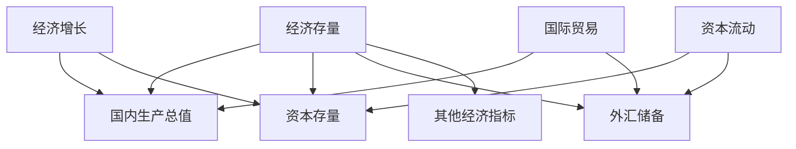
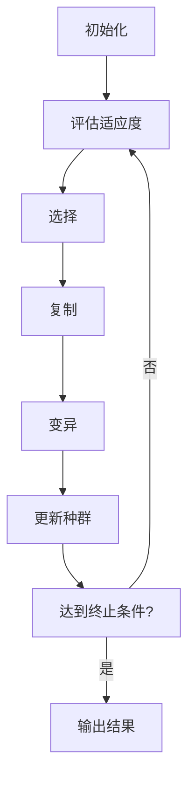

# 全球经济存量争夺的长期现象

## 1. 背景介绍

### 1.1 问题的由来

在当前全球化的经济格局下,各国之间的经济实力对比日益显著。发达国家凭借其先进的科技水平和雄厚的资本实力,长期主导着全球经济版图。而新兴经济体则凭借人口红利和廉价劳动力,逐渐崛起并分一杯羹。在这种背景下,全球经济存量的争夺成为一种长期现象。

经济存量指的是一个国家或地区在特定时期内的经济总量,包括国内生产总值(GDP)、外汇储备、资本存量等。拥有更多经济存量意味着更强的经济实力和更大的话语权。因此,各国都在努力提高本国的经济存量,以确保在国际竞争中占据有利地位。

### 1.2 研究现状

目前,关于全球经济存量争夺的研究主要集中在以下几个方面:

1. **经济增长模型**:许多经济学家提出了不同的经济增长模型,试图解释经济存量增长的动因和规律,如索罗经济增长模型、罗默经济增长模型等。

2. **国际贸易理论**:国际贸易是影响经济存量变化的重要因素。许多经典理论如比较优势理论、赫克歇尔-俄林理论等,都在探讨国际贸易对经济存量的影响。

3. **全球化影响研究**:随着全球化进程的加深,各国经济更加相互依存。一些研究探讨了全球化对经济存量分配的影响,如"赢家通吃"效应等。

4. **区域经济一体化**:区域经济一体化是影响经济存量分配的重要力量,如欧盟、北美自由贸易区等。

5. **国际资本流动**:国际资本流动对经济存量的重新分配起着关键作用,如外国直接投资、国际投资组合等。

然而,现有研究大多集中于特定领域或角度,缺乏对全球经济存量争夺这一长期现象的系统性分析和预测。

### 1.3 研究意义

深入研究全球经济存量争夺的长期现象,具有重要的理论和现实意义:

1. **理论意义**:有助于厘清经济存量变化的内在规律,完善相关经济理论模型,为制定经济政策提供理论依据。

2. **现实意义**:有利于各国准确把握当前经济形势,制定有效的经济发展战略,在全球经济版图中占据有利位置。

3. **风险预警**:能够预测潜在的经济存量失衡风险,防范系统性金融风险的发生。

4. **国际合作**:有助于促进各国在经济存量争夺中的相互理解和利益协调,推动构建新型全球经济治理体系。

总之,深入研究这一长期现象,有助于维护全球经济秩序的稳定,促进可持续发展。

### 1.4 本文结构

本文将系统阐述全球经济存量争夺的长期现象。首先介绍该现象的背景和研究现状,阐明研究意义。其次探讨核心概念,建立理论模型并推导公式。再次通过实证分析和案例解读,说明理论模型的应用。最后总结研究成果,展望未来发展趋势和面临的挑战。

## 2. 核心概念与联系

全球经济存量争夺的核心概念包括:

1. **经济存量**:指一个国家或地区在特定时期内的经济总量,包括国内生产总值(GDP)、资本存量、外汇储备等指标。

2. **经济增长**:经济存量的变化主要源于经济增长,即一国生产能力的不断提高。影响经济增长的因素包括资本积累、劳动力数量和质量、技术进步等。

3. **国际贸易**:通过进出口贸易,一国可以获得更多的经济存量。贸易顺差国家的经济存量将增加,而逆差国家则相反。

4. **资本流动**:包括外国直接投资、国际投资组合等,也会导致经济存量在国家之间的再分配。资本净流入国将获得更多经济存量。

5. **其他经济指标**:如就业率、通货膨胀率、财政赤字等,也会间接影响一国的经济存量水平。

上述核心概念相互关联、相互作用,共同决定了全球经济存量的分配格局。掌握这些概念及其内在联系,是研究这一长期现象的基础。

## 3. 核心算法原理 & 具体操作步骤

### 3.1 算法原理概述

为了量化分析全球经济存量争夺的长期现象,我们构建了一个基于多智能体的演化博弈模型。该模型的核心思想是:将每个国家或地区视为一个独立的智能体,它们在经济活动中相互竞争和博弈,经过长期演化最终形成一种动态均衡。

具体来说,该模型包含以下几个关键要素:

1. **多智能体系统**:将全球划分为N个经济体,每个经济体作为一个独立的智能体,拥有自己的经济存量状态和策略空间。

2. **博弈规则**:智能体之间的经济活动被建模为一个演化博弈,它们通过贸易、投资等方式相互影响,改变彼此的经济存量水平。

3. **适应度函数**:每个智能体的适应度由其经济存量水平决定,适应度越高表明该经济体在当前环境下越有竞争力。

4. **进化算法**:智能体根据适应度进行复制、变异和选择,模拟生物进化过程。具有较高适应度的经济体将占据优势地位。

5. **动态均衡**:经过长期演化,整个系统将收敛到一种动态均衡状态,即全球经济存量的分配格局将趋于相对稳定。

该模型的优势在于,它能够有效捕捉经济体之间的相互作用,并通过简单的规则模拟出复杂的宏观现象。同时,该模型也具有较强的可扩展性和可解释性。

### 3.2 算法步骤详解

下面将详细介绍该算法的具体执行步骤:

1. **初始化**:首先需要设定模型的初始参数,包括经济体数量N、初始经济存量分布、博弈规则等。此外,还需要设置进化算法的参数,如种群规模、复制概率、变异率等。

2. **评估适应度**:对当前种群中的每个经济体,根据其经济存量水平计算适应度值。适应度函数可以是简单的线性函数,也可以是非线性的复杂函数,需要根据具体问题进行设计。

3. **选择**:根据适应度值,从当前种群中选择若干经济体,作为下一代种群的父代。选择方法可以是赌轮盘赌选择、锦标赛选择等。

4. **复制**:将选中的父代经济体复制到下一代种群中,复制数量根据其适应度值决定。

5. **变异**:以一定的变异率,对下一代种群中的经济体进行变异操作,模拟基因突变。变异可以是对经济存量状态或策略的微小改变。

6. **更新种群**:用新生成的下一代种群替换当前种群。

7. **终止条件检查**:检查是否达到终止条件,如最大迭代次数、收敛条件等。如果达到,则输出最终结果;否则返回第2步,继续进行下一轮迭代。

该算法的关键在于设计合理的适应度函数、博弈规则和变异操作,以确保模型能够很好地模拟现实情况。同时,参数的选择也会对模型的收敛性和准确性产生重大影响。

### 3.3 算法优缺点

**优点:**

1. **动态性**:能够动态模拟经济存量的长期变化过程,而不是静态分析。

2. **自适应性**:通过进化算法,模型能够自主适应环境变化,无需人为干预。

3. **解释性强**:模型的规则和过程都具有很好的解释性,有利于理解现象的内在机理。

4. **可扩展性**:可以方便地引入新的规则和参数,对模型进行扩展和完善。

**缺点:**

1. **参数sensitiveness**: 模型对一些参数值比较敏感,参数的选择需要谨慎。

2. **计算复杂度高**:当经济体数量很大时,模型的计算复杂度将急剧增加。

3. **模型简化**:为了可计算性,模型对现实情况进行了一定程度的简化,可能会引入一些偏差。

4. **数据依赖**:模型的准确性和预测能力在很大程度上依赖于输入数据的质量。

总的来说,该算法能够较好地描述和模拟全球经济存量争夺的长期现象,但也存在一些需要进一步改进的地方。

### 3.4 算法应用领域

该算法可以应用于以下几个领域:

1. **宏观经济政策模拟**:通过设置不同的初始条件和规则,可以模拟不同经济政策对全球经济格局的影响,为决策提供依据。

2. **风险预警**:算法可以预测潜在的经济存量失衡风险,为金融监管部门提供早期预警。

3. **区域经济一体化研究**:模型可以模拟区域经济一体化对经济存量分配的影响,为一体化进程提供理论支持。

4. **国际贸易谈判**:通过模拟不同贸易条件下的经济存量变化,可以为国际贸易谈判提供策略建议。

5. **学术研究**:该算法为研究全球经济存量争夺这一长期现象提供了一种新的计算模型和分析工具。

总之,该算法具有广阔的应用前景,有望为相关领域的研究和实践提供有力支持。

## 4. 数学模型和公式 & 详细讲解 & 举例说明

### 4.1 数学模型构建

为了量化描述全球经济存量争夺的长期现象,我们构建了一个基于进化博弈的数学模型。该模型的核心思想是将每个国家或地区视为一个独立的智能体,它们通过经济活动相互竞争和博弈,经过长期演化最终形成一种动态均衡。

假设全球共有N个经济体,用$i(i=1,2,...,N)$表示第i个经济体。在时间t,第i个经济体的经济存量为$E_i(t)$,总的全球经济存量为$E(t)=\sum_{i=1}^{N}E_i(t)$。

我们定义第i个经济体的相对经济存量为:

$$r_i(t)=\frac{E_i(t)}{E(t)}$$

其中$0\leq r_i(t)\leq 1$,且$\sum_{i=1}^{N}r_i(t)=1$。$r_i(t)$反映了该经济体在全球经济中所占的比重。

经济体之间的相互作用可以用一个$N\times N$的矩阵$A$来描述,其中$a_{ij}$表示第i个经济体对第j个经济体的影响程度。根据经典的赫克歇尔-俄林理论,我们有:

$$a_{ij}=\frac{E_i(t)E_j(t)}{E(t)^2}$$

也就是说,两个经济体之间的相互影响程度与它们的经济存量规模成正比。

在每一个时间步长,经济体之间的相互作用将导致它们的相对经济存量发生变化。我们用一个$N\times 1$的向量$\vec{f}(t)$来表示这种变化,