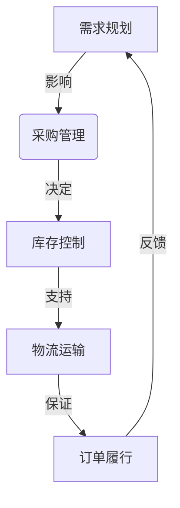

# 公司供应链系统的产品规划、设计和产品设计方案落地实施

## 1. 背景介绍

### 1.1 问题的由来

在当今瞬息万变的商业环境中，供应链管理对于企业的成功至关重要。有效的供应链系统可以优化资源分配、提高运营效率、降低成本并提升客户满意度。然而,构建一个高效、灵活且可扩展的供应链系统是一项艰巨的挑战,需要深入理解业务需求、技术架构以及实施过程。

### 1.2 研究现状

近年来,供应链管理领域取得了长足进步,涌现出诸多创新理念和技术,如物联网(IoT)、大数据分析、人工智能(AI)等。但将这些前沿技术与传统供应链系统相结合,并真正发挥其潜力,仍面临诸多挑战。许多企业在供应链系统的规划、设计和实施过程中,常常遇到诸如需求变更、技术选型、集成困难等问题,导致项目延期、超支或无法达到预期效果。

### 1.3 研究意义

本文旨在为企业提供一个全面的指南,阐述供应链系统的产品规划、设计和实施过程中的关键考虑因素、最佳实践和常见挑战。通过深入探讨核心概念、算法原理、数学模型、代码实现和应用场景,帮助读者构建一个高效、可靠且可扩展的供应链系统,从而提高企业的竞争力。

### 1.4 本文结构

本文首先介绍供应链系统的背景和研究现状,阐明研究意义。接下来,探讨供应链系统的核心概念和算法原理,包括数学模型和公式推导。然后,通过代码实例和应用场景分析,展示供应链系统的实际实现和应用。最后,总结未来发展趋势和面临的挑战,并提供相关资源推荐。

## 2. 核心概念与联系

供应链系统涉及多个关键概念,包括需求规划、采购管理、库存控制、物流运输、订单履行等,这些概念相互关联,构成了一个复杂的网络。



需求规划是供应链系统的起点,根据市场需求和销售预测,制定生产计划和物料需求计划。采购管理则负责根据需求计划,从供应商处采购所需原材料和零部件。库存控制则需要平衡供需,维持适当的库存水平,以满足生产需求和客户订单。物流运输负责将原材料、半成品和成品在供应链网络中高效流动。最后,订单履行环节确保产品及时准确地交付给客户,并收集客户反馈,为下一轮需求规划提供依据。

## 3. 核心算法原理 & 具体操作步骤

### 3.1 算法原理概述

供应链系统中的核心算法主要包括:

1. **需求预测算法**: 基于历史数据和外部因素(如节假日、促销活动等),预测未来一段时间内的产品需求量。常用算法包括移动平均法、指数平滑法、回归分析等。

2. **库存优化算法**: 确定每种产品的最佳库存水平,在满足服务水平的同时,最小化库存成本。常用算法包括经济订货量(EOQ)模型、周期补货模型等。

3. **运输路线优化算法**: 规划车辆的最佳运输路线,以最小化运输成本和时间。常用算法包括旅行商问题(TSP)算法、车辆路线问题(VRP)算法等。

4. **供应商选择优化算法**: 根据多个标准(如价格、质量、交货期等)评估并选择最佳供应商。常用算法包括分析层次过程(AHP)、数据包络分析(DEA)等。

### 3.2 算法步骤详解

以需求预测算法为例,具体步骤如下:

1. **数据预处理**:收集并清洗历史销售数据,剔除异常值。

2. **建立时间序列模型**:根据数据特征,选择合适的时间序列模型,如移动平均、指数平滑或 ARIMA 模型。

3. **模型训练**:使用历史数据训练模型参数。

4. **模型评估**:在测试集上评估模型性能,如均方根误差(RMSE)等指标。

5. **模型调优**:根据评估结果,调整模型参数或尝试其他模型。

6. **需求预测**:使用训练好的模型,对未来一段时间内的需求进行预测。

7. **预测结果分析**:分析预测结果的合理性,并将其输入到供应链系统的其他模块,如采购计划、生产计划等。

### 3.3 算法优缺点

每种算法都有其优缺点,需要根据具体场景进行权衡选择:

- **需求预测算法**:移动平均法简单但对趋势变化反应迟钝;指数平滑法对最新数据更加敏感,但参数调整较为困难;回归分析能捕捉趋势和季节性,但对异常值敏感。

- **库存优化算法**:经济订货量模型假设条件较为理想化,难以处理需求波动;周期补货模型更贴近实际,但计算复杂度较高。

- **运输路线优化算法**:旅行商问题和车辆路线问题都属于 NP 难问题,当规模较大时,求解困难且时间开销大。

- **供应商选择算法**:分析层次过程法能综合考虑多个标准,但主观性较强;数据包络分析则基于实际数据,但对异常值敏感。

### 3.4 算法应用领域

上述算法在供应链系统的多个环节都有广泛应用:

- **需求预测算法**:应用于销售预测、生产计划、物料需求计划等。
- **库存优化算法**:应用于确定安全库存水平、制定库存补货策略等。
- **运输路线优化算法**:应用于车辆调度、货物配送等物流运输环节。
- **供应商选择算法**:应用于供应商评估、采购决策等采购管理环节。

## 4. 数学模型和公式 & 详细讲解 & 举例说明

### 4.1 数学模型构建

供应链系统中的许多问题可以用数学模型进行描述和求解。以经典的经济订货量(EOQ)模型为例,其基本假设包括:

- 需求已知且恒定
- 缺货不允许
- 订货成本和库存成本已知且固定
- 订货量无限制

在此假设下,我们可以构建如下数学模型:

设:
- $D$ 为年需求量
- $S$ 为每次订货的固定成本
- $H$ 为每单位产品的年库存成本
- $Q$ 为每次订货量

目标函数为最小化总成本 $TC(Q)$:

$$TC(Q) = \frac{DS}{Q} + \frac{HQ}{2}$$

其中,$\frac{DS}{Q}$ 为年订货成本, $\frac{HQ}{2}$ 为年库存成本(假设平均库存量为 $\frac{Q}{2}$)。

通过对目标函数求导并令导数等于 0,可得最优订货量 $Q^*$:

$$Q^* = \sqrt{\frac{2DS}{H}}$$

将 $Q^*$ 代入目标函数,可得最小总成本:

$$TC(Q^*) = \sqrt{2DHS} + \frac{DS}{\sqrt{2DH}}$$

### 4.2 公式推导过程

以经济订货量模型为例,推导最优订货量 $Q^*$ 的具体过程如下:

1) 构建目标函数 $TC(Q)$:

$$TC(Q) = \frac{DS}{Q} + \frac{HQ}{2}$$

2) 对 $Q$ 求导:

$$\frac{dTC(Q)}{dQ} = -\frac{DS}{Q^2} + \frac{H}{2}$$

3) 令导数等于 0,解出 $Q^*$:

$$\frac{dTC(Q)}{dQ} = 0 \Rightarrow -\frac{DS}{(Q^*)^2} + \frac{H}{2} = 0$$
$$\Rightarrow (Q^*)^2 = \frac{2DS}{H}$$
$$\Rightarrow Q^* = \sqrt{\frac{2DS}{H}}$$

4) 将 $Q^*$ 代入目标函数,得到最小总成本:

$$TC(Q^*) = \frac{DS}{Q^*} + \frac{HQ^*}{2}$$
$$= \frac{DS}{\sqrt{\frac{2DS}{H}}} + \frac{H\sqrt{\frac{2DS}{H}}}{2}$$
$$= \sqrt{2DHS} + \frac{DS}{\sqrt{2DH}}$$

### 4.3 案例分析与讲解

现有一家电子产品制造商,其某款产品年需求量为 50,000 件,每次订货的固定成本为 200 元,每件产品的年库存成本为 10 元。根据经济订货量模型,求:

1) 最优订货量 $Q^*$
2) 最小总成本 $TC(Q^*)$
3) 最优订货周期(单位:周)

**解**:

1) 代入公式,得最优订货量:

$$Q^* = \sqrt{\frac{2DS}{H}} = \sqrt{\frac{2 \times 50000 \times 200}{10}} = 2000$$

2) 代入公式,得最小总成本:

$$TC(Q^*) = \sqrt{2DHS} + \frac{DS}{Q^*} = \sqrt{2 \times 50000 \times 200 \times 10} + \frac{50000 \times 200}{2000} = 20000 + 5000 = 25000 \text{ 元}$$

3) 订货周期 $T^*$ 为:

$$T^* = \frac{Q^*}{D} = \frac{2000}{50000} = 0.04 \text{ 年} \approx 2 \text{ 周}$$

因此,该企业最优订货量为 2000 件,最小总成本为 25000 元,最优订货周期约为 2 周。

### 4.4 常见问题解答

**Q**: 经济订货量模型的基本假设过于理想化,在实际中很难完全满足,如何应对?

**A**: 您提出了一个很好的问题。的确,经济订货量模型有诸多理想化假设,如需求恒定、无缺货、无数量折扣等,在实际应用中可能会存在偏差。为解决这一问题,我们可以考虑:

1. 放宽部分假设,构建更贴近实际的模型,如概率需求模型、有缺货模型等。
2. 结合其他算法,如机器学习算法预测需求,模糊数学处理不确定性等。
3. 引入更多约束条件,如订货量上下限、运输容量限制等。
4. 将模型视为一个近似解,结合人工经验进行调整和优化。

总的来说,数学模型旨在对现实问题进行简化抽象,无法完全等同于复杂的实际情况。我们需要根据具体场景,权衡模型的适用性,并在必要时进行改进和补充。

## 5. 项目实践:代码实例和详细解释说明

### 5.1 开发环境搭建

本节将使用 Python 编程语言,结合 NumPy、Pandas、Scikit-Learn 等常用库,实现供应链系统中的需求预测算法。

首先,确保已安装所需的 Python 包:

```bash
pip install numpy pandas scikit-learn
```

接下来,导入所需的库:

```python
import numpy as np
import pandas as pd
from sklearn.linear_model import LinearRegression
from sklearn.metrics import mean_squared_error
```

### 5.2 源代码详细实现

```python
# 加载历史销售数据
data = pd.read_csv('sales_data.csv', index_col='date', parse_dates=True)

# 数据预处理
data = data.resample('M').sum().fillna(0)  # 按月汇总,填充缺失值
data = data.asfreq('M', method='ffill')  # 向前填充缺失值

# 构建时间序列特征
data['month'] = data.index.month
data['year'] = data.index.year

# 拆分训练集和测试集
train = data.iloc[:-12]
test = data.iloc[-12:]

# 训练线性回归模型
X_train = train[['month', 'year']]
y_train = train['sales']
model = LinearRegression().fit(X