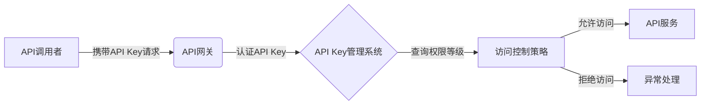

# 分级 API Key 的管理

作者：禅与计算机程序设计艺术 / Zen and the Art of Computer Programming

## 1. 背景介绍
### 1.1 问题的由来
在现代软件开发中，API(Application Programming Interface)已成为不可或缺的一部分。越来越多的公司和开发者通过开放API，让第三方应用程序能够访问其服务和资源。然而，随着API的广泛应用，API的安全问题也日益突出。未经授权的访问、数据泄露、DDoS攻击等安全威胁给API提供者带来了巨大的挑战。因此，如何有效地管理和保护API成为了一个亟待解决的问题。

### 1.2 研究现状
目前，业界普遍采用API Key的方式来对API进行访问控制和认证。API Key是一串唯一的字符串，用于标识调用者的身份。API提供者通过为每个调用者分配不同的API Key，并要求调用者在请求中携带相应的Key，从而实现对API的访问控制。

然而，传统的API Key管理方式存在一些局限性。首先，API Key通常被视为一种"一刀切"的方案，所有调用者共用同一个权限级别，无法进行更细粒度的访问控制。其次，API Key的生成、分发、更新和废弃等生命周期管理比较繁琐，容易出现管理不当导致的安全风险。

### 1.3 研究意义
针对上述问题，本文提出了一种分级API Key的管理方案。通过引入多个权限等级，并为不同的调用者分配不同级别的API Key，可以实现更细粒度的访问控制。同时，采用规范化的API Key生命周期管理流程，并引入自动化工具，可以降低管理成本并提高安全性。

分级API Key管理对于保护API安全、提高API管理效率具有重要意义。它不仅可以帮助API提供者更好地控制对其服务和资源的访问，还可以为调用者提供更灵活、更安全的API使用方式。这对于促进API经济的健康发展具有积极作用。

### 1.4 本文结构
本文将从以下几个方面展开分级API Key的管理：

1. 介绍分级API Key管理的核心概念和相关术语。 
2. 详细阐述分级API Key的技术原理和关键算法。
3. 给出分级API Key系统的参考架构和设计模式。
4. 通过一个具体的案例，演示分级API Key管理的实现过程。
5. 总结分级API Key管理的优势，并展望其未来的发展方向。

## 2. 核心概念与联系

在分级API Key管理中，有几个核心概念需要理解：

- API Key：一个唯一的字符串，用于标识API调用者的身份。调用者在请求API时需要携带相应的Key。
- 权限等级(Permission Level)：根据API调用者的不同属性（如身份、信任程度、服务等级协议等）而设定的不同访问权限。每个权限等级对应一个或多个API Key。
- API网关(API Gateway)：作为API提供者对外提供服务的入口，负责对API请求进行认证、鉴权、流量控制、计费等管理功能。
- 访问控制策略(Access Control Policy)：定义了不同权限等级对API资源的访问规则，如可以访问哪些API、可以执行哪些操作、访问频率限制等。

下图展示了这些概念之间的关系：



从图中可以看出，API调用者携带API Key向API网关发起请求，网关从API Key管理系统中认证Key的有效性，并查询其对应的权限等级。然后根据预设的访问控制策略，判断该权限等级是否允许访问目标API服务，并相应地放行或拒绝该请求。

## 3. 核心算法原理 & 具体操作步骤
### 3.1 算法原理概述
分级API Key管理的核心是权限判定算法，即根据API Key所属的权限等级，判断其是否有权限访问目标API资源。

常见的权限判定算法有基于角色的访问控制(RBAC)和基于属性的访问控制(ABAC)两种。RBAC根据API调用者的角色来确定其权限，而ABAC则通过动态计算一组属性来确定权限。下面我们以RBAC为例进行说明。

### 3.2 算法步骤详解
1. 定义角色和权限：首先需要定义系统中的角色(Role)，并给每个角色分配相应的权限(Permission)。例如，可以定义管理员、普通用户、游客等角色，分别拥有不同的API访问权限。

2. 创建API Key并关联角色：为每个API调用者创建唯一的API Key，并将其关联到特定的角色上。同一个角色可以关联多个API Key，但每个Key只能关联一个角色。

3. 提取请求中的API Key：当API网关收到一个API请求时，首先从请求头或请求参数中提取出API Key。

4. 查询Key对应的角色：根据提取出的API Key，查询API Key管理系统，获取该Key关联的角色信息。

5. 获取角色的权限：查询角色-权限关系表，获取该角色拥有的权限列表。

6. 鉴别权限：根据请求的API路径和HTTP方法，判断该请求是否在权限列表的允许范围内。如果允许，则放行该请求；否则，拒绝该请求并返回错误信息。

以上步骤可以用下面的伪代码表示：

```
function checkPermission(apiKey, apiPath, httpMethod) {
  role = getRoleByApiKey(apiKey);
  permissions = getPermissionsByRole(role);
  for each permission in permissions {
    if (matchPermission(apiPath, httpMethod, permission)) {
      return true;
    }
  }
  return false;
}
```

### 3.3 算法优缺点
RBAC的优点是概念简单、易于理解和管理。只需要对角色进行权限分配，而不需要对每个API Key单独配置权限，降低了管理复杂度。

但RBAC也有其局限性，主要体现在粒度较粗和灵活性不够两个方面。因为角色权限是预设的，对于一些需要动态调整权限的场景，就不太适用了。而且实际系统中API Key的属性可能很多，单靠角色难以进行细粒度的权限控制。

这些问题可以通过引入ABAC来解决。ABAC通过动态计算一组属性（如用户属性、环境属性、资源属性等）来实现更细粒度和灵活的权限控制，但其引入也会增加系统复杂度。

### 3.4 算法应用领域
RBAC和ABAC广泛应用于需要进行访问控制的系统中，如API管理、用户权限管理、资源授权等领域。目前，主流的API管理工具和平台都支持这两种算法，并允许用户根据实际需求进行选择和配置。

## 4. 数学模型和公式 & 详细讲解 & 举例说明
### 4.1 数学模型构建
为了形式化地描述分级API Key的权限控制，我们可以构建一个简单的数学模型。

首先定义以下符号：
- $U$：API调用者(User)的集合
- $R$：角色(Role)的集合
- $P$：权限(Permission)的集合
- $K$：API Key的集合
- $UR \subseteq U \times R$：用户-角色的多对多关系
- $RP \subseteq R \times P$：角色-权限的多对多关系
- $KR: K \to R$：API Key到角色的映射关系

其中，$UR$ 和 $RP$ 都是二元关系，分别表示用户拥有哪些角色，以及角色拥有哪些权限。$KR$ 是一个函数，表示每个API Key唯一对应一个角色。

给定一个API Key $k$，如果想要判断其是否拥有权限 $p$，就可以通过以下公式来计算：

$$
\exists r \in R,\ (KR(k),p) \in RP
$$

也就是说，只要能找到一个角色 $r$，使得 $k$ 映射到 $r$，且 $(r,p)$ 在角色-权限关系中，就可以认为 $k$ 拥有权限 $p$。

### 4.2 公式推导过程
上面的公式可以进一步推导。首先，根据 $KR$ 的定义，$k$ 一定映射到一个唯一的角色 $r_k$，即：

$$
KR(k) = r_k
$$

因此，判断 $k$ 是否拥有 $p$ 可以简化为：

$$
(r_k,p) \in RP
$$

即只需判断 $k$ 对应的角色 $r_k$ 是否拥有权限 $p$ 即可。

进一步地，我们可以定义一个判断函数 $checkPermission(k,p)$，其值为1表示 $k$ 拥有 $p$，为0表示 $k$ 不拥有 $p$，即：

$$
checkPermission(k,p) = \begin{cases}
1, & (KR(k),p) \in RP \\
0, & otherwise
\end{cases}
$$

这就得到了一个简洁的权限判定公式。

### 4.3 案例分析与讲解
下面我们通过一个具体的例子来说明上述模型的应用。

假设某API管理系统定义了以下角色和权限：
- 角色：$R = \{admin, user, guest\}$
- 权限：$P = \{read, write, delete\}$

角色-权限关系 $RP$ 如下：
- $admin$ 拥有 $read$、$write$、$delete$ 权限
- $user$ 拥有 $read$、$write$ 权限
- $guest$ 只拥有 $read$ 权限

现在有三个API Key：
- $k_1$ 对应角色 $admin$
- $k_2$ 对应角色 $user$
- $k_3$ 对应角色 $guest$

根据上面的公式，我们可以判断：
- $checkPermission(k_1, read) = 1$
- $checkPermission(k_1, write) = 1$
- $checkPermission(k_1, delete) = 1$
- $checkPermission(k_2, read) = 1$
- $checkPermission(k_2, write) = 1$
- $checkPermission(k_2, delete) = 0$
- $checkPermission(k_3, read) = 1$
- $checkPermission(k_3, write) = 0$
- $checkPermission(k_3, delete) = 0$

可以看出，不同角色的API Key拥有不同的权限，与我们预期的结果一致。

### 4.4 常见问题解答
Q: 如果一个用户拥有多个角色，其权限如何计算？
A: 可以采用最大权限原则，即用户的最终权限是其所有角色权限的并集。例如，如果用户同时拥有 $admin$ 和 $user$ 两个角色，那么他就拥有全部三种权限。这可以通过在判权函数中遍历用户的所有角色来实现。

Q: 如何动态调整某个角色的权限？
A: 可以通过修改 $RP$ 关系来动态调整角色的权限，例如为 $user$ 角色增加 $delete$ 权限。这种调整对所有关联该角色的API Key都会生效。需要注意的是，修改 $RP$ 可能需要系统管理员权限。

Q: 如何快速吊销某个API Key的权限？ 
A: 可以通过删除该API Key与角色的映射关系 $KR$ 来实现。这样该Key就变成了无效Key，无法通过权限校验。这种方式比修改 $RP$ 更加高效和安全。

## 5. 项目实践：代码实例和详细解释说明
### 5.1 开发环境搭建
下面我们使用Node.js和Express框架，来实现一个简单的分级API Key管理系统。

首先需要安装Node.js和npm包管理工具。然后创建一个新的目录，并在其中初始化npm项目：

```bash
mkdir api-key-demo
cd api-key-demo
npm init -y
```

接着安装Express框架和其他相关依赖：

```bash
npm install express body-parser jsonwebtoken
```

其中，`jsonwebtoken`是用于生成和验证JWT(JSON Web Token)的库，可以用于实现API Key。

### 5.2 源代码详细实现
1. 首先，我们定义一个`config.js`文件，用于存