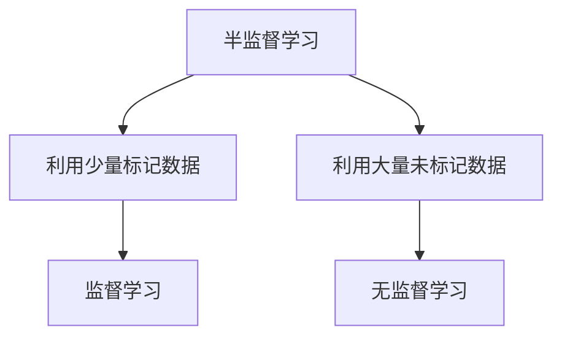
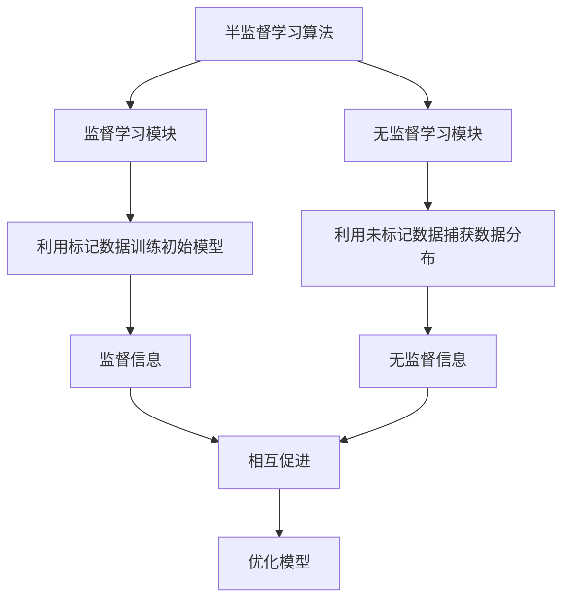

# 半监督学习 (Semi-supervised Learning)

## 1. 背景介绍

### 1.1 问题的由来

在现实世界中，获取大量高质量的标记数据通常是一个巨大的挑战。标记数据集需要耗费大量的人力和财力,这使得在某些领域几乎不可能获得足够的标记数据来训练有效的监督学习模型。与此同时,未标记的数据却随处可得且成本低廉。这就催生了半监督学习(Semi-Supervised Learning)的兴起,它旨在利用大量未标记数据与少量标记数据相结合,从而提高模型的性能和泛化能力。

### 1.2 研究现状

半监督学习作为机器学习的一个重要分支,近年来受到了广泛的关注和研究。学术界和工业界都在积极探索和发展各种半监督学习算法,以期在各种应用场景中发挥其优势。目前,半监督学习已经在图像分类、自然语言处理、推荐系统等多个领域取得了令人瞩目的成绩。

### 1.3 研究意义

半监督学习的研究意义主要体现在以下几个方面:

1. **数据效率**:通过有效利用未标记数据,可以极大地减少对昂贵的标记数据的依赖,从而降低数据获取成本。

2. **性能提升**:合理地利用未标记数据,可以为模型提供更多的信息,从而提高模型的性能和泛化能力。

3. **应用前景**:半监督学习为解决现实世界中的数据稀缺问题提供了一种有效的途径,因此具有广阔的应用前景。

4. **理论挑战**:半监督学习涉及到监督学习和无监督学习的结合,需要解决一些理论上的挑战,这为机器学习理论的发展提供了新的契机。

### 1.4 本文结构

本文将全面介绍半监督学习的核心概念、算法原理、数学模型、实践应用等内容。文章结构安排如下:

- 第2部分介绍半监督学习的核心概念及其与监督学习和无监督学习的联系。
- 第3部分详细阐述半监督学习的核心算法原理及具体操作步骤。
- 第4部分构建半监督学习的数学模型,推导公式并进行案例分析。
- 第5部分提供半监督学习的代码实例,并进行详细的解释说明。
- 第6部分探讨半监督学习在实际应用场景中的运用。
- 第7部分推荐相关的学习资源、开发工具和论文等。
- 第8部分总结半监督学习的研究成果,展望未来发展趋势和面临的挑战。
- 第9部分列出常见问题并给出解答。

## 2. 核心概念与联系

半监督学习(Semi-Supervised Learning)是介于监督学习(Supervised Learning)和无监督学习(Unsupervised Learning)之间的一种机器学习范式。它旨在利用少量标记数据(Labeled Data)和大量未标记数据(Unlabeled Data)相结合,从而提高模型的性能和泛化能力。

半监督学习与监督学习和无监督学习的关系可以用上图来概括:

- 与监督学习相比,半监督学习利用了大量未标记数据,减少了对昂贵标记数据的依赖。
- 与无监督学习相比,半监督学习利用了少量标记数据,提供了一些监督信息,有助于提高模型的性能。

因此,半监督学习可以被视为监督学习和无监督学习的一种有效结合,它既可以利用标记数据提供的监督信息,又可以利用未标记数据提供的数据分布信息,从而达到更好的学习效果。

半监督学习的核心思想是:在学习过程中,利用已标记的数据进行监督学习,同时利用未标记的数据进行无监督学习,并将两者的优点结合起来,从而获得比单一监督学习或无监督学习更好的性能。

## 3. 核心算法原理 & 具体操作步骤

### 3.1 算法原理概述

半监督学习算法的核心原理可以概括为以下三个方面:

1. **利用标记数据进行监督学习**:通过标记数据训练一个初始的监督模型,作为半监督学习的基础。

2. **利用未标记数据进行无监督学习**:通过对未标记数据进行聚类、降维等无监督学习,捕获数据的内在结构和分布信息。

3. **监督学习与无监督学习相互促进**:将监督学习和无监督学习的结果相互结合,使两者相互促进,从而提高模型的性能和泛化能力。

上图展示了半监督学习算法的基本工作流程:

1. 监督学习模块利用标记数据训练一个初始模型,提供监督信息。
2. 无监督学习模块利用未标记数据捕获数据的内在结构和分布信息,提供无监督信息。
3. 监督信息和无监督信息相互促进,优化模型的性能。

不同的半监督学习算法在具体实现上会有所不同,但都遵循上述基本原理。

### 3.2 算法步骤详解

半监督学习算法的具体步骤可以概括为以下几个步骤:

1. **数据准备**:收集标记数据集 $D_l = \{(x_i, y_i)\}_{i=1}^{l}$ 和未标记数据集 $D_u = \{x_i\}_{i=l+1}^{l+u}$,其中 $l$ 表示标记数据的数量, $u$ 表示未标记数据的数量。

2. **初始监督学习**:利用标记数据集 $D_l$ 训练一个初始的监督学习模型 $f_0$,作为半监督学习的基础模型。常用的监督学习算法包括支持向量机(SVM)、决策树、神经网络等。

3. **无监督学习**:对未标记数据集 $D_u$ 进行无监督学习,捕获数据的内在结构和分布信息。常用的无监督学习方法包括聚类算法(如K-Means)、降维算法(如PCA)、生成模型(如高斯混合模型)等。

4. **半监督学习迭代**:将监督学习和无监督学习的结果相互结合,进行迭代优化。具体做法是:

   a. 利用当前模型 $f_t$ 对未标记数据集 $D_u$ 进行预测,获得伪标记数据集 $\tilde{D}_u = \{(x_i, \tilde{y}_i)\}_{i=l+1}^{l+u}$。
   
   b. 将伪标记数据集 $\tilde{D}_u$ 与原始标记数据集 $D_l$ 合并,构建扩展训练集 $D_{ext} = D_l \cup \tilde{D}_u$。
   
   c. 利用扩展训练集 $D_{ext}$ 重新训练监督学习模型,获得新的模型 $f_{t+1}$。
   
   d. 重复上述步骤,直至模型收敛或达到预设的迭代次数。

5. **模型评估**:在保留的测试集上评估最终模型的性能,并根据需要进行微调和优化。

通过上述步骤,半监督学习算法可以有效地利用标记数据和未标记数据,提高模型的性能和泛化能力。

### 3.3 算法优缺点

半监督学习算法相比于纯监督学习和纯无监督学习,具有以下优缺点:

**优点**:

1. **数据效率高**:能够有效利用大量未标记数据,减少对昂贵标记数据的依赖。
2. **性能提升**:合理利用未标记数据,可以为模型提供更多的信息,提高模型的性能和泛化能力。
3. **适用范围广**:半监督学习可以应用于各种领域,如图像分类、自然语言处理、推荐系统等。

**缺点**:

1. **算法复杂性高**:半监督学习算法需要同时处理标记数据和未标记数据,算法实现相对复杂。
2. **理论基础薄弱**:半监督学习的理论基础相对薄弱,缺乏统一的理论框架。
3. **伪标记质量影响大**:算法的性能heavily依赖于伪标记的质量,伪标记质量差会导致算法性能下降。

### 3.4 算法应用领域

半监督学习算法由于其独特的优势,在多个领域都有广泛的应用:

1. **图像分类**:利用少量标记图像和大量未标记图像,提高图像分类的性能。
2. **自然语言处理**:利用少量标记语料和大量未标记语料,提高文本分类、机器翻译等任务的性能。
3. **推荐系统**:利用少量用户反馈数据和大量未标记的用户行为数据,提高推荐系统的准确性。
4. **生物信息学**:利用少量标记基因数据和大量未标记基因数据,提高基因表达分析的性能。
5. **异常检测**:利用少量标记异常数据和大量未标记数据,提高异常检测的准确率。
6. **医疗健康**:利用少量标记病例数据和大量未标记病例数据,提高疾病诊断的准确性。

总的来说,半监督学习算法在数据标记成本高、未标记数据丰富的领域具有广阔的应用前景。

## 4. 数学模型和公式 & 详细讲解 & 举例说明

### 4.1 数学模型构建

半监督学习的数学模型通常是在监督学习和无监督学习的基础上进行扩展和改进。我们先回顾一下监督学习和无监督学习的基本模型,然后介绍半监督学习的数学模型。

**监督学习模型**:

给定标记数据集 $D_l = \{(x_i, y_i)\}_{i=1}^{l}$,监督学习的目标是学习一个模型 $f: \mathcal{X} \rightarrow \mathcal{Y}$,使得对于任意输入 $x \in \mathcal{X}$,模型 $f(x)$ 可以很好地预测其对应的输出 $y \in \mathcal{Y}$。常见的监督学习模型包括线性回归、逻辑回归、支持向量机等。

**无监督学习模型**:

给定未标记数据集 $D_u = \{x_i\}_{i=1}^{u}$,无监督学习的目标是发现数据的内在结构和规律,例如对数据进行聚类或降维。常见的无监督学习模型包括K-Means聚类、高斯混合模型、主成分分析(PCA)等。

**半监督学习模型**:

半监督学习模型旨在利用标记数据集 $D_l$ 和未标记数据集 $D_u$ 相结合,学习一个更加准确的模型 $f: \mathcal{X} \rightarrow \mathcal{Y}$。具体来说,半监督学习模型通常包括以下几个部分:

1. **监督学习部分**:利用标记数据集 $D_l$ 学习一个初始的监督模型 $f_0$,例如使用支持向量机或神经网络等算法。

2. **无监督学习部分**:利用未标记数据集 $D_u$ 学习数据的内在结构和分布信息,例如使用聚类算法或生成模型等方法。

3. **半监督学习部分**:将监督学习和无监督学习的结果相互结合,通过迭代优化的方式学习最终的模型 $f^*$。

半监督学习模型的目标函数通常是一个复合损失函数,包括监督损失项和无监督正则化项,形式如下:

$$J(f) = J_l(f; D_l) + \lambda J_u(f; D_