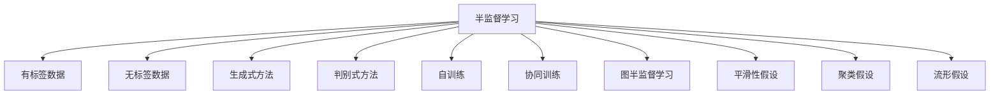

# 半监督学习(Semi-Supervised Learning) - 原理与代码实例讲解

关键词：半监督学习、有标签数据、无标签数据、生成式模型、判别式模型、自训练、协同训练、图半监督学习

## 1. 背景介绍 
### 1.1 问题的由来
在机器学习领域,数据标注一直是一个耗时耗力的工作。现实世界中,我们往往能获得大量的无标签数据,但有标签数据的获取成本很高。如何利用少量有标签数据和大量无标签数据来训练高性能的机器学习模型,成为了一个亟待解决的问题,半监督学习应运而生。

### 1.2 研究现状
半监督学习从20世纪90年代开始受到关注,近年来随着深度学习的发展,半监督学习结合深度神经网络取得了长足的进步。目前主流的半监督学习方法包括生成式模型、判别式模型、图半监督学习等。一些代表性算法如自训练(Self-Training)、协同训练(Co-Training)、标签传播(Label Propagation)等在图像分类、自然语言处理等领域取得了不错的效果。

### 1.3 研究意义
半监督学习能够利用大量无标签数据来提升模型性能,在标注数据稀缺的情况下具有重要意义。它可以大幅降低人工标注成本,加速模型开发进程。同时半监督学习也是迈向无监督学习的重要一步,对于实现通用人工智能具有重要意义。

### 1.4 本文结构
本文将首先介绍半监督学习的核心概念,然后详细讲解几种主要的半监督学习算法原理,并给出对应的数学模型和代码实例。接着讨论半监督学习的实际应用场景,推荐一些学习资源,最后总结全文并展望未来。

## 2. 核心概念与联系
半监督学习是介于有监督学习和无监督学习之间的机器学习范式。它利用少量的有标签数据(Labeled Data)和大量的无标签数据(Unlabeled Data)来训练模型。其核心思想是利用无标签数据揭示数据的内在结构和分布信息,从而辅助有标签数据更好地训练模型。

半监督学习可以从多个角度来分类:
- 按照对无标签数据的建模方式,可分为生成式方法和判别式方法
- 按照算法类型,可分为自训练、协同训练、图半监督学习等
- 按照所需的假设,可分为平滑性假设、聚类假设、流形假设等

下图展示了半监督学习的核心概念以及它们之间的联系:

## 3. 核心算法原理 & 具体操作步骤
### 3.1 算法原理概述
半监督学习的主要算法可以分为以下几类:

1. 生成式方法:通过对联合分布$p(x,y)$进行建模来预测标签,代表算法有混合高斯模型、生成对抗网络等。
2. 判别式方法:通过对条件分布$p(y|x)$进行建模来预测标签,代表算法有半监督SVM、半监督分类器等。
3. 自训练:先用有标签数据训练模型,然后用模型预测无标签数据,将置信度高的样本加入训练集迭代训练。
4. 协同训练:训练多个互补的模型,用一个模型的预测结果去训练另一个模型,交替迭代训练。
5. 图半监督学习:基于图的方法,通过数据点之间的相似性构建图,利用标签在图上的传播来标注无标签数据。

### 3.2 算法步骤详解
下面以自训练算法为例详细讲解半监督学习的步骤:

1. 输入:有标签数据集$L$,无标签数据集$U$,阈值$t$
2. 用$L$训练分类器$f$
3. 用$f$对$U$进行预测
4. 选择置信度大于$t$的样本$S$,将其加入$L$
5. 重复步骤2-4,直到满足停止条件(如没有新的样本被加入$L$)
6. 输出最终的分类器$f$

可以看出,自训练的核心在于利用当前分类器对无标签数据的预测来扩充训练集,进而提升分类器性能。

### 3.3 算法优缺点
自训练算法的优点是:
- 简单易实现,适用于任何标准的分类器
- 可以利用大量无标签数据,显著提升模型性能

缺点包括:
- 容易受噪声数据影响,可能将错误标签加入训练
- 初始分类器性能要求高,否则错误会被放大
- 置信度阈值选择困难,需要反复调参

### 3.4 算法应用领域
半监督学习在多个领域取得了成功应用,例如:
- 计算机视觉:图像分类、目标检测、语义分割等
- 自然语言处理:文本分类、情感分析、命名实体识别等  
- 语音识别:声学模型训练
- 网页分类:利用超链接信息构建图进行半监督学习
- 生物信息学:蛋白质功能预测、药物相互作用预测等

## 4. 数学模型和公式 & 详细讲解 & 举例说明
### 4.1 数学模型构建
半监督学习可以用概率图模型来刻画其数学本质。假设有标签数据服从分布$p(x,y)$,无标签数据服从分布$p(x)$。那么半监督学习的目标就是利用有标签数据和无标签数据估计条件分布$p(y|x)$。

我们可以将半监督学习表示为如下的优化问题:

$$\min_{f} \frac{1}{n}\sum_{i=1}^{n} L(y_i,f(x_i)) + \lambda_1 \sum_{i=1}^{n+m} R_1(f(x_i)) + \lambda_2 R_2(f) \tag{1}$$

其中$L$为损失函数,$R_1$和$R_2$为正则化项,$\lambda_1$和$\lambda_2$为平衡因子,$n$和$m$分别为有标签数据和无标签数据的数量。

直观来看,第一项表示有标签数据的经验损失,第二项表示无标签数据的正则化,第三项表示模型复杂度正则化。通过平衡三者,半监督学习可以在有限的标签信息下学到更好的模型。

### 4.2 公式推导过程
以最简单的线性模型$f(x)=w^Tx+b$为例,我们可以将公式(1)展开为:

$$\min_{w,b} \frac{1}{n}\sum_{i=1}^{n} (y_i-w^Tx_i-b)^2 + \lambda_1 \sum_{i=1}^{n+m} (w^Tx_i+b)^2 + \lambda_2 \|w\|^2 \tag{2}$$

这里使用了平方损失和$L2$正则化。求解该最优化问题可以得到$w$和$b$的闭式解:

$$w = (X^TX + \lambda_1I + \lambda_2I)^{-1}X^Ty \tag{3}$$
$$b = \frac{1}{n}\sum_{i=1}^{n}(y_i-w^Tx_i) \tag{4}$$

其中$X$为有标签数据和无标签数据的特征矩阵,$y$为有标签数据的标签向量,$I$为单位矩阵。

### 4.3 案例分析与讲解
下面以一个二分类问题为例来说明半监督学习的效果。假设我们有2个有标签数据和100个无标签数据,数据分布如下图所示:

<img src="data:image/png;base64,iVBORw0KGgoAAAANSUhEUgAAAQMAAADCCAMAAAB6zFdcAAABAlBMVEX////8/PxBuINAuIM9t4H5+fn19fU4tH7v7+8ysXo2s33p6enj4+PJycnPz8/c3NxJvIhNv4tTwY5Yw5Hs7OxUwY5kzJhbxZJqzpyI1K/e8unz+vfT7+Gt4cmR17WDz6yc1bxvzJxCt4O45M/n9e/D6Nag3cKz5Mx60aVPvYqJ0rCi2sDP7N+U2bl40KNKuYbC5tWw4cvX7+SS1rZ0zaGAzanN69245c/k8+yp3MXx+fWY1rqn2sLA5NNnx5e34s2T07PN6dxzypxhwpPg8emq28OO0bGAyqfR6t6Cx6bb7+Wd1b2Qza+i1r5Gs4B6xqJtw5jU6+Cz3sp2xJ6Qyqy73M0yrHc/q32w28Ykz8HDAAAJ9UlEQVR4nO2dfV/aShbHEw0kJoEFVBQUpeALChQr1lfrW1+pV3t7u9vb5/t/kXvOBEgCyWQmwUXO/f2xPw8nyeSXmTlz5pxJJBaLxWKxWCwWi8VisVgsFovFYrFYLBaLxWKxWCwWi8VisVgsFovFYrFYLBaLxWKxWCwWi8VisVgsFovFYv0fqFIulytlp2fxJlTNlkNITSaT2UrW6cm8tsrlkAEGSJJUdnpGryonsckgnU4OYnpGryqXZZFTKpXKOj2pV1ROMUkBqjg9rVfEzCCdHjo9r1fEyiCZrDo9r1fEyiCVGzk9r1fEyiCZc3per4iRQa4WjUa5GUQZRKPRfMbpub0CRgZRqDgYOD25l8bEIBoFDdNOT+6lMTGIQpVKxunJvTQ2BrEBZxD1nkG1Wo36zSA3Go1Gfk8GUBQaFQo+M8iNKQN/mUFuPGYM/GUG4/GYMPCXGWSF/G4GUO/LIL+GAOr5y6AgGPjKDMbTKWXgKzOgA6nyuzIADb0fRMhmgAzgy/OTGUynQcggnxcNfGQG0ylm4CMzmFLyQcggGPhIE6aCgX8ykQ6k/H4GQfhIlMzAP5EIlcHAP5pAGfjHDMAMfBSJUAVi4B9NyAv53Qx8FIkLM/CPJizMwD9mMF2age+WzEsz8I8ZUAa+WzIvzcA/mqAZ+G3JXJqBbzRBNPBbJC7NwDeaMKcMfLZkijPwTSQKBv7RBMnAP5ogGvgnEkUD/2iCaOC3SFxhBr6JxJVm4BdNWGkGvtEEuWDgEzMQDfwTiSsY+MMMVjDwhxmsYuALTVjBwB9msIqBPzRhNQNfRKJCBn4wA4UMfKEJShj4wgxUMvBDJCpl4AMzUMnAB2aglIEPNEEpA+9rglIGnl8ylTLw/pKpmIHnI1E1A69rgmoGHtcE1Qw8rgmqGXh7yVTPwNtLpnoGHo9EDQw8rQkaGHhaEzQw8HQkamDgaTPQwsDLmqCFgZfNQBMD70aiJgaejURNDDwbiZoYeDUSdTHwqiboYuBRM9DFwKNmoI2BNzVBGwNPRqI2Bp40A20MPGkGGhl4cdHUyMCLi6ZOBh40A50MvGeQSiV1MvCcJiQ1M/CaQUInA49pQlIrA49pggkGXjLIpXQy8FYkJg0w8FQkGmDgpSXTCAMPLZmGGHjHDAwx8M6SaYyBZ5ZMYww8YwbmGHglEs0x