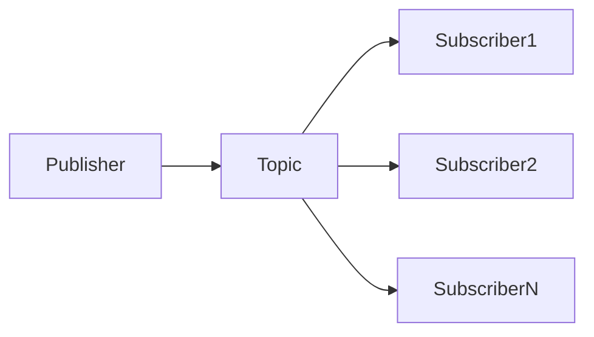

# 发布订阅 原理与代码实例讲解

关键词：发布订阅模式、消息中间件、异步通信、解耦、可扩展性、RabbitMQ、Kafka

## 1. 背景介绍

### 1.1 问题的由来
在现代软件系统中，各个组件之间的通信和数据交换变得越来越复杂。传统的同步通信方式，如 HTTP 请求/响应模型，在处理大规模分布式系统时面临诸多挑战，如系统耦合度高、可扩展性差等问题。因此，需要一种更加灵活、可扩展的通信机制来应对这些挑战。

### 1.2 研究现状
发布订阅模式（Publish-Subscribe Pattern）作为一种异步通信模式，已经在业界得到广泛应用。许多消息中间件如 RabbitMQ、Kafka 等都支持发布订阅模式。目前，发布订阅模式已成为构建松耦合、可扩展系统的重要手段之一。

### 1.3 研究意义
深入研究发布订阅模式的原理和实现，对于设计和开发高性能、可扩展的分布式系统具有重要意义。通过理解发布订阅模式的核心概念、工作原理以及代码实现，可以帮助开发者更好地应用该模式，提高系统的灵活性和可维护性。

### 1.4 本文结构
本文将从以下几个方面对发布订阅模式进行深入探讨：

1. 介绍发布订阅模式的核心概念和相关术语。
2. 详细阐述发布订阅模式的工作原理和关键步骤。
3. 结合数学模型和公式，对发布订阅模式进行理论分析。
4. 通过代码实例，演示发布订阅模式的具体实现。
5. 探讨发布订阅模式的实际应用场景。
6. 推荐相关的工具和学习资源。
7. 总结发布订阅模式的未来发展趋势和面临的挑战。
8. 提供常见问题的解答，帮助读者更好地理解和应用发布订阅模式。

## 2. 核心概念与联系

在发布订阅模式中，有以下几个核心概念：

- 发布者（Publisher）：负责生产和发送消息的组件。
- 订阅者（Subscriber）：对感兴趣的主题进行订阅，接收并处理消息的组件。
- 主题（Topic）：一个逻辑上的消息分类，发布者将消息发布到特定主题，订阅者订阅感兴趣的主题。
- 消息（Message）：发布者和订阅者之间传递的数据单元。
- 消息中间件（Message Broker）：负责消息的存储、转发和管理的中间件系统，如 RabbitMQ、Kafka 等。

这些概念之间的关系如下图所示：



发布者将消息发布到特定主题，消息中间件负责将消息分发给订阅了该主题的订阅者。订阅者接收到消息后进行相应的处理。

## 3. 核心算法原理 & 具体操作步骤

### 3.1 算法原理概述
发布订阅模式的核心算法可以概括为以下几个步骤：

1. 发布者将消息发布到特定主题。
2. 消息中间件接收到消息，将其存储在内部的消息队列中。
3. 消息中间件根据订阅关系，将消息转发给订阅了该主题的订阅者。
4. 订阅者接收到消息，对消息进行处理。

### 3.2 算法步骤详解

1. 发布消息：
   - 发布者创建一个消息对象，指定消息的主题和内容。
   - 发布者通过消息中间件提供的 API 将消息发布到指定主题。

2. 消息存储：
   - 消息中间件接收到发布者发布的消息。
   - 消息中间件将消息存储在内部的消息队列中，并为每个主题维护一个独立的消息队列。

3. 消息转发：
   - 消息中间件根据订阅关系，将消息从主题的消息队列中取出。
   - 消息中间件将消息转发给订阅了该主题的所有订阅者。

4. 消息处理：
   - 订阅者接收到消息后，根据自己的业务逻辑对消息进行处理。
   - 订阅者可以选择同步或异步的方式处理消息。

### 3.3 算法优缺点

优点：
- 解耦发布者和订阅者，提高系统的灵活性和可扩展性。
- 支持异步通信，发布者无需等待订阅者的响应，提高系统的并发性能。
- 消息中间件提供可靠的消息传递保证，确保消息不会丢失。

缺点：
- 引入了额外的消息中间件组件，增加了系统复杂度。
- 消息的时序性无法保证，不同订阅者接收消息的顺序可能不一致。
- 需要妥善处理消息的重复消费和幂等性问题。

### 3.4 算法应用领域
发布订阅模式广泛应用于以下领域：

- 分布式系统的事件通知和状态同步。
- 微服务架构中服务之间的解耦和通信。
- 实时数据处理和流式计算系统。
- 消息队列系统的核心通信机制。

## 4. 数学模型和公式 & 详细讲解 & 举例说明

### 4.1 数学模型构建
我们可以使用集合论来建模发布订阅系统。假设有 $n$ 个发布者和 $m$ 个订阅者，定义以下集合：

- $P = \{p_1, p_2, ..., p_n\}$：发布者集合。
- $S = \{s_1, s_2, ..., s_m\}$：订阅者集合。
- $T = \{t_1, t_2, ..., t_k\}$：主题集合。

定义以下关系：

- $publish: P \times T \rightarrow M$：发布关系，表示发布者 $p_i$ 向主题 $t_j$ 发布消息 $m_k$。
- $subscribe: S \times T \rightarrow \{0, 1\}$：订阅关系，表示订阅者 $s_i$ 是否订阅了主题 $t_j$。

### 4.2 公式推导过程
根据以上定义，我们可以推导出以下公式：

1. 发布者 $p_i$ 发布消息 $m_k$ 到主题 $t_j$ 的数学表示：

$$publish(p_i, t_j) = m_k$$

2. 订阅者 $s_i$ 订阅主题 $t_j$ 的数学表示：

$$subscribe(s_i, t_j) = \begin{cases}
1, & \text{if } s_i \text{ subscribes to } t_j \\
0, & \text{otherwise}
\end{cases}$$

3. 订阅者 $s_i$ 接收到主题 $t_j$ 的消息 $m_k$ 的条件：

$$receive(s_i, m_k) \Leftrightarrow \exists p_i \in P, t_j \in T: publish(p_i, t_j) = m_k \wedge subscribe(s_i, t_j) = 1$$

### 4.3 案例分析与讲解
假设有三个发布者 $P = \{p_1, p_2, p_3\}$，四个订阅者 $S = \{s_1, s_2, s_3, s_4\}$，以及两个主题 $T = \{t_1, t_2\}$。

订阅关系如下：
- $s_1$ 订阅了主题 $t_1$。
- $s_2$ 订阅了主题 $t_1$ 和 $t_2$。
- $s_3$ 订阅了主题 $t_2$。
- $s_4$ 没有订阅任何主题。

发布者 $p_1$ 向主题 $t_1$ 发布消息 $m_1$，发布者 $p_2$ 向主题 $t_2$ 发布消息 $m_2$，发布者 $p_3$ 向主题 $t_1$ 发布消息 $m_3$。

根据以上条件，我们可以得出以下结论：
- 订阅者 $s_1$ 将接收到消息 $m_1$ 和 $m_3$。
- 订阅者 $s_2$ 将接收到消息 $m_1$、$m_2$ 和 $m_3$。
- 订阅者 $s_3$ 将接收到消息 $m_2$。
- 订阅者 $s_4$ 不会接收到任何消息。

### 4.4 常见问题解答

1. 问：发布订阅模式中的消息顺序如何保证？
   答：发布订阅模式本身并不保证消息的顺序性。如果需要严格的消息顺序，可以在消息中添加序列号或时间戳，并在订阅者端按照序列号或时间戳对消息进行排序处理。

2. 问：如何处理消息的重复消费问题？
   答：可以通过为每个消息分配唯一的消息 ID，并在订阅者端记录已经处理过的消息 ID，来避免重复消费。当收到一个消息时，首先检查其 ID 是否已经处理过，如果已处理则直接丢弃，否则进行处理并记录该 ID。

3. 问：发布订阅模式如何实现消息的持久化？
   答：消息中间件通常提供消息持久化的功能。可以将消息持久化到磁盘或数据库中，以确保在系统故障或重启后能够恢复未处理的消息。持久化的方式和配置取决于具体的消息中间件实现。

## 5. 项目实践：代码实例和详细解释说明

### 5.1 开发环境搭建
本节将使用 Python 语言和 RabbitMQ 消息中间件来演示发布订阅模式的代码实现。首先，需要安装以下工具和库：

- Python 3.x
- RabbitMQ 服务器
- Pika：Python 的 RabbitMQ 客户端库

可以使用以下命令安装 Pika 库：

```bash
pip install pika
```

### 5.2 源代码详细实现

#### 5.2.1 发布者代码

```python
import pika

# 建立与 RabbitMQ 的连接
connection = pika.BlockingConnection(pika.ConnectionParameters('localhost'))
channel = connection.channel()

# 声明交换机
channel.exchange_declare(exchange='logs', exchange_type='fanout')

# 发布消息
message = "Hello, subscribers!"
channel.basic_publish(exchange='logs', routing_key='', body=message)
print("Sent message: %r" % message)

# 关闭连接
connection.close()
```

#### 5.2.2 订阅者代码

```python
import pika

# 建立与 RabbitMQ 的连接
connection = pika.BlockingConnection(pika.ConnectionParameters('localhost'))
channel = connection.channel()

# 声明交换机
channel.exchange_declare(exchange='logs', exchange_type='fanout')

# 创建临时队列
result = channel.queue_declare(queue='', exclusive=True)
queue_name = result.method.queue

# 将队列绑定到交换机
channel.queue_bind(exchange='logs', queue=queue_name)

print("Waiting for messages...")

# 定义回调函数处理接收到的消息
def callback(ch, method, properties, body):
    print("Received message: %r" % body)

# 设置消费者参数
channel.basic_consume(queue=queue_name, on_message_callback=callback, auto_ack=True)

# 开始消费消息
channel.start_consuming()
```

### 5.3 代码解读与分析

发布者代码解读：
1. 建立与 RabbitMQ 的连接，创建一个信道（Channel）。
2. 声明一个类型为 fanout 的交换机，名为 "logs"。
3. 使用 `basic_publish` 方法发布消息到交换机，指定交换机名称为 "logs"，路由键为空字符串。
4. 关闭与 RabbitMQ 的连接。

订阅者代码解读：
1. 建立与 RabbitMQ 的连接，创建一个信道。
2. 声明一个类型为 fanout 的交换机，名为 "logs"。
3. 创建一个临时队列，并获取队列名称。
4. 将临时队列绑定到 "logs" 交换机。
5. 定义一个回调函数 `callback`，用于处理接收到的消息。
6. 设置消费者参数，指定要消费的队列和回调函数。
7. 开始消费消息，等待接收消息并调用回调函数进行处理。

### 5.4 运行