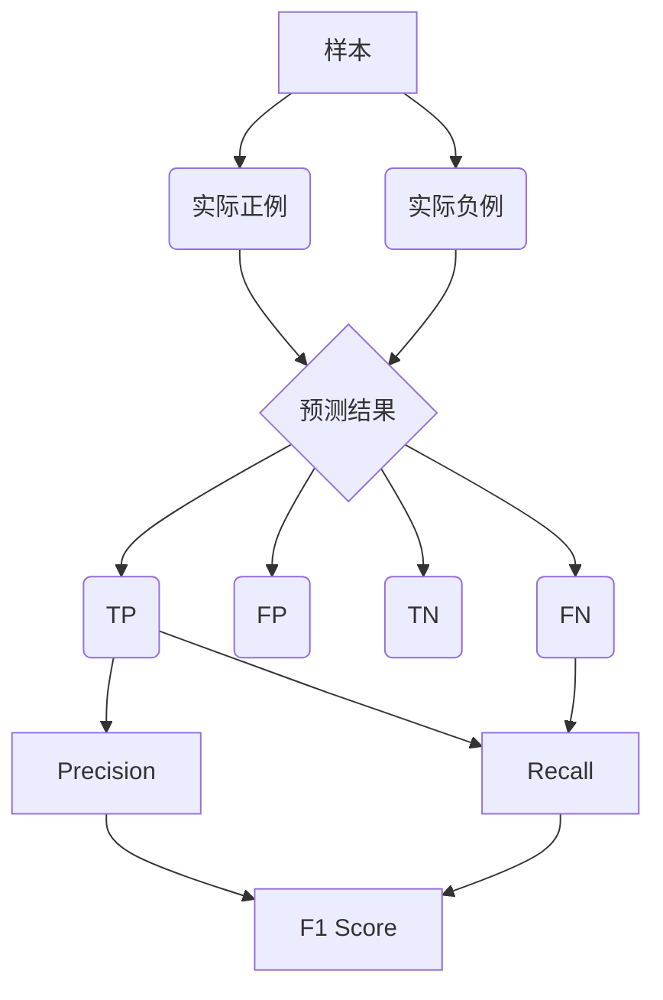

# 召回率Recall原理与代码实例讲解

## 1. 背景介绍

### 1.1 问题的由来
在信息检索和机器学习领域中,评估一个模型或算法的性能是非常重要的。召回率(Recall)作为一个关键的评估指标,在许多场景下都扮演着重要角色,如搜索引擎、推荐系统、医疗诊断等。然而,对于初学者来说,理解召回率的概念和计算方法可能会有些困难。

### 1.2 研究现状
目前,关于召回率的研究主要集中在如何在不同场景下合理地使用和改进这一指标。例如,在不平衡数据集下,召回率可能会受到数据分布的影响而失真。一些研究者提出了如F1分数、G-mean等改进指标来平衡召回率和精确率。

### 1.3 研究意义
深入理解召回率的原理和计算方法,对于机器学习和数据挖掘从业者来说非常重要。这不仅有助于我们选择合适的评估指标,也能帮助我们更好地优化模型。同时,召回率也是理解其他评估指标如F1分数的基础。

### 1.4 本文结构
本文将从召回率的基本概念出发,详细讲解其定义和计算公式。然后,我们将通过一个实际的二分类问题,演示如何用Python代码实现召回率的计算。最后,我们还将讨论召回率在实际应用中的一些注意事项,以及未来的研究方向。

## 2. 核心概念与联系

在介绍召回率之前,我们先来回顾一下二分类问题中的几个关键概念:

- 真正例(True Positive,TP):被模型预测为正例,且实际也是正例的样本。
- 假正例(False Positive,FP):被模型预测为正例,但实际是负例的样本。
- 真负例(True Negative,TN):被模型预测为负例,且实际也是负例的样本。
- 假负例(False Negative,FN):被模型预测为负例,但实际是正例的样本。

有了以上概念,我们就可以给出召回率的定义:

$$ Recall = \frac{TP}{TP+FN} $$

可以看出,召回率衡量的是模型找出的所有正例占实际正例总数的比例。它反映了模型对正例的"查全"能力。

召回率与精确率(Precision)是一对孪生兄弟,它们经常被一起使用来评估模型性能:

$$ Precision = \frac{TP}{TP+FP} $$

精确率衡量的是模型预测的正例中有多少是真正例,反映了模型对正例的"查准"能力。

召回率和精确率是一对矛盾体,在实际应用中需要根据具体问题来权衡两者的重要性。我们经常用F1分数来综合考虑二者:

$$ F1 = \frac{2 \times Precision \times Recall}{Precision + Recall} $$

下图展示了这些概念之间的关系:



## 3. 核心算法原理 & 具体操作步骤

### 3.1 算法原理概述
召回率的计算过程可以分为以下几步:
1. 对测试集样本进行预测,得到预测结果。
2. 将预测结果与真实标签进行比较,统计TP和FN的数量。
3. 根据召回率公式进行计算。

### 3.2 算法步骤详解
下面我们用Python代码来演示如何计算召回率。假设我们有一个二分类模型,对一个测试集进行预测:

```python
from sklearn.metrics import recall_score

y_true = [1, 0, 1, 1, 0, 1, 0, 0, 1, 0] # 真实标签
y_pred = [1, 0, 0, 1, 0, 0, 1, 0, 1, 1] # 预测标签

recall = recall_score(y_true, y_pred)
print(f'Recall: {recall:.2f}')
```

输出结果:
```
Recall: 0.60
```

可以看出,我们的模型在这个测试集上的召回率是0.6,即找出了60%的正例。

我们也可以手工计算召回率,以加深理解:

```python
tp = sum((y_true == 1) & (y_pred == 1))
fn = sum((y_true == 1) & (y_pred == 0))
recall = tp / (tp + fn)
print(f'Recall: {recall:.2f}')
```

这里我们先统计了TP和FN的数量,然后根据公式计算召回率,结果与直接调用`recall_score`函数一致。

### 3.3 算法优缺点
召回率的优点在于:
- 概念简单,易于理解和计算。
- 能够衡量模型对正例的"查全"能力,在某些场景下(如医疗诊断)非常重要。

召回率的缺点包括:
- 只关注正例,忽略了负例的预测情况。
- 与精确率是一对矛盾体,单独使用可能会误导我们对模型性能的判断。

### 3.4 算法应用领域
召回率在许多领域都有广泛应用,例如:
- 信息检索:衡量搜索引擎返回的相关文档占所有相关文档的比例。
- 推荐系统:衡量推荐算法能够推荐出用户感兴趣物品的能力。
- 医疗诊断:衡量诊断模型能够找出所有患者的能力,避免漏诊。
- 垃圾邮件检测:衡量模型能够将垃圾邮件识别出来的能力。

## 4. 数学模型和公式 & 详细讲解 & 举例说明

### 4.1 数学模型构建
召回率的数学模型可以用一个简单的公式表达:

$$ Recall = \frac{TP}{TP+FN} $$

其中,$TP$表示真正例的数量,$FN$表示假负例的数量。

### 4.2 公式推导过程
召回率公式可以从混淆矩阵(Confusion Matrix)中推导出来。混淆矩阵是一个二维表格,用于展示模型的预测结果与真实情况的差异:

|      | 预测正例    | 预测负例    |
|------|-------------|-------------|
| 实际正例 | $TP$        | $FN$        |
| 实际负例 | $FP$        | $TN$        |

召回率就是$TP$占实际正例总数$(TP+FN)$的比例。

### 4.3 案例分析与讲解
我们再来看一个具体的例子。假设某医院开发了一个模型,用于预测患者是否患有某种疾病。我们从医院的历史数据中抽取了100个患者的记录作为测试集,其中20个患者实际患病。模型的预测结果如下:

|      | 预测患病    | 预测未患病    |
|------|-------------|--------------|
| 实际患病 | 15          | 5            |
| 实际未患病 | 3          | 77           |

我们可以计算模型在这个测试集上的召回率:

$$ Recall = \frac{15}{15+5} = 0.75 $$

即模型正确识别出了75%的患病者。这个指标告诉我们,尽管模型有一定的漏诊率,但总体上对患者的查全能力还是不错的。

### 4.4 常见问题解答
问:如果一个模型的召回率很高,是否就意味着它是一个好模型?

答:不一定。召回率只反映了模型对正例的查全能力,并没有考虑负例。如果一个模型对所有样本都预测为正例,它的召回率会达到100%,但显然这不是一个好模型。我们还需要同时关注模型的精确率,或者用F1分数来平衡两者。只有召回率和精确率都较高的模型,才能算是比较好的模型。

## 5. 项目实践:代码实例和详细解释说明

### 5.1 开发环境搭建
我们将使用Python 3和Scikit-learn库来实现召回率的计算。首先确保你已经安装了以下库:
- NumPy
- Scikit-learn

如果没有安装,可以使用pip进行安装:

```bash
pip install numpy scikit-learn
```

### 5.2 源代码详细实现
下面是一个完整的示例代码,演示了如何训练一个简单的逻辑回归模型,并计算其在测试集上的召回率:

```python
from sklearn.datasets import make_classification
from sklearn.model_selection import train_test_split
from sklearn.linear_model import LogisticRegression
from sklearn.metrics import recall_score

# 生成一个二分类数据集
X, y = make_classification(n_samples=1000, n_classes=2, random_state=42)

# 划分训练集和测试集
X_train, X_test, y_train, y_test = train_test_split(X, y, test_size=0.2, random_state=42)

# 训练一个逻辑回归模型
clf = LogisticRegression()
clf.fit(X_train, y_train)

# 在测试集上进行预测
y_pred = clf.predict(X_test)

# 计算召回率
recall = recall_score(y_test, y_pred)
print(f'Recall: {recall:.2f}')
```

### 5.3 代码解读与分析
让我们来逐步分析这段代码:

1. 首先,我们使用`make_classification`函数生成了一个二分类数据集,包含1000个样本。

2. 然后,我们使用`train_test_split`函数将数据集划分为训练集和测试集,测试集占20%。

3. 接着,我们创建了一个`LogisticRegression`分类器,并用训练集对其进行训练。

4. 在训练完成后,我们用训练好的模型对测试集进行预测,得到预测标签`y_pred`。

5. 最后,我们将预测标签与真实标签`y_test`传入`recall_score`函数,计算出召回率并打印出来。

### 5.4 运行结果展示
运行上述代码,我们得到如下输出结果:

```
Recall: 0.88
```

这表明我们训练的逻辑回归模型在这个测试集上的召回率为0.88,即正确识别出了88%的正例。

## 6. 实际应用场景

召回率在许多实际场景中都扮演着重要角色。下面我们来看几个具体的应用案例:

1. 搜索引擎:对于搜索引擎来说,召回率衡量的是搜索结果中相关文档占所有相关文档的比例。一个好的搜索引擎应该尽可能地返回所有相关的结果,即追求高召回率。当然,搜索结果的精确率也很重要,需要在两者之间取得平衡。

2. 推荐系统:在推荐系统中,我们希望尽可能多地向用户推荐他们感兴趣的物品。召回率在这里衡量的是推荐算法能够找出用户感兴趣物品的能力。一个好的推荐系统应该能够发掘用户的潜在兴趣,即追求高召回率。同时也要注意推荐的精确性,避免过多无关推荐。

3. 医疗诊断:在医疗诊断中,漏诊的代价往往大于误诊。因此,我们希望诊断模型能够尽可能地找出所有患者,哪怕以一些误诊为代价。这就要求诊断模型具有高召回率。当然,我们也不能完全忽视精确率,需要在两者之间权衡。

4. 垃圾邮件检测:对于垃圾邮件检测系统,我们希望尽可能多地将垃圾邮件过滤出去。这就要求检测模型具有高召回率,即能够找出大部分垃圾邮件。同时,我们也要注意不要将正常邮件误判为垃圾邮件,这就需要兼顾精确率。

### 6.4 未来应用展望
随着人工智能技术的发展,召回率的应用场景也在不断拓展。例如,在自然语言处理领域,召回率可以用来评估命名实体识别、关系抽取等任务的性能。在计算机视觉领域,召回率可以用来评估目标检测、图像分割等任务的性能。未来,召回率有望在更多领域发挥重要作用。

## 7. 工