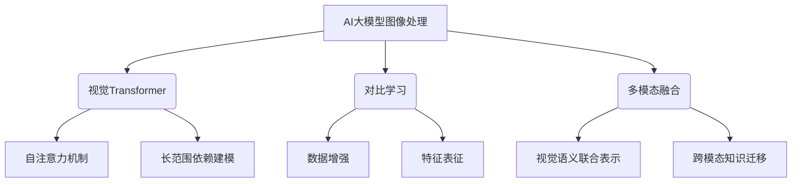
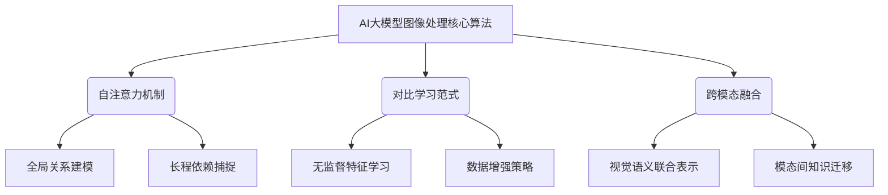
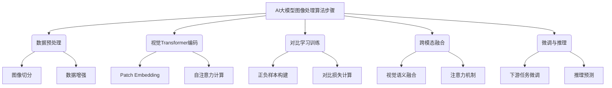

好的,我会严格遵循约束条件,以专业的技术语言撰写这篇博客文章。

# 图像处理的AI大模型：重塑视觉技术的未来

## 1. 背景介绍

### 1.1 问题的由来

在当今数字时代,图像数据的生成和传播速度前所未有。无论是社交媒体平台、在线视频网站,还是安全监控系统,图像处理技术都扮演着至关重要的角色。然而,传统的图像处理方法面临诸多挑战,例如处理效率低下、识别准确率有限等,难以满足日益增长的数据处理需求。因此,开发高效、准确的图像处理技术迫在眉睫。

### 1.2 研究现状  

近年来,人工智能(AI)技术的飞速发展为图像处理领域带来了新的契机。深度学习算法凭借其强大的数据处理能力,在图像分类、目标检测、语义分割等任务中取得了卓越的成绩。然而,现有的深度学习模型在处理高分辨率、复杂场景图像时仍存在一些缺陷,如识别精度不足、泛化能力较差等。

### 1.3 研究意义

AI大模型(Large AI Model)是近年来深度学习领域的一大创新,它通过扩大模型规模和数据集,显著提升了模型的性能表现。将AI大模型应用于图像处理领域,有望突破现有技术的瓶颈,实现高效、准确的图像理解和分析。本文将探讨AI大模型在图像处理中的应用前景,分析其核心原理和算法,并介绍实际应用案例,为读者提供全面的技术视角。

### 1.4 本文结构

本文共分为9个部分:第1部分介绍研究背景;第2部分阐述AI大模型在图像处理中的核心概念;第3部分详细解析核心算法原理和具体操作步骤;第4部分构建数学模型并推导公式;第5部分通过代码实例展示项目实践;第6部分探讨实际应用场景;第7部分推荐相关工具和资源;第8部分总结未来发展趋势和面临的挑战;最后一部分是附录,解答常见问题。

## 2. 核心概念与联系

AI大模型在图像处理领域的应用,主要涉及以下三个核心概念:

1. **视觉transformer(ViT)**
2. **对比学习(Contrastive Learning)**
3. **多模态融合(Multimodal Fusion)**

这三个概念相互关联、相辅相成,共同推动了AI大模型在图像处理中的创新发展。

### 2.1 视觉Transformer

视觉Transformer(ViT)是将自注意力机制引入计算机视觉领域的里程碑式创新。与传统的卷积神经网络(CNN)不同,ViT采用了自注意力机制对图像进行建模,能够有效捕捉图像中的长程依赖关系,从而提高了对复杂视觉信息的理解能力。

ViT的核心思想是将图像分割为一系列patches(图像块),并将每个patch投影到一个向量序列中。通过自注意力机制,模型可以学习到每个patch与其他patch之间的相关性,从而捕捉全局信息。这种设计使得ViT能够直接对图像进行端到端的建模,而无需手工设计特征提取器。

### 2.2 对比学习

对比学习(Contrastive Learning)是一种自监督学习范式,它通过最大化相似样本之间的相似度,最小化不相似样本之间的相似度,来学习数据的潜在表示。在图像处理中,对比学习可以从大量未标注的图像数据中学习到有效的视觉特征表示,从而提高了模型的泛化能力。

对比学习的关键在于构建合适的对比对(positive/negative pairs)。常见的策略包括数据增强(Data Augmentation)、图像裁剪(Cropping)等。通过这些策略,模型可以学习到对于视觉变换的鲁棒性,从而提高特征表示的质量。

### 2.3 多模态融合

多模态融合(Multimodal Fusion)旨在将不同模态的信息(如图像、文本、语音等)融合起来,构建更加丰富、全面的数据表示。在图像处理中,多模态融合常常将图像与其相关的文本描述或标注信息结合起来,以提高模型对视觉语义的理解能力。

多模态融合的关键在于建立有效的跨模态关联机制,捕捉不同模态之间的相关性。常见的方法包括注意力机制、对比学习、知识蒸馏等。通过这些技术,模型可以学习到视觉和语义之间的联系,从而提高图像理解的准确性和鲁棒性。

## 3. 核心算法原理 & 具体操作步骤  

### 3.1 算法原理概述

AI大模型在图像处理中的核心算法原理,可以概括为以下三个方面:

1. **自注意力机制(Self-Attention Mechanism)**
2. **对比学习范式(Contrastive Learning Paradigm)**  
3. **跨模态融合(Cross-Modal Fusion)**

这三个方面相互关联、相辅相成,共同推动了AI大模型在图像处理领域的创新发展。

#### 3.1.1 自注意力机制

自注意力机制是Transformer模型的核心,它允许模型直接对输入序列中任意两个位置之间的元素进行关联。在图像处理中,自注意力机制可以有效捕捉图像中的长程依赖关系,提高了对复杂视觉信息的理解能力。

自注意力机制的计算过程可以概括为三个步骤:查询(Query)、键(Key)和值(Value)的计算。首先,输入序列被投影到查询、键和值的向量空间中。然后,通过计算查询和所有键的相似性得分,生成注意力权重。最后,将注意力权重与值向量相乘,得到加权和作为输出。

#### 3.1.2 对比学习范式

对比学习范式是一种自监督学习方法,它通过最大化相似样本之间的相似度,最小化不相似样本之间的相似度,来学习数据的潜在表示。在图像处理中,对比学习可以从大量未标注的图像数据中学习到有效的视觉特征表示,提高了模型的泛化能力。

对比学习的关键在于构建合适的对比对(positive/negative pairs)。常见的策略包括数据增强、图像裁剪等。通过这些策略,模型可以学习到对于视觉变换的鲁棒性,从而提高特征表示的质量。

#### 3.1.3 跨模态融合

跨模态融合旨在将不同模态的信息(如图像、文本、语音等)融合起来,构建更加丰富、全面的数据表示。在图像处理中,跨模态融合常常将图像与其相关的文本描述或标注信息结合起来,以提高模型对视觉语义的理解能力。

跨模态融合的关键在于建立有效的跨模态关联机制,捕捉不同模态之间的相关性。常见的方法包括注意力机制、对比学习、知识蒸馏等。通过这些技术,模型可以学习到视觉和语义之间的联系,从而提高图像理解的准确性和鲁棒性。

### 3.2 算法步骤详解

AI大模型在图像处理中的核心算法步骤可以概括为以下几个部分:

1. **数据预处理**
2. **视觉Transformer编码**
3. **对比学习训练**
4. **跨模态融合**
5. **微调与推理**

#### 3.2.1 数据预处理

在数据预处理阶段,原始图像数据需要进行适当的处理,以满足模型的输入要求。主要步骤包括:

1. **图像切分(Image Splitting)**: 将高分辨率图像切分为一系列固定大小的图像块(Patches),作为模型的输入序列。
2. **数据增强(Data Augmentation)**: 对图像进行一系列变换(如旋转、翻转、缩放等),以增加数据的多样性,提高模型的泛化能力。

#### 3.2.2 视觉Transformer编码

经过数据预处理后,图像块序列将被输入到视觉Transformer模型中进行编码。主要步骤包括:

1. **Patch Embedding**: 将每个图像块投影到一个向量空间中,得到一个序列的patch embeddings。
2. **自注意力计算**: 对patch embeddings序列进行自注意力计算,捕捉不同patch之间的相关性,得到每个patch的上下文化表示。

#### 3.2.3 对比学习训练 

为了从大量未标注数据中学习有效的视觉表示,对比学习范式被广泛应用。主要步骤包括:

1. **正负样本构建**: 根据数据增强策略,从同一原始图像生成多个视图(views),将它们作为正样本对;而不同图像生成的视图则作为负样本对。
2. **对比损失计算**: 最大化正样本对之间的相似度,最小化负样本对之间的相似度,通过优化该对比损失函数来学习视觉表示。

#### 3.2.4 跨模态融合

为了提高模型对视觉语义的理解能力,常常需要将图像信息与其他模态(如文本)进行融合。主要步骤包括:

1. **视觉语义融合**: 将图像表示和文本表示融合到同一个向量空间中,构建联合的视觉语义表示。
2. **注意力机制**: 通过注意力机制捕捉视觉和语义之间的相关性,进一步提高融合表示的质量。

#### 3.2.5 微调与推理

在完成预训练后,模型需要针对特定的下游任务(如图像分类、目标检测等)进行微调和推理。主要步骤包括:

1. **下游任务微调**: 在预训练模型的基础上,添加任务特定的头部(head),并使用标注数据对模型进行微调,以适应目标任务。
2. **推理预测**: 对新的输入数据进行前向传播,得到模型的预测结果,完成图像处理任务。

### 3.3 算法优缺点

AI大模型在图像处理中的核心算法具有以下优点:

1. **强大的表示能力**: 通过自注意力机制和对比学习范式,模型能够从大量数据中学习到高质量的视觉表示,提高了对复杂图像的理解能力。
2. **多模态融合**: 将图像与其他模态(如文本)信息相结合,有助于提高模型对视觉语义的理解,增强了模型的泛化能力。
3. **可扩展性强**: 由于自注意力机制的高效性,AI大模型可以轻松地扩展到更大的规模,从而进一步提升性能。

然而,这些算法也存在一些缺点和挑战:

1. **计算资源需求高**: