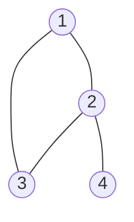

# 图算法 原理与代码实例讲解

作者：禅与计算机程序设计艺术 / Zen and the Art of Computer Programming

## 1. 背景介绍

### 1.1 问题的由来

图算法是计算机科学中一个重要的研究领域,在许多实际应用中都有着广泛的应用。从社交网络分析、路径规划、推荐系统到生物信息学,图算法无处不在。然而,图算法的原理和实现对于初学者来说可能比较抽象和复杂。因此,深入浅出地讲解图算法的原理,并给出清晰的代码实例,对于广大读者来说是很有必要的。

### 1.2 研究现状

目前,关于图算法的研究已经取得了丰硕的成果。从经典的 Dijkstra 最短路径算法、Prim 和 Kruskal 最小生成树算法,到现代的 PageRank 网页排名算法、社区发现算法等,图算法在不断发展和创新。许多优秀的开源图计算框架如 Giraph、GraphX 也应运而生。但是,对于图算法的原理和代码实现的讲解,还有进一步深入浅出的空间。

### 1.3 研究意义

通过对图算法原理的深入剖析和代码实例的讲解,可以帮助读者更好地理解图算法的精髓,提升对图算法的掌握和应用能力。同时,这也有助于读者在实际工作中更好地利用图算法解决问题,提升工作效率和技术水平。此外,这对于推动图算法的普及和发展也有重要意义。

### 1.4 本文结构

本文将围绕图算法展开,主要内容包括:图的基本概念与表示、经典图算法原理与实现、图算法的应用实践、图计算工具与资源推荐等。力求内容全面、深入浅出、理论结合实践,给读者一个全方位的图算法学习指南。下面就让我们开始图算法的探索之旅吧。

## 2. 核心概念与联系

在讲解图算法之前,我们先来回顾一下图的一些基本概念:

- 顶点(Vertex):图中的基本元素,表示一个独立的实体,如人、地点等。
- 边(Edge):连接两个顶点,表示它们之间的关系。边可以是有向的或无向的。
- 权重(Weight):边上的一个数值,表示两个顶点之间的距离、成本等。
- 度(Degree):一个顶点连接的边的数量。对于有向图,还分为入度(指向该顶点的边)和出度(从该顶点出发的边)。
- 路径(Path):由一系列顶点和边连接形成的序列。
- 连通图(Connected Graph):图中任意两个顶点之间都存在路径。
- 环(Cycle):一条起点和终点相同的路径。

图可以分为几种类型:

- 无向图(Undirected Graph):边没有方向。
- 有向图(Directed Graph):边有方向。
- 加权图(Weighted Graph):边带有权重值。

图的常见存储和表示方式有:

- 邻接矩阵(Adjacency Matrix):用一个二维矩阵表示图,矩阵元素 A[i][j] 表示顶点 i 到 j 是否有边(或边的权重)。
- 邻接表(Adjacency List):每个顶点维护一个链表,存储与之相连的顶点。
- 边集数组(Edge List):用一个数组存储所有的边。

下图展示了图的几种表示方式:



|     | A   | B   | C   | D   |
| --- | --- | --- | --- | --- |  
| A   | 0   | 1   | 1   | 0   |
| B   | 1   | 0   | 1   | 1   |
| C   | 1   | 1   | 0   | 0   |
| D   | 0   | 1   | 0   | 0   |

邻接表:
- A -> B -> C
- B -> A -> C -> D  
- C -> A -> B
- D -> B

边集数组:
- (A, B)
- (A, C) 
- (B, C)
- (B, D)

理解了这些概念,我们就可以进一步学习图算法了。图算法大致可以分为以下几类:

- 图的遍历:BFS、DFS 等。
- 最短路径:Dijkstra、Floyd 等。
- 最小生成树:Prim、Kruskal 等。
- 拓扑排序:Kahn、DFS 等。
- 图的连通性:Union-Find 等。
- 二分图:匈牙利算法等。
- 网络流:Ford-Fulkerson、Dinic 等。

这些算法在实际应用中有着广泛的用途,比如:

- 地图导航中的最短路径规划。
- 社交网络中的社区发现、影响力分析等。
- 任务调度中的依赖分析。
- 电路设计、信号网络等中的连通性分析。
- 二分图匹配在任务分配、资源调度中的应用。
- 网络流在资源最大利用、运输问题优化等方面的应用。

下面我们就来具体讲解几个常见的图算法。

## 3. 核心算法原理 & 具体操作步骤

### 3.1 算法原理概述

#### 3.1.1 BFS 广度优先搜索

BFS 即广度优先搜索(Breadth First Search),是一种对图进行遍历的算法。其基本思想是:从图中某个顶点出发,先访问这个顶点的所有未访问过的邻接点,然后再依次访问这些邻接点的所有未访问过的邻接点,直到图中所有顶点都被访问到。

可以用一个队列来实现 BFS 的过程:

1. 选择一个顶点作为起点,将其标记为已访问,并加入队列。
2. 当队列不为空时:
   - 取出队首顶点,访问它。
   - 将该顶点所有未访问过的邻接点标记为已访问,并加入队列。
3. 重复步骤 2,直到队列为空。

这样,就可以按照"广度优先"的顺序遍历图中的所有顶点。

#### 3.1.2 DFS 深度优先搜索

DFS 即深度优先搜索(Depth First Search),也是一种图的遍历算法。与 BFS 不同的是,DFS 会尽可能"深入"地遍历图,只有当一条路走不通时才回溯。

DFS 可以用递归或显式栈来实现:

1. 选择一个顶点作为起点,将其标记为已访问。
2. 访问该顶点。
3. 对该顶点的每一个未访问过的邻接点,递归执行步骤 1-3。
4. 当所有顶点都被访问到时,搜索结束。

DFS 常用于找出图中的路径、环等结构。

#### 3.1.3 Dijkstra 最短路径算法

Dijkstra 算法是一种用于计算单源最短路径的贪心算法。给定一个起点,它可以找出从该点到图中所有其他顶点的最短路径。

算法的基本思想是:

1. 初始时,起点到自身的距离为 0,到其他所有点的距离为无穷大。
2. 从未确定最短路的顶点中选择距离最小的一个,将其标记为已确定。
3. 更新该顶点的所有邻接点的距离:如果"起点到当前点的距离 + 当前点到邻接点的距离" 小于"起点直接到邻接点的距离",则更新为新的较小的距离。
4. 重复步骤 2-3,直到所有顶点都被标记为已确定。

Dijkstra 算法常用于路径规划、网络路由等场景。

#### 3.1.4 Prim 最小生成树算法

Prim 算法是一种求解加权无向图的最小生成树(Minimum Spanning Tree, MST)的贪心算法。所谓最小生成树,就是在图的所有生成树(包含图中所有顶点的无环连通子图)中,边权重之和最小的那一棵。

Prim 算法的基本思想是:

1. 任选一个顶点加入 MST。
2. 在剩余的顶点中,选择与当前 MST 有边相连的、且该边权重最小的顶点,加入 MST。
3. 重复步骤 2,直到所有顶点都加入 MST。

Prim 算法常用于网络设计、电路布线等场景,以最小的成本连通所有节点。

### 3.2 算法步骤详解

下面我们以 BFS 和 Dijkstra 算法为例,详细讲解其步骤。

#### 3.2.1 BFS 算法步骤

以下是 BFS 遍历无向图的详细步骤,假设我们从顶点 0 开始遍历:

1. 创建一个队列 q,将起点 0 加入队列,并标记为已访问。
2. 当队列 q 不为空时,重复以下步骤:
   1. 取出队首元素 v,访问它。
   2. 遍历 v 的所有邻接点 w:
      - 如果 w 未被访问,则标记为已访问,并加入队列 q。
3. 队列为空,BFS 结束。

用 Python 代码表示如下:

```python
from collections import deque

def bfs(graph, start):
    visited = set()
    q = deque([start])
    visited.add(start)
    
    while q:
        v = q.popleft()
        print(v)  # 访问顶点 v
        
        for w in graph[v]:
            if w not in visited:
                visited.add(w)
                q.append(w)
```

其中,graph 是一个邻接表,表示图的结构。visited 是一个集合,记录已访问的顶点。q 是一个双端队列,用于存储待访问的顶点。

#### 3.2.2 Dijkstra 算法步骤

以下是 Dijkstra 算法的详细步骤,假设我们求顶点 0 到其他所有顶点的最短路径:

1. 初始化距离数组 dist,dist[0] = 0,其他顶点的 dist 为无穷大。
2. 创建一个集合 visited,记录已确定最短路的顶点。
3. 重复以下步骤,直到所有顶点都进入 visited:
   1. 在未确定最短路的顶点中,选择 dist 最小的顶点 v,将其加入 visited。
   2. 遍历 v 的所有邻接点 w:
      - 如果 dist[v] + graph[v][w] < dist[w],则更新 dist[w] 为 dist[v] + graph[v][w]。
4. 最终 dist 数组即为起点到所有顶点的最短路径长度。

用 Python 代码表示如下:

```python
import heapq

def dijkstra(graph, start):
    n = len(graph)
    dist = [float('inf')] * n
    dist[start] = 0
    visited = set()
    pq = [(0, start)]
    
    while pq:
        d, v = heapq.heappop(pq)
        if v in visited: continue
        visited.add(v)
        
        for w, weight in graph[v]:
            if dist[v] + weight < dist[w]:
                dist[w] = dist[v] + weight
                heapq.heappush(pq, (dist[w], w))
    
    return dist
```

其中,graph 是一个邻接表,但每个元素是一个二元组 (邻接点,边权重)。dist 是一个列表,记录起点到各个顶点的最短距离。visited 是一个集合,记录已确定最短路的顶点。pq 是一个小根堆,用于选择 dist 最小的顶点。

算法的时间复杂度为 O((V+E)logV),其中 V 和 E 分别为图的顶点数和边数。

### 3.3 算法优缺点

BFS 算法:
- 优点:可以找出无权图的最短路径;空间复杂度较低,为 O(V)。
- 缺点:不适用于加权图;当图比较大时,时间复杂度较高,为 O(V+E)。

DFS 算法:
- 优点:空间复杂度较低,与树的高度成正比;适合解决可达性问题。
- 缺点:不适合找最短路;在有向图中可能访问到未连通的顶点。

Dijkstra 算法:
- 优点:可以高效地找出单源最短路径。
- 缺点:要求图中不存在负权边;时间复杂度较高,为 O((V+E)logV)。

Prim 算法:
- 优点:可以