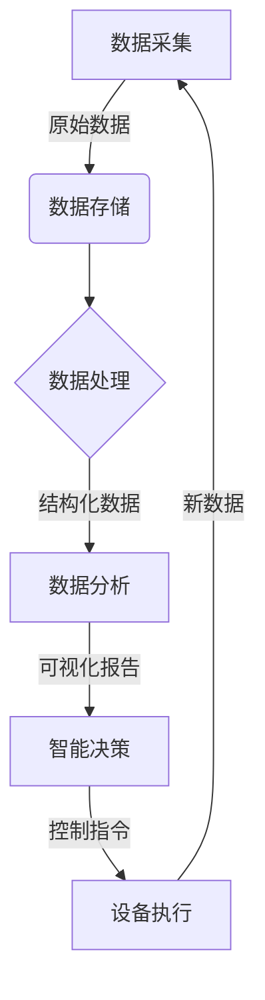
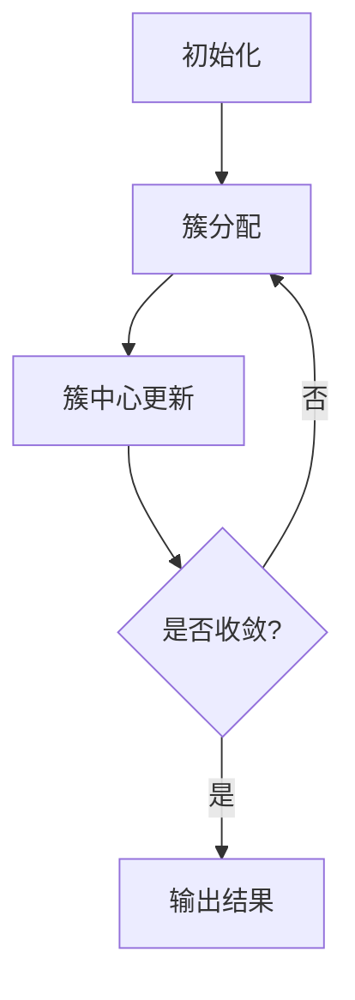
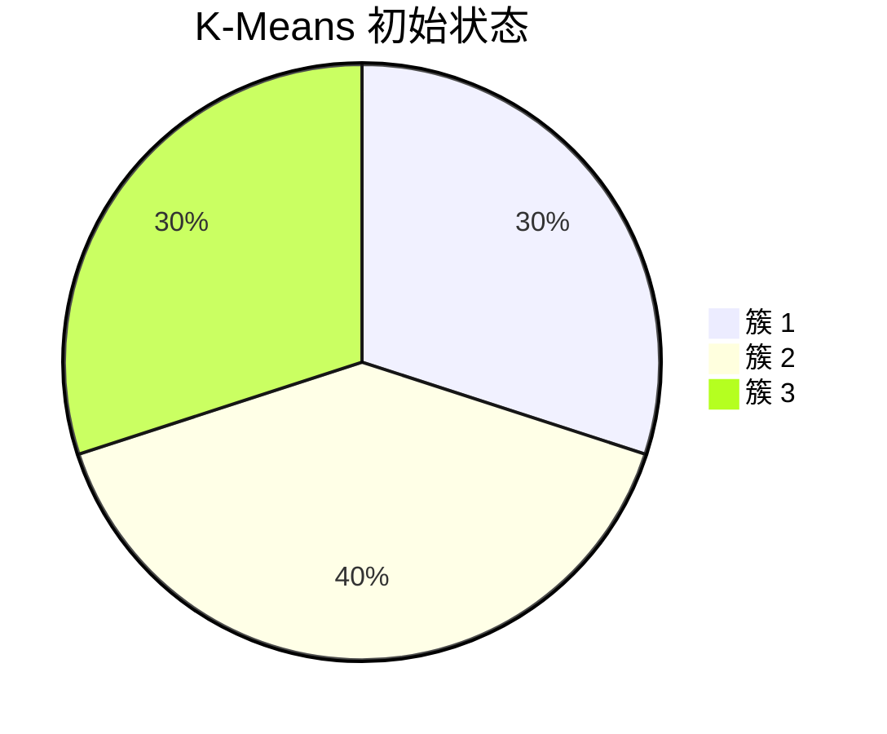
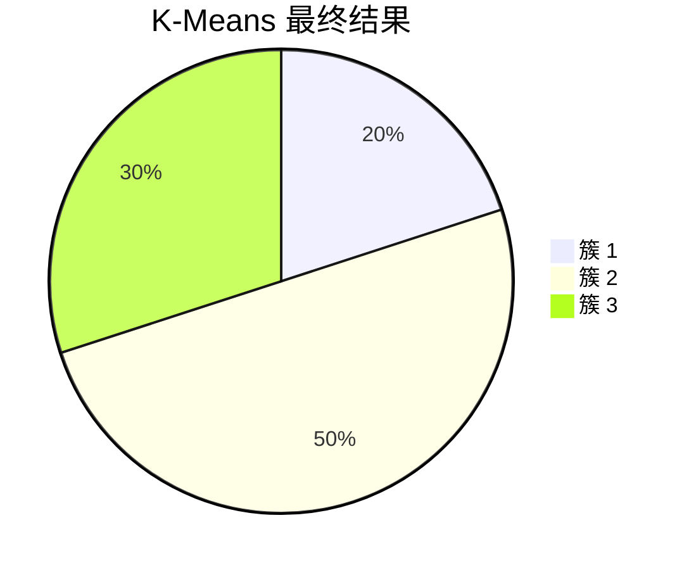

# 基于Java的智能家居设计：探讨Java在智能家居大数据处理中的角色

## 1. 背景介绍

### 1.1 问题的由来

随着科技的飞速发展，人们对于生活品质的追求不断提高，智能家居应运而生。智能家居系统通过将各种智能化设备连接到家庭网络中，实现对家居环境的自动化控制和远程管理，为居住者带来了极大的便利。然而，随着智能家居设备数量的增加和功能的复杂化，海量的数据被产生，如何高效地处理和利用这些数据成为了一个亟待解决的问题。

### 1.2 研究现状

目前，智能家居数据处理主要面临以下挑战：

1. **数据量大且种类繁多**：智能家居系统涉及多种设备和传感器，产生的数据种类繁多，包括环境数据、用户行为数据、设备状态数据等。
2. **实时性要求高**：某些场景下需要对数据进行实时处理和响应，如安防系统、紧急情况处理等。
3. **数据价值挖掘难度大**：如何从海量数据中发现有价值的模式和规律，为智能决策提供支持，是一个巨大的挑战。

### 1.3 研究意义

高效处理智能家居大数据对于提高系统的智能化水平、优化用户体验、降低运营成本具有重要意义。本文旨在探讨如何利用Java语言及其生态系统中的大数据处理框架和工具，构建高效、可扩展的智能家居大数据处理解决方案。

### 1.4 本文结构

本文首先介绍智能家居大数据处理的核心概念和技术，包括数据采集、存储、处理和分析等环节。接下来详细阐述基于Java的智能家居大数据处理解决方案的设计和实现，包括系统架构、核心算法原理、数学模型等。然后通过实际案例展示该解决方案的应用场景和效果。最后总结该领域的发展趋势和面临的挑战，并给出相关工具和资源推荐。

## 2. 核心概念与联系

智能家居大数据处理涉及多个核心概念，它们之间存在紧密联系，共同构成了完整的解决方案。



1. **数据采集**：从各种智能家居设备和传感器中收集原始数据，如温度、湿度、用电量、安防状态等。
2. **数据存储**：将采集到的原始数据持久化存储，以备后续处理和分析。
3. **数据处理**：对原始数据进行清洗、转换、归并等操作，将其转化为结构化的数据集。
4. **数据分析**：基于结构化数据，运用大数据分析算法和模型，发现有价值的模式和规律。
5. **智能决策**：根据分析结果，制定相应的控制策略和决策。
6. **设备执行**：将决策转化为具体的控制指令，下发到相应的智能家居设备执行。
7. **反馈循环**：设备执行过程中产生新的数据，反馈到数据采集环节，形成闭环。

这些环节相互衔接、循环往复，构成了智能家居大数据处理的完整解决方案。

## 3. 核心算法原理 & 具体操作步骤

### 3.1 算法原理概述

智能家居大数据处理涉及多种算法和模型，包括数据清洗、特征工程、聚类分析、关联规则挖掘、时序预测等。本节以常见的聚类分析算法 K-Means 为例，阐述其核心原理和操作步骤。

K-Means 算法是一种无监督学习算法，旨在将数据集划分为 K 个簇，使得簇内数据点之间的距离最小，簇间数据点之间的距离最大。它通过迭代优化的方式，不断调整簇中心位置和数据点的簇归属，直至收敛。

### 3.2 算法步骤详解

1. **初始化**：随机选择 K 个数据点作为初始簇中心。
2. **簇分配**：对于每个数据点，计算它与各个簇中心的距离，将其归属于距离最近的簇。
3. **簇中心更新**：对于每个簇，重新计算簇中所有数据点的均值作为新的簇中心。
4. **迭代**：重复步骤2和步骤3，直至簇中心位置不再发生变化或达到最大迭代次数。



### 3.3 算法优缺点

**优点**：

- 算法思路简单直观，易于理解和实现。
- 计算效率较高，适用于大规模数据集。
- 无需事先标注数据，属于无监督学习。

**缺点**：

- 需要预先设定簇数 K，对结果影响较大。
- 对异常值和噪声数据敏感。
- 无法处理非凸形状的簇。

### 3.4 算法应用领域

K-Means 算法在智能家居大数据处理中有广泛应用，例如：

- 用户行为分析：根据用户的使用习惯和偏好对用户进行聚类，实现个性化服务。
- 能源优化：对家庭用电数据进行聚类，发现异常用电模式，优化能源利用。
- 室内环境控制：根据温湿度等环境数据的聚类结果，调节空调、加湿器等设备的工作状态。

## 4. 数学模型和公式 & 详细讲解 & 举例说明

### 4.1 数学模型构建

K-Means 算法的目标是最小化所有数据点到其所属簇中心的距离之和，即最小化目标函数：

$$J = \sum_{i=1}^{n}\sum_{j=1}^{k}\mathbb{I}(r_i=j)\left \| x_i - \mu_j \right \|^2$$

其中：

- $n$ 为数据集中数据点的个数
- $k$ 为簇的个数
- $r_i$ 为数据点 $x_i$ 的簇标记
- $\mu_j$ 为第 $j$ 个簇的中心
- $\mathbb{I}(\cdot)$ 为指示函数，当条件成立时取值为 1，否则为 0

### 4.2 公式推导过程

目标函数 $J$ 的推导过程如下：

1. 对于每个数据点 $x_i$，计算它与所有簇中心 $\mu_j$ 的距离 $\left \| x_i - \mu_j \right \|^2$。
2. 将 $x_i$ 归属于距离最近的簇 $j^*$，即 $r_i = j^*$。
3. 对于每个簇 $j$，求和它包含的所有数据点到簇中心的距离之和。
4. 对所有簇的距离之和求和，得到目标函数 $J$。

算法的目标是最小化目标函数 $J$，即找到最优的簇中心位置和数据点的簇归属，使得数据点到其所属簇中心的总距离之和最小。

### 4.3 案例分析与讲解

假设我们有一个包含 10 个数据点的二维数据集，需要将其划分为 3 个簇。初始时随机选择 3 个数据点作为簇中心，如下图所示：



经过多次迭代，算法逐步优化簇中心位置和数据点的簇归属，最终收敛到如下结果：



可以看到，最终的簇划分更加合理，簇内数据点更加紧密，簇间数据点更加分散。

### 4.4 常见问题解答

**1. 如何选择合适的 K 值？**

K 值的选择对聚类结果有很大影响，通常需要根据具体问题和数据集的特点进行试验和评估。一种常见的方法是计算不同 K 值下的聚类评价指标（如轮廓系数），选择指标值最优的 K 值。

**2. 算法如何处理异常值和噪声数据？**

K-Means 算法对异常值和噪声数据敏感，可能导致簇中心位置偏移。一种解决方案是在数据预处理阶段去除异常值，另一种方案是使用更加鲁棒的聚类算法，如 K-Medoids 算法。

**3. 算法如何处理非凸形状的簇？**

K-Means 算法假设簇呈现球形或超球形，无法很好地处理非凸形状的簇。对于这种情况，可以考虑使用基于密度的聚类算法（如 DBSCAN）或基于层次的聚类算法。

## 5. 项目实践：代码实例和详细解释说明

### 5.1 开发环境搭建

本节将使用 Java 语言和 Apache Spark 框架实现 K-Means 聚类算法，并应用于智能家居用电数据分析场景。

首先，需要准备以下开发环境：

- Java 8 或更高版本
- Apache Spark 3.0 或更高版本
- Apache Spark 集群或本地伪集群环境
- Maven 或其他构建工具

### 5.2 源代码详细实现

```java
import org.apache.spark.ml.clustering.KMeans;
import org.apache.spark.ml.clustering.KMeansModel;
import org.apache.spark.ml.feature.VectorAssembler;
import org.apache.spark.sql.Dataset;
import org.apache.spark.sql.Row;
import org.apache.spark.sql.SparkSession;

public class ElectricityUsageClusteringApp {
    public static void main(String[] args) {
        SparkSession spark = SparkSession.builder()
                .appName("ElectricityUsageClustering")
                .getOrCreate();

        // 加载用电数据
        Dataset<Row> data = spark.read().csv("electricity_usage.csv");

        // 特征工程
        VectorAssembler vectorAssembler = new VectorAssembler()
                .setInputCols(new String[]{"hour", "temperature", "humidity"})
                .setOutputCol("features");
        Dataset<Row> vectorData = vectorAssembler.transform(data);

        // 训练 K-Means 模型
        KMeans kmeans = new KMeans()
                .setK(3)
                .setSeed(1L)
                .setFeaturesCol("features");
        KMeansModel model = kmeans.fit(vectorData);

        // 对数据进行聚类
        Dataset<Row> predictions = model.transform(vectorData);
        predictions.show();

        spark.stop();
    }
}
```

代码解读：

1. 创建 SparkSession 对象，作为程序的入口点。
2. 加载用电数据文件 `electricity_usage.csv`，该文件包含每小时的用电量、温度和湿度信息。
3. 使用 `VectorAssembler` 将特征列合并为一个向量列 `features`，作为 K-Means 算法的输入。
4. 配置 K-Means 算法的参数，包括簇数 `K=3` 和随机种子。
5. 使用 `fit` 方法在训练数据上训练 K-Means 模型。
6. 使用 `transform` 方法对原始数据进行聚类预测，得到每个数据点的簇标记。
7. 显示聚类结果。

### 5.3 代码解读与分析

在该示例中，我们将用电数据的每小时用电量、温度和湿度作为特征向量，使用 K-Means 算法对用电数据进行聚类分析。通过聚类结果，我们可以发现不同的用电模式，如高峰用电模式、节能用电模式等，为制定相应的节能策略提供依据。

代码的核心部分是使用 Apache Spark 提供的 `KMeans` 类实现 K-Means 算法。我们首先需要对原始数据进行特征工程，将相关特征合并为一个向量列。然后配置算法的参数，包括簇数 K 和随机