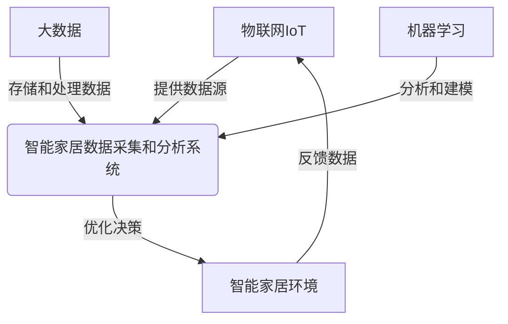
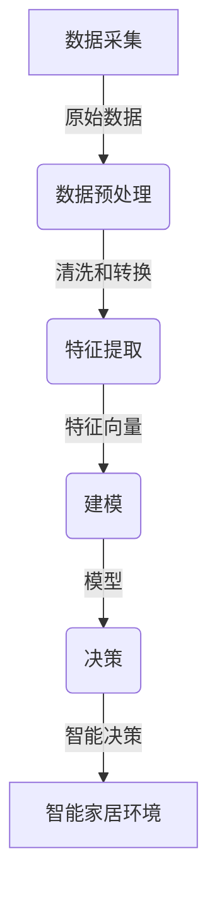

# 基于Java的智能家居设计：智能家居数据的采集和分析技术

## 1. 背景介绍

### 1.1 问题的由来

随着物联网技术的快速发展和人们对智能生活方式需求的不断增长,智能家居系统已经成为一个热门的研究领域。智能家居系统旨在通过将各种智能设备连接到家庭网络,从而实现对家居环境的自动化控制和优化。然而,实现真正智能化的家居环境需要大量的数据采集和分析。

智能家居系统需要从各种传感器和设备中采集数据,如温度、湿度、照明、能源使用情况等。这些数据需要被实时采集、处理和分析,以便系统能够做出智能决策,如调节温度、控制照明等。此外,用户行为数据也是非常宝贵的资源,可用于优化系统的个性化体验和提高能源效率。

### 1.2 研究现状

目前,已有一些智能家居系统提供了基本的数据采集和分析功能。但是,这些系统通常只能处理有限的数据类型,且分析能力有限。此外,大多数系统都是封闭的,难以与第三方设备和服务集成。因此,开发一个更加灵活、可扩展和智能化的数据采集和分析系统,对于推动智能家居技术的发展至关重要。

### 1.3 研究意义

设计和实现一个高效、可靠的智能家居数据采集和分析系统,对于提高家居环境的智能化水平、优化能源利用、提升用户体验等方面具有重要意义。具体来说,该系统可以带来以下好处:

1. **环境优化**:通过分析环境数据,系统可以自动调节温度、湿度、照明等,创造一个舒适的家居环境。
2. **能源节约**:基于用户行为模式和环境数据,系统可以优化能源利用,降低能源消耗。
3. **个性化体验**:通过分析用户偏好和使用习惯,系统可以提供个性化的服务和体验。
4. **远程监控**:用户可以通过移动应用远程监控家居状态,实现智能管理。
5. **第三方集成**:开放的系统架构可以与各种第三方设备和服务集成,扩展系统功能。

### 1.4 本文结构

本文将详细介绍一种基于Java的智能家居数据采集和分析系统的设计和实现。文章首先阐述系统的核心概念和架构,然后深入探讨数据采集和分析的算法原理、数学模型和实现细节。接下来,我们将通过实际项目实践,展示系统的代码实现和运行结果。最后,文章将讨论系统的应用场景、相关工具和资源,并对未来的发展趋势和挑战进行总结和展望。

## 2. 核心概念与联系

智能家居数据采集和分析系统涉及多个核心概念,包括物联网(IoT)、大数据、机器学习等。这些概念之间存在着紧密的联系,共同构建了一个完整的智能家居解决方案。

1. **物联网(IoT)**:智能家居系统中的各种传感器和设备通过物联网技术相互连接,形成了数据采集的基础。这些设备可以实时采集环境数据(如温度、湿度、照明等)和用户行为数据。

2. **大数据**:智能家居系统需要处理来自多个数据源的海量数据,包括结构化数据(如传感器读数)和非结构化数据(如视频、音频等)。大数据技术可以高效地存储、管理和处理这些数据。

3. **机器学习**:通过应用机器学习算法,系统可以从历史数据中发现模式和规律,进行建模和预测。这些模型可用于优化家居环境、个性化用户体验、预测能源消耗等。

4. **智能家居环境**:系统的最终目标是创建一个智能化的家居环境,提供自动化控制、个性化体验和能源优化等功能。系统将根据分析结果做出相应的决策和调整。

5. **反馈循环**:智能家居环境中的变化将反馈回物联网设备,形成一个闭环系统。这种反馈机制可以持续优化系统的决策,提高智能化水平。

通过将这些核心概念有机结合,我们可以构建一个完整的智能家居数据采集和分析解决方案,实现真正的智能家居体验。

## 3. 核心算法原理 & 具体操作步骤

### 3.1 算法原理概述

智能家居数据采集和分析系统的核心算法包括数据采集、数据预处理、特征提取、建模和决策等多个环节。这些环节相互依赖,共同完成从原始数据到智能决策的全过程。

1. **数据采集**:从物联网设备(如传感器、摄像头等)中采集原始数据,包括环境数据和用户行为数据。

2. **数据预处理**:对原始数据进行清洗、格式转换、缺失值处理等操作,以准备后续的特征提取和建模。

3. **特征提取**:从预处理后的数据中提取有意义的特征,构建特征向量。这些特征可能包括温度、湿度、照明水平、用户位置、活动模式等。

4. **建模**:利用机器学习算法(如回归、分类、聚类等)在特征向量上训练模型,捕捉数据中的模式和规律。

5. **决策**:根据训练好的模型,对新的输入数据进行预测和决策,如调节温度、控制照明等。

6. **智能家居环境**:系统的决策将反映在智能家居环境中,优化家居体验。同时,环境的变化也将反馈回数据采集环节,形成闭环。

### 3.2 算法步骤详解

以下是智能家居数据采集和分析算法的具体步骤:

1. **数据采集**
   - 从各种物联网设备(如温湿度传感器、运动传感器、摄像头等)实时采集数据。
   - 将采集到的数据存储在分布式文件系统(如HDFS)或数据库中,以备后续处理。

2. **数据预处理**
   - 对原始数据进行清洗,剔除异常值和噪声数据。
   - 处理缺失值,如通过插值法或机器学习模型预测缺失值。
   - 对数据进行格式转换和标准化,以适应后续的特征提取和建模需求。

3. **特征提取**
   - 从预处理后的数据中提取有意义的特征,如温度、湿度、照明水平、用户位置、活动模式等。
   - 构建特征向量,作为机器学习模型的输入。

4. **建模**
   - 选择合适的机器学习算法,如回归、分类、聚类等,根据任务需求进行建模。
   - 将特征向量输入到算法中,在训练数据集上训练模型。
   - 对模型进行评估和优化,如通过交叉验证、调参等方法提高模型性能。

5. **决策**
   - 将新的输入数据(如实时环境数据和用户行为数据)输入到训练好的模型中。
   - 模型对输入数据进行预测和决策,如预测温度变化、检测用户活动等。
   - 根据模型的决策,系统可以做出相应的调整,如调节温度、控制照明等。

6. **反馈和优化**
   - 监测智能家居环境的变化,将新的数据反馈回数据采集环节。
   - 利用新的数据持续优化和重训练模型,提高决策的准确性和智能化水平。

需要注意的是,上述步骤并非严格线性的,在实际应用中可能会存在迭代和反馈的过程。此外,不同的应用场景可能需要调整和优化特定的算法步骤。

### 3.3 算法优缺点

智能家居数据采集和分析算法具有以下优点:

1. **自动化决策**:算法可以自动分析数据,做出智能决策,减轻人工干预的需求。
2. **个性化体验**:通过分析用户行为数据,算法可以为每个用户提供个性化的家居体验。
3. **能源优化**:算法可以基于环境和用户数据,优化能源利用,降低能源消耗。
4. **可扩展性**:算法可以轻松集成新的数据源和功能模块,具有良好的可扩展性。
5. **持续优化**:算法可以通过反馈机制持续优化决策,提高智能化水平。

然而,该算法也存在一些缺点和挑战:

1. **数据质量**:算法的性能在很大程度上依赖于输入数据的质量。噪声数据或缺失数据可能导致模型精度下降。
2. **隐私和安全**:处理用户行为数据可能会引发隐私和安全问题,需要采取适当的保护措施。
3. **算法复杂度**:随着数据量和功能需求的增加,算法可能变得越来越复杂,导致计算开销和维护成本增加。
4. **人机交互**:算法决策的可解释性和透明度是一个挑战,需要提供良好的人机交互界面。
5. **系统集成**:将算法集成到现有的智能家居系统中可能需要克服一些技术障碍。

总的来说,智能家居数据采集和分析算法为实现真正的智能家居体验提供了有力支持,但也需要解决一些潜在的挑战和问题。

### 3.4 算法应用领域

智能家居数据采集和分析算法可以应用于多个领域,为用户带来更智能、更舒适、更节能的家居体验。以下是一些典型的应用场景:

1. **环境控制**:算法可以根据温度、湿度、照明等环境数据,自动调节空调、加湿器、灯光等设备,创造舒适的家居环境。

2. **能源管理**:通过分析用户行为模式和环境数据,算法可以优化能源利用,降低能源消耗,实现节能目标。

3. **安全监控**:利用摄像头和运动传感器采集的数据,算法可以检测异常活动,提高家庭安全性。

4. **个性化服务**:基于用户偏好和使用习惯,算法可以为每个用户提供个性化的娱乐、购物、健康等服务。

5. **老年人和残障人士照护**:算法可以监测老年人和残障人士的活动模式,及时发现异常情况并提供援助。

6. **远程家居管理**:用户可以通过移动应用远程监控和控制家居设备,实现智能家居管理。

7. **预测性维护**:算法可以分析设备运行数据,预测故障发生,提前进行维护和维修。

8. **智能家电控制**:算法可以优化家电的使用模式,如根据用户习惯自动预热烤箱、调节洗衣机程序等。

总的来说,智能家居数据采集和分析算法为智能家居系统带来了广阔的应用前景,有望深刻改变人们的生活方式。

## 4. 数学模型和公式 & 详细讲解 & 举例说明

在智能家居数据采集和分析系统中,数学模型和公式扮演着重要的角色。它们为算法提供了理论基础,并指导了模型的构建和优化过程。本节将介绍一些常用的数学模型和公式,并通过具体案例进行详细讲解和举例说明。

### 4.1 数学模型构建

智能家居系统中的数学模型通常基于机器学习和统计学理论,旨在从数据中发现潜在的模式和规律。以下是一些常见的数学模型:

1. **