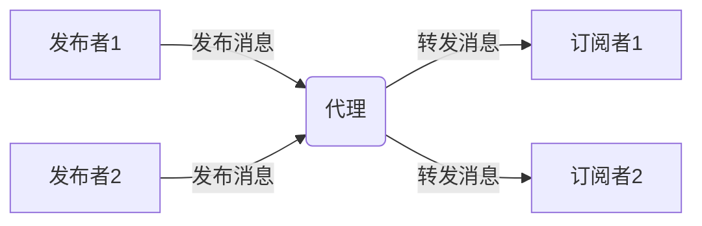
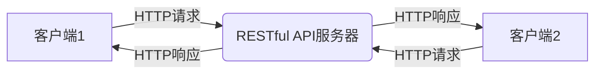
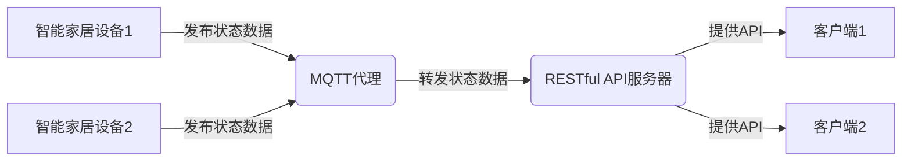
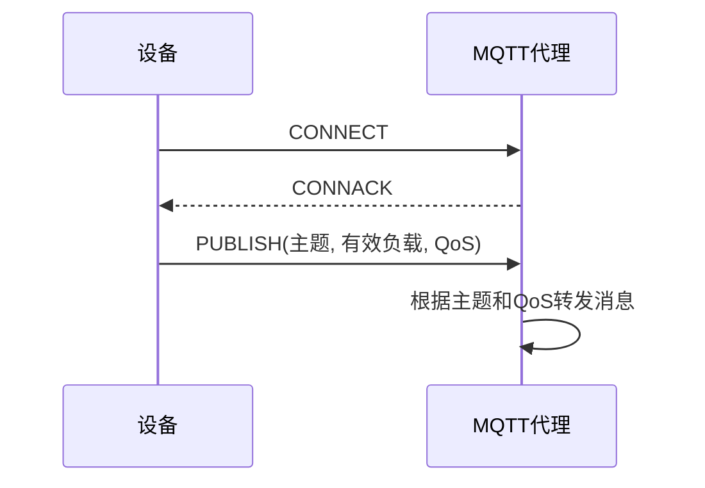
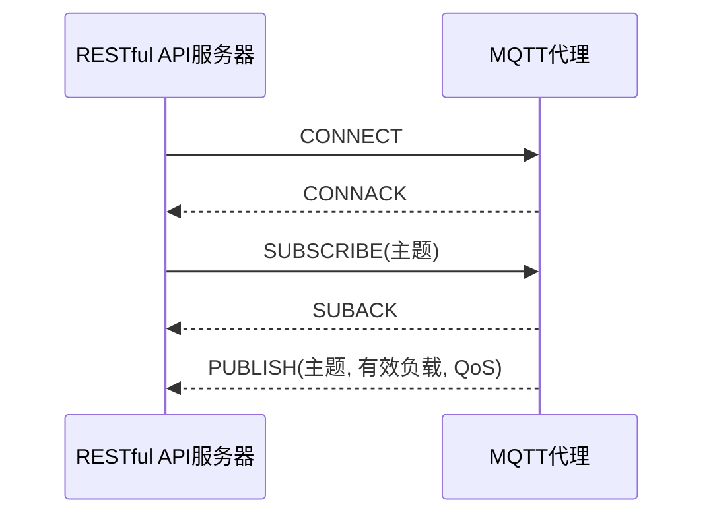

# 基于MQTT协议和RESTful API的智能家居设备状态监测

## 1. 背景介绍

### 1.1 问题的由来

随着物联网技术的不断发展和普及,智能家居已经成为了一种新兴的生活方式。智能家居系统通过将各种家用电器连接到互联网上,实现了对这些设备的远程监控和控制。然而,由于家庭环境中设备种类繁多、通信协议不统一等原因,给设备状态的实时监测带来了一定的挑战。

### 1.2 研究现状

目前,已经有一些解决方案被提出和应用,例如基于Wi-Fi、蓝牙、ZigBee等技术的本地通信方式。但是,这些方案存在一些局限性,比如通信距离有限、设备兼容性差、无法实现远程访问等。因此,需要一种更加通用、可扩展的解决方案来满足智能家居设备状态监测的需求。

### 1.3 研究意义

基于MQTT协议和RESTful API的智能家居设备状态监测系统,能够有效解决上述问题。MQTT是一种轻量级的发布/订阅模式的消息传递协议,可以实现设备与服务器之间的实时数据交换。RESTful API则提供了一种标准化的接口,使得不同类型的客户端(如移动应用、Web应用等)都能够方便地访问和控制家居设备。

该解决方案具有以下优势:

1. **通信高效**:MQTT协议的开销小、功耗低,非常适合于资源受限的物联网设备。
2. **可扩展性强**:基于发布/订阅模式,新设备可以方便地加入系统。
3. **跨平台访问**:RESTful API使得不同平台的客户端都能够与系统进行交互。
4. **远程监控**:通过互联网,用户可以随时随地监测和控制家中设备的状态。

### 1.4 本文结构

本文将从以下几个方面对该解决方案进行详细阐述:

1. 核心概念与联系
2. 核心算法原理与具体操作步骤
3. 数学模型和公式详细讲解与举例说明
4. 项目实践:代码实例和详细解释说明
5. 实际应用场景
6. 工具和资源推荐
7. 总结:未来发展趋势与挑战
8. 附录:常见问题与解答

## 2. 核心概念与联系

在介绍核心算法原理之前,我们先来了解一下该解决方案所涉及的几个核心概念及它们之间的联系。

### 2.1 MQTT协议

MQTT(Message Queuing Telemetry Transport)是一种基于发布/订阅模式的轻量级消息传输协议。它由IBM在1999年发布,后被OASIS组织采纳为标准协议。MQTT适用于物联网领域,可以在受限的带宽和不可靠的网络环境下实现设备与服务器之间的实时通信。

MQTT协议定义了三种角色:发布者(Publisher)、代理(Broker)和订阅者(Subscriber)。发布者将消息发布到代理,订阅者从代理处订阅感兴趣的主题(Topic),并接收相应的消息。这种通信模式降低了发布者和订阅者之间的耦合度,提高了系统的可扩展性和灵活性。



### 2.2 RESTful API

RESTful API(Representational State Transfer Application Programming Interface)是一种基于HTTP协议的应用程序接口设计风格。它将服务器上的资源通过URI(Uniform Resource Identifier)进行唯一标识,并使用HTTP方法(GET、POST、PUT、DELETE等)对资源进行操作。

RESTful API具有以下特点:

1. **无状态**: 客户端和服务器之间的通信是无状态的,每次请求都包含了完整的信息。
2. **统一接口**: 通过统一的资源URI和HTTP方法进行交互。
3. **分层系统**: 客户端无需了解服务器的具体实现细节,只需与RESTful API进行交互即可。

在智能家居系统中,RESTful API可以为不同类型的客户端(如移动应用、Web应用等)提供统一的接口,实现对家居设备的远程监控和控制。



### 2.3 智能家居设备

智能家居设备是指能够与互联网连接并实现远程监控和控制的各种家用电器,如智能灯泡、智能插座、智能门锁等。这些设备通常具有嵌入式系统和无线通信模块,可以与MQTT代理或RESTful API服务器进行数据交互。

在本解决方案中,智能家居设备需要集成MQTT客户端,以便将设备状态数据发布到MQTT代理。同时,RESTful API服务器也需要与MQTT代理进行集成,以便将设备状态数据转发给客户端。



通过上述三个核心概念的介绍,我们可以看到它们之间是相互关联、相互依赖的。MQTT协议实现了设备与服务器之间的实时数据通信,RESTful API为不同类型的客户端提供了统一的接口,而智能家居设备则作为整个系统的数据源。这三者的有机结合,构成了一个完整的智能家居设备状态监测解决方案。

## 3. 核心算法原理与具体操作步骤

### 3.1 算法原理概述

该解决方案的核心算法原理可以概括为以下几个步骤:

1. **设备状态数据采集**: 智能家居设备通过内置的传感器和控制模块,采集自身的状态数据,如温度、湿度、电量等。

2. **数据发布**: 设备将采集到的状态数据通过MQTT协议发布到MQTT代理。

3. **数据订阅**: RESTful API服务器作为MQTT代理的订阅者,订阅感兴趣的主题,并接收相应的设备状态数据。

4. **数据存储**: RESTful API服务器将接收到的设备状态数据存储在数据库中,以便后续查询和处理。

5. **API提供**: RESTful API服务器根据客户端的请求,从数据库中查询相应的设备状态数据,并通过HTTP响应的方式返回给客户端。

6. **数据展示**: 客户端(如移动应用、Web应用等)接收到RESTful API返回的数据后,将其展示在用户界面上,实现对设备状态的实时监测。

### 3.2 算法步骤详解

下面我们将对上述算法原理进行更加详细的解释和说明。

#### 3.2.1 设备状态数据采集

智能家居设备通常都会内置各种传感器和控制模块,用于采集自身的状态数据。例如:

- 温湿度传感器,用于采集环境温度和湿度数据。
- 光线传感器,用于采集环境光线强度数据。
- 电量检测模块,用于采集设备的剩余电量数据。
- 控制模块,用于采集设备的工作状态(开/关)数据。

这些传感器和模块通过设备内部的数据总线或通信接口,将采集到的数据传输给设备的主控制器(如MCU或SoC)。主控制器负责对这些数据进行处理和封装,准备发送给MQTT代理。

#### 3.2.2 数据发布

设备的主控制器需要集成MQTT客户端模块,以便与MQTT代理进行通信。当采集到新的状态数据时,主控制器会将这些数据封装成MQTT消息,并通过MQTT协议发布到MQTT代理。

MQTT消息的结构如下:

- **主题(Topic)**: 用于标识消息的类型或来源,通常采用分层命名方式,如`home/bedroom/temperature`。
- **有效负载(Payload)**: 消息的实际内容,即设备状态数据。
- **质量服务等级(QoS)**: 用于指定消息传输的可靠性级别,共有三个级别(0、1、2)可选。

发布消息的过程如下:

1. 设备与MQTT代理建立TCP连接。
2. 设备向MQTT代理发送`CONNECT`报文,进行连接认证。
3. MQTT代理返回`CONNACK`报文,确认连接成功。
4. 设备向MQTT代理发送`PUBLISH`报文,包含主题、有效负载和QoS等信息。
5. MQTT代理根据主题和QoS,将消息转发给相应的订阅者。



#### 3.2.3 数据订阅

RESTful API服务器需要集成MQTT客户端模块,并作为MQTT代理的订阅者,订阅感兴趣的主题。当MQTT代理收到发布者发来的消息时,会根据主题和QoS,将消息转发给相应的订阅者。

订阅过程如下:

1. RESTful API服务器与MQTT代理建立TCP连接。
2. 服务器向MQTT代理发送`CONNECT`报文,进行连接认证。
3. MQTT代理返回`CONNACK`报文,确认连接成功。
4. 服务器向MQTT代理发送`SUBSCRIBE`报文,订阅感兴趣的主题。
5. MQTT代理返回`SUBACK`报文,确认订阅成功。
6. 当MQTT代理收到发布者发来的消息时,会根据主题和QoS,将消息转发给服务器。



#### 3.2.4 数据存储

RESTful API服务器在接收到MQTT代理转发来的设备状态数据后,需要将这些数据存储在数据库中,以便后续查询和处理。常用的数据库类型包括关系型数据库(如MySQL、PostgreSQL)和非关系型数据库(如MongoDB、Redis)。

数据存储的过程如下:

1. 服务器解析MQTT消息,提取出设备ID、状态数据类型和具体数值等信息。
2. 根据提取出的信息,构建相应的数据库操作语句(如SQL语句或NoSQL语句)。
3. 执行数据库操作,将设备状态数据存储到相应的表或集合中。

为了提高查询效率,可以根据实际需求设计合理的数据库模式,如采用时序数据库或使用索引等优化手段。

#### 3.2.5 API提供

RESTful API服务器需要提供一系列API接口,供不同类型的客户端访问和查询设备状态数据。常见的API接口包括:

- **获取设备列表**: 返回所有已连接设备的基本信息,如设备ID、设备名称、设备类型等。
- **获取设备状态**: 根据设备ID,返回该设备的最新状态数据。
- **获取历史状态**: 根据设备ID和时间范围,返回该设备在指定时间段内的历史状态数据。
- **控制设备**: 向指定设备发送控制命令,如开关设备、调节设备参数等。

API接口的实现通常采用RESTful风格,使用HTTP方法(GET、POST、PUT、DELETE等)对资源进行操作,并通过JSON或XML格式返回数据。

例如,获取设备状态的API接口可以定义为:

```
GET /api/devices/{deviceId}/status
```

该接口使用HTTP GET方法,通过设备ID作为路径参数,返回该设备的最新状态数据。响应示例:

```json
{
  "deviceId": "device001",
  "temperature": 