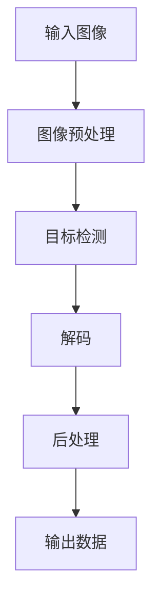

# 基于OpenCV的二维码和条形码识别

## 1. 背景介绍

### 1.1 问题的由来

在当今快节奏的商业世界中，快速高效的数据采集和处理已经成为各行业的迫切需求。二维码和条形码作为一种简单且广泛使用的自动识别技术,已经渗透到我们生活的方方面面。从商品追踪、库存管理到支付结算,再到产品防伪溯源等,二维码和条形码无疑成为了信息化时代的重要载体。

然而,传统的人工扫描方式不仅效率低下,而且容易出现人为操作失误,难以满足大规模应用场景的需求。因此,如何实现对二维码和条形码的自动化识别成为了一个亟待解决的问题。

### 1.2 研究现状

基于图像处理和模式识别技术的二维码和条形码识别算法已经成为研究的热点。目前,主流的识别方法主要包括:

1. **传统图像处理方法**: 利用图像滤波、二值化、边缘检测等基础图像处理算法对二维码和条形码进行定位和解码。这种方法相对简单,但对图像质量要求较高,鲁棒性较差。

2. **基于机器学习的方法**: 将二维码和条形码识别问题转化为监督学习或无监督学习问题,利用神经网络等机器学习模型进行端到端的识别。这种方法具有较强的鲁棒性,但需要大量的训练数据和计算资源。

3. **基于OpenCV的方法**: OpenCV是一个开源的计算机视觉库,提供了丰富的图像处理和机器视觉算法。利用OpenCV中的二维码和条形码检测模块,可以实现高效、准确的识别。

### 1.3 研究意义

基于OpenCV的二维码和条形码识别技术具有以下重要意义:

1. **提高工作效率**: 自动化识别可以大幅提高数据采集和处理的效率,节省人力成本,减少人为操作失误。

2. **支持大规模应用**: OpenCV提供了高性能、跨平台的解决方案,可以支持大规模的二维码和条形码识别应用。

3. **开源和可扩展性**: OpenCV作为开源库,具有良好的可扩展性,用户可以根据需求进行二次开发和定制。

4. **广泛的应用前景**: 二维码和条形码识别技术在零售、物流、支付、安防等多个领域都有广阔的应用前景。

### 1.4 本文结构

本文将详细介绍基于OpenCV的二维码和条形码识别技术,内容安排如下:

1. 核心概念与联系
2. 核心算法原理与具体操作步骤
3. 数学模型和公式详细讲解与案例分析
4. 项目实践:代码实例和详细解释说明
5. 实际应用场景
6. 工具和资源推荐
7. 总结:未来发展趋势与挑战
8. 附录:常见问题与解答

## 2. 核心概念与联系

在深入探讨二维码和条形码识别算法之前,我们需要先了解一些核心概念及其相互关系。

### 2.1 二维码

二维码(QR Code)是一种矩阵式的二维条码,由黑白方块组成,可以编码多种类型的数据,如网址、文本、联系信息等。二维码具有以下特点:

- 高容量:可以存储大量数据
- 小尺寸:即使尺寸很小,也能被识别
- 抗干扰:具有一定的错误校正能力
- 多种类型:可以编码多种类型的数据

### 2.2 条形码

条形码是一种由一系列不同宽度的条和空组成的机器可读符号,通常用于商品标识和追踪。条形码的主要特点包括:

- 简单:结构简单,易于识别
- 低成本:制作和打印成本较低
- 标准化:遵循国际标准,具有良好的兼容性
- 一维性:只能编码有限的数据

### 2.3 图像处理

图像处理是指对图像进行数字化处理,以提取有用信息或改善图像质量。常见的图像处理操作包括:

- 滤波:去噪、锐化等
- 二值化:将灰度图像转换为二值图像
- 边缘检测:检测图像中的边缘信息
- 形态学操作:对图像进行形态学变换

### 2.4 模式识别

模式识别是指从数据中发现规律性,并对未知数据进行分类或预测的过程。在二维码和条形码识别中,模式识别主要包括以下步骤:

- 预处理:对图像进行预处理,如去噪、二值化等
- 特征提取:提取图像的特征,如形状、纹理等
- 分类识别:根据提取的特征,利用分类器进行识别

### 2.5 OpenCV

OpenCV(Open Source Computer Vision Library)是一个开源的计算机视觉和机器学习库,提供了丰富的图像处理和计算机视觉算法。它支持多种编程语言,如C++、Python、Java等,可以在多种操作系统上运行。

OpenCV在二维码和条形码识别中扮演着重要角色,提供了现成的检测和解码模块,可以大幅简化开发过程。

## 3. 核心算法原理与具体操作步骤

### 3.1 算法原理概述

基于OpenCV的二维码和条形码识别算法主要分为以下几个步骤:

1. **图像预处理**: 对输入图像进行预处理,如去噪、锐化、二值化等,以提高图像质量和对比度,为后续检测和解码做准备。

2. **目标检测**: 利用OpenCV提供的检测算法,在预处理后的图像中定位二维码或条形码的位置和大小。

3. **解码**: 对检测到的二维码或条形码进行解码,获取其中编码的数据信息。

4. **后处理**: 对解码结果进行后处理,如错误校正、格式转换等,以获取最终的有效数据。

该算法的核心在于高效准确的目标检测和解码,OpenCV提供了多种优化算法,可以有效提高识别的速度和准确率。

### 3.2 算法步骤详解

#### 3.2.1 图像预处理

图像预处理是二维码和条形码识别算法的第一步,主要包括以下操作:

1. **去噪**

   由于图像采集过程中可能存在噪声干扰,因此需要进行去噪处理。常用的去噪方法包括高斯滤波、中值滤波等。

2. **灰度化**

   将彩色图像转换为灰度图像,可以简化后续的处理过程。

3. **二值化**

   将灰度图像转换为二值图像,即只有黑白两种像素值。常用的二值化方法包括全局阈值法、自适应阈值法等。

4. **边缘检测**

   对二值化后的图像进行边缘检测,可以提取出二维码或条形码的轮廓信息。常用的边缘检测算子包括Canny、Sobel等。

5. **形态学操作**

   通过开运算、闭运算等形态学操作,可以进一步优化图像质量,去除噪点,连接断开的边缘等。

经过预处理后,图像质量得到显著提升,为后续的目标检测和解码奠定基础。

#### 3.2.2 目标检测

目标检测是算法的核心步骤,OpenCV提供了多种检测算法,可以高效准确地定位二维码和条形码的位置和大小。

**二维码检测**

OpenCV中的`cv2.QRCodeDetector`类提供了二维码检测功能,可以检测多个二维码并返回其位置和数据。主要步骤如下:

1. 创建`QRCodeDetector`对象
2. 调用`detectAndDecode`方法,传入预处理后的图像
3. 获取检测结果,包括二维码位置和解码数据

**条形码检测**

OpenCV中的`cv2.barcode_BarcodeDetector`类提供了条形码检测功能,支持多种条形码格式。主要步骤如下:

1. 创建`BarcodeDetector`对象,指定条形码格式
2. 调用`detectAndDecode`方法,传入预处理后的图像
3. 获取检测结果,包括条形码位置和解码数据

在检测过程中,OpenCV还提供了一些优化算法,如自适应阈值、多尺度检测等,可以提高检测的鲁棒性和准确性。

#### 3.2.3 解码

获取到二维码或条形码的位置后,下一步就是对其进行解码,获取编码的数据信息。OpenCV提供了现成的解码功能,无需用户手动实现。

**二维码解码**

对于二维码,OpenCV会自动进行解码,将解码结果存储在`QRCodeDetector`对象的`data`属性中。用户只需访问该属性即可获取解码后的数据。

**条形码解码**

对于条形码,OpenCV同样会自动进行解码,将解码结果存储在`BarcodeDetector`对象的`data`属性中。用户可以访问该属性获取解码数据。

需要注意的是,OpenCV支持多种二维码和条形码格式,在创建检测器对象时需要指定相应的格式。

#### 3.2.4 后处理

在获取到解码数据后,可能还需要进行一些后处理操作,如错误校正、格式转换等,以获取最终的有效数据。

**错误校正**

由于图像质量或者其他原因,解码结果可能存在一些错误。对于二维码,OpenCV会自动进行错误校正,但对于条形码,可能需要用户自行实现错误校正算法。

**格式转换**

解码后的数据通常是原始的字节流或字符串,可能需要进行格式转换,如将字节流转换为UTF-8字符串,或者将字符串转换为特定的数据结构。

**数据过滤**

在某些应用场景中,可能需要对解码数据进行过滤,如去除无效数据、进行数据验证等。

经过后处理,我们可以获取到最终的有效数据,为后续的应用提供支持。

### 3.3 算法优缺点

#### 3.3.1 优点

1. **高效性**

   OpenCV提供了高度优化的算法,可以实现高效的二维码和条形码识别,满足实时性要求。

2. **准确性**

   OpenCV的检测和解码算法具有较高的准确性,能够有效应对各种干扰因素,如噪声、失真、遮挡等。

3. **开源和可扩展性**

   作为开源库,OpenCV具有良好的可扩展性,用户可以根据需求进行二次开发和定制。

4. **跨平台支持**

   OpenCV支持多种操作系统和编程语言,可以方便地集成到各种应用程序中。

5. **丰富的功能**

   除了二维码和条形码识别,OpenCV还提供了丰富的图像处理和计算机视觉算法,可以满足各种需求。

#### 3.3.2 缺点

1. **依赖第三方库**

   OpenCV作为第三方库,需要进行安装和配置,可能会增加一些部署和维护的复杂性。

2. **性能瓶颈**

   虽然OpenCV提供了优化算法,但在一些极端场景下,如超高分辨率图像或大规模并行处理,可能会遇到性能瓶颈。

3. **学习曲线陡峭**

   OpenCV提供了丰富的API,但也增加了学习和使用的复杂度,对于初学者来说,可能存在一定的学习曲线。

4. **对图像质量要求较高**

   虽然OpenCV具有一定的鲁棒性,但对于极差的图像质量,如严重失真、遮挡等,识别效果可能会受到影响。

5. **缺乏端到端解决方案**

   OpenCV主要提供底层的图像处理和计算机视觉算法,对于完整的应用系统,用户可能需要自行集成其他模块。

### 3.4 算法应用领域

基于OpenCV的二维码和条形码识别算法具有广泛的应用前景,主要包括以下几个领域:

1. **零售和物流**

   