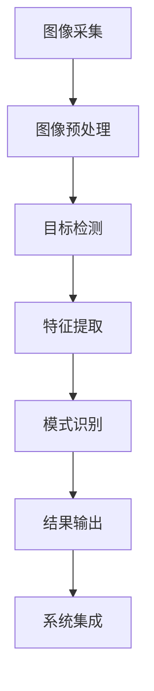

# 基于OpenCV的螺丝防松动检测系统详细设计与具体代码实现

## 1. 背景介绍

### 1.1 问题的由来

在现代工业生产中，螺丝连接广泛应用于各种机械装配过程。然而，由于振动、温度变化、材料疲劳等因素的影响，螺丝可能会发生松动。一旦螺丝松动，不仅会影响整个装置的稳定性和可靠性，还可能导致严重的安全隐患。因此，及时发现和防止螺丝松动对于确保生产质量和安全运行至关重要。

传统的螺丝松动检测方法主要依赖于人工目视检查,这种方式不仅效率低下,而且容易受人为主观因素的影响,导致检测结果的准确性和一致性较差。随着计算机视觉技术的发展,基于图像处理的自动化螺丝松动检测系统逐渐受到关注,它能够提供高效、准确和客观的检测结果,有望替代传统的人工检测方式。

### 1.2 研究现状

目前,国内外已有一些学者和企业针对螺丝松动检测问题进行了相关研究和尝试。常见的方法包括基于模板匹配、边缘检测、形状特征提取等传统图像处理算法,以及基于深度学习的目标检测和分类算法。

这些方法在一定程度上能够实现螺丝松动的自动检测,但仍然存在一些不足之处。传统图像处理算法对图像质量、光照条件、背景复杂度等因素较为敏感,鲁棒性较差。而基于深度学习的方法虽然具有较强的鲁棒性和适应性,但需要大量的标注数据进行训练,且模型训练和推理过程往往计算量较大,实时性和部署难度较高。

### 1.3 研究意义

设计一种高效、准确、鲁棒的螺丝防松动检测系统,不仅能够提高工业生产的质量和安全性,还可以降低人工检测的成本和工作强度。同时,该系统的研究和开发也将推动计算机视觉技术在工业领域的进一步应用和发展。

本文将基于OpenCV这一广泛使用的开源计算机视觉库,结合传统图像处理算法和机器学习方法,设计并实现一种螺丝防松动检测系统。该系统将具有较高的检测精度、实时性和鲁棒性,并且部署和维护相对简单,有望在实际工业生产中得到应用。

### 1.4 本文结构

本文首先介绍了螺丝防松动检测问题的背景和研究现状,阐明了开展这一研究的意义。接下来,将详细阐述系统的核心概念、算法原理和数学模型,并给出具体的代码实现和案例分析。最后,探讨该系统在实际应用场景中的使用方式,以及未来的发展趋势和面临的挑战。

## 2. 核心概念与联系

在螺丝防松动检测系统中,涉及到以下几个核心概念:

1. **图像预处理**: 包括图像去噪、增强、校正等操作,旨在提高图像质量,为后续图像处理和分析奠定基础。

2. **目标检测**: 在图像中定位和识别出螺丝的位置和范围,是后续松动检测的前提。

3. **特征提取**: 从检测到的螺丝图像中提取出与松动程度相关的特征,如螺丝头的形状、纹理、边缘等。

4. **模式识别**: 基于提取的特征,通过机器学习或其他模式识别算法,判断螺丝是否松动。

5. **系统集成**: 将上述各个模块有机结合,形成完整的螺丝防松动检测系统。

这些核心概念之间存在紧密的联系和依赖关系,如下图所示:

图像采集是整个系统的输入,通过图像预处理提高图像质量,然后进行目标检测定位螺丝位置。对检测到的螺丝图像进行特征提取,并基于提取的特征进行模式识别,判断螺丝是否松动。最终将检测结果输出,并将各个模块集成为完整的系统。

## 3. 核心算法原理 & 具体操作步骤

### 3.1 算法原理概述

本系统的核心算法包括以下几个部分:

1. **图像预处理**: 采用中值滤波、直方图均衡化等算法,去除图像噪声,增强图像对比度。

2. **目标检测**: 使用基于形状和纹理的模板匹配算法,在图像中定位螺丝的位置和范围。

3. **特征提取**: 对检测到的螺丝图像进行边缘检测,提取螺丝头的边缘特征;同时,计算螺丝头区域的纹理特征。

4. **模式识别**: 基于提取的边缘和纹理特征,使用支持向量机(SVM)算法对螺丝是否松动进行分类。

该算法的优点是结合了传统图像处理和机器学习方法,具有较好的检测精度和鲁棒性。同时,算法的计算量相对较小,能够满足实时检测的需求。

### 3.2 算法步骤详解

1. **图像预处理**:
   - 中值滤波: 对输入图像进行中值滤波,去除椒盐噪声和高斯噪声。
   - 直方图均衡化: 对滤波后的图像进行直方图均衡化,增强图像对比度。

2. **目标检测**:
   - 模板匹配: 使用预先准备的螺丝头模板图像,在预处理后的图像中进行模板匹配,定位螺丝头的位置和范围。
   - 区域提取: 根据模板匹配的结果,从原始图像中提取出包含螺丝头的区域图像。

3. **特征提取**:
   - 边缘检测: 对提取的螺丝头区域图像进行Canny边缘检测,获取螺丝头的边缘特征。
   - 纹理特征: 计算螺丝头区域的灰度共生矩阵(GLCM)特征,包括对比度、相关性、能量和同质性等纹理特征。

4. **模式识别**:
   - 特征向量: 将提取的边缘特征和纹理特征拼接成一个特征向量。
   - SVM分类: 使用预先训练的SVM模型,基于特征向量对螺丝是否松动进行分类。

5. **结果输出**:
   - 将分类结果输出,并在原始图像上标记出松动螺丝的位置。

### 3.3 算法优缺点

**优点**:

1. 结合了传统图像处理和机器学习方法,具有较好的检测精度和鲁棒性。
2. 算法计算量相对较小,能够满足实时检测的需求。
3. 使用开源的OpenCV库,部署和维护相对简单。

**缺点**:

1. 对于背景复杂、光照条件差的图像,检测精度可能会受到一定影响。
2. 需要预先准备好螺丝头模板图像,对于不同类型的螺丝可能需要重新准备模板。
3. SVM模型需要基于标注数据进行训练,标注过程可能比较耗时。

### 3.4 算法应用领域

该算法不仅可以应用于螺丝防松动检测,还可以扩展到其他类似的缺陷检测场景,如螺栓、螺母等紧固件的松动检测,以及焊缝、铆钉等连接件的缺陷检测。此外,该算法也可以作为一种通用的目标检测和缺陷识别框架,应用于其他工业视觉检测领域。

## 4. 数学模型和公式 & 详细讲解 & 举例说明

### 4.1 数学模型构建

在本系统中,我们将使用支持向量机(SVM)作为核心的模式识别模型,用于判断螺丝是否松动。SVM是一种有监督的机器学习算法,它通过构建最大间隔超平面将不同类别的样本分开,具有良好的泛化能力。

对于线性可分的情况,SVM的数学模型可以表示为:

$$
\begin{aligned}
\min_{\vec{w},b} & \frac{1}{2}\|\vec{w}\|^2 \\
\text{s.t. } & y_i(\vec{w}^T\vec{x}_i+b) \geq 1, \quad i=1,2,\ldots,n
\end{aligned}
$$

其中, $\vec{x}_i$ 表示第 $i$ 个样本, $y_i \in \{-1,1\}$ 表示其类别标签, $\vec{w}$ 和 $b$ 分别表示超平面的法向量和偏移量。目标函数 $\frac{1}{2}\|\vec{w}\|^2$ 表示最大化间隔,约束条件 $y_i(\vec{w}^T\vec{x}_i+b) \geq 1$ 确保每个样本都被正确分类且距离超平面的距离不小于 $\frac{1}{\|\vec{w}\|}$。

对于线性不可分的情况,我们可以引入松弛变量 $\xi_i$ 和惩罚参数 $C$,将原始优化问题转化为软间隔的形式:

$$
\begin{aligned}
\min_{\vec{w},b,\vec{\xi}} & \frac{1}{2}\|\vec{w}\|^2 + C\sum_{i=1}^{n}\xi_i \\
\text{s.t. } & y_i(\vec{w}^T\vec{x}_i+b) \geq 1 - \xi_i, \quad i=1,2,\ldots,n \\
& \xi_i \geq 0, \quad i=1,2,\ldots,n
\end{aligned}
$$

其中, $\xi_i$ 表示第 $i$ 个样本违反约束条件的程度, $C$ 是一个用于平衡最大间隔和误分类样本的惩罚参数。

在实际应用中,我们通常会将输入样本映射到更高维的特征空间,使得原本线性不可分的问题在新的特征空间中变为线性可分。这种映射可以通过核函数 $K(\vec{x}_i,\vec{x}_j)$ 来实现,常用的核函数包括线性核、多项式核和高斯核等。

### 4.2 公式推导过程

接下来,我们将推导SVM的对偶形式,以便于求解。首先,构造拉格朗日函数:

$$
L(\vec{w},b,\vec{\alpha},\vec{\xi},\vec{r}) = \frac{1}{2}\|\vec{w}\|^2 + C\sum_{i=1}^{n}\xi_i - \sum_{i=1}^{n}\alpha_i\left[y_i(\vec{w}^T\vec{x}_i+b)-1+\xi_i\right] - \sum_{i=1}^{n}r_i\xi_i
$$

其中, $\vec{\alpha}=(\alpha_1,\alpha_2,\ldots,\alpha_n)$ 和 $\vec{r}=(r_1,r_2,\ldots,r_n)$ 分别是对应于约束条件的拉格朗日乘子。

对 $L$ 分别对 $\vec{w}$, $b$ 和 $\vec{\xi}$ 求偏导数并令其等于零,可以得到:

$$
\begin{aligned}
\frac{\partial L}{\partial \vec{w}} &= \vec{0} \Rightarrow \vec{w} = \sum_{i=1}^{n}\alpha_iy_i\vec{x}_i \\
\frac{\partial L}{\partial b} &= 0 \Rightarrow \sum_{i=1}^{n}\alpha_iy_i = 0 \\
\frac{\partial L}{\partial \xi_i} &= 0 \Rightarrow C - \alpha_i - r_i = 0
\end{aligned}
$$

将上述结果代入拉格朗日函数,可以得到对偶形式:

$$
\begin{aligned}
\max_{\vec{\alpha}} & \sum_{i=1}^{n}\alpha_i - \frac{1}{2}\sum_{i=1}^{n}\sum_{j=1}^{n}\alpha_i\alpha_jy_iy_jK(\vec{x}_i,\vec{x}_j) \\
\text{s.t. } & \sum_{i=1}^{n}\alpha_iy_i = 0 \\
& 0 